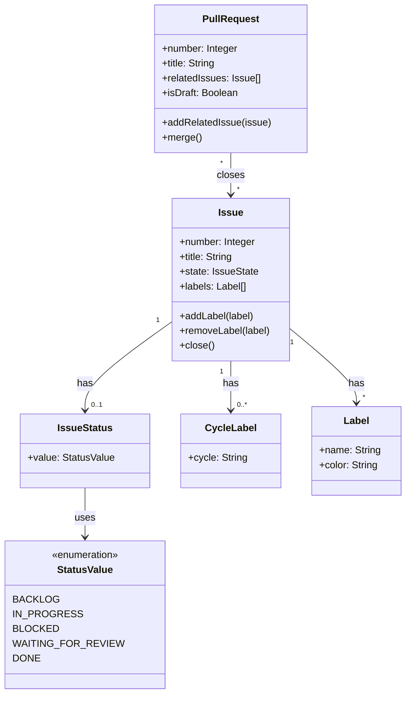
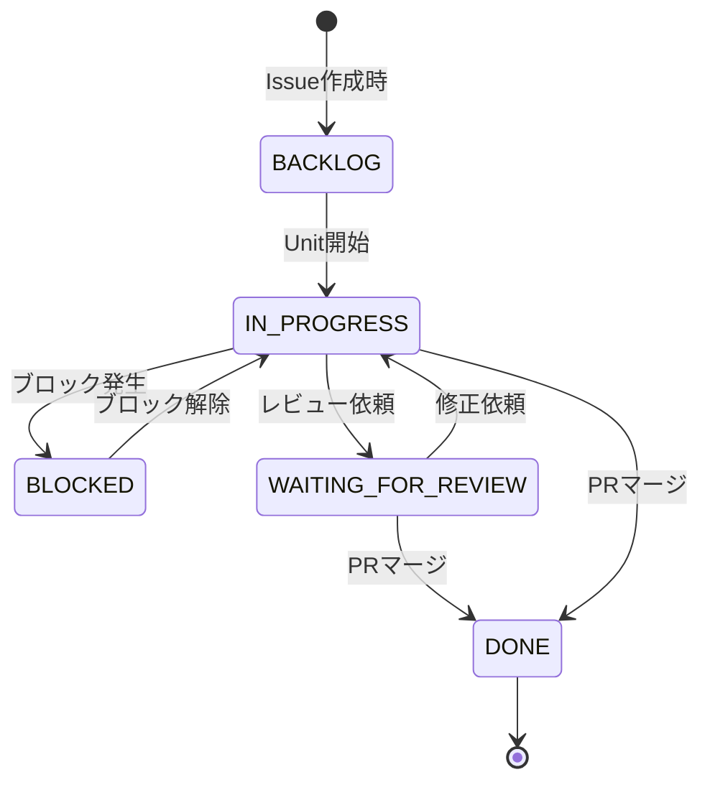

# ドメインモデル: Issue管理プロセス改善

## 概要

AI-DLCにおけるIssueライフサイクル管理を明文化し、ステータスラベルによる進捗可視化とPRマージ時の自動クローズを実現する。

**重要**: このドメインモデル設計では**コードは書かず**、構造と責務の定義のみを行います。実装はImplementation Phase（コード生成ステップ）で行います。

## エンティティ（Entity）

### Issue

GitHub Issueを表すエンティティ。AI-DLCではIssue番号で識別する。

- **ID**: Issue番号（Integer）
- **属性**:
  - title: String - Issueのタイトル
  - state: IssueState - open / closed
  - labels: Label[] - 付与されているラベル群
  - milestone: Milestone? - 紐付けられているマイルストーン（オプショナル）
- **振る舞い**:
  - addLabel(label): ラベルを追加
  - removeLabel(label): ラベルを削除
  - close(): Issueをクローズ
  - closeAsNotPlanned(): 「対応しない」としてクローズ

### PullRequest

GitHub Pull Requestを表すエンティティ。Issueと紐付けて管理する。

- **ID**: PR番号（Integer）
- **属性**:
  - title: String - PRのタイトル
  - state: PRState - open / merged / closed
  - relatedIssues: Issue[] - 紐付けられたIssue群（Closes #XXで記載）
  - isDraft: Boolean - ドラフトPRかどうか
- **振る舞い**:
  - addRelatedIssue(issue): 関連Issueを追加（Closes #XX形式）
  - merge(): PRをマージ（→ 関連Issueが自動クローズ）
  - markReady(): ドラフトを解除してレビュー可能に

## 値オブジェクト（Value Object）

### Label

GitHub Issueに付与するラベル。

- **属性**:
  - name: String - ラベル名
  - color: String - 色コード（例: "5319E7"）
  - description: String - 説明
- **不変性**: ラベル名と色は作成後に変更されない（GitHubの仕様上は変更可能だが、運用上は不変として扱う）
- **等価性**: nameが一致すれば等価

### IssueStatus

Issueの進捗ステータスを表す値オブジェクト。ステータスラベルに対応。

- **属性**:
  - value: StatusValue - ステータス値
- **不変性**: 状態遷移は新しいIssueStatusインスタンスを生成
- **等価性**: valueが一致すれば等価

#### StatusValue（列挙型）

| 値 | ラベル名 | 説明 |
|---|---|---|
| BACKLOG | `status:backlog` | バックログにある未着手の状態 |
| IN_PROGRESS | `status:in-progress` | 作業中 |
| BLOCKED | `status:blocked` | 他の作業やIssueにブロックされている |
| WAITING_FOR_REVIEW | `status:waiting-for-review` | レビュー待ち |
| DONE | (ラベルなし、Issueクローズ) | 完了 |

### CycleLabel

サイクルを識別するラベル。

- **属性**:
  - cycle: String - サイクル名（例: "v1.13.0"）
- **不変性**: サイクル名は不変
- **等価性**: cycleが一致すれば等価
- **フォーマット**: `cycle:{cycle}` （例: `cycle:v1.13.0`）

## 集約（Aggregate）

### IssueLifecycle

Issueのライフサイクル全体を管理する集約。

- **集約ルート**: Issue
- **含まれる要素**:
  - Issue（集約ルート）
  - IssueStatus（値オブジェクト）
  - CycleLabel（値オブジェクト）
  - Label[]（値オブジェクト群）
- **境界**: 1つのIssueに対するステータス遷移と関連付け
- **不変条件**:
  - ステータスラベルは同時に1つのみ（排他的）
  - サイクルラベルは複数可（複数サイクルにまたがる可能性）

## ドメインサービス

### IssueStatusService

Issueのステータス遷移を管理するサービス。

- **責務**: ステータスラベルの追加・削除による状態遷移を管理
- **操作**:
  - transitionTo(issue, newStatus): ステータスを遷移（古いステータスラベルを削除、新しいラベルを追加）
  - clearStatus(issue): すべてのステータスラベルを削除

### CycleLabelService

サイクルラベルの管理サービス（既存のlabel-cycle-issues.shに対応）。

- **責務**: サイクルラベルの付与
- **操作**:
  - assignCycle(issue, cycle): サイクルラベルを付与
  - listIssuesInCycle(cycle): サイクルに紐付いたIssueを取得

### PRAutoCloseService

PRマージ時のIssue自動クローズを管理するサービス（GitHub組み込み機能を使用）。

- **責務**: PRとIssueの紐付けと自動クローズの説明
- **操作**:
  - linkIssue(pr, issue): PRに「Closes #XX」を追加
  - explainAutoClose(): 自動クローズの仕組みを説明

## リポジトリインターフェース

### IssueRepository

GitHub Issue操作のインターフェース（gh CLIでの実装を想定）。

- **対象集約**: IssueLifecycle
- **操作**:
  - find(number): Issue番号で検索
  - list(filters): フィルタ条件でIssue一覧取得
  - addLabel(number, label): ラベル追加
  - removeLabel(number, label): ラベル削除
  - close(number): Issueクローズ

## ドメインモデル図

## 状態遷移図

## フェーズ別Issue操作フロー

### Inception Phase

1. **対応Issue選択**: バックログからサイクルで対応するIssueを選択
2. **サイクルラベル付与**: `cycle:vX.X.X` ラベルを付与
3. **ステータス設定**: 必要に応じて `status:backlog` を付与（デフォルト状態）
4. **サイクルPR作成時**: ドラフトPRに全関連Issueを `Closes #XX` 形式で記載

### Construction Phase

1. **Unit開始時**: 関連Issueのステータスを `status:in-progress` に遷移
2. **Unit PR作成時**: 関連Issueを参照（`関連Issue: #XX`形式、Closesなし）
3. **ブロック発生時**: `status:blocked` に遷移
4. **Unit完了時**: `status:waiting-for-review` に遷移

### Operations Phase

1. **サイクルPR Ready化**: ドラフトPRのCloses記載を確認・更新
2. **PRマージ時**: 自動クローズにより関連Issueがクローズ（`status:*` ラベルは手動削除不要）
3. **残存Issue確認**: 未クローズのIssueを次サイクルに引き継ぐか確認

## ユビキタス言語

このドメインで使用する共通用語：

- **Issue**: GitHub上で管理される課題・要望・バグ報告
- **ステータスラベル**: Issueの進捗状態を示すラベル（`status:*` 形式）
- **サイクルラベル**: 対応中のサイクルを示すラベル（`cycle:*` 形式）
- **自動クローズ**: PRマージ時に「Closes #XX」記載のIssueが自動的にクローズされる機能
- **ライフサイクル**: Issueの作成からクローズまでの一連の流れ

## 不明点と質問（設計中に記録）

[Question] ステータスラベルの命名規則について、`status:in-progress` と `in-progress` のどちらが適切か？
[Answer] 既存のラベル構成（`type:*`, `priority:*`, `cycle:*`）との整合性から `status:*` プレフィックスを採用

[Question] Inception PhaseのドラフトPR（サイクルPR）にも「Closes #XX」を含めるか？
[Answer] サイクルPRのみで「Closes #XX」を含める。Unit PRには含めない（参照のみ）。

---

## AIレビューからの検討事項

### Inception PhaseのドラフトPRについて

- **現状**: Inception Phaseでサイクルブランチ作成時にドラフトPRを作成する機能がある（operations.mdで定義）
- **検討点**: このドラフトPRにも「Closes #XX」を含めるべきか

**決定**: サイクルPRのみで「Closes #XX」を含める

**理由**:

1. **サイクルPRの性質**: サイクルPR（cycle/vX.X.X → main）が最終的にmainにマージされるPR
2. **自動クローズの適切なタイミング**: Issueはサイクル完了（main へのマージ）時にクローズされるべき
3. **Unit PRの役割**: Unit PR（cycle/vX.X.X/unit-NNN → cycle/vX.X.X）は中間的なPR

**実装方針**:

- **サイクルPR（operations.md）**: 全関連Issueを「Closes #XX」で記載
- **Unit PR（construction.md）**: 「Closes #XX」は含めない（参照のみ）
- **construction.mdのドラフトPRテンプレート**: 「関連Issue: #XX」（Closesなし）で参照表示
