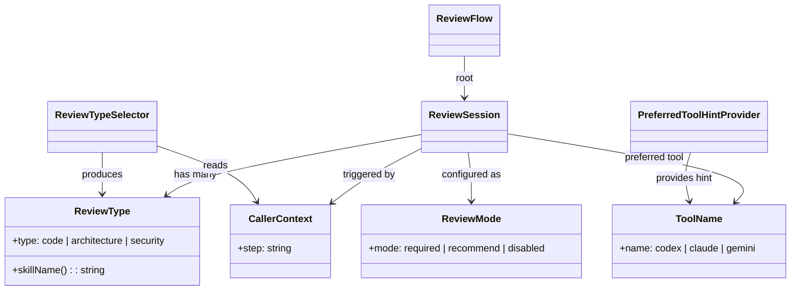

# ドメインモデル: レビューフロー更新

## 概要

AIレビューフロー（review-flow.md）のドメインモデル。レビュー種別選択とツール選択の2段階構造を定義する。

**重要**: このドメインモデル設計では**コードは書かず**、構造と責務の定義のみを行います。

## エンティティ（Entity）

### ReviewSession（レビューセッション）

- **ID**: セッション固有ID（Codexの場合はsession id）
- **属性**:
  - reviewTypes: ReviewType[] - 実行するレビュー種別のリスト
  - preferredTool: ToolName - toolsから決定された優先ツール名
  - callerContext: CallerContext - 呼び出し元のステップ情報
  - mode: ReviewMode - required / recommend / disabled
- **振る舞い**:
  - determineReviewTypes(): callerContextに基づきレビュー種別を決定
  - executeReviews(): reviewTypesを直列に実行し、全種別で指摘0件で完了

## 値オブジェクト（Value Object）

### ReviewType（レビュー種別）

- **属性**: type: "code" | "architecture" | "security"
- **不変性**: レビュー実行中に種別は変更されない
- **等価性**: type文字列で判定
- **対応スキル**:
  - code → `skill="reviewing-code"`
  - architecture → `skill="reviewing-architecture"`
  - security → `skill="reviewing-security"`

### ToolName（ツール名）

- **属性**: name: "codex" | "claude" | "gemini"
- **不変性**: 設定から読み取った時点で確定
- **等価性**: name文字列で判定

### CallerContext（呼び出し元コンテキスト）

- **属性**: step: string - 呼び出し元のステップ名
- **不変性**: review-flow呼び出し時に確定
- **等価性**: step文字列で判定
- **マッピング**:

| step | デフォルトのReviewType |
|---|---|
| 計画承認前 | [architecture] |
| 設計レビュー | [architecture] |
| コード生成後 | [code] |
| 統合とレビュー | [code, security] |
| 不明 | ユーザーに選択を求める |

### ReviewMode（レビューモード）

- **属性**: mode: "required" | "recommend" | "disabled"
- **不変性**: aidlc.tomlから読み取った時点で確定
- **デフォルト**: "recommend"

## 集約（Aggregate）

### ReviewFlow（レビューフロー）

- **集約ルート**: ReviewSession
- **含まれる要素**: ReviewType[], ToolName, CallerContext, ReviewMode
- **境界**: 1回のAIレビューフロー呼び出し全体
- **不変条件**:
  - reviewTypesは1つ以上含まれること
  - modeがdisabledの場合はAIレビューを実行しない
  - 複数reviewTypes時は直列実行し、全種別で指摘0件で完了

## ドメインサービス

### ReviewTypeSelector（レビュー種別セレクタ）

- **責務**: CallerContextからデフォルトのReviewTypeリストを決定する
- **操作**: selectTypes(context: CallerContext): ReviewType[]
  - CallerContextのstepに基づきマッピングテーブルからデフォルト種別を返す
  - stepが不明の場合はユーザーに選択を求める
  - ユーザーが追加の種別を指定した場合はマージする

### PreferredToolHintProvider（優先ツールヒント提供）

- **責務**: tools設定から優先ツールのヒントを決定し、スキル呼び出し引数に含める。**ツール選択の最終決定はスキル内部の責務**であり、このサービスは最善努力のヒントを提供するのみ
- **操作**: getHint(aiTools: ToolName[]): ToolName
  - toolsリストの先頭をヒントとして返す
  - 結果は「優先ツール: [name]」として引数テキストに含める
  - スキルがヒントを解釈できない場合のフォールバックはスキル側の責務（allowed-tools順序で自動選択）

## ドメインモデル図

## ユビキタス言語

- **レビュー種別（ReviewType）**: レビューの観点。code（コード品質）、architecture（構造設計）、security（セキュリティ）の3種類
- **優先ツール（PreferredTool）**: tools設定で指定されたツールの優先順位。最善努力のヒントとしてスキルに伝達される
- **呼び出し元コンテキスト（CallerContext）**: review-flowを呼び出したステップの情報。レビュー種別の自動決定に使用される
- **直列実行**: 複数種別を1つずつ順番に実行すること。並列実行はしない
- **反復レビュー**: 1種別につき1セット最大3回のレビュー＆修正サイクル

## 不明点と質問（設計中に記録）

[Question] 統合とレビュー時のデフォルトレビュー種別
[Answer] code, security（アーキテクチャは設計フェーズで確認済みの前提）
