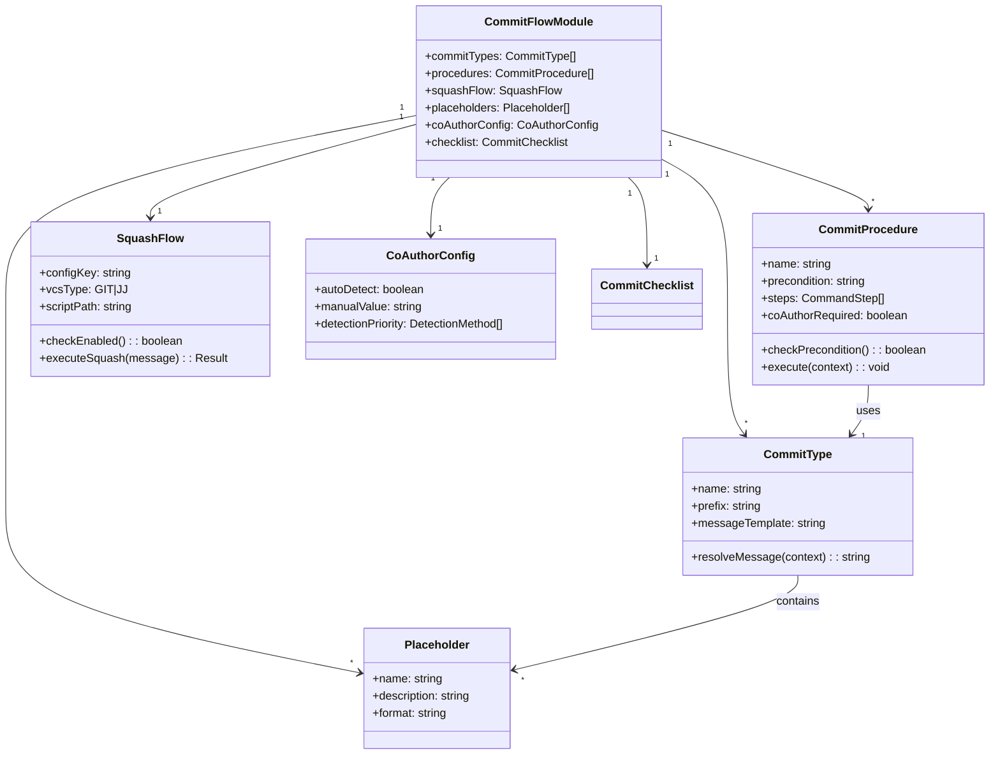

# ドメインモデル: コミット処理統合

## 概要

AI-DLCプロンプト群に分散しているコミット関連ロジックの概念構造を定義する。各コミットタイプ・メッセージフォーマット・実行手順を体系化し、`commit-flow.md` への集約の設計基盤とする。

**重要**: このドメインモデル設計では**コードは書かず**、構造と責務の定義のみを行います。実装はImplementation Phase（コード生成ステップ）で行います。

## エンティティ（Entity）

### CommitType（コミットタイプ）

コミット操作の種類を表す。各タイプには固有のメッセージフォーマットと実行条件がある。

- **ID**: タイプ名（文字列）
- **属性**:
  - prefix: string - コミットメッセージのprefixキーワード（`feat:` / `chore:`）
  - messageTemplate: string - メッセージテンプレート
  - placeholders: list\<Placeholder\> - テンプレート内のプレースホルダ
- **振る舞い**:
  - resolveMessage(context): コンテキスト値でプレースホルダを解決し最終メッセージを生成

**注意**: 「ポリシー層」と「実行フロー層」の区別は `commit-flow.md` ファイルのセクション構成レベルで適用する。CommitTypeエンティティ自体は全て実行フロー層で参照される。

#### CommitType一覧

| タイプ名 | prefix | メッセージテンプレート |
|---------|--------|----------------------|
| REVIEW_PRE | `chore:` | `chore: [{{CYCLE}}] レビュー前 - {ARTIFACT_NAME}` |
| REVIEW_POST | `chore:` | `chore: [{{CYCLE}}] レビュー反映 - {ARTIFACT_NAME}` |
| INCEPTION_COMPLETE | `feat:` | `feat: [{{CYCLE}}] Inception Phase完了 - {DESCRIPTION}` |
| UNIT_COMPLETE | `feat:` | `feat: [{{CYCLE}}] Unit {NNN}完了 - {DESCRIPTION}` |
| UNIT_SQUASH_PREP | `chore:` | `chore: [{{CYCLE}}] Unit {NNN}完了 - 完了準備` |
| OPERATIONS_COMPLETE | `chore:` | `chore: [{{CYCLE}}] Operations Phase完了 - {DESCRIPTION}` |

### CommitProcedure（コミット手順）

コミットを実行する具体的な手順（一連のコマンド群）を表す。

- **ID**: 手順名（文字列）
- **属性**:
  - precondition: string - 実行前提条件（「変更がある場合のみ」等）
  - steps: list\<CommandStep\> - 実行するコマンドのリスト
  - commitType: CommitType - 使用するコミットタイプ
  - coAuthorRequired: boolean - Co-Authored-By付与の要否
- **振る舞い**:
  - checkPrecondition(): 前提条件を確認（`git status --porcelain`）
  - execute(context): 手順を順次実行

#### CommitProcedure一覧

| 手順名 | 前提条件 | コミットタイプ | Co-Author |
|-------|---------|-------------|-----------|
| reviewPreCommit | 変更あり | REVIEW_PRE | yes |
| reviewPostCommit | 変更あり | REVIEW_POST | yes |
| inceptionCompleteCommit | - | INCEPTION_COMPLETE | yes |
| unitCompleteCommit | - | UNIT_COMPLETE | yes |
| operationsCompleteCommit | - | OPERATIONS_COMPLETE | yes |
| squashPrepCommit | squash有効 | UNIT_SQUASH_PREP | yes |

### SquashFlow（Squashフロー）

Unit完了時の中間コミット統合フローを表す。

- **ID**: フロー名
- **属性**:
  - configKey: string - 設定キー（`rules.squash.enabled`）
  - vcsType: enum\<GIT, JJ\> - 使用するVCS
  - scriptPath: string - `docs/aidlc/bin/squash-unit.sh`
- **振る舞い**:
  - checkEnabled(): 設定を読み取りsquashが有効か判定
  - detectVcsType(): jj設定からVCSタイプを判定
  - detectBaseCommit(): ベースコミットを検出
  - executeSquash(message): squash-unit.sh を実行
  - handleBookmark(): jjブックマーク更新（jjの場合のみ）

## 値オブジェクト（Value Object）

### Placeholder（プレースホルダ）

コミットメッセージテンプレート内の変数部分。

- **属性**:
  - name: string - プレースホルダ名（`{{CYCLE}}`, `{NNN}` 等）
  - description: string - 説明
  - format: string - フォーマット規則（3桁ゼロパディング等）
- **不変性**: プレースホルダ定義は全コミットタイプで共通
- **等価性**: name が同一なら等価

#### 標準プレースホルダ一覧

| name | description | format |
|------|------------|--------|
| `{{CYCLE}}` | サイクル番号 | `vX.X.X` |
| `{NNN}` | Unit番号 | 3桁ゼロパディング |
| `{UNIT_NAME}` | Unit名 | 文字列 |
| `{ARTIFACT_NAME}` | 成果物名 | 文字列 |
| `{DESCRIPTION}` | 説明文 | 自由記述 |
| `{AI_AUTHOR}` | Co-Authored-By値 | `名前 <メール>` 形式 |

### CoAuthorConfig（Co-Authored-By設定）

コミットメッセージに付与するAI著者情報の設定。

- **属性**:
  - autoDetect: boolean - 自動検出の有効/無効
  - manualValue: string - 手動設定値
  - detectionPriority: list\<DetectionMethod\> - 検出優先順位
- **不変性**: 設定は `docs/aidlc.toml` に永続化
- **等価性**: 全属性が同一なら等価

### CommitChecklist（コミット前確認チェックリスト）

コミット前に確認すべきファイル群のリスト。

- **属性**:
  - items: list\<ChecklistItem\> - チェック項目
- **不変性**: フェーズ/コンテキストごとに固定
- **等価性**: 全items が同一なら等価

## 集約（Aggregate）

### CommitFlowModule（コミットフローモジュール）

`commit-flow.md` ファイル全体を表す集約。

- **集約ルート**: CommitFlowModule
- **含まれる要素**: CommitType, CommitProcedure, SquashFlow, Placeholder, CoAuthorConfig, CommitChecklist
- **境界**: コミットに関連するすべてのポリシーと実行手順
- **不変条件**:
  - すべてのCommitProcedureが使用するCommitTypeはこのモジュール内で定義されていること
  - すべてのプレースホルダは標準プレースホルダ一覧に定義されていること
  - フェーズプロンプトへの逆参照を含まないこと（DAG制約）

## ドメインサービス

### CommitReferenceResolver（コミット参照解決サービス）

各フェーズプロンプトから `commit-flow.md` への参照を解決する。

- **責務**: フェーズプロンプトが参照する `commit-flow.md` のセクション名を、正しい手順に対応づける
- **操作**:
  - resolveSection(sectionName): セクション名から対応するCommitProcedureを特定
  - validateReferences(allPrompts): 全プロンプトの参照が有効か検証

## ドメインモデル図

## ユビキタス言語

- **コミットタイプ**: コミット操作の種類。prefix（feat:/chore:）とメッセージテンプレートで定義される
- **コミット手順**: 前提条件確認からコミット実行までの一連のコマンド群
- **ポリシー層**: 「いつ・何を・どのフォーマットで」コミットするかのルール定義
- **実行フロー層**: 具体的なgit/jjコマンドと手順の定義
- **プレースホルダ**: コミットメッセージテンプレート内の変数部分（`{{CYCLE}}`, `{NNN}` 等）
- **セクション参照**: フェーズプロンプトが `commit-flow.md` の特定セクションを名前で参照するパターン
- **Squashフロー**: Unit完了時に中間コミットを1つの完了コミットに統合するオプショナルフロー
- **DAG制約**: `commit-flow.md` → フェーズプロンプトへの逆方向参照の禁止ルール
