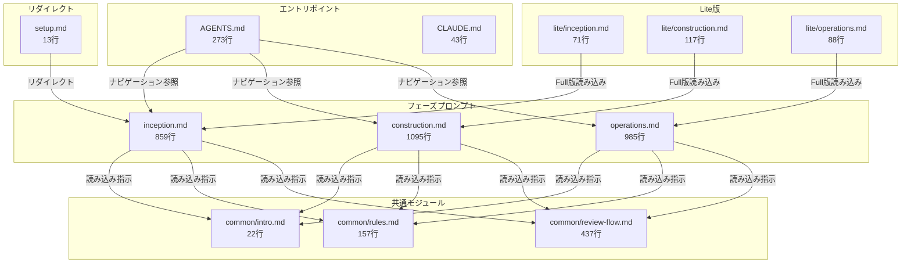

# ドメインモデル: プロンプト構造分析

## 概要

AI-DLCプロンプト群（`prompts/package/prompts/`）の構造を分析し、各ファイルの責務・依存関係・共通/固有の境界を明確化する。Skills化に向けた整理の前提資料。

## パスの基準

| 区分 | パス | 説明 |
|------|------|------|
| **正本（Source of Truth）** | `prompts/package/prompts/` | プロンプトの原本。編集はここで行う |
| **展開先（デプロイコピー）** | `docs/aidlc/prompts/` | `rsync` で正本から同期されるコピー。直接編集禁止 |

本ドキュメントのファイルパスは、特に断りがない限り正本（`prompts/package/prompts/`）を基準とする。

## ファイルカタログ

### 一覧

| ファイル | 行数 | カテゴリ | 責務 |
|---------|------|----------|------|
| `AGENTS.md` | 273 | エントリポイント | 全AIツール共通の入口。ナビゲーション、共通ルール、フィードバック機構、AIツール対応（Skills/KiroCLI） |
| `CLAUDE.md` | 43 | ツール固有設定 | Claude Code固有の設定: AskUserQuestion利用ルール、TodoWriteツール活用 |
| `common/intro.md` | 22 | 共通モジュール | AI-DLC手法の要約（主要原則、3フェーズ、アーティファクト） |
| `common/rules.md` | 157 | 共通モジュール | 共通開発ルール: 設定読み込み、承認プロセス、Q&A記録、コミットタイミング、Co-Authored-By、jjサポート |
| `common/review-flow.md` | 437 | 共通モジュール | AIレビューフロー: モード設定、種別決定、ツール可否確認、反復レビュー、セッション管理、指摘対応判断 |
| `inception.md` | 859 | フェーズプロンプト | Inception Phase: セットアップ + Intent明確化 → ユーザーストーリー → Unit定義。環境確認、サイクル作成、バックログ確認含む |
| `construction.md` | 1095 | フェーズプロンプト | Construction Phase: Phase 1（設計: ドメインモデル、論理設計）+ Phase 2（実装: コード生成、テスト、統合）。Unit選択、PR管理含む |
| `operations.md` | 985 | フェーズプロンプト | Operations Phase: デプロイ準備、CI/CD構築、監視・ロギング、配布、リリース準備、PRマージ。サイクル完了処理含む |
| `setup.md` | 13 | リダイレクト | inception.mdへの転送（Setupは統合済み） |
| `lite/inception.md` | 71 | Lite版 | Inception Phase簡略版。Full版を前提とし、スキップ/簡略化するステップを定義 |
| `lite/construction.md` | 117 | Lite版 | Construction Phase簡略版。設計フェーズをスキップし直接実装。Full版を前提 |
| `lite/operations.md` | 88 | Lite版 | Operations Phase簡略版。全ステップ任意。Full版を前提 |

### 合計

- 全ファイル: 12ファイル
- 総行数: 4,160行
- フェーズプロンプト3ファイル合計: 2,939行（全体の70.6%）

## 依存の定義

本分析で扱う依存関係は以下の3種類に分類する:

| 依存種別 | 記号 | 説明 | 例 |
|---------|------|------|-----|
| **実行時読み込み（Read）** | Read | フェーズ開始時に内容を読み込む。動作に必須 | `inception.md` → `common/rules.md` |
| **ナビゲーション参照（Nav）** | Nav | パスの案内のみ。内容は読み込まない | `AGENTS.md` → `inception.md` |
| **リダイレクト（Redir）** | Redir | 別ファイルへの転送 | `setup.md` → `inception.md` |

**補足**: フェーズプロンプト間の「バックトラック」「フェーズ完了遷移」は上記いずれにも該当しない **テキスト内参照** であり、ファイルの読み込みは発生しない（ユーザーへの案内としてパスを記載しているのみ）。詳細は「フェーズ間遷移参照」セクションを参照。

## 依存グラフ

### ファイル間の読み込み関係

### 依存方向の分類

| 依存元 → 依存先 | 種別 | 説明 |
|----------------|------|------|
| AGENTS → フェーズプロンプト | ナビゲーション | パス参照のみ（内容は読み込まない） |
| フェーズプロンプト → common/* | 読み込み | 実行時に内容を読み込む（必須） |
| Lite版 → Full版 | 読み込み | Full版を前提として差分のみ定義 |
| setup.md → inception.md | リダイレクト | 単純な転送 |

## 依存マトリクス

| 依存元 ＼ 依存先 | AGENTS | CLAUDE | intro | rules | review | inception | construction | operations | setup | lite/* |
|:-:|:-:|:-:|:-:|:-:|:-:|:-:|:-:|:-:|:-:|:-:|
| **AGENTS** | - | - | - | - | - | Nav | Nav | Nav | - | - |
| **CLAUDE** | - | - | - | - | - | - | - | - | - | - |
| **common/intro** | - | - | - | - | - | - | - | - | - | - |
| **common/rules** | - | - | - | - | - | - | - | - | - | - |
| **common/review** | - | - | - | - | - | - | - | - | - | - |
| **inception** | - | - | Read | Read | Read | - | - | - | - | - |
| **construction** | - | - | Read | Read | Read | - | - | - | - | - |
| **operations** | - | - | Read | Read | Read | - | - | - | - | - |
| **setup** | - | - | - | - | - | Redir | - | - | - | - |
| **lite/inception** | - | - | - | - | - | Read | - | - | - | - |
| **lite/construction** | - | - | - | - | - | - | Read | - | - | - |
| **lite/operations** | - | - | - | - | - | - | - | Read | - | - |

凡例: Nav=ナビゲーション参照, Read=読み込み, Redir=リダイレクト

### 依存方向ルール

| ルール | 状態 |
|-------|------|
| `フェーズプロンプト → common/*` 許可 | OK（現行通り） |
| `common/* → フェーズプロンプト` 禁止 | OK（違反なし） |
| `Lite版 → Full版` 許可 | OK（現行通り） |
| `Full版 → Lite版` 禁止 | OK（違反なし） |
| `common/* → common/*` 禁止 | OK（違反なし） |

### 循環依存チェック結果

**結果: 循環依存なし**

依存は単方向のDAG（有向非巡回グラフ）構造を維持している。

## フェーズ間遷移参照

フェーズプロンプト間には、実行時読み込みとは別に「テキスト内参照」が存在する。これらはファイルの読み込みを伴わず、ユーザーへの案内としてパスを記載している。

### バックトラック参照

各フェーズプロンプトの「このフェーズに戻る場合【バックトラック】」セクションで定義:

| 参照元 | 参照先 | 内容 |
|--------|--------|------|
| inception.md | construction.md | バックトラック完了後、Construction Phaseに戻る案内 |
| construction.md | inception.md | Inception Phaseに戻る手順の参照 |
| construction.md | operations.md | Operations Phaseに戻る案内（バグ修正完了後） |
| operations.md | construction.md | Construction Phaseに戻る案内（設計/実装バグ時） |

### フェーズ完了遷移

各フェーズの完了時に次フェーズへの遷移を案内:

| 参照元 | 参照先 | 内容 |
|--------|--------|------|
| inception.md | construction.md | 「コンテキストをリセットしてConstruction Phaseを開始」 |
| construction.md | operations.md | 「コンテキストをリセットしてOperations Phaseを開始」 |
| operations.md | construction.md | 未完了Unit時にConstruction Phaseに戻る案内 |

### フェーズの責務/責務分離セクション

3フェーズプロンプト共通で、全フェーズの責務一覧を記載:

| 参照元 | 参照先 | 内容 |
|--------|--------|------|
| inception.md | construction.md, operations.md | 3フェーズの責務一覧にパスを記載 |
| construction.md | inception.md, operations.md | 同上 |
| operations.md | inception.md, construction.md | 同上 |

### Skills化への影響

これらのテキスト内参照はファイル読み込みを伴わないため、common/抽出やSkills化の際に依存方向の問題は発生しない。ただし、パス変更時には全フェーズプロンプトの参照箇所を更新する必要がある。

## 共通/固有分離マップ

### 各フェーズプロンプトに重複する共通構造

3つのフェーズプロンプト（inception, construction, operations）は以下の共通構造を持つ:

| セクション | 内容 | 重複状況 |
|-----------|------|----------|
| プロジェクト情報 | 概要、技術スタック、ディレクトリ構成、制約事項 | 3ファイルで同一テンプレート（変数`{{CYCLE}}`使用） |
| 開発ルール | 履歴管理、気づき記録、workaround、割り込み対応、レビュー、コンテキストリセット | construction/operationsで類似（フェーズ名のみ異なる） |
| フェーズの責務/責務分離 | 3フェーズの役割定義 | 3ファイルで同一内容 |
| 進捗管理と冪等性 | 既存成果物確認、差分更新 | 3ファイルで同一内容 |
| テンプレート参照 | テンプレートディレクトリへの参照 | 3ファイルで同一内容 |
| あなたの役割 | AIの役割定義 | フェーズごとに微妙に異なる |
| 最初に必ず実行すること | 初期チェック手順 | フェーズごとに大きく異なる |
| フロー | メインの作業フロー | フェーズ固有（完全に異なる） |
| 完了基準 | 完了条件 | フェーズ固有 |

### 共通/固有の境界分析

**共通として抽出済み（common/に存在）**:

- AI-DLC手法の要約（intro.md）
- 共通開発ルール（rules.md）
- AIレビューフロー（review-flow.md）

**共通だが各プロンプト内に埋め込まれている（抽出候補）**:

1. **プロジェクト情報セクション**: 3ファイルで同一テンプレート
2. **フェーズの責務/責務分離**: 3ファイルで同一内容
3. **進捗管理と冪等性**: 3ファイルで同一内容
4. **テンプレート参照**: 3ファイルで同一内容
5. **コンテキストリセット対応**: construction/operationsで類似パターン
6. **コンパクション時の対応**: 3ファイルで類似パターン

**完全にフェーズ固有（抽出不要）**:

1. 初期チェック手順（フェーズごとに大きく異なる）
2. メインフロー（フェーズ固有のワークフロー）
3. 完了基準（フェーズ固有の条件）
4. バックトラック手順（フェーズ間遷移の固有ルール）

### AGENTS.mdの責務分析

AGENTS.mdは以下の複数の責務を持つ:

| 責務 | 行範囲(概算) | Skills化での扱い |
|------|------------|-----------------|
| ナビゲーション（フェーズ選択） | 1-70 | エントリポイントとして維持 |
| 共通ルール（実行前検証、質問、禁止事項等） | 71-150 | common/に移動候補 |
| コンテキスト要約時の情報保持 | 128-150 | common/に移動候補 |
| フィードバック送信 | 154-210 | 独立機能として分離候補 |
| AIツール対応（Skills、KiroCLI） | 213-273 | ツール設定として分離候補 |

## 完了条件チェックリスト

| # | 条件 | 状態 | エビデンス |
|---|------|------|-----------|
| 1 | ファイル一覧の網羅性 | 完了 | [ファイルカタログ](#ファイルカタログ): 12ファイル/4,160行 |
| 2 | 依存関係の分析 | 完了 | [依存グラフ](#依存グラフ)、[依存マトリクス](#依存マトリクス) |
| 3 | 依存の種別定義 | 完了 | [依存の定義](#依存の定義): Read/Nav/Redir + テキスト内参照 |
| 4 | フェーズ間遷移参照の分析 | 完了 | [フェーズ間遷移参照](#フェーズ間遷移参照): バックトラック/完了遷移/責務一覧 |
| 5 | 循環依存チェック | 完了 | [循環依存チェック結果](#循環依存チェック結果): 循環依存なし（DAG構造） |
| 6 | 共通/固有の境界分析 | 完了 | [共通/固有分離マップ](#共通固有分離マップ) |
| 7 | AGENTS.mdの責務分析 | 完了 | [AGENTS.mdの責務分析](#agentsmdの責務分析): 5責務を特定 |
| 8 | パスの基準明示 | 完了 | [パスの基準](#パスの基準): 正本 vs 展開先 |

**承認**: ユーザー承認済み（2026-02-15、設計レビュー時）

## 不明点と質問

（分析段階では不明点なし。方針策定段階で確認予定。）
