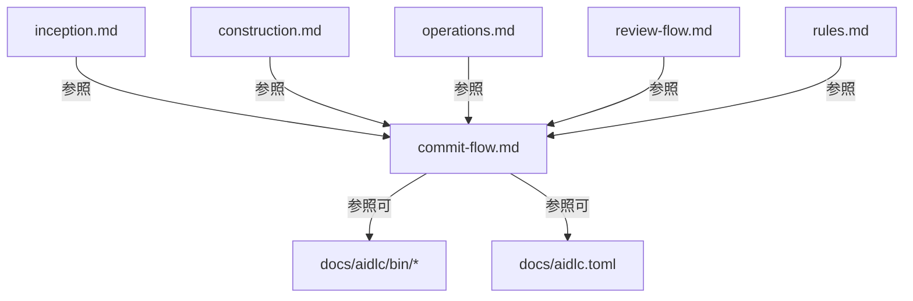

# 論理設計: コミット処理統合

## 概要

分散したコミット関連ロジックを `prompts/package/prompts/common/commit-flow.md` に集約し、各フェーズプロンプトからセクション参照方式で統一する。

## 変更適用方針【重要】

### 正本とデプロイコピーの関係

| パス | 役割 | 編集可否 |
|------|------|---------|
| `prompts/package/prompts/` | 正本（Source of Truth） | 編集対象 |
| `docs/aidlc/prompts/` | デプロイコピー（rsync同期先） | 直接編集禁止 |

**実施順序**:

1. `prompts/package/prompts/` 配下のファイルを編集
2. Operations Phase で `sync-prompts.sh` 実行時に `docs/aidlc/prompts/` へ自動反映

**プロンプト内の参照パス**: AIがランタイムで読み込むパスは `docs/aidlc/prompts/common/commit-flow.md`（デプロイコピー側）を使用する。これは既存の `review-flow.md` 参照パターンと同一。

## アーキテクチャパターン

### 参照パターン: セクション参照方式（案B）

各フェーズプロンプトは `commit-flow.md` の特定セクションを名前で参照する。

**参照形式**:

```text
**【次のアクション】** 今すぐ `docs/aidlc/prompts/common/commit-flow.md` の「セクション名」を読み込んで、手順に従ってください。
```

**利点**:
- コンテキスト肥大化を防止（必要なセクションのみ読み込む）
- 既存の `review-flow.md` 参照パターンと一貫
- 各フェーズプロンプトの可読性を維持

**制約**:
- `commit-flow.md` から他の全プロンプトファイルへの逆参照禁止（DAG維持）
- セクション名は安定アンカー（番号なし名前ベース）で一意

### セクション安定アンカー方針

セクション見出しに番号を使わず、固定名で参照することで、章追加・再構成時に契約が壊れないようにする。

| 安定アンカー名 | 見出し |
|-------------|-------|
| `コミットポリシー` | `## コミットポリシー` |
| `レビュー前コミット` | `### レビュー前コミット` |
| `レビュー反映コミット` | `### レビュー反映コミット` |
| `Inception Phase完了コミット` | `### Inception Phase完了コミット` |
| `Unit完了コミット` | `### Unit完了コミット` |
| `Operations Phase完了コミット` | `### Operations Phase完了コミット` |
| `Squash統合フロー` | `## Squash統合フロー` |
| `コミット前確認チェックリスト` | `### コミット前確認チェックリスト` |

### ファイル依存関係



### 逆参照禁止ルール

`commit-flow.md` 内で以下への参照を含めてはならない:
- `inception.md`
- `construction.md`
- `operations.md`
- `review-flow.md`
- `rules.md`

`commit-flow.md` が参照してよいもの:
- `docs/aidlc/bin/` 配下のスクリプト
- `docs/aidlc.toml` の設定値

## コンポーネント設計: commit-flow.md

### セクション構成（安定アンカーベース）

```markdown
# コミットフロー

## コミットポリシー
（ポリシー層: いつ・何を・どのフォーマットで）

### コミットタイミング
（rules.md L73-82 から移動）

### コミットメッセージフォーマット一覧
（新規: 全パターンの定義テーブル）

### Co-Authored-By 設定
（rules.md L84-146 から移動）

### プレースホルダ定義
（新規: 標準プレースホルダテーブル）

## レビューコミット手順
（実行フロー層: 具体的な手順・コマンド）

### レビュー前コミット
（review-flow.md L130-141, L373-384 から統合）

### レビュー反映コミット
（review-flow.md L333-344, L389-400 から統合）

## フェーズ完了コミット手順

### Inception Phase完了コミット
（inception.md L804-810 から移動）

### Unit完了コミット
（construction.md L868-914 から移動）

### Operations Phase完了コミット
（operations.md L656-662 から移動）

## Squash統合フロー
（construction.md L746-866 から移動）

### 設定確認・VCS判定
### ユーザー確認・中間コミット
### 起点コミット特定・Squash実行
### jjブックマーク更新・エラーリカバリ

## コミット前確認チェックリスト
（construction.md L883-914 から移動）
```

### セクション別 詳細仕様

#### コミットメッセージフォーマット一覧

| ID | prefix | テンプレート | 使用場面 |
|-----|--------|------------|---------|
| REVIEW_PRE | `chore:` | `chore: [{{CYCLE}}] レビュー前 - {ARTIFACT_NAME}` | AIレビュー/人間レビュー前 |
| REVIEW_POST | `chore:` | `chore: [{{CYCLE}}] レビュー反映 - {ARTIFACT_NAME}` | レビュー修正反映後 |
| INCEPTION_COMPLETE | `feat:` | `feat: [{{CYCLE}}] Inception Phase完了 - {DESCRIPTION}` | Inception Phase完了時 |
| UNIT_COMPLETE | `feat:` | `feat: [{{CYCLE}}] Unit {NNN}完了 - {DESCRIPTION}` | Unit完了時（標準パス） |
| UNIT_SQUASH_PREP | `chore:` | `chore: [{{CYCLE}}] Unit {NNN}完了 - 完了準備` | Squash前の中間コミット |
| OPERATIONS_COMPLETE | `chore:` | `chore: [{{CYCLE}}] Operations Phase完了 - {DESCRIPTION}` | Operations Phase完了時 |

#### プレースホルダ定義

| プレースホルダ | 形式 | 説明 |
|-------------|------|------|
| `{{CYCLE}}` | `vX.X.X` | サイクル番号 |
| `{NNN}` | 3桁ゼロパディング | Unit番号（例: 001, 004） |
| `{UNIT_NAME}` | 文字列 | Unit名 |
| `{ARTIFACT_NAME}` | 文字列 | 成果物名（レビュー対象名） |
| `{DESCRIPTION}` | 自由記述 | コミットの説明文 |
| `{AI_AUTHOR}` | `名前 <メール>` | Co-Authored-By値 |

#### プレースホルダ移行マッピング

既存ファイルのプレースホルダを `commit-flow.md` の標準プレースホルダに統一する。

| 現状の表記 | ファイル | 統一後 |
|----------|---------|-------|
| `{成果物名}` | review-flow.md L140, L343, L383, L399 | `{ARTIFACT_NAME}` |
| `{ai_author}` | construction.md L790, L801 | `{AI_AUTHOR}` |
| `{Unit名}` | construction.md L844 | `{UNIT_NAME}` |
| `{検出または設定されたai_author値}` | rules.md L145 | `{AI_AUTHOR}` |
**移行ルール**:
- `commit-flow.md` 内では統一後のプレースホルダのみ使用
- 既存ファイルで残る参照（`commit-flow.md` への委譲テキスト部分）はプレースホルダを含まないため影響なし
- 移行は `commit-flow.md` 作成時に一括適用（既存ファイルのインライン手順は削除されるため個別パッチ不要）

**移行対象外**:
- `construction_unit{NN}.md`（履歴ファイル命名規則）の `{NN}` はコミットメッセージのプレースホルダではなく、ファイル命名規約のため統一対象外。2桁ゼロパディングのまま維持する

#### レビュー前コミット（手順定義）

```markdown
### レビュー前コミット

**レビュー前コミット**（変更がある場合のみ）:

\```bash
git status --porcelain
\```

AIが出力を確認し、変更がある場合は以下を順次実行:

\```bash
git add -A
git commit -m "$(cat <<'EOF'
chore: [{{CYCLE}}] レビュー前 - {ARTIFACT_NAME}

Co-Authored-By: {AI_AUTHOR}
EOF
)"
\```
```

**注意**: 既存のレビュー前コミットでは Co-Authored-By が付与されていないが、統合後は全コミットに統一付与する。

#### レビュー反映コミット（手順定義）

レビュー前コミットと同一構造で、メッセージテンプレートのみ REVIEW_POST を使用。

#### Unit完了コミット（標準パス）

以下の要素を含む:
- squash未実行/スキップ時のフロー
- コミット前確認チェックリストへの参照
- `git status` による事後確認

#### Squash統合フロー

construction.md L746-866 の内容をそのまま移動。変更点:
- プレースホルダを統一名に変更（移行マッピング参照）
- セクション見出しを安定アンカー名に変更

## 既存ファイルの変更仕様

**重要**: すべての変更は `prompts/package/prompts/` 配下で実施する。

### common/rules.md の変更

**対象**: `prompts/package/prompts/common/rules.md`

**削除対象**: L73-146（コミットタイミング + Co-Authored-By 全体）

**置換内容**:

```markdown
## Gitコミットのルール

コミットタイミング、メッセージフォーマット、Co-Authored-By設定は `common/commit-flow.md` を参照。
```

**残すもの**: L1-72（設定読み込み、承認プロセス、Q&A記録、予想禁止ルール）、L148以降（jjサポート設定、コード品質基準）

### common/review-flow.md の変更

**対象**: `prompts/package/prompts/common/review-flow.md`

**変更箇所4箇所**（安定アンカー名で参照）:

1. **L130-141（AIレビューフロー内のレビュー前コミット）**:

   置換:
   ```markdown
   - **レビュー前コミット**: `common/commit-flow.md` の「レビュー前コミット」手順に従う
   ```

2. **L333-344（AIレビューフロー内のレビュー後コミット）**:

   置換:
   ```markdown
   - **レビュー後コミット**: `common/commit-flow.md` の「レビュー反映コミット」手順に従う
   ```

3. **L373-384（人間レビューフロー内のレビュー前コミット）**:

   置換:
   ```markdown
   - **レビュー前コミット**: `common/commit-flow.md` の「レビュー前コミット」手順に従う
   ```

4. **L389-400（人間レビューフロー内のレビュー後コミット）**:

   置換:
   ```markdown
   - **レビュー後コミット**: `common/commit-flow.md` の「レビュー反映コミット」手順に従う
   ```

### construction.md の変更

**対象**: `prompts/package/prompts/construction.md`

**変更箇所2箇所**:

1. **L746-866（Squashセクション全体）**:

   置換:
   ```markdown
   ### 3.5 Squash（コミット統合）【オプション】

   **【次のアクション】** `docs/aidlc/prompts/common/commit-flow.md` の「Squash統合フロー」を読み込んで、手順に従ってください。

   - `squash:success` の場合: ステップ4をスキップ
   - その他の場合: ステップ4に進む
   ```

2. **L868-914（Gitコミットセクション）**:

   置換:
   ```markdown
   ### 4. Gitコミット

   **注意**: ステップ3.5でsquashを実行した場合（`squash:success`）、コミットは既に完了しています。`git status` で確認のみ行ってください。

   squashを実行していない場合は、`docs/aidlc/prompts/common/commit-flow.md` の「Unit完了コミット」手順に従ってください。
   ```

### inception.md の変更

**対象**: `prompts/package/prompts/inception.md`

**変更箇所**: L804-810

置換:
```markdown
### 5. Gitコミット

Inception Phaseで作成・変更したすべてのファイル（**inception/progress.md、履歴ファイルを含む**）をコミット。

`docs/aidlc/prompts/common/commit-flow.md` の「Inception Phase完了コミット」手順に従ってください。
```

### operations.md の変更

**対象**: `prompts/package/prompts/operations.md`

**変更箇所**: L656-662

置換:
```markdown
#### 6.5 Gitコミット

Operations Phaseで作成したすべてのファイル（**operations/progress.md、履歴ファイルを含む**）をコミット。

`docs/aidlc/prompts/common/commit-flow.md` の「Operations Phase完了コミット」手順に従ってください。
```

## インターフェース契約

### commit-flow.md が提供するセクション参照API

| 安定アンカー名 | 呼び出し元 | 入力パラメータ |
|------------|----------|--------------|
| レビュー前コミット | review-flow.md | `{{CYCLE}}`, `{ARTIFACT_NAME}`, `{AI_AUTHOR}` |
| レビュー反映コミット | review-flow.md | `{{CYCLE}}`, `{ARTIFACT_NAME}`, `{AI_AUTHOR}` |
| Inception Phase完了コミット | inception.md | `{{CYCLE}}`, `{DESCRIPTION}`, `{AI_AUTHOR}` |
| Unit完了コミット | construction.md | `{{CYCLE}}`, `{NNN}`, `{DESCRIPTION}`, `{AI_AUTHOR}` |
| Operations Phase完了コミット | operations.md | `{{CYCLE}}`, `{DESCRIPTION}`, `{AI_AUTHOR}` |
| Squash統合フロー | construction.md | `{{CYCLE}}`, `{NNN}`, `{UNIT_NAME}`, `{AI_AUTHOR}` |

## 影響分析

| ファイル | 変更種別 | 行数影響（概算） |
|---------|---------|----------------|
| `common/commit-flow.md` | 新規作成 | +300行 |
| `common/rules.md` | 削除+置換 | -72行, +3行 |
| `common/review-flow.md` | 置換 | -48行, +4行 |
| `construction.md` | 削除+置換 | -168行, +12行 |
| `inception.md` | 置換 | -5行, +3行 |
| `operations.md` | 置換 | -5行, +3行 |
| **合計** | | +300行, -298行 = +2行 |

## 不明点と質問

（なし - Unit 003の分析結果と計画承認で方針確定済み）
