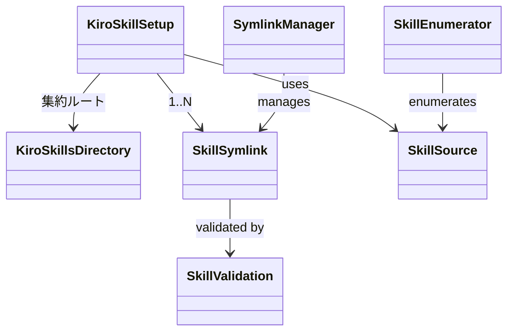

# ドメインモデル: Kiro標準スキル呼び出し対応

## 概要

`.kiro/skills/` ディレクトリにシンボリックリンクを配置し、Kiroネイティブのスキル発見機能で既存AI-DLCスキルを利用可能にする。ファイルシステム構成の変更とセットアップスクリプトの拡張が対象。

**重要**: このドメインモデル設計では**コードは書かず**、構造と責務の定義のみを行います。

## エンティティ

### KiroSkillsDirectory

`.kiro/skills/` ディレクトリを表す。

- **属性**:
  - path: String - `.kiro/skills/`（プロジェクトルートからの相対パス）
- **振る舞い**:
  - 作成: ディレクトリが存在しなければ作成する
  - スキルリンク配置: `docs/aidlc/skills/` の各スキルに対応するシンボリックリンクを配置する

### SkillSymlink

個別スキルのシンボリックリンクを表す。

- **属性**:
  - linkPath: String - `.kiro/skills/{skill-name}/`（リンク元）
  - targetPath: String - `../../docs/aidlc/skills/{skill-name}/`（リンク先、相対パス）
  - skillName: String - スキル名（ディレクトリ名）
- **振る舞い**:
  - 作成: リンクが存在しなければ作成
  - 整合性確認: 既存リンクのターゲットが正しいか確認
  - 壊れリンク削除: リンク先が存在しないリンクを削除

### AgentConfig

`.kiro/agents/aidlc.json` の設定を表す。

- **属性**:
  - resources: Array - リソース参照のリスト
- **振る舞い**:
  - skill://参照削除: `skill://docs/aidlc/skills/*/SKILL.md` をresourcesから削除

## 値オブジェクト

### SkillSource

スキルのソースディレクトリ情報。

- **属性**:
  - basePath: String - `docs/aidlc/skills/`
  - skillDirs: Array - スキルディレクトリ名のリスト
- **不変性**: `docs/aidlc/skills/` はrsyncで管理される読み取り専用のソース
- **等価性**: basePath + skillDirs の完全一致

### SkillValidation

スキルディレクトリの有効性判定。

- **属性**:
  - hasSkillMd: Boolean - SKILL.mdが存在するか
- **不変性**: SKILL.mdの有無は列挙時に一度判定すればよい
- **等価性**: hasSkillMd の一致

## 集約

### KiroSkillSetup

- **集約ルート**: KiroSkillsDirectory
- **含まれる要素**: SkillSymlink（複数）、SkillSource、SkillValidation
- **境界**: `.kiro/skills/` ディレクトリ配下のシンボリックリンク管理
- **不変条件**:
  - 全リンクは `docs/aidlc/skills/` 配下の有効なスキル（SKILL.md存在）を指す
  - 不正なリンク先のシンボリックリンクは自己修復される（unlink→再作成）
  - 壊れたリンクは存在しない
  - べき等性: 何度実行しても同じ結果に収束する

## ドメインサービス

### SkillEnumerator

- **責務**: `docs/aidlc/skills/` を動的列挙し、有効なスキル（SKILL.md存在）を返す
- **操作**: enumerate() - 有効なスキルディレクトリ名のリストを返す。SKILL.mdがないディレクトリは警告してスキップ

### SymlinkManager

- **責務**: シンボリックリンクの作成・検証・壊れリンク削除
- **操作**:
  - createLink(linkPath, targetPath) - 存在しなければ作成、既存なら整合性確認
  - cleanBrokenLinks(directory) - 壊れたシンボリックリンクを削除

## ドメインモデル図

## ユビキタス言語

- **スキル**: AIエージェントに特定の能力を教えるモジュール（SKILL.md + references/）
- **ネイティブ発見**: Kiro CLIが `.kiro/skills/` を自動スキャンしてスキルを認識する仕組み
- **スキルソース**: `docs/aidlc/skills/` — rsyncで管理されるスキル定義の正規ソース
- **リンク先**: シンボリックリンクが指すスキルソース内のディレクトリ

## 設計判断

### 共通関数抽出について

AIレビューで `setup_claude_skills` と `setup_kiro_skills` のシンボリックリンク管理ロジック重複が指摘された。

**判断**: 共通関数を抽出する。理由:
- `.claude/skills/` と `.kiro/skills/` の処理は「ターゲットディレクトリ」と「リンクベースパス」のみが異なる
- 共通関数 `setup_skill_symlinks(target_dir, source_dir)` として抽出することで、新ツール追加時の拡張も容易になる
- 壊れリンク削除ロジックも共有可能
