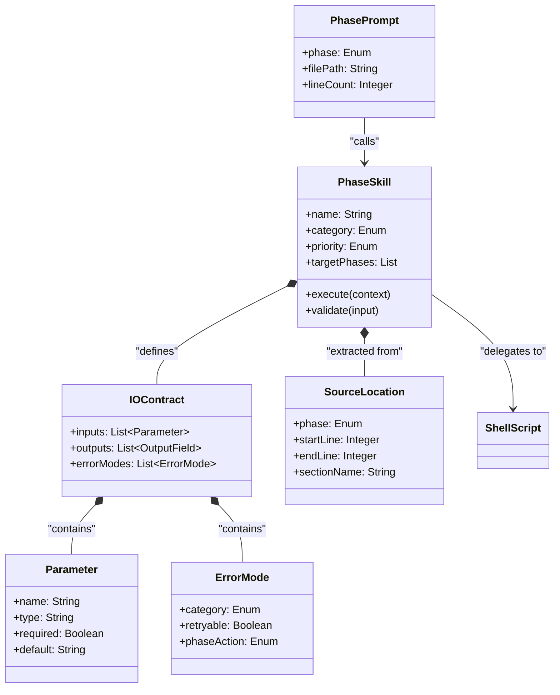

# ドメインモデル: 共通処理スキル化の全体設計

## 概要

フェーズプロンプト（inception.md, construction.md, operations.md）に散在する共通処理をスキルとして抽出・構造化するための概念モデルを定義する。各スキル候補の責務、I/O契約、依存関係、凝集度基準を明確にし、次サイクル以降の実装の指針とする。

**重要**: このドメインモデル設計では**コードは書かず**、構造と責務の定義のみを行います。

## スキル候補一覧と優先度

### 優先度評価基準

| 基準 | 重み | 説明 |
|------|------|------|
| 削減効果（行数） | 高 | フェーズプロンプトからの削減行数 |
| 再利用性 | 高 | 複数フェーズで使用されるか |
| 意味的共通性 | 高 | 文面類似ではなく、ビジネスロジックとしての共通性があるか |
| 実装複雑度 | 中 | スキル化の難易度（条件分岐・状態管理の複雑さ） |
| 可読性影響 | 中 | 抽象化による可読性低下リスク |

### 候補一覧

| # | スキル名 | カテゴリ | 優先度 | 推定削減行数 | 対象フェーズ |
|---|---------|---------|--------|------------|------------|
| 1 | issue-management | 操作系 | High | ~106 | I/C/O |
| 2 | backlog-management | 操作系 | High | ~137 | I/C/O |
| 3 | pr-operations | 操作系 | High | ~256 | I/O |
| 4 | version-management | 操作系 | Medium | ~143 | I/O |
| 5 | setup-initialization | フロー制御系 | Medium | ~225 | I |
| 6 | progress-tracking | フロー制御系 | Medium | ~75 | I/C/O |
| 7 | dialogue-planning | フロー制御系 | Low | ~248 | I/C/O |
| 8 | completion-validation | フロー制御系 | Low | ~91 | C |
| 9 | code-quality-check | ユーティリティ系 | Low | ~20 | C/O |
| 10 | unit-squash | ユーティリティ系 | Low | ~12 | C |

I = Inception, C = Construction, O = Operations

**注**: markdown-validation は code-quality-check (#9) の check_type パラメータに統合済みのため、独立候補からは除外。

### 優先度判定の根拠

**High（3件）**: 複数フェーズで使用 + 削減効果大 + 意味的共通性が高い
- issue-management: 5箇所に散在、全フェーズで同一のIssue操作パターン
- backlog-management: モード分岐（git/issue）が同一ロジックで3フェーズに散在
- pr-operations: PR作成・更新・マージが2フェーズに類似パターンで存在

**Medium（3件）**: 削減効果は大きいが、フェーズ固有ロジックの比率が高い
- version-management: バージョン比較・更新は共通だが、iOS固有ロジック等の分岐が多い
- setup-initialization: Inception固有だが225行と大きく、手続き的で切り出しやすい
- progress-tracking: 全フェーズ共通だが行数が少なく、後方互換処理がConstruction固有

**Low（5件）**: 行数が少ない、または抽象化コストが可読性向上を上回る
- dialogue-planning: 行数は多いがメタパターン的で、抽象化するとフェーズ固有の文脈が失われるリスク
- completion-validation: Construction固有の検証ロジック
- code-quality-check / markdown-validation: 既にスクリプト化済み（run-markdownlint.sh）で追加抽象化のメリットが薄い
- unit-squash: 12行と小さく、スキル化のオーバーヘッドが削減効果を上回る

## エンティティ（Entity）

### PhaseSkill（フェーズスキル）
スキルとして切り出される共通処理の単位。

- **ID**: スキル名（文字列、一意）
- **属性**:
  - name: String - スキル識別名（kebab-case、例: `issue-management`）
  - category: Enum[操作系, フロー制御系, ユーティリティ系] - スキルカテゴリ
  - priority: Enum[High, Medium, Low] - 実装優先度
  - description: String - スキルの説明（英語、SKILL.mdのdescriptionフィールド用）
  - argumentHint: String - 引数のヒント
  - targetPhases: List[Enum[Inception, Construction, Operations]] - 対象フェーズ
- **振る舞い**:
  - execute(context): 指定されたコンテキストでスキルの処理を実行
  - validate(input): 入力パラメータを検証し、不正時はエラーを返す

### SkillCandidate（スキル候補）
分析段階でのスキル化候補。PhaseSkillの設計前の状態。

- **ID**: 連番（Integer）
- **属性**:
  - name: String - 候補名
  - sourceLocations: List[SourceLocation] - プロンプト内の出現箇所
  - estimatedLineReduction: Integer - 推定削減行数
  - semanticCommonality: Enum[High, Medium, Low] - 意味的共通性
  - abstractionRisk: Enum[High, Medium, Low] - 抽象化リスク
- **振る舞い**:
  - assessPriority(): 優先度評価基準に基づいてスキル優先度を算出

## 値オブジェクト（Value Object）

### SourceLocation（ソース位置）
プロンプトファイル内のセクション位置を示す。

- **属性**:
  - phase: Enum[Inception, Construction, Operations]
  - filePath: String - ファイルパス
  - startLine: Integer - 開始行番号
  - endLine: Integer - 終了行番号
  - sectionName: String - セクション名
- **不変性**: プロンプトファイルの特定バージョン時点での位置を表す
- **等価性**: phase + filePath + startLine で一意に特定

### IOContract（I/O契約）
スキルの入出力定義。

- **属性**:
  - inputs: List[Parameter] - 入力パラメータリスト
  - outputs: List[OutputField] - 出力フィールドリスト
  - errorModes: List[ErrorMode] - 失敗モードリスト
- **不変性**: スキルバージョンに紐づく
- **等価性**: 全フィールドの値で判定

### Parameter（パラメータ）
- **属性**:
  - name: String - パラメータ名
  - type: String - 型
  - required: Boolean - 必須かどうか
  - default: String | null - デフォルト値
  - description: String - 説明

### OutputField（出力フィールド）
- **属性**:
  - name: String - フィールド名
  - type: String - 型
  - description: String - 説明

### ErrorMode（エラーモード）
- **属性**:
  - category: Enum[INPUT_INVALID, DEPENDENCY_UNAVAILABLE, EXECUTION_FAILURE, SKIPPED_BY_CONFIG]
  - description: String - エラーの説明
  - retryable: Boolean - リトライ可能か
  - phaseAction: Enum[CONTINUE, STOP, ASK_USER] - フェーズ側の対応

## 集約（Aggregate）

### SkillDesign（スキル設計）
- **集約ルート**: PhaseSkill
- **含まれる要素**: IOContract, List[SourceLocation]
- **境界**: 1つのスキルの設計全体（責務、I/O、出現箇所）
- **不変条件**:
  - 1スキル1責務（変更理由が1つ）
  - 入力パラメータの名前は集約内で一意
  - 必須パラメータにデフォルト値なし
  - **内部モジュール分離**: operationパラメータで複数操作を持つスキル（issue-management, backlog-management, pr-operations等）は、references/operations.md 内で操作ごとにセクション分離し、SKILL.md本文はディスパッチャーとしての責務のみを持つ

## ドメインサービス

### SkillPriorityAssessor（スキル優先度評価サービス）
- **責務**: 候補に対して優先度評価基準を適用し、High/Medium/Low を判定
- **操作**:
  - assess(candidate): 削減効果・再利用性・意味的共通性・実装複雑度・可読性影響を総合評価

### CohesionChecker（凝集度チェッカー）
- **責務**: スキルが単一責務・変更理由の一貫性・再利用境界を満たすか検証
- **操作**:
  - check(skill): 凝集度チェック基準に基づいてPass/Failを判定

## 依存ルール表

### 許可される依存方向

```
PhasePrompt → PhaseSkill → ShellScript
PhasePrompt → CommonFile
PhaseSkill → CommonFile（参照のみ）
```

### 禁止される依存

| 依存元 | 依存先 | 理由 |
|--------|--------|------|
| PhaseSkill | PhasePrompt | 循環依存。スキルはフェーズから独立して動作すべき |
| PhaseSkill | PhaseSkill | スキル間循環依存。各スキルは独立して呼び出し可能であるべき |
| ShellScript | PhaseSkill | 逆方向依存。スクリプトはスキルの存在を知らない |

### 境界越境時の扱い

- **共通データ（cycle名、Unit番号等）**: 呼び出し元（PhasePrompt）が引数として渡す
- **環境状態（gh:available等）**: PhasePromptが事前に取得し、引数として渡す。スキル内で環境チェックを重複実行しない
- **設定値（aidlc.toml）**: スキル内で必要な設定値は引数として受け取る。直接tomlを読まない（ただしスキル内部のスクリプト呼び出しで間接的に読む場合を除く）

## 凝集度チェック基準

各スキルは以下の3基準を満たすこと：

| 基準 | 説明 | 判定方法 |
|------|------|---------|
| 単一責務 | スキルの変更理由が1つであること | 「〜のために変更する」が1つの文で完結するか |
| 変更理由の一貫性 | スキル内のすべての処理が同一のビジネス目的に寄与すること | 処理を削除した場合、スキルの目的が損なわれるか |
| 再利用境界 | スキルが2つ以上のフェーズまたは2つ以上のステップで再利用されること | 1箇所でしか使われない処理はスキル化しない（例外: 225行超の大きなブロック） |

## 共通レスポンス形式

全スキルの出力は以下の共通構造に従う：

| フィールド | 型 | 必須 | 説明 |
|-----------|-----|------|------|
| status | Enum[ok, warning, error, skipped] | Yes | 操作結果ステータス |
| data | Object | No | 操作固有のデータ（各スキルで定義） |
| errors | List[String] | No | エラーメッセージ一覧（status=error時） |

**各スキルのI/O契約で定義する「出力」は `data` フィールド内のフィールド定義である。**

例: `issue-management` の `list` 操作の場合
- status: `ok`
- data: `{ issues: [{...}, {...}] }`

## 各スキルのI/O契約定義

### 1. issue-management

**責務**: GitHub Issueの状態管理（ステータス更新、ラベル付与、一覧取得）

| 入力 | 型 | 必須 | デフォルト | 説明 |
|------|-----|------|-----------|------|
| operation | Enum[set-status, list, create-label, label-batch, extract-related] | Yes | - | 実行する操作 |
| issue_number | Integer | No | - | 対象Issue番号（set-status時必須） |
| status | String | No | - | 設定するステータス（set-status時必須） |
| cycle | String | No | - | サイクル番号（create-label, label-batch時必須） |
| unit_file_path | String | No | - | Unit定義ファイルパス（extract-related時必須） |

| data配下フィールド | 型 | 説明 |
|-------------------|-----|------|
| operation_result | String | 操作結果（`issue:{number}:status-updated:{status}` 等） |
| issues | List[Object] | Issue一覧（list操作時） |

| エラーモード | カテゴリ | リトライ | フェーズ対応 |
|------------|---------|---------|------------|
| gh CLI未インストール | DEPENDENCY_UNAVAILABLE | No | CONTINUE（スキップ） |
| Issue番号不正 | INPUT_INVALID | No | ASK_USER |
| API通信失敗 | EXECUTION_FAILURE | Yes | ASK_USER |

### 2. backlog-management

**責務**: バックログ項目の管理（作成、一覧、整理、重複検出）

| 入力 | 型 | 必須 | デフォルト | 説明 |
|------|-----|------|-----------|------|
| operation | Enum[list, create-item, move-completed, detect-duplicates, inspect] | Yes | - | 実行する操作 |
| backlog_mode | Enum[git, issue, git-only, issue-only] | Yes | - | バックログモード |
| cycle | String | No | - | サイクル番号 |
| item_title | String | No | - | 項目タイトル（create-item時必須） |
| item_type | Enum[feature, bugfix, chore, refactor, docs, perf, security] | No | chore | 項目種類（create-item時） |

| data配下フィールド | 型 | 説明 |
|-------------------|-----|------|
| operation_result | String | 操作結果 |
| items | List[Object] | バックログ項目一覧（list操作時） |
| duplicates | List[Object] | 重複候補（detect-duplicates時） |

| エラーモード | カテゴリ | リトライ | フェーズ対応 |
|------------|---------|---------|------------|
| バックログディレクトリ不在 | DEPENDENCY_UNAVAILABLE | No | CONTINUE（自動作成） |
| Issue作成失敗（gh不可、git/issue モード） | DEPENDENCY_UNAVAILABLE | No | CONTINUE（git fallback） |
| Issue作成失敗（gh不可、issue-only モード） | DEPENDENCY_UNAVAILABLE | No | ASK_USER（git保存不可のため手動対応を案内） |
| モード不正 | INPUT_INVALID | No | ASK_USER |

### 3. pr-operations

**責務**: Pull Requestのライフサイクル管理（作成、Ready化、マージ、検証）

| 入力 | 型 | 必須 | デフォルト | 説明 |
|------|-----|------|-----------|------|
| operation | Enum[create, ready, merge, validate-state, generate-body] | Yes | - | 実行する操作 |
| base_branch | String | Yes | - | マージ先ブランチ |
| title | String | No | - | PRタイトル（create時必須） |
| body_context | Object | No | - | PRボディ生成に必要なコンテキスト |
| merge_strategy | Enum[squash, merge, rebase] | No | squash | マージ戦略 |

| data配下フィールド | 型 | 説明 |
|------|-----|------|
| pr_url | String | PR URL |
| pr_number | Integer | PR番号 |
| operation_result | String | 操作結果ステータス |

| エラーモード | カテゴリ | リトライ | フェーズ対応 |
|------------|---------|---------|------------|
| gh CLI不可 | DEPENDENCY_UNAVAILABLE | No | CONTINUE（手動案内） |
| ブランチ未push | INPUT_INVALID | No | STOP（push指示） |
| マージコンフリクト | EXECUTION_FAILURE | No | ASK_USER |

### 4. version-management

**責務**: バージョン番号の確認・比較・更新

| 入力 | 型 | 必須 | デフォルト | 説明 |
|------|-----|------|-----------|------|
| operation | Enum[check-starter-kit, suggest-cycle-version, check-current, update-version] | Yes | - | 実行する操作 |
| cycle | String | No | - | サイクル番号 |
| project_type | String | No | - | プロジェクト種類（Node, Python, Go, iOS等） |

| data配下フィールド | 型 | 説明 |
|------|-----|------|
| current_version | String | 現在バージョン |
| latest_version | String | 最新バージョン |
| needs_update | Boolean | 更新が必要か |
| suggested_version | String | 推奨バージョン |

| エラーモード | カテゴリ | リトライ | フェーズ対応 |
|------------|---------|---------|------------|
| GitHub API通信失敗 | EXECUTION_FAILURE | Yes | CONTINUE（現行バージョンで継続） |
| バージョンファイル不在 | DEPENDENCY_UNAVAILABLE | No | ASK_USER |

### 5. setup-initialization

**責務**: サイクル開始時の環境初期化（ディレクトリ作成、ブランチ確認、設定検証）

| 入力 | 型 | 必須 | デフォルト | 説明 |
|------|-----|------|-----------|------|
| cycle | String | Yes | - | サイクル番号 |
| branch_name | String | No | - | 現在のブランチ名 |

| data配下フィールド | 型 | 説明 |
|-------------------|-----|------|
| created_dirs | List[String] | 作成されたディレクトリ |
| warnings | List[String] | 警告メッセージ |

| エラーモード | カテゴリ | リトライ | フェーズ対応 |
|------------|---------|---------|------------|
| ディレクトリ作成失敗 | EXECUTION_FAILURE | Yes | STOP |
| ブランチ名不一致 | INPUT_INVALID | No | ASK_USER |

### 6. progress-tracking

**責務**: フェーズ・Unit進捗の読み取りと状態管理

| 入力 | 型 | 必須 | デフォルト | 説明 |
|------|-----|------|-----------|------|
| phase | Enum[inception, construction, operations] | Yes | - | 対象フェーズ |
| cycle | String | Yes | - | サイクル番号 |

| data配下フィールド | 型 | 説明 |
|------|-----|------|
| units | List[UnitStatus] | 各Unitの状態一覧 |
| current_unit | UnitStatus | No | 進行中のUnit情報（なければ省略） |
| all_completed | Boolean | 全Unit完了か |

| エラーモード | カテゴリ | リトライ | フェーズ対応 |
|------------|---------|---------|------------|
| Unit定義ファイル不在 | DEPENDENCY_UNAVAILABLE | No | STOP（Inception案内） |
| 実装状態セクション未発見 | INPUT_INVALID | No | CONTINUE（後方互換処理） |

### 7. dialogue-planning

**責務**: 対話形式での計画作成・承認取得のメタパターン提供

| 入力 | 型 | 必須 | デフォルト | 説明 |
|------|-----|------|-----------|------|
| context_type | Enum[intent, user-story, unit-definition, design, plan] | Yes | - | 対話コンテキスト種別 |
| template_path | String | No | - | 使用するテンプレートパス |

| data配下フィールド | 型 | 説明 |
|------|-----|------|
| artifact_path | String | 作成された成果物パス |
| approval_status | Enum[approved, rejected, pending] | 承認状態 |

| エラーモード | カテゴリ | リトライ | フェーズ対応 |
|------------|---------|---------|------------|
| テンプレート不在 | DEPENDENCY_UNAVAILABLE | No | ASK_USER |

**凝集度評価**: Low優先度の理由 - メタパターン的な共通性はあるが、各フェーズのコンテキスト（質問内容、成果物形式）が異なり、抽象化によりフェーズ固有の文脈が失われるリスクが高い。

### 8. completion-validation

**責務**: Unit完了時の条件チェックと設計・実装整合性検証

| 入力 | 型 | 必須 | デフォルト | 説明 |
|------|-----|------|-----------|------|
| cycle | String | Yes | - | サイクル番号 |
| unit_number | String | Yes | - | Unit番号 |
| plan_file_path | String | Yes | - | 計画ファイルパス |

| data配下フィールド | 型 | 説明 |
|------|-----|------|
| checklist_result | List[CheckItem] | 各条件の達成状況 |
| all_passed | Boolean | 全条件達成か |
| design_consistency | Object | 設計・実装整合性結果 |

| エラーモード | カテゴリ | リトライ | フェーズ対応 |
|------------|---------|---------|------------|
| 計画ファイル不在 | DEPENDENCY_UNAVAILABLE | No | CONTINUE（警告表示） |
| チェックリストセクション不在 | INPUT_INVALID | No | CONTINUE（スキップ） |

### 9. code-quality-check

**責務**: markdownlint等のコード品質チェック実行

| 入力 | 型 | 必須 | デフォルト | 説明 |
|------|-----|------|-----------|------|
| cycle | String | Yes | - | サイクル番号 |
| check_type | Enum[markdownlint] | No | markdownlint | チェック種類 |

| data配下フィールド | 型 | 説明 |
|-------------------|-----|------|
| check_result | Enum[pass, fail, skipped] | チェック結果 |
| lint_errors | List[String] | lintエラー一覧 |

| エラーモード | カテゴリ | リトライ | フェーズ対応 |
|------------|---------|---------|------------|
| markdownlint未インストール | DEPENDENCY_UNAVAILABLE | No | CONTINUE（スキップ） |
| 設定で無効化 | SKIPPED_BY_CONFIG | No | CONTINUE（自動スキップ） |

### 10. unit-squash

**責務**: Unit完了時のコミットsquash実行

| 入力 | 型 | 必須 | デフォルト | 説明 |
|------|-----|------|-----------|------|
| cycle | String | Yes | - | サイクル番号 |
| unit_number | String | Yes | - | Unit番号 |
| unit_name | String | Yes | - | Unit名 |
| vcs | Enum[git, jj] | Yes | - | VCS種類 |
| base_commit | String | No | - | 起点コミット |

| data配下フィールド | 型 | 説明 |
|-------------------|-----|------|
| squash_result | Enum[success, skipped, error] | squash結果 |
| detail_message | String | 結果メッセージ |

| エラーモード | カテゴリ | リトライ | フェーズ対応 |
|------------|---------|---------|------------|
| working tree dirty | INPUT_INVALID | No | STOP（コミット指示） |
| squash対象なし | SKIPPED_BY_CONFIG | No | CONTINUE（squash:skipped） |
| rebase失敗 | EXECUTION_FAILURE | No | ASK_USER（リカバリ手順提示） |

> **統合済み: markdown-validation → code-quality-check (#9)**
> markdownlintの実行は code-quality-check の check_type パラメータで markdownlint を指定する形に統合。独立スキルとしない。将来的に他のlint（textlint等）が追加された場合も check_type の拡張で対応可能。

## ドメインモデル図



## ユビキタス言語

- **フェーズプロンプト**: AI-DLCの各フェーズ（Inception/Construction/Operations）を定義するMarkdownファイル
- **スキル**: SKILL.mdで定義される独立した処理単位。AIツールから呼び出し可能
- **I/O契約**: スキルの入力パラメータと出力形式の定義
- **依存ルール**: コンポーネント間の許可/禁止される依存方向の定義
- **凝集度**: スキル内の処理が単一の目的に向かっている度合い
- **意味的共通性**: 文面の類似性ではなく、ビジネスロジックとしての共通性
- **抽象化リスク**: スキル化により失われるフェーズ固有の文脈の大きさ
- **エラーモード**: スキル実行時に発生しうる失敗パターンとその対応方針
- **バックログモード**: バックログ項目の保存先（git/issue/git-only/issue-only）

## 不明点と質問（設計中に記録）

[Question] markdown-validation を独立スキルとするか、code-quality-check に統合するか
[Answer] 統合推奨。check_type パラメータで区別する方が凝集度が高く、将来の拡張にも対応しやすい。→ 候補数は実質10件（#11は#9に統合）
