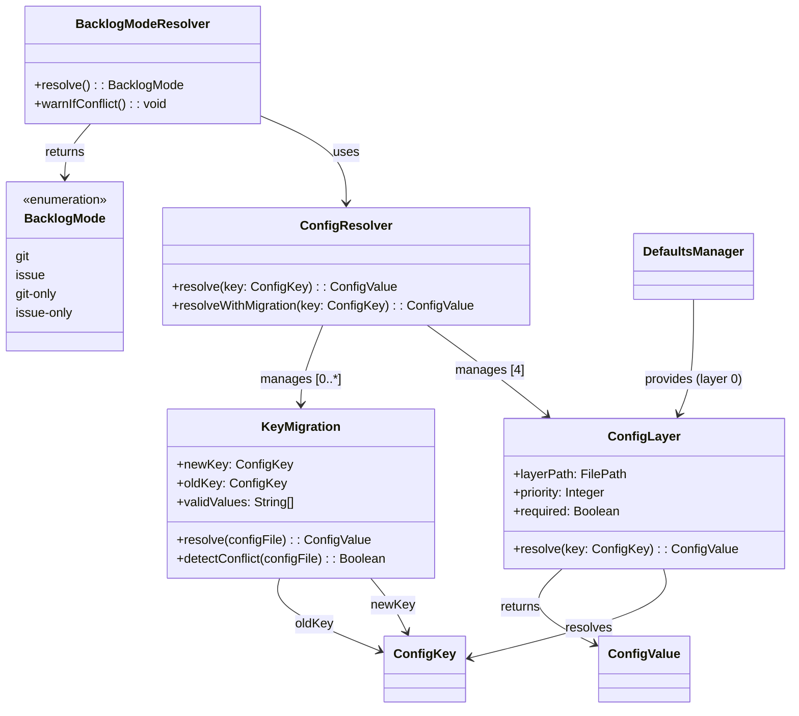

# ドメインモデル: 設定基盤リファクタ

## 概要

aidlc.tomlの設定キー構造を統一し、デフォルト値の集中管理を実現するためのドメインモデル。設定読み込みの4階層マージとキーマイグレーション（旧→新フォールバック）の責務を定義する。

**重要**: このドメインモデル設計では**コードは書かず**、構造と責務の定義のみを行います。実装はImplementation Phase（コード生成ステップ）で行います。

## 値オブジェクト（Value Object）

### ConfigKey

設定キーのドット区切りパス表現。

- **属性**: path: String - ドット区切りのキーパス（例: `rules.backlog.mode`）
- **不変性**: キーパスは解決時に変更されない
- **等価性**: path文字列の完全一致

### BacklogMode

バックログ管理モードの列挙型。

- **属性**: value: Enum - `git` | `issue` | `git-only` | `issue-only`
- **不変性**: モード値は設定ファイルから読み取った後変更されない
- **等価性**: value文字列の完全一致
- **バリデーション**: 上記4値以外は不正値として扱う
- **デフォルト値**: `git`

### ConfigValue

設定から読み取った値。

- **属性**: raw: String - 読み取った生の値
- **不変性**: 読み取り後変更されない
- **等価性**: raw文字列の完全一致

## エンティティ（Entity）

### ConfigLayer

設定値を提供する1つの層（ファイル）を表す。

- **ID**: layerPath: FilePath - 設定ファイルのパス
- **属性**:
  - priority: Integer - マージ優先度（低い値 = 低い優先度）
  - required: Boolean - 必須ファイルか否か
  - exists: Boolean - ファイルが実際に存在するか
- **振る舞い**:
  - resolve(key: ConfigKey): ConfigValue | null - 指定キーの値を読み取る

### KeyMigration

旧キーから新キーへのマイグレーション定義。

- **ID**: newKey: ConfigKey
- **属性**:
  - oldKey: ConfigKey - 旧キーパス
  - validValues: String[] - 有効な値のリスト（バリデーション用）
- **振る舞い**:
  - resolve(configFile): ConfigValue - 新キー優先→不正値なら旧キー→最終フォールバックのロジック
  - detectConflict(configFile): Boolean - 新旧両方存在かつ値不一致を検出
  - warnConflict(): void - stderrに警告を出力

## 集約（Aggregate）

### ConfigResolver

設定値の読み込みと解決を担う集約ルート。

- **集約ルート**: ConfigResolver
- **含まれる要素**:
  - ConfigLayer[] - 4つの設定レイヤー（優先度順）
  - KeyMigration[] - キーマイグレーション定義（現時点では backlog.mode → rules.backlog.mode の1件）
- **境界**: 設定値の読み込み・マージ・フォールバック・バリデーションの全責務
- **不変条件**:
  - レイヤーは必ず優先度順に評価される
  - 高優先度レイヤーの値が低優先度を上書きする
  - マイグレーション対象キーは有効値バリデーションを行う

### 4階層レイヤー構成

| 優先度 | レイヤー | パス | required |
|--------|---------|------|----------|
| 0（最低） | defaults | `docs/aidlc/config/defaults.toml` | No |
| 1 | user | `~/.aidlc/config.toml` | No |
| 2 | project | `docs/aidlc.toml` | Yes |
| 3（最高） | local | `docs/aidlc.toml.local` | No |

## ドメインサービス

### BacklogModeResolver

バックログモード固有の解決ロジック。`resolve-backlog-mode.sh` の `resolve_backlog_mode()` 関数に相当。3スクリプト（check-backlog-mode.sh、env-info.sh、init-cycle-dir.sh）はこの共通実装を source して使用する。

- **責務**: BacklogModeの解決（新旧キーフォールバック + 有効値バリデーション）
- **操作**:
  - resolve(): BacklogMode - 以下の優先順序で解決
    1. `rules.backlog.mode` が有効値 → 採用
    2. `rules.backlog.mode` が不正値 → 旧キー `backlog.mode` を評価
    3. `rules.backlog.mode` が未定義 → 旧キー `backlog.mode` を評価
    4. 旧キーも未定義または不正値 → デフォルト `git`
  - warnIfConflict(): void - 新旧両方存在・値不一致時にstderrに警告

### DefaultsManager

デフォルト値定義ファイルの管理。

- **責務**: defaults.toml の配置と read-config.sh への統合
- **操作**:
  - getDefault(key: ConfigKey): ConfigValue | null - defaults.toml からデフォルト値を取得

## ドメインモデル図

## ユビキタス言語

- **設定キー（ConfigKey）**: ドット区切りの階層パス（例: `rules.backlog.mode`）
- **設定レイヤー（ConfigLayer）**: 設定値を提供する1つのファイル層
- **キーマイグレーション（KeyMigration）**: 旧キーから新キーへの移行。新キー優先で旧キーフォールバック
- **デフォルト値レイヤー（DefaultsLayer）**: スターターキットが提供するデフォルト値の定義層
- **バックログモード（BacklogMode）**: バックログの保存先を決定するモード値
- **フォールバック**: 上位の設定が未定義または不正値の場合に、下位の設定や旧キーから値を取得する動作
- **有効値バリデーション**: 読み取った値がマイグレーション定義の `validValues` に含まれるか検証

## 不明点と質問（設計中に記録）

（なし - 計画承認時に仕様は確定済み）
