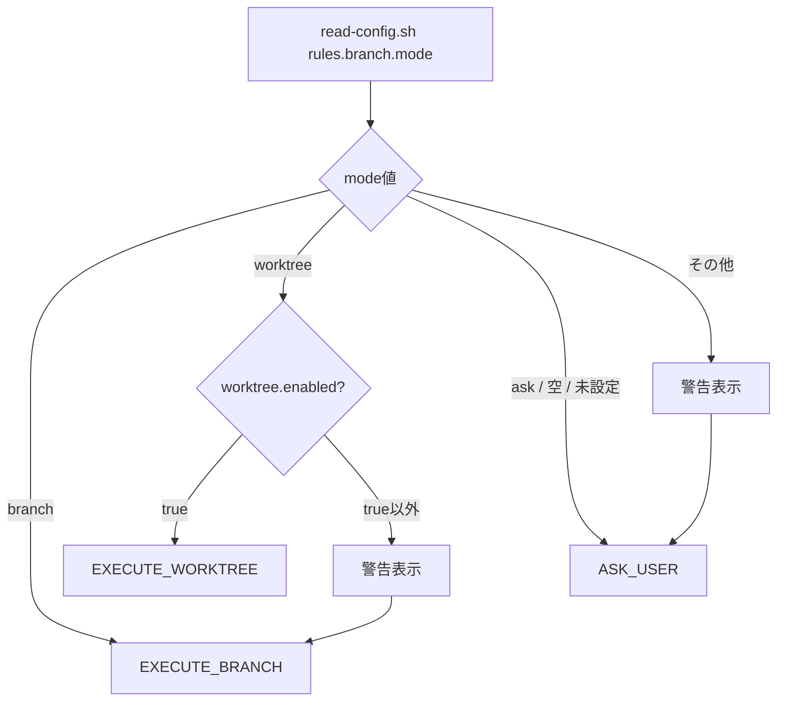

# ドメインモデル: ブランチ作成方式の設定固定化

## 概要

Inception Phase ステップ7のブランチ作成方式を設定で固定化するための概念モデル。設定値の解釈・検証・フォールバックの規則を定義する。

**重要**: このドメインモデル設計では**コードは書かず**、構造と責務の定義のみを行います。実装はImplementation Phase（コード生成ステップ）で行います。

## 値オブジェクト（Value Object）

### BranchMode

ブランチ作成方式の設定値を表す。

- **属性**: mode: String - `rules.branch.mode` から読み取った値
- **有効値**: `"branch"`, `"worktree"`, `"ask"`
- **不変性**: 設定ファイルから1回読み取った後は変更されない
- **等価性**: 文字列の完全一致で判定

### WorktreeEnabled

worktree機能の有効/無効を表す。

- **属性**: enabled: Boolean - `rules.worktree.enabled` から読み取った値
- **不変性**: 設定ファイルから1回読み取った後は変更されない
- **等価性**: Boolean値の一致で判定

## ドメインサービス

### BranchModeResolver（ブランチ方式決定サービス）

設定値から最終的なブランチ作成方式を決定する。

- **責務**: BranchMode と WorktreeEnabled を受け取り、最終実行方式を返す
- **操作**: resolve(mode, worktreeEnabled) → ExecutionStrategy

**決定ルール**:

| 入力 mode | worktreeEnabled | 出力 | 副作用 |
|-----------|----------------|------|--------|
| `"branch"` | 任意 | `EXECUTE_BRANCH` | なし |
| `"worktree"` | `true` | `EXECUTE_WORKTREE` | なし |
| `"worktree"` | `true`以外 | `EXECUTE_BRANCH` | 警告メッセージ出力 |
| `"ask"` | 任意 | `ASK_USER` | なし |
| 空 / 未設定 | 任意 | `ASK_USER` | なし |
| その他 | 任意 | `ASK_USER` | 警告メッセージ出力 |

### ExecutionStrategy（実行戦略）

BranchModeResolver の出力。ステップ7の実行方法を表す。

- `EXECUTE_BRANCH`: 質問なしでブランチ作成を自動実行
- `EXECUTE_WORKTREE`: 質問なしでworktree作成を自動実行
- `ASK_USER`: 現行通りユーザーに質問

## ドメインモデル図

## ユビキタス言語

- **BranchMode**: サイクルブランチ作成方式の設定値（branch / worktree / ask）
- **フォールバック**: 設定値が無効または条件を満たさない場合の代替動作
- **自動実行**: ユーザーへの質問を省略し、設定に基づいて直接実行すること

## 不明点と質問（設計中に記録）

現時点で不明点はありません。Issue #214 と Issue #223 の内容から要件は明確です。
