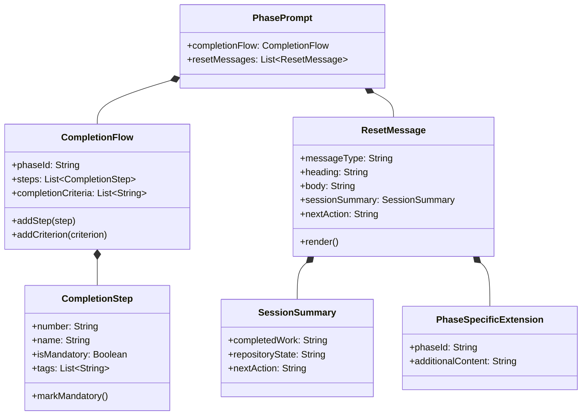

# ドメインモデル: コンテキストリセット改善

## 概要

AI-DLCプロンプトシステムにおける完了フローとコンテキストリセット通知の構造を定義する。リセット指示の省略防止とセッションサマリ付与を実現するためのドメインモデル。

**重要**: このドメインモデル設計では**コードは書かず**、構造と責務の定義のみを行います。実装はImplementation Phase（コード生成ステップ）で行います。

## エンティティ（Entity）

### CompletionFlow（完了フロー）

各フェーズプロンプトが持つ、完了時に実行すべき番号付きステップの集合。

- **ID**: フェーズ名（construction / inception / operations）
- **属性**:
  - steps: OrderedList<CompletionStep> - 番号付きの必須ステップ一覧
  - completionCriteria: List<String> - 完了基準の一覧（`## 完了基準` セクション）
  - completionChecklist: List<String> - 完了確認項目（`## 完了時の確認` セクション、operationsのみ）
- **振る舞い**:
  - addStep(step): 最終ステップとしてリセット提示ステップを追加
  - addCriterion(criterion): 完了基準にリセット提示を追加

### CompletionStep（完了ステップ）

完了フロー内の個別ステップ。

- **ID**: ステップ番号（0, 0.5, 1, 1.5, ..., 6）
- **属性**:
  - number: String - ステップ番号
  - name: String - ステップ名
  - isMandatory: Boolean - 必須かどうか
  - tags: List<String> - 付加タグ（例: 【必須】【推奨】）
- **振る舞い**:
  - markMandatory(): 【必須】タグを付与

### ResetMessage（リセットメッセージ）

フェーズ/Unit/サイクル完了時にユーザーに提示するリセット通知メッセージ。

- **ID**: メッセージ種別（unit-complete / phase-continue / phase-complete / cycle-complete）
- **属性**:
  - heading: String - 見出し（例: "Unit [名前] 完了"）
  - body: String - 本文（リセット理由の説明）
  - sessionSummary: SessionSummary - セッションサマリ（3行）
  - nextAction: String - 次のアクション指示
  - skipCondition: String - 省略条件（ユーザーからの明示的連続実行指示）
- **振る舞い**:
  - render(): メッセージをmarkdownコードブロックとして出力

## 値オブジェクト（Value Object）

### SessionSummary（セッションサマリ）

リセットメッセージに付加する、次セッション引き継ぎ用の3行サマリ。

- **属性**:
  - completedWork: String - 「サイクル番号 + 完了作業名」（例: "v1.16.3 / Unit 003 コンテキストリセット改善"）
  - repositoryState: String - 「ブランチ名 + PR状態」（例: "cycle/v1.16.3 ブランチ、コミット済み"）
  - nextAction: String - 「次のアクション指示」（例: "「コンストラクション進めて」で次のUnitを開始"）
- **不変性**: 一度生成されたサマリは変更されない（リセットメッセージの一部として固定）
- **等価性**: 3つの属性すべてが一致する場合に等価

### PhaseSpecificExtension（フェーズ固有追記）

各フェーズ固有のリセットメッセージ追記内容。

- **属性**:
  - phaseId: String - フェーズ名
  - additionalContent: String - フェーズ固有の追加情報
- **不変性**: フェーズの責務に紐づくため固定
- **等価性**: phaseIdで判定

## 集約（Aggregate）

### PhasePrompt（フェーズプロンプト集約）

1つのフェーズプロンプトファイルを表す集約。

- **集約ルート**: CompletionFlow
- **含まれる要素**: CompletionFlow, List<CompletionStep>, List<ResetMessage>
- **境界**: 1つのプロンプトファイル内の完了フロー全体
- **不変条件**:
  - 完了フローの最終ステップは必ずリセット提示ステップである
  - リセット提示ステップには【必須】タグが付与されている
  - リセットメッセージにはSessionSummaryの生成指示が含まれる
  - 完了基準/完了確認にリセット提示の確認項目が含まれる

## ドメインサービス

該当なし（各フェーズプロンプトが自己完結的に完了フローを管理）

## リポジトリインターフェース

該当なし（ファイルベースの直接編集）

## ドメインモデル図

## ユビキタス言語

- **完了フロー**: Unit/Phase/サイクル完了時に実行する番号付きステップの集合
- **リセット提示**: コンテキストリセットを促すメッセージをユーザーに提示する行為
- **セッションサマリ**: リセット時に付与する3行の引き継ぎ情報（完了作業・リポジトリ状態・次アクション）
- **連続実行指示**: ユーザーがリセットせずに続行を明示的に指示すること（「続けて」「このまま次へ」等）
- **完了基準**: プロンプトの `## 完了基準` セクションに列挙される、フェーズ/Unit完了の判定条件
- **完了確認**: プロンプトの `## 完了時の確認` セクションに列挙される、完了時に確認すべき項目（operationsのみ）

## 不明点と質問（設計中に記録）

（なし - 計画承認済みのため不明点はありません）
