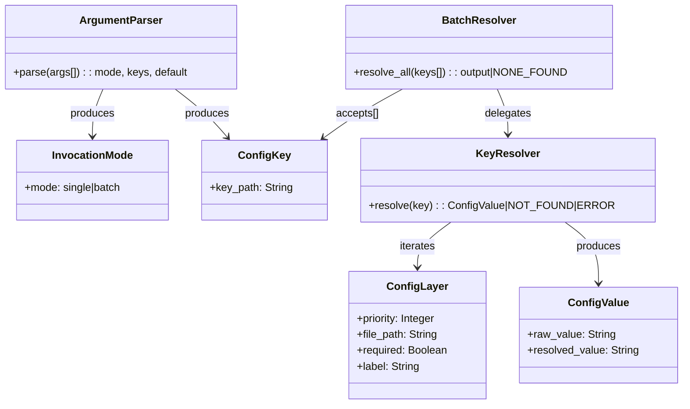

# ドメインモデル: read-config.sh 改善

## 概要
設定値の4階層マージによる解決ロジックを関数化し、単一キー・複数キー両方の取得に対応する設定リーダーのドメインモデル。

**重要**: このドメインモデル設計では**コードは書かず**、構造と責務の定義のみを行います。実装はImplementation Phase（コード生成ステップ）で行います。

## 値オブジェクト（Value Object）

### ConfigKey
- **属性**: key_path: String - ドット区切りの設定キーパス（例: `rules.reviewing.mode`）
- **不変性**: 一度指定されたキーパスは解決プロセス中に変更されない
- **等価性**: key_path の文字列一致で判定
- **制約**: 空文字不可、ドット区切り形式

### ConfigValue
- **属性**: raw_value: String - dasel から取得した生の値（クォート付き）
- **属性**: resolved_value: String - strip_quotes 適用後の値
- **不変性**: 解決された値は変更されない
- **等価性**: resolved_value の文字列一致で判定

### ConfigLayer
- **属性**: priority: Integer - 優先度（0=最低〜3=最高）
- **属性**: file_path: String - 設定ファイルのパス
- **属性**: required: Boolean - 必須ファイルかどうか
- **属性**: label: String - レイヤー名（defaults / home / project / local）
- **不変性**: レイヤーの優先度と構成は実行中に変更されない
- **等価性**: priority で判定
- **定義済みレイヤー**:
  - Layer 0: defaults.toml（オプション、優先度最低）
  - Layer 1: ~/.aidlc/config.toml（オプション）
  - Layer 2: docs/aidlc.toml（必須）
  - Layer 3: docs/aidlc.toml.local（オプション、優先度最高）

### InvocationMode
- **属性**: mode: Enum - `single` | `batch`
- **不変性**: 引数パース後に確定し変更されない
- **等価性**: mode 値で判定
- **制約**: single と batch は排他的（同時指定不可）

## ドメインサービス

### KeyResolver
- **責務**: 単一キーの値を4階層マージで解決する
- **操作**:
  - resolve(key: ConfigKey) → (ConfigValue | NOT_FOUND | ERROR): 4階層を順に走査し、最後にヒットしたレイヤーの値を返す
- **ビジネスルール**:
  - レイヤーは優先度順（低→高）に走査する
  - 後から見つかった値が前の値を上書きする
  - 必須レイヤー（project）のエラーは致命的（exit 2）
  - オプショナルレイヤーのエラーは警告のみ（スキップ）
  - キー不在は正常（次のレイヤーに進む）

### BatchResolver
- **責務**: 複数キーを一括で解決し、key:value 形式で出力する
- **操作**:
  - resolve_all(keys: ConfigKey[]) → (key:value の出力 | NONE_FOUND): 各キーについて KeyResolver.resolve を呼び出し、結果を集約する
- **ビジネスルール**:
  - 各キーは独立して解決される
  - **NOT_FOUND(1)は継続**: あるキーが全レイヤーに存在しなくても、他のキーの解決に影響しない（そのキーの行を出力しないだけ）
  - **ERROR(2)は即時終了**: いずれかのキーの解決中に致命的エラー（daselエラー、必須ファイル読み取り失敗等）が発生した場合、スクリプト全体を即座に終了する（部分出力を防ぐ）
  - 1件以上の値が取得できれば成功（exit 0）
  - 全件が不在の場合は失敗（exit 1）
  - 出力形式: `key:value`（1行1キー）

### ArgumentParser
- **責務**: コマンドライン引数を解析し、InvocationMode と対象キーを決定する
- **操作**:
  - parse(args: String[]) → (mode: InvocationMode, keys: ConfigKey[], default: String?)
- **ビジネスルール**:
  - 位置引数（単一キー）と `--keys` は排他的
  - `--keys` と `--default` は排他的
  - `--keys` 後にキーが0件はエラー
  - 不明オプションはエラー

## ドメインモデル図

## ユビキタス言語

- **キー（Key）**: ドット区切りの設定パス。例: `rules.reviewing.mode`
- **レイヤー（Layer）**: 設定ファイルの優先度階層。低い番号ほど優先度が低い
- **マージ（Merge）**: 複数レイヤーを走査し、最も優先度の高いレイヤーの値を採用すること
- **解決（Resolve）**: キーに対応する最終的な値を決定すること
- **一括取得（Batch）**: 複数キーを1コマンドで取得する操作モード
- **デフォルト値（Default）**: defaults.toml で定義される最低優先度の値

## 不明点と質問（設計中に記録）

（なし - Unit定義と計画で十分に明確化済み）
