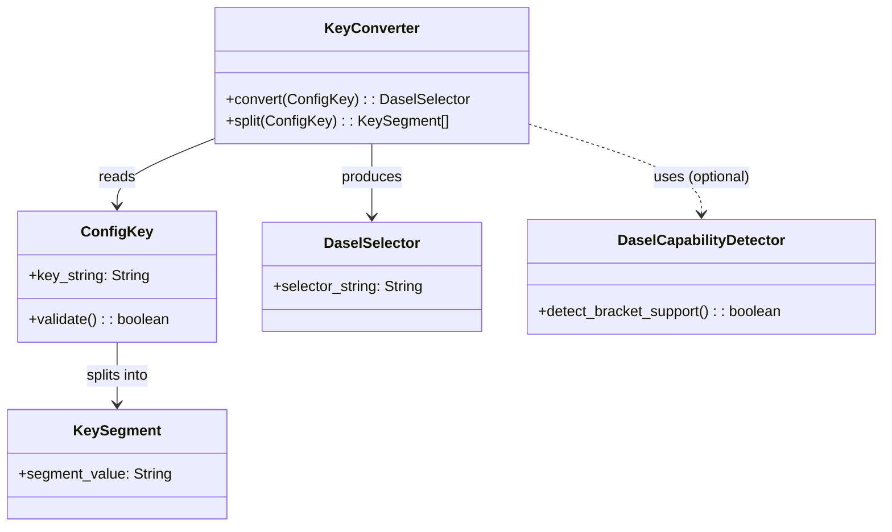

# ドメインモデル: dasel v3 予約語対応修正

## 概要

read-config.sh の get_value() 関数内で、ドット区切りの設定キーを dasel セレクター構文に安全に変換するためのドメインモデル。dasel v2/v3 の構文差異を吸収し、予約語を含むキーでも正しく値を取得できるようにする。

**重要**: このドメインモデル設計ではコードは書かず、構造と責務の定義のみを行います。

## 値オブジェクト（Value Object）

### ConfigKey（設定キー）

- **属性**: key_string: String - ドット区切りの設定キー（例: `rules.branch.mode`）
- **不変性**: 入力キーは読み取り専用で変換処理によって変更されない
- **等価性**: 文字列としての完全一致
- **バリデーション**: `^[A-Za-z_][A-Za-z0-9_.-]*$`（既存の正規表現を維持）

### KeySegment（キーセグメント）

- **属性**: segment_value: String - ドットで分割された各セグメント（例: `rules`, `branch`, `mode`）
- **不変性**: 分割後のセグメントは変更不可
- **等価性**: 文字列としての完全一致

### DaselSelector（daselセレクター）

- **属性**: selector_string: String - dasel に渡すクエリ文字列（例: `rules["branch"]["mode"]`）
- **不変性**: 変換後のセレクターは変更不可
- **等価性**: 文字列としての完全一致
- **制約**: dasel v3 で正しくパースできる構文であること

## ドメインサービス

### KeyConverter（キー変換サービス）

- **責務**: ConfigKey を DaselSelector に変換する
- **操作**:
  - convert(config_key) → dasel_selector: ドット区切りキーをブラケット記法に変換
    - 第1セグメント: そのまま出力（dasel v3 の制約: 先頭をブラケット化できない）
    - 第2セグメント以降: `["segment"]` 形式に変換
  - split(config_key) → key_segments[]: ドット区切りキーをセグメントに分割

### DaselCapabilityDetector（dasel機能検出サービス）

- **責務**: 現在の dasel 環境でブラケット記法が使用可能かを判定する
- **操作**:
  - detect_bracket_support() → boolean: ブラケット記法の動作をテストクエリで判定
- **設計方針**: バージョン文字列の解析ではなく、実際のクエリ実行結果で判定する（機能検出パターン）

## ドメインモデル図

## ユビキタス言語

- **セグメント**: ドット区切りキーの各部分（例: `rules.branch.mode` の `rules`, `branch`, `mode`）
- **ブラケット記法**: dasel のプロパティアクセス構文 `key["prop"]` 形式
- **予約語**: dasel v3 のセレクター構文で特別な意味を持つ識別子（`branch`, `filter` 等）
- **機能検出**: バージョン番号ではなく実際の動作で機能の有無を判定するパターン

## 実装時の注記

本ドメインモデルはシェルスクリプト（read-config.sh）の修正に対する設計概念を示したものです。実装時は以下の3つのシェル関数/処理ブロックとして簡潔に実装します:

1. **機能検出処理**（スクリプトレベル初期化）: `_DASEL_USE_BRACKET` グローバル変数の設定
2. **キー変換処理**（get_value() 内の条件分岐）: sed によるブラケット記法変換
3. **get_value()**（既存関数の改修）: 変換結果を使用した dasel クエリ実行

DDD風の値オブジェクト・サービスはあくまで責務と関係の整理用であり、クラスや型としての実装は行いません。

## 不明点と質問（設計中に記録）

（なし - 事前調査で十分な情報が得られている）
