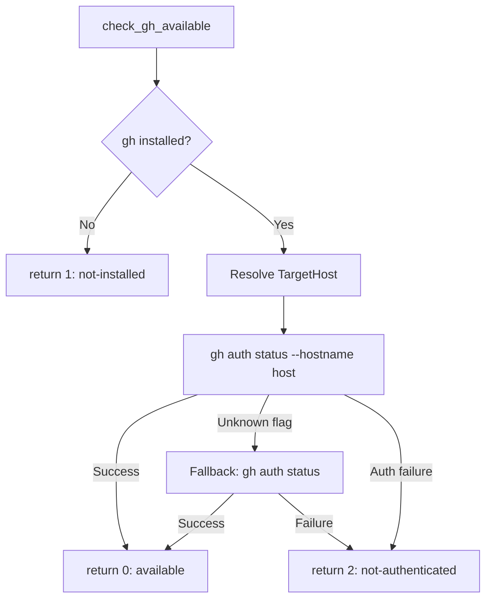

# ドメインモデル: issue-ops.sh 認証判定バグ修正

## 概要

`issue-ops.sh` の認証判定ロジックにおける概念構造を定義する。bash関数の責務と判定フローを明確化し、ホスト指定・フォールバックの構造を設計する。

**重要**: このドメインモデル設計では**コードは書かず**、構造と責務の定義のみを行います。

## 値オブジェクト（Value Object）

### GhAvailabilityStatus
- **属性**: status: enum {available(0), not-installed(1), not-authenticated(2)}
- **不変性**: 一度の判定で決定し変更しない
- **等価性**: status値で判定

### TargetHost
- **属性**: hostname: string（例: `github.com`）
- **不変性**: 判定実行中は変更しない
- **等価性**: hostname文字列で判定
- **解決順序**: `GH_HOST` 環境変数 → デフォルト値 `github.com`

## ドメインサービス

### GhAvailabilityChecker（check_gh_available関数）
- **責務**: gh CLIのインストール状態と対象ホストへの認証状態を判定する
- **操作**:
  - `check()` → GhAvailabilityStatus を返す
    1. `command -v gh` でインストール確認 → 不在なら `not-installed(1)`
    2. TargetHost を解決
    3. `gh auth status --hostname <host>` で認証確認
       - 成功 → `available(0)`
       - `--hostname` 未対応エラー → フォールバック（後述）
       - 認証失敗 → `not-authenticated(2)`
    4. フォールバック: `gh auth status`（`--hostname` なし）で認証確認
       - 成功 → `available(0)`
       - 失敗 → `not-authenticated(2)`

### HostnameSupportDetector
- **責務**: gh CLIが `--hostname` オプションをサポートするか判定
- **判定基準**: stderrに "unknown flag" / "unknown command" を含む場合は未対応

## ドメインモデル図

## ユビキタス言語

- **TargetHost**: 認証判定の対象となるGitHubホスト。`GH_HOST`環境変数で上書き可能
- **フォールバック**: `--hostname` 未対応の旧 gh CLI 向けに従来コマンドに切り替える処理
- **GH_HOST**: GitHub CLI が参照する環境変数。GitHub Enterprise Server 等の非デフォルトホストを指定する際に使用

## 不明点と質問

（なし - Unit定義とIssue #225の情報で設計に必要な情報は充足）
