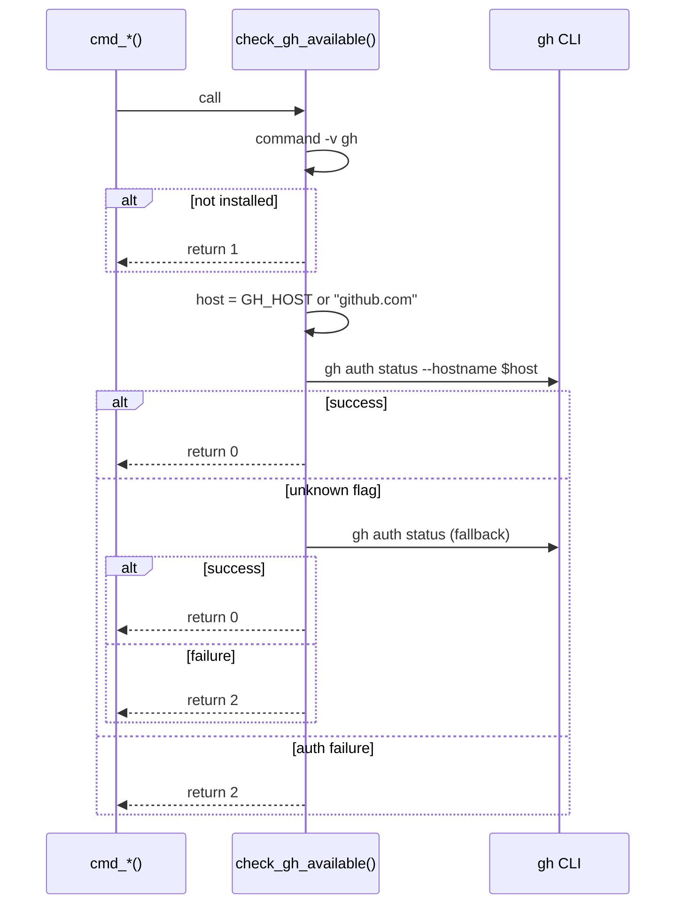

# 論理設計: issue-ops.sh 認証判定バグ修正

## 概要

`issue-ops.sh` の `check_gh_available()` 関数を修正し、`--hostname` 指定による特定ホスト認証判定と旧バージョン向けフォールバックを実現する。

**重要**: この論理設計では**コードは書かず**、コンポーネント構成とインターフェース定義のみを行います。

## アーキテクチャパターン

既存の手続き型bashスクリプトのパターンを維持。関数単位の責務分離を行う。

## コンポーネント構成

### 関数構成

```text
issue-ops.sh
├── check_gh_available()  ← 修正対象
│   ├── ホスト解決（GH_HOST環境変数 / デフォルト github.com）
│   ├── --hostname付き認証チェック
│   └── フォールバック判定 + 従来認証チェック
├── format_output()       （変更なし）
├── parse_gh_error()      （変更なし）
├── cmd_label()           （変更なし）
├── cmd_remove_label()    （変更なし）
├── cmd_set_status()      （変更なし）
├── cmd_close()           （変更なし）
└── main()                （変更なし）
```

### コンポーネント詳細

#### check_gh_available()（修正対象）
- **責務**: gh CLIのインストール確認と対象ホストへの認証状態判定
- **依存**: gh CLI、GH_HOST環境変数
- **公開インターフェース**: 戻り値（0/1/2）で判定結果を返す

## スクリプトインターフェース設計

### check_gh_available() 関数

#### 概要
gh CLIが利用可能か（インストール済み＋認証済み）を判定する

#### 引数
なし（環境変数 `GH_HOST` を参照）

#### 成功時出力
- 出力: なし（戻り値のみ）
- 戻り値: `0`（利用可能）

#### エラー時出力
- 出力: なし（戻り値のみ）
- 戻り値: `1`（gh未インストール）、`2`（gh未認証）

## 処理フロー概要

### 認証判定の処理フロー

**ステップ**:

1. `command -v gh` でghインストール確認
   - 不在 → return 1
2. ホスト解決: `local host="${GH_HOST:-github.com}"`
3. `gh auth status --hostname "$host"` を実行し、stderrをキャプチャ
4. 成功（exit code 0）→ return 0
5. 失敗時: stderrの内容を確認
   - "unknown flag" または "unknown command" を含む → フォールバックへ
   - それ以外 → return 2（認証失敗）
6. フォールバック: `gh auth status` を実行
   - 成功 → return 0
   - 失敗 → return 2

**関与するコンポーネント**: check_gh_available()



## 非機能要件（NFR）への対応

### パフォーマンス
- **要件**: 既存と同等
- **対応策**: `gh auth status` はローカル認証情報を参照するのみでネットワーク不要。フォールバック時に最大2回の呼び出しが発生するが、いずれもローカル操作で影響は軽微

### セキュリティ
- **要件**: 認証状態の正確な判定
- **対応策**: `--hostname` による特定ホスト指定で、複数ホスト構成での誤判定を防止

## 技術選定
- **言語**: bash
- **依存**: GitHub CLI (gh) v2.0.0以上推奨（`--hostname` サポート。未対応バージョンではフォールバック動作）

## 実装上の注意事項
- stderrキャプチャ時に `2>&1` を使用し、stdoutと分離する
- フォールバック判定は stderr 内容に基づく文字列マッチのみ。終了コードだけでは `--hostname` 未対応と認証失敗を区別できないため
- `GH_HOST` は gh CLI 自体も参照する標準的な環境変数であり、新たな環境変数を導入するものではない
- **`set -e` 互換性**: スクリプトは `set -euo pipefail` を使用しているが、既存の呼び出しパターン（`check_gh_available; gh_status=$?`）はそのまま維持する。呼び出しパターンの変更は全サブコマンドに影響するためUnit境界外。`check_gh_available()` 内部では `gh auth status` の失敗を `2>&1` キャプチャで処理し、関数内で `set -e` によるスクリプト終了が発生しないよう設計する

## 不明点と質問

（なし）
