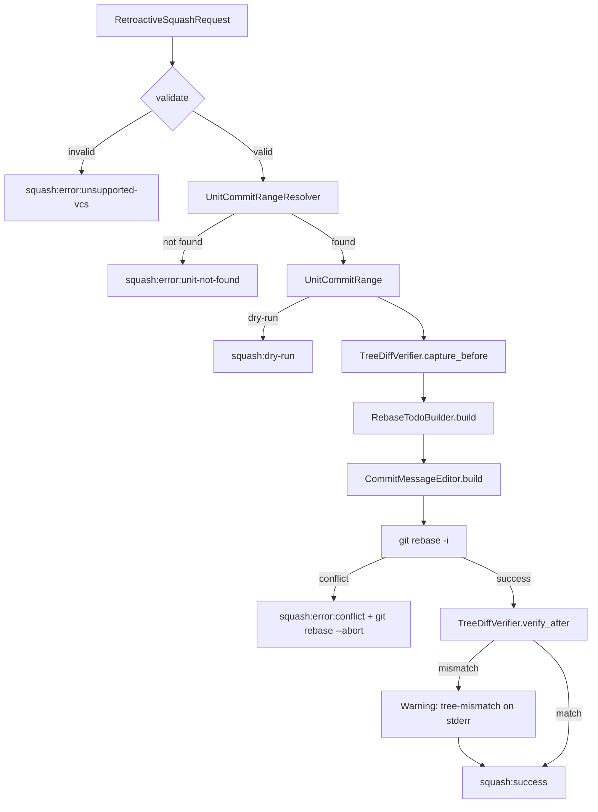

# ドメインモデル: squash-unit.sh 事後squash対応

## 概要

squash-unit.shに `--retroactive` オプションを追加し、GIT_SEQUENCE_EDITOR方式で過去のUnit（HEAD以外）に対する非対話的rebaseによる事後squashを実現する。

**重要**: このドメインモデル設計ではコードは書かず、構造と責務の定義のみを行います。

## エンティティ

### RetroactiveSquashRequest
- **属性**:
  - cycle: String - 対象サイクル（例: v1.17.0）
  - unit: String - 対象Unit番号（3桁、例: 003）。`--retroactive` 時は必須
  - message: String - squash後のコミットメッセージ
  - vcs_type: Enum(git) - VCS種類。retroactiveはgitのみ対応
  - base_commit: String? - 起点コミットハッシュ（オプション。指定時は自動判定を上書き）
  - dry_run: Boolean - ドライラン実行フラグ
- **振る舞い**:
  - validate(): 入力バリデーション（unit形式チェック、vcs=git制約チェック）

### UnitCommitRange
- **属性**:
  - first_commit: String - 対象Unitの最初のコミットハッシュ（最古）
  - last_commit: String - 対象Unitの最後のコミットハッシュ（最新）
  - commit_list: List<CommitInfo> - 対象コミットの一覧
  - count: Integer - 対象コミット数
- **振る舞い**:
  - is_empty(): コミットが0件かチェック
  - is_single(): コミットが1件かチェック

### CommitInfo
- **属性**:
  - hash: String - コミットハッシュ（短縮形。rebase todoとの照合に使用）
  - full_hash: String - コミットハッシュ（完全形。git logからの取得に使用）
  - subject: String - コミットメッセージ1行目
- **ハッシュ照合ルール**: rebase todoは短縮ハッシュを使用するため、todo行のハッシュと照合する際は短縮形で比較する。find_unit_commit_range_gitは短縮ハッシュも保持する

## 値オブジェクト

### RebaseTodo
- **属性**:
  - entries: List<RebaseTodoEntry> - rebase todoの各行
- **不変性**: 生成後は変更しない（入力todoファイルを読み込み→加工済みtodoファイルを出力）
- **等価性**: entries の内容が一致するか

### RebaseTodoEntry
- **属性**:
  - action: Enum(pick, reword, fixup) - rebase操作
  - hash: String - コミットハッシュ
  - subject: String - コミットメッセージ
- **変換ルール**:
  - 対象Unitの最初のコミット: pick → reword
  - 対象Unitの2番目以降のコミット: pick → fixup
  - 対象Unit以外のコミット: pick のまま

### SquashResult
- **属性**:
  - status: Enum(success, error, dry-run, skipped) - 結果ステータス
  - detail: String - 詳細情報（ハッシュ、エラーコード等）
- **出力パターン**:
  - `squash:success:{new_hash}` - 成功
  - `squash:dry-run:{count}` - ドライラン
  - `squash:skipped:no-commits` - 対象コミットなし
  - `squash:error:unit-not-found` - 対象Unitのコミットが見つからない
  - `squash:error:dirty-working-tree` - 作業ツリーが汚い
  - `squash:error:conflict` - rebase中にコンフリクト発生
  - `squash:error:unsupported-vcs` - `--retroactive` で jj を指定

## ドメインサービス

### UnitCommitRangeResolver
- **責務**: 対象Unitのコミット範囲を特定する
- **操作**:
  - resolve(cycle, unit, base_commit?): コミットメッセージから対象Unitの範囲を特定
    - `--base` 明示指定時はそのコミット以降のUnit番号マッチで範囲特定
    - `--base` 未指定時はサイクル全体のログから自動判定
  - **境界判定の基本方針**: Unit完了コミット（`feat: [{cycle}] Unit {NNN}完了`）を境界アンカーとして使用。`chore:` コミットはUnit番号を含まないため、境界アンカーの間にある全コミットを対象Unitに帰属させる
  - Unit開始の判定: 前Unitの完了コミット(`feat: [{cycle}] Unit {prev_unit}完了`) の次のコミット、またはInception完了コミット(`feat: [{cycle}] Inception Phase完了`)の次のコミット
  - Unit終了の判定: 対象Unitの完了コミット(`feat: [{cycle}] Unit {unit}完了`)まで。完了コミットが存在しない場合は次Unitの完了コミットの直前まで、どちらもなければHEADまで
  - **判定不能時**: 境界アンカーが見つからない場合は `squash:error:unit-not-found` で即座に失敗

### RebaseTodoBuilder
- **責務**: GIT_SEQUENCE_EDITOR用のtodo編集スクリプトを構築する
- **操作**:
  - build(unit_range: UnitCommitRange): 一時ファイル置換方式のbashスクリプトを生成
    - 入力: git rebase -i が生成する todoファイルパス（$1）
    - 処理: todoの各行を走査し、対象Unitのコミットに対してreword/fixupに書き換え
    - 出力: 書き換え済みtodoファイル（同じパスに上書き）

### CoAuthorExtractor
- **責務**: 対象Unit範囲内のCo-Authored-By情報を抽出する
- **操作**:
  - extract_for_range(first_commit, last_commit): 指定範囲のコミットからCo-Authored-Byを抽出（重複排除）
  - 既存のextract_co_authors()はbase..HEAD全体を対象とするため、retroactiveでは使用しない

### CommitMessageEditor
- **責務**: GIT_EDITOR用のメッセージ差し替えスクリプトを構築する
- **操作**:
  - build(message: String, co_authors: String): 一時ファイルにメッセージを書き込み、GIT_EDITORとして渡すスクリプトを生成

### TreeDiffVerifier
- **責務**: squash前後でリポジトリのツリー状態が一致することを検証する
- **操作**:
  - capture_before(): squash前のツリーハッシュ（`git diff <base>..HEAD` のtree）を記録
  - verify_after(): squash後のツリーハッシュと比較し、一致を検証

## ドメインモデル図

## ユビキタス言語

- **事後squash（retroactive squash）**: 過去のUnit（HEADの最新Unitではない）のコミットを後からsquashする操作
- **rebase todo**: `git rebase -i` が生成するコミット操作計画ファイル
- **reword**: rebase todoで、コミットメッセージのみ書き換える操作
- **fixup**: rebase todoで、コミット内容を前のコミットに統合しメッセージは破棄する操作
- **Unit完了コミット**: `feat: [{cycle}] Unit {NNN}完了 - {description}` 形式のコミット
- **中間コミット**: Unit作業中のレビュー前/反映コミット（`chore:` prefix）
