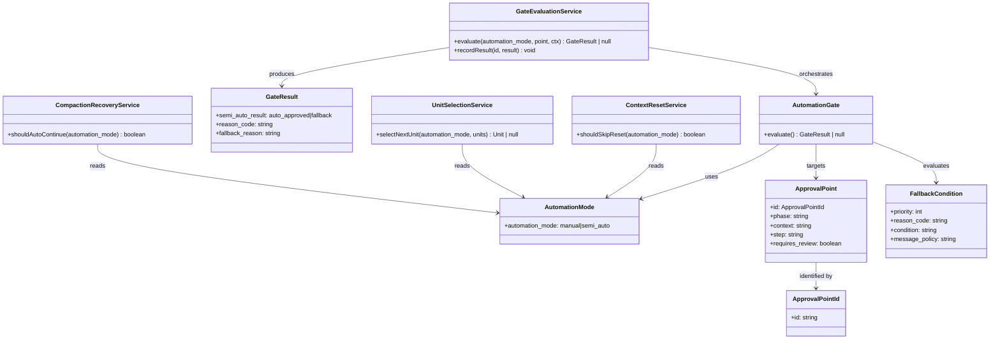

# ドメインモデル: セミオートモード実装

## 概要

AI-DLCの承認フローにおけるセミオートモード（自動承認）の概念モデルを定義する。プロンプト駆動システムのため、従来のコードベースのドメインモデルではなく、プロンプト指示文の構造・概念・用語を対象とする。

**重要**: このドメインモデル設計では**コードは書かず**、構造と責務の定義のみを行います。

## 値オブジェクト（Value Object）

### AutomationMode

承認フロー全体の自動化レベルを表す設定値。

- **属性**: automation_mode: `"manual"` | `"semi_auto"` - 自動化モード
- **TOML設定キー**: `rules.automation.mode`
- **プロンプト文中の参照名**: `automation_mode`（`rules.reviewing.mode`（review_mode）との混同を防ぐため、プロンプト指示文中では `automation_mode` として参照する）
- **不変性**: TOML設定ファイルから読み取った値でセッション中は固定
- **等価性**: 文字列値の一致で判定
- **デフォルト値**: `"manual"`
- **読み取り方法**: `read-config.sh rules.automation.mode --default "manual"`

### ApprovalPointId

承認ポイントを一意に識別するID。

- **属性**: id: 文字列 - `{phase}.{context}.{step}` 形式
- **不変性**: プロンプト定義時に決定、変更不可
- **等価性**: 文字列値の一致で判定
- **命名規則**: `{phase}` は `inception` | `construction` | `operations`、`{context}` は承認対象の文脈、`{step}` は具体的なステップ

### GateResult

セミオートゲートの判定結果を表す構造化シグナル。

- **属性**:
  - semi_auto_result: `"auto_approved"` | `"fallback"` - 判定結果
  - reason_code: `"none"` | `"error"` | `"review_issues"` | `"incomplete_conditions"` | `"decision_required"` - フォールバック理由コード
  - fallback_reason: 文字列 - ユーザー向け表示用メッセージ（fallback時のみ使用）
- **不変性**: 判定完了時に生成、以後変更不可
- **等価性**: 3属性すべての一致で判定

### FallbackCondition

フォールバックをトリガーする条件の定義。

- **属性**:
  - priority: 整数 (1-4) - 評価優先順位（1が最優先）
  - reason_code: 文字列 - 対応するGateResultのreason_code
  - condition: 文字列 - 条件の記述
  - message_policy: 文字列 - ユーザーへのメッセージ方針
- **不変性**: 共通仕様として定義、変更不可
- **等価性**: reason_codeの一致で判定

## エンティティ（Entity）

### ApprovalPoint

各フェーズプロンプト内の承認チェックポイント。

- **ID**: ApprovalPointId
- **属性**:
  - phase: 文字列 - 所属フェーズ（inception / construction / operations）
  - context: 文字列 - 承認対象の文脈（plan / design / code / integration 等）
  - step: 文字列 - 具体的なステップ名
  - requires_review: 真偽値 - AIレビュー結果に基づく判定が必要か
  - description: 文字列 - 承認ポイントの説明
- **振る舞い**:
  - evaluate(): GateResult | null - セミオートゲートの判定を実行。AutomationMode とフォールバック条件を評価し、GateResultを返す（`automation_mode=manual` 時は null）

## 集約（Aggregate）

### AutomationGate

セミオートモードの判定を統括する集約。

- **集約ルート**: AutomationGate（概念的エンティティ）
- **含まれる要素**: AutomationMode, FallbackCondition (複数), ApprovalPoint
- **境界**: 1回の承認判定プロセス全体
- **不変条件**:
  1. `automation_mode=manual` の場合、ゲート判定をスキップし従来フローを実行（GateResult は生成しない、履歴記録も行わない）
  2. `automation_mode=semi_auto` の場合、すべてのFallbackConditionを優先順位順に評価し、最初に該当した条件でフォールバック
  3. FallbackConditionに該当しない場合のみ `auto_approved`
  4. GateResult は `semi_auto` 時のみ生成され、判定後に履歴記録される

## ドメインサービス

### GateEvaluationService

セミオートゲートの判定ロジックを実行するサービス。

- **責務**: AutomationModeとFallbackConditionに基づき、ApprovalPointでの承認判定を実行する
- **操作**:
  - evaluate(automation_mode, approvalPoint, context) → GateResult | null
    - automation_mode が `manual` → null を返す（ゲート判定スキップ、従来フロー）
    - automation_mode が `semi_auto` → FallbackConditionを優先順位順に評価
    - 該当条件なし → auto_approved を返す
  - recordResult(approvalPointId, gateResult) → 履歴記録（gateResult が null でない場合のみ）
    - auto_approved 時: `【セミオート自動承認】` を記録
    - fallback 時: `【セミオートフォールバック】` を記録

### ContextResetService

Unit完了時のコンテキストリセット判定サービス。

- **責務**: セミオートモード時にコンテキストリセット提示をスキップするか判定
- **操作**:
  - shouldSkipReset(automation_mode) → 真偽値
    - `semi_auto` → true（スキップ）
    - `manual` → false（従来どおり提示）

### CompactionRecoveryService

コンパクション（自動要約）発生時のセミオート復帰サービス。

- **責務**: コンパクション後にセミオートモード状態を復元し、作業を自動継続するか判定
- **操作**:
  - shouldAutoContinue(automation_mode) → 真偽値
    - `semi_auto` → true（自動継続）
    - `manual` → false（ユーザーに再開確認）
  - **グローバルフォールバック**: 設定読取失敗・実行エラー・前提不成立時はユーザーに報告し従来フローへ

### UnitSelectionService

Unit選択の自動判定サービス。

- **責務**: セミオートモード時に次のUnitを自動選択する
- **操作**:
  - selectNextUnit(automation_mode, availableUnits) → Unit | null
    - `semi_auto` + 実行可能Unit1つ → そのUnitを返す
    - `semi_auto` + 実行可能Unit複数 → 番号順で最初のUnitを返す
    - `semi_auto` + 実行可能Unit0 → null（全完了）
    - `manual` → 従来ロジック（1つなら自動、複数ならユーザー選択）

## ドメインモデル図

## ユビキタス言語

- **セミオートモード**: AIレビュー合格時にユーザー承認を省略し、自動的に次ステップへ遷移するモード
- **セミオートゲート**: 各承認ポイントに配置される判定機構。AutomationModeとFallbackConditionに基づき自動承認またはフォールバックを決定する
- **承認ポイント**: フロー中でユーザーの承認が求められる箇所。`{phase}.{context}.{step}` 形式のIDで識別
- **フォールバック**: セミオートモードが有効でも、条件に該当した場合に従来の手動承認フローに戻ること
- **自動承認**: AIレビュー合格等の条件を満たし、ユーザー確認なしで次ステップに自動遷移すること
- **構造化シグナル**: ゲート判定結果を表す固定スキーマ（semi_auto_result, reason_code, fallback_reason の3キー）
- **GateResult**: セミオートゲートの判定結果。`auto_approved` または `fallback` のいずれか
