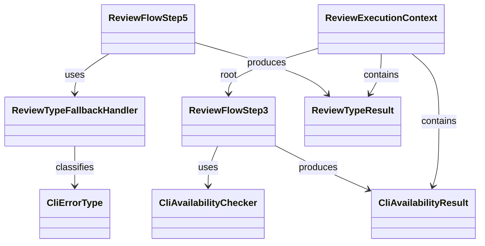

# ドメインモデル: レビュースキル外部ツール優先

## 概要

review-flow.mdのAIレビューフローにおいて、外部CLIツールの可用性に基づく実行パス判定と、種別単位のフォールバック処理の構造を定義する。

**重要**: このドメインモデル設計では**コードは書かず**、構造と責務の定義のみを行います。実装はImplementation Phase（コード生成ステップ）で行います。

## エンティティ（Entity）

### ReviewFlowStep3（優先ツール決定・利用可否チェック）

- **ID**: ステップ番号（3）
- **属性**:
  - tools_list: 文字列配列 - `aidlc.toml` から取得した優先ツールリスト
  - preferred_tool: 文字列 - 決定された優先ツール名
  - cli_availability: 列挙型（available / not_installed） - 外部CLI可用性
  - skill_availability_map: マップ（種別→真偽値） - 各レビュー種別ごとのSkillツール利用可否
- **振る舞い**:
  - checkSkillAvailability(): 各レビュー種別のSkill利用可否を確認（既存）
  - checkCliAvailability(): `which` コマンドで外部CLIのインストール状態を確認（新規）
  - determineExecutionPath(): Skill可用性 × CLI可用性 × mode の組み合わせから遷移先を決定

### ReviewFlowStep5（AIレビューフロー）

- **ID**: ステップ番号（5）
- **属性**:
  - current_review_type: 文字列 - 実行中のレビュー種別
  - completed_types: ReviewTypeResult配列 - 完了済みレビュー種別の結果
  - fallback_log: 配列 - 種別ごとのフォールバック記録
- **振る舞い**:
  - executeReviewByType(): 種別ごとに外部CLIでレビューを実行
  - handleCliError(): エラー種類に応じたフォールバック処理
  - fallbackToSelfReview(): 該当種別のみセルフレビューへ遷移

## 値オブジェクト（Value Object）

### CliAvailabilityResult

- **属性**:
  - tool_name: 文字列 - CLIツール名（codex / claude / gemini）
  - is_installed: 真偽値 - `which` コマンドの結果
- **不変性**: チェック時点のスナップショットとして不変。ステップ5実行時にCLI不在エラーが発生した場合は、ステップ5のフォールバック処理で再判定する
- **等価性**: tool_name で一意

### CliErrorType

- **属性**:
  - category: 列挙型 - CLI不在（恒久） / 実行エラー（一時的） / 出力解析不能
  - detail: 文字列 - エラー詳細
- **不変性**: 発生したエラーの分類は不変
- **等価性**: category で判定

### ReviewTypeResult

- **属性**:
  - review_type: 文字列 - レビュー種別（code / architecture / security / inception）
  - execution_method: 列挙型 - external_cli / self_review
  - result: レビュー結果
- **不変性**: 完了した種別の結果は不変
- **等価性**: review_type で一意

## 集約（Aggregate）

### ReviewExecutionContext

- **集約ルート**: ReviewFlowStep3
- **含まれる要素**: CliAvailabilityResult（toolsリストの各CLIに対応）、ReviewTypeResult（完了済み種別）
- **境界**: 1回のAIレビューフロー実行全体
- **不変条件**:
  - CLI可用性は種別間で共有される（同一のCLIが使われる）
  - 完了済み種別は再実行されない
  - mode=required時、スキップにはスキップ理由と履歴記録が必須

## ドメインサービス

### CliAvailabilityChecker

- **責務**: 外部CLIツールのインストール状態を確認し、利用可能なCLIを特定する
- **操作**:
  - checkAll(tools_list) - toolsリスト全体の可用性を返す
  - findFirstAvailable(tools_list) - 最初に利用可能なCLIを返す

### ReviewTypeFallbackHandler

- **責務**: 種別単位でのフォールバック判定と遷移処理
- **操作**:
  - classifyError(error) - エラーをCliErrorTypeに分類
  - decideFallbackAction(error_type, mode) - フォールバック先を決定
  - recordFallback(review_type, error_type, detail) - 履歴に記録

## ドメインモデル図

## ユビキタス言語

- **外部CLI**: codex / claude / gemini 等の外部AIレビューツールのコマンドラインインターフェース
- **CLI可用性**: `which` コマンドでCLIがインストールされているかの状態
- **種別単位フォールバック**: 複数レビュー種別の直列実行中に、失敗した種別のみセルフレビューへ遷移すること
- **恒久エラー**: CLI未インストールのようにリトライで解消しないエラー
- **一時エラー**: タイムアウトや認証失敗のようにリトライで解消する可能性があるエラー
- **Skill利用可否**: Skillツール経由でレビュースキルを呼び出せるかどうか（CLI可用性とは独立）
