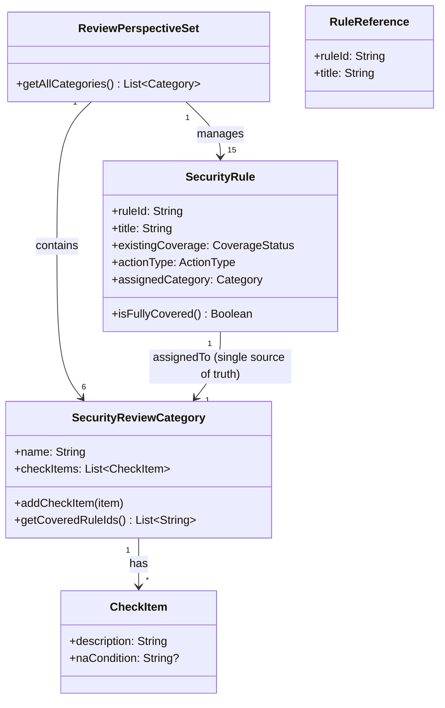

# ドメインモデル: セキュリティレビュー観点拡充

## 概要

reviewing-securityスキルのSKILL.mdにおけるセキュリティレビュー観点の構造を定義する。既存の3カテゴリ体系を6カテゴリに拡張し、Amazon AIDLC SECURITY-01〜15の全ルールをカバーする。

**重要**: このドメインモデル設計では**コードは書かず**、構造と責務の定義のみを行います。実装はImplementation Phase（コード生成ステップ）で行います。

## エンティティ（Entity）

### SecurityReviewCategory（セキュリティレビューカテゴリ）

- **ID**: カテゴリ名（文字列、一意）
- **属性**:
  - name: String - カテゴリの正規名称（SKILL.mdのセクション見出しに使用）
  - checkItems: List\<CheckItem\> - このカテゴリに属するチェック項目一覧
- **振る舞い**:
  - addCheckItem: 新しいチェック項目を追加する
  - getCoveredRuleIds: SecurityRule.assignedCategoryから導出（派生属性）

### SecurityRule（セキュリティルール）

- **ID**: rule_id（SECURITY-XX形式、01〜15）
- **属性**:
  - title: String - ルールの英語タイトル
  - existingCoverage: Enum(full/partial/none) - 現行SKILL.mdでのカバー状態
  - actionType: Enum(maintain/extend/add) - 対応方針
  - assignedCategory: SecurityReviewCategory - 割当カテゴリ（1対1）
- **振る舞い**:
  - isFullyCovered: 全チェック項目がカバーされているか判定

## 値オブジェクト（Value Object）

### CheckItem（チェック項目）

- **属性**:
  - description: String - レビュー時の確認内容（SKILL.mdの箇条書き項目）
  - naCondition: Optional\<String\> - プロジェクトに該当しない場合の判定基準
- **不変性**: チェック項目の内容は設計時に確定し、レビュー実行中は変更しない
- **等価性**: descriptionの文字列一致

### RuleReference（ルール参照）

- **属性**:
  - ruleId: String - SECURITY-XX形式
  - title: String - ルールタイトル
- **不変性**: 外部基準の固定時点での値を保持
- **等価性**: ruleIdの一致

## 集約（Aggregate）

### ReviewPerspectiveSet（レビュー観点セット）

- **集約ルート**: ReviewPerspectiveSet
- **含まれる要素**: SecurityReviewCategory（6個）、SecurityRule（15個）
- **境界**: SKILL.mdのレビュー観点セクション全体（N/A判定ガイダンス・対応表を含む）
- **不変条件**:
  - 全15個のSecurityRuleが正確に1つのSecurityReviewCategoryに割り当てられていること（15/15カバレッジ）
  - 各SecurityReviewCategoryには少なくとも1つのチェック項目が存在すること
  - カテゴリ名はSKILL.md全体で一意であること
  - **対応関係の唯一の正**: SecurityRule.assignedCategoryが正。SecurityReviewCategoryのカバールール一覧はassignedCategoryからの導出

## ドメインサービス

### CoverageVerificationService（カバレッジ検証サービス）

- **責務**: SECURITY-01〜15の全ルールがレビュー観点でカバーされているかを外部基準と突合して検証する（集約外の独立検証）
- **操作**:
  - verifyCoverage: 外部基準（Intent内のルール一覧）と対応表のrule_idを突合し、カバレッジレポートを生成。N/A判定されたルールは「covered(N/A)」として扱う
  - identifyGaps: カバーされていないルールを特定
- **N/Aの扱い**: N/A判定はカバレッジ計算上「covered」として扱う。ただしN/A理由の記録が必須

## ドメインモデル図

## カテゴリ体系（6カテゴリ）

| # | カテゴリ名 | 種別 | 対応ルール | 説明 |
|---|-----------|------|-----------|------|
| 1 | OWASP Top 10 | 既存拡張 | 01, 04, 05, 09, 15 | Webアプリケーションセキュリティの主要リスク |
| 2 | 認証・認可 | 既存維持 | 06, 08, 12 | 認証メカニズム・アクセス制御・権限管理（既存で完全カバー、変更なし） |
| 3 | 依存脆弱性 | 既存拡張 | 10, 13 | サプライチェーン・整合性検証 |
| 4 | ログ・監視 | 新規 | 02, 03, 14 | ネットワーク/アプリケーションレベルのログ・アラート |
| 5 | ネットワークセキュリティ | 新規 | 07 | ネットワーク設定・通信制限 |
| 6 | セキュアデザイン | 新規 | 11 | セキュア設計原則・脅威モデリング |

## ルール別対応方針

### 既存カテゴリの拡張（部分カバー → 完全カバー）

| rule_id | 対応内容 |
|---------|---------|
| SECURITY-01 | 暗号化に関するチェック項目を強化（保存時暗号化の明示的確認を追加） |
| SECURITY-04 | HTTPセキュリティヘッダーの具体的確認項目を追加（CSP, HSTS, X-Frame-Options等） |
| SECURITY-09 | ミスコンフィギュレーション防止の観点を追加（デフォルトクレデンシャル、不要サービス等） |

### 既存カテゴリへの新規追加

| rule_id | 対応内容 |
|---------|---------|
| SECURITY-13 | 依存脆弱性カテゴリにソフトウェア/データ整合性検証を追加 |
| SECURITY-15 | OWASP Top 10カテゴリに例外処理・フェイルセーフを追加 |

### 新規カテゴリの追加

| rule_id | 対応内容 |
|---------|---------|
| SECURITY-02 | ログ・監視カテゴリにネットワーク中間点のアクセスログ観点を追加 |
| SECURITY-03 | ログ・監視カテゴリにアプリケーションレベルログ観点を追加 |
| SECURITY-07 | ネットワークセキュリティカテゴリを新設し、ネットワーク設定制限観点を追加 |
| SECURITY-11 | セキュアデザインカテゴリを新設し、セキュア設計原則観点を追加 |
| SECURITY-14 | ログ・監視カテゴリにアラート・モニタリング観点を追加 |

## ユビキタス言語

- **レビュー観点**: SKILL.mdのレビューセクション内の箇条書き項目。レビュアーが確認すべき具体的なチェック項目
- **カテゴリ**: レビュー観点をグループ化するセクション見出し（OWASP Top 10、認証・認可等）
- **カバレッジ**: SECURITYルールがレビュー観点によってカバーされている状態
- **N/A判定**: プロジェクトの特性によりレビュー観点が該当しない場合の判定
- **対応表**: SECURITY-01〜15とレビュー観点の対応関係を一覧化した表

## 不明点と質問（設計中に記録）

（不明点なし。Unit定義とIntentで要件が明確に定義されている）
