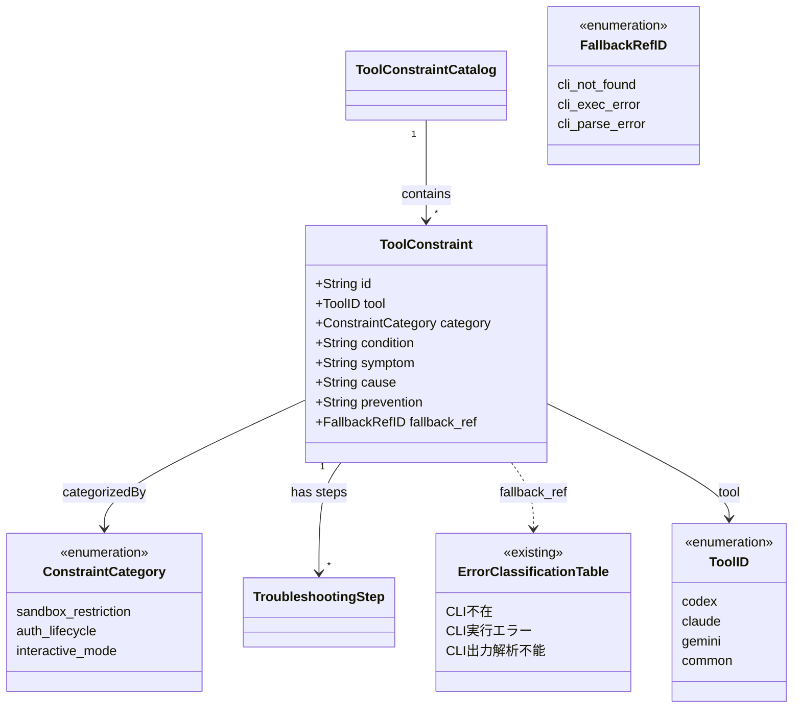

# ドメインモデル: 外部レビューツール制約のドキュメント化

## 概要

外部レビューツール（Codex, Claude, Gemini）の既知制約を体系的に分類し、事前予防策と対処法をreview-flow.mdに追加するための構造を定義する。

**重要**: このドメインモデル設計では**コードは書かず**、構造と責務の定義のみを行います。実装はImplementation Phase（コード生成ステップ）で行います。

## 正規スキーマ（ドメインモデル・論理設計共通）

制約エントリの正規項目定義。論理設計のテーブルカラムもこのスキーマに準拠する。

| 項目名 | 型 | 必須 | 説明 |
|--------|-----|------|------|
| tool | ToolID | 必須 | 対象ツール名 |
| category | ConstraintCategory | 必須 | 制約の分類 |
| condition | String | 必須 | いつ・どのような状況で発生するか |
| symptom | String | 必須 | 観察できる症状 |
| cause | String | 必須 | 根本原因 |
| prevention | String | 必須 | 事前予防策・回避策 |
| fallback_ref | FallbackRefID / null | 任意 | 既存エラー分類表への参照（下記参照） |

### ToolID（ツール識別子）

許容値:

- `codex` — OpenAI Codex
- `claude` — Anthropic Claude Code
- `gemini` — Google Gemini
- `common` — 全ツール共通

### FallbackRefID（フォールバック参照ID）

許容値（既存エラー分類表のエントリに対応）:

- `cli_not_found` — CLI不在（恒久）
- `cli_exec_error` — CLI実行エラー（一時的可能性）
- `cli_parse_error` — CLI出力解析不能

参照先が存在しない場合の代替導線: セルフレビュー（ステップ5.5）へ遷移

## エンティティ（Entity）

### ToolConstraint（ツール制約）

- **ID**: 制約識別子（例: `codex-read-only`, `auth-expiry`）
- **属性**: 上記正規スキーマの全項目
- **従属要素**: TroubleshootingStep（0個以上）— 制約ごとの対処手順

## 値オブジェクト（Value Object）

### ConstraintCategory（制約カテゴリ）

- **属性**: value: Enum - 制約の種類
- **有効値**:
  - `sandbox_restriction` - サンドボックス・権限制約（read-only等）
  - `auth_lifecycle` - 認証・トークンのライフサイクル制約
  - `interactive_mode` - インタラクティブモード・セッション制約
- **不変性**: 分類体系は固定（新ツール追加時にエントリ追加は可能だがカテゴリ体系は変更しない）
- **等価性**: value の完全一致

### TroubleshootingStep（トラブルシューティング手順）

- **属性**:
  - order: Integer - 手順の順序
  - action: String - 実行すべきアクション
  - expectedResult: String - 期待される結果
- **不変性**: 手順は順序付き
- **等価性**: order + action の一致
- **所有**: ToolConstraintに従属（カタログではなく個々の制約が手順を保持）

## 集約（Aggregate）

### ToolConstraintCatalog（ツール制約カタログ）

- **集約ルート**: カタログ自体（ドキュメントセクション）
- **含まれる要素**: ToolConstraint（複数、各制約がTroubleshootingStepを内包）
- **境界**: review-flow.md内の「外部レビューツールの既知制約と対処法」セクション
- **不変条件**:
  - 各ToolConstraintはユニークなIDを持つ
  - 既存エラー分類表と内容が重複しない（prevention に特化、エラー発生後の処理は既存表を参照）

## ドメインモデル図

## ユビキタス言語

- **既知制約（Known Constraint）**: 外部ツールの仕様や環境に起因する既知の制限事項
- **事前予防策（Prevention）**: 制約に遭遇する前に取れる回避策
- **フォールバック参照（Fallback Reference）**: 既存エラー分類表の該当エントリへの列挙ID参照
- **サンドボックス制約（Sandbox Restriction）**: read-only等の実行環境制限
- **認証ライフサイクル（Auth Lifecycle）**: トークン・セッションの有効期限管理
