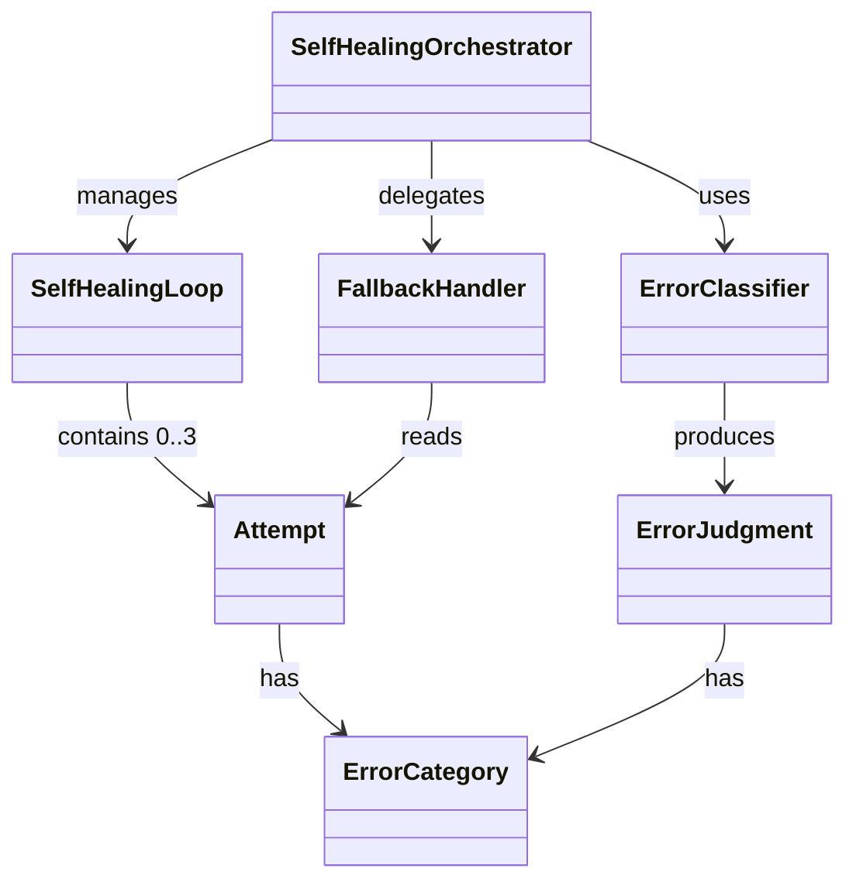

# ドメインモデル: Self-Healingテストループ

## 概要

Construction Phase Step 6のビルド/テスト失敗時に、AIが自動修正を最大3回試行するSelf-Healingループの概念構造を定義する。プロンプトフローの手順定義であり、ソフトウェアコンポーネントの実装ではない。

**重要**: このドメインモデル設計では**コードは書かず**、構造と責務の定義のみを行います。実装はImplementation Phase（コード生成ステップ）で行います。

## エンティティ（Entity）

### SelfHealingLoop（試行管理）

- **ID**: Unit実行ごとに暗黙的に一意（永続化不要）
- **属性**:
  - attempt_current: Integer - 現在の試行番号（1-3）
  - attempt_max: Integer - 最大試行回数（固定値: 3）
  - status: Enum(active, succeeded, exhausted, aborted) - ループの状態
- **振る舞い**:
  - startLoop: エラー発生時にループを開始する
  - advanceAttempt: attempt番号をインクリメントし、次の試行を開始する
  - checkTermination: 成功/最大回数到達/非回復系エラーに基づき終了判定する

### Attempt（試行記録）

- **ID**: attempt番号（1, 2, 3）
- **属性**:
  - error_type: Enum(build_error, test_error) - エラーの種別
  - error_category: ErrorCategory - エラー分類結果
  - cause: String - 失敗要因の要約
  - fix_summary: String - 実施した修正の要約
  - result: Enum(fixed, failed) - 修正結果
- **振る舞い**:
  - recordResult: 試行結果を記録する

## 値オブジェクト（Value Object）

### ErrorCategory

- **属性**: category: Enum(recoverable, non_recoverable, transient)
- **不変性**: エラー分類結果は判定後に変更されない
- **等価性**: category値の一致で判定

### ErrorJudgment（判定結果）

- **属性**:
  - category: ErrorCategory
  - matched_criteria: String - マッチした判定基準
- **不変性**: 判定結果は再評価まで変更されない
- **等価性**: category + matched_criteriaの一致で判定

## 集約（Aggregate）

### SelfHealingSession

- **集約ルート**: SelfHealingLoop
- **含まれる要素**: SelfHealingLoop, Attempt（0〜3件）, ErrorJudgment
- **境界**: 1つのStep 6実行内のSelf-Healing試行全体
- **不変条件**:
  - attempt_currentはattempt_maxを超えない
  - non_recoverable判定後にループを継続しない
  - transientエラーの再試行は1回のみ（attempt消費あり）

## ドメインサービス

### ErrorClassifier（エラー分類器）

- **責務**: エラー出力を解析し、3カテゴリ（recoverable / non_recoverable / transient）に分類する
- **操作**:
  - classify(error_output: String) → ErrorJudgment: エラー出力（ビルド/テストの標準エラー出力）から判定基準テーブルに基づき分類。入力は生ログ文字列

## アプリケーションサービス

### SelfHealingOrchestrator（オーケストレータ）

- **責務**: Self-Healingループ全体のフロー制御とログ出力
- **操作**:
  - orchestrate(error_output: String) → Enum(succeeded, exhausted, aborted, manual): エラー分類 → ループ実行 → 終了判定の制御
  - emitAttemptLog(attempt: Attempt) → void: attempt出力仕様に従いログ出力（プレゼンテーション責務）

### FallbackHandler（フォールバックハンドラ）

- **責務**: ループ終了後のユーザー判断フロー提示（プレゼンテーション責務）
- **操作**:
  - handleExhausted(attempts: Attempt[]) → Enum(manual_continue, backlog_skip, abort): 3回失敗時のユーザー判断フロー
  - handleNonRecoverable(judgment: ErrorJudgment) → Enum(manual_continue, backlog_skip, abort): 非回復系エラー検出時のフロー

## ドメインモデル図

## ユビキタス言語

- **Self-Healing**: ビルド/テスト失敗時にAIが自動修正を試行すること
- **attempt**: 1回の自動修正試行（エラー分析→修正→再実行のサイクル）
- **非回復系エラー（non_recoverable）**: AIの自動修正では解決不可能なエラー（認証失効、リソース不足等）
- **一時的障害（transient）**: 時間経過や再試行で解決する可能性のあるエラー（ネットワーク等）
- **回復可能（recoverable）**: AIの自動修正で解決可能なエラー（コード・テストのロジックエラー等）
- **フォールバック**: ループ終了後にユーザーに判断を委ねること
- **オーケストレータ**: ループ全体のフロー制御を行う責務

## 不明点と質問（設計中に記録）

（なし — 計画段階で責務とカテゴリが明確化済み）
