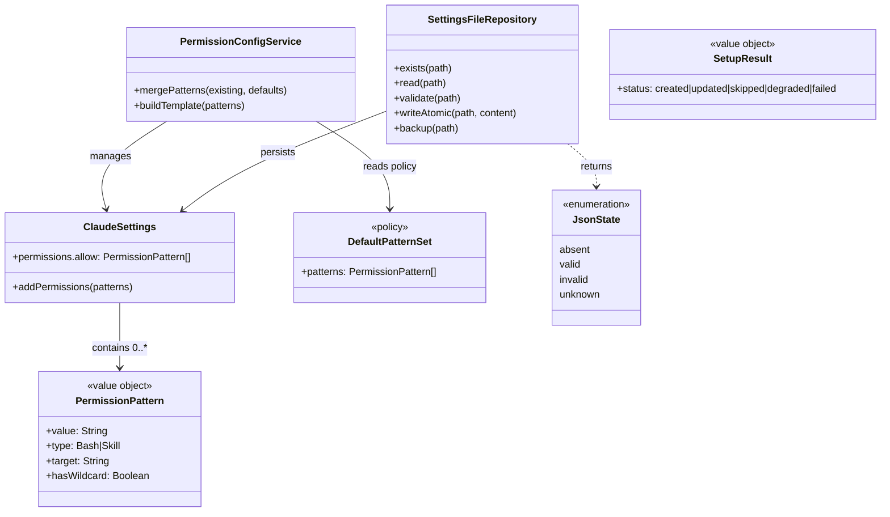

# ドメインモデル: セットアップ時のデフォルト許可パターン追加

## 概要

AI-DLCセットアップ完了時に `.claude/settings.json` へデフォルト許可パターンを自動設定するドメインを定義する。

**重要**: このドメインモデル設計では**コードは書かず**、構造と責務の定義のみを行います。実装はImplementation Phase（コード生成ステップ）で行います。

## エンティティ（Entity）

### ClaudeSettings

Claude Codeの設定内容を表すエンティティ。

- **ID**: シングルトン（プロジェクトに1つ。永続化キーはRepository側がファイルパスで管理）
- **属性**:
  - permissions: Object - 許可設定オブジェクト
  - permissions.allow: PermissionPattern[] - 許可パターン配列
- **振る舞い**:
  - addPermissions(patterns): 許可パターンを追加（既存エントリを保持、重複排除）

## 値オブジェクト（Value Object）

### PermissionPattern

許可パターンの1エントリを表す値オブジェクト。

- **属性**:
  - value: String - パターン文字列（例: `Bash(docs/aidlc/bin/write-history.sh:*)`）
  - type: String - パターン種別（`Bash` / `Skill`）
  - target: String - 対象リソース（スクリプトパス or スキル名）
  - hasWildcard: Boolean - `:*`（任意引数）サフィックスの有無
- **不変性**: パターン文字列は生成後に変更しない
- **等価性**: value（パターン文字列）の完全一致で判定

### DefaultPatternSet（ポリシー）

AI-DLCの基本操作に必要な最小限の許可パターン集合。集約外のポリシー定数。

- **属性**: patterns: PermissionPattern[] - デフォルトパターン（計画ファイル参照）
- **不変性**: AI-DLCバージョンに紐づく固定セット。実行時に動的変更しない
- **等価性**: パターン配列の内容一致

### SetupResult

setup_claude_permissions()の結果を表す値オブジェクト。

- **属性**: status: Enum - `created` / `updated` / `skipped` / `degraded` / `failed`
- **不変性**: 結果は処理完了時に確定
- **等価性**: status値の一致

## 集約（Aggregate）

### ClaudeSettings（集約ルート）

- **集約ルート**: ClaudeSettings
- **含まれる要素**: ClaudeSettings, PermissionPattern（0..N）
- **境界**: 設定内容と不変条件の整合性（読み書きI/OはRepository側の責務）
- **不変条件**:
  - 既存の `permissions.allow` エントリは削除されない
  - 重複パターンは追加されない

## ドメインサービス

### PermissionConfigService

- **責務**: 許可パターンのマージ方針と不変条件を制御する（I/OはRepository側）
- **操作**:
  - mergePatterns(existing, defaults) - 既存パターンとデフォルトをマージ（既存順序保持＋未登録パターンを末尾追加）
  - buildTemplate(patterns) - デフォルトパターンからテンプレートJSON構造を生成

## リポジトリインターフェース

### SettingsFileRepository

- **対象集約**: ClaudeSettings
- **操作**:
  - exists(path) - ファイル存在確認
  - read(path) - JSONファイル読み込み
  - validate(path) - JSON構造の妥当性を検証（absent / valid / invalid / unknown を返す）
  - writeAtomic(path, content) - テンポラリファイル経由で原子的書き込み
  - backup(path) - `.bak` サフィックスでバックアップ作成

## アプリケーション層

### JsonState（アプリケーション層の判定結果）

設定ファイルの状態を表す判定結果。Repositoryのvalidate()が返す。

- state: Enum - `absent` / `valid` / `invalid` / `unknown`（jq・python3不在でバリデーション不可の場合）

## ドメインモデル図

## ユビキタス言語

- **許可パターン（Permission Pattern）**: Claude Codeの `permissions.allow` に登録する文字列。`Bash(path:*)` や `Skill(name)` の形式
- **デフォルトパターンセット**: AI-DLCの基本操作に必要な最小限の許可パターン集合（ポリシー定数）
- **原子的書き込み（Atomic Write）**: テンポラリファイルに書き込み後、`mv` でリネームする書き込み方式。書き込み途中の障害でも元ファイルを破損しない
- **`:*` サフィックス**: 引数にcycle名・unit番号等の可変値が必要なスクリプトに付与する任意引数パターン
- **JSON状態（JsonState）**: 設定ファイルの4状態 - `absent`（不在）、`valid`（正常JSON）、`invalid`（不正JSON）、`unknown`（バリデーション不可）
- **SetupResult**: 処理結果の5状態 - `created`（新規作成）、`updated`（更新）、`skipped`（変更不要）、`degraded`（jq/python3不在で部分適用）、`failed`（書き込み失敗）

## 不明点と質問（設計中に記録）

（なし - 計画フェーズおよびレビューで解決済み）
