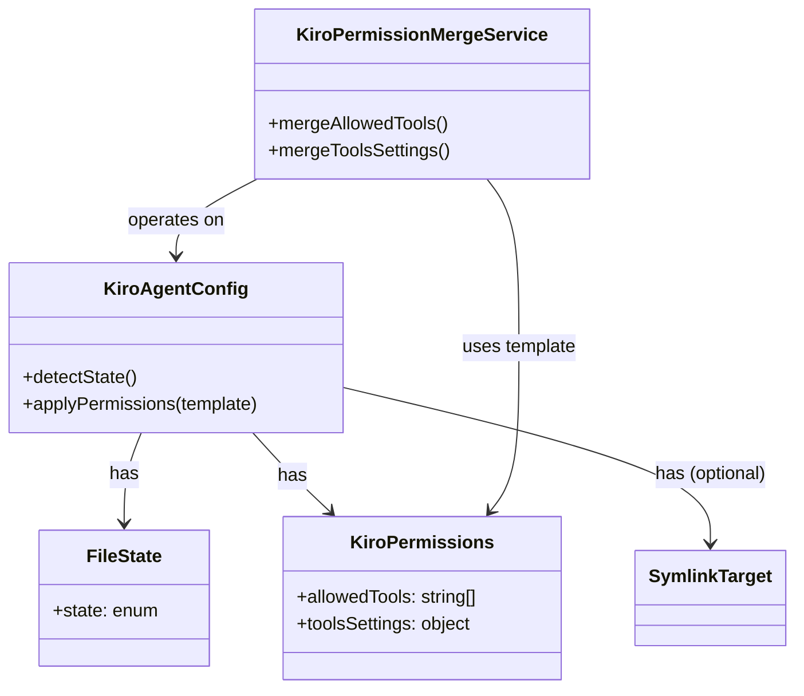

# ドメインモデル: Kiroエージェント許可設定セットアップ

## 概要

setup-ai-tools.shの`setup_kiro_agent`関数を拡張し、Kiroエージェント設定ファイルの状態に応じた許可設定のセットアップを行うドメインモデル。

**重要**: このドメインモデル設計では**コードは書かず**、構造と責務の定義のみを行います。

## エンティティ（Entity）

### KiroAgentConfig

Kiroエージェント設定ファイル（`.kiro/agents/aidlc.json`）の許可設定を表す。ファイル状態の判定やI/O操作はインフラ層（論理設計のコンポーネント）の責務。

- **ID**: ファイルパス（`.kiro/agents/aidlc.json`）
- **属性**:
  - permissions: KiroPermissions（値オブジェクト） - 許可設定
- **振る舞い**:
  - mergePermissions(existing, template): 既存設定にテンプレートの差分をマージする（ビジネスルール: set-difference）

## 値オブジェクト（Value Object）

### FileState

- **属性**: state: enum（symlink_correct, symlink_incorrect, real_file_valid, real_file_invalid, absent）
- **不変性**: ファイル状態は判定時点で確定し、操作中に変化しない
- **等価性**: state値で判定

### KiroPermissions

- **属性**:
  - allowedTools: string[] - 許可するツール一覧（fs_read, grep, glob等）
  - toolsSettings: object - ツール固有の設定。マージ対象は `execute_bash` キーのみ:
    - `execute_bash.allowedCommands`: string[] - 許可コマンドパターン（set-differenceマージ）
    - `execute_bash.autoAllowReadonly`: boolean - 読み取り専用操作の自動許可
  - その他の `toolsSettings` キーが将来追加された場合はマージ対象外（既存を維持）
- **不変性**: テンプレートから生成される許可設定の定義
- **等価性**: allowedTools配列とtoolsSettings構造の完全一致

### SymlinkTarget

- **属性**: targetPath: string - symlinkのリンク先パス
- **不変性**: リンク先パスは判定時に確定
- **等価性**: targetPath文字列の一致

## 集約（Aggregate）

### KiroAgentSetup

- **集約ルート**: KiroAgentConfig
- **含まれる要素**: FileState, KiroPermissions, SymlinkTarget
- **境界**: Kiroエージェント設定ファイルの状態判定と許可設定の適用
- **不変条件**:
  - symlinkの場合はテンプレートリンクのみ許可（許可設定はテンプレートに含まれる）
  - 実ファイルの場合はset-differenceマージ（既存設定を破壊しない）
  - 不正JSONの場合は上書き禁止（データ保護）

## ドメインサービス

### KiroPermissionMergeService

- **責務**: テンプレートの許可設定を既存の実ファイルにマージする
- **操作**:
  - mergeAllowedTools(existing, template): 既存のallowedToolsにテンプレートの差分を追加
  - mergeToolsSettings(existing, template): 既存のtoolsSettingsにテンプレートの差分を追加
  - マージ戦略: set-difference（テンプレートにあって既存にないものだけ追加）

## ドメインモデル図

## ユビキタス言語

- **テンプレート**: `prompts/package/kiro/agents/aidlc.json` — 許可設定の正本（Source of Truth）
- **許可設定**: allowedTools + toolsSettings — Kiroエージェントが自動承認するツール・コマンドの定義
- **set-differenceマージ**: テンプレートにあって既存ファイルにない項目のみ追加するマージ戦略
- **symlink方式**: テンプレートファイルへのシンボリックリンクによるゼロコピー参照
- **実ファイル**: ユーザーがsymlinkを解除してカスタマイズしたJSON設定ファイル
