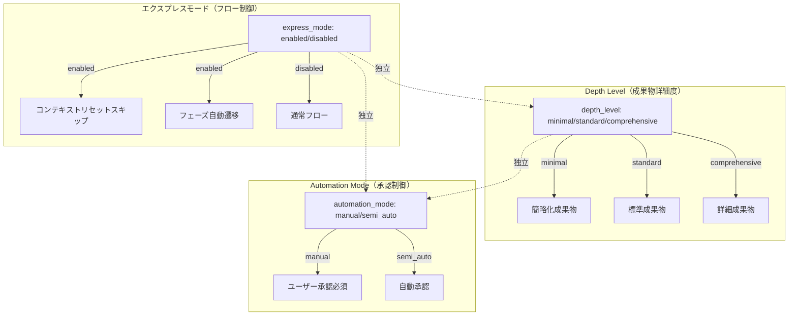

# ドメインモデル: エクスプレスモード再設計

## 概要
エクスプレスモードの概念モデルを再定義し、depth_level・automation_mode との関係を明確化する。本Unitはプロンプトファイル改修のため、概念モデルとして設計する。

**重要**: このドメインモデル設計では**コードは書かず**、構造と責務の定義のみを行います。

## 概念モデル: 3軸の独立性



## エンティティ（概念）

### ExpressMode（エクスプレスモード）
- **状態**: `enabled` | `disabled`
- **起動トリガー**: `start express` コマンド
- **属性**:
  - express_enabled: boolean — エクスプレスモードの有効/無効
  - eligibility_result: `eligible` | `ineligible` | `not_evaluated` — 適格性判定結果
  - eligibility_reason: string — 判定理由（ineligible 時に必須）
- **振る舞い**:
  - activate(): `start express` コマンドで express_enabled=true をセット。depth_level は変更しない
  - evaluateEligibility(units): Unit リストを受け取り、複雑度判定を実行して eligibility_result をセット

### ComplexityAssessment（複雑度評価）
- **属性**:
  - unit_name: string — 評価対象 Unit 名
  - clarity_score: `eligible` | `ineligible` — 受け入れ基準の明確さ
  - dependency_score: `eligible` | `ineligible` — 依存関係の複雑さ
  - risk_score: `eligible` | `ineligible` — 技術的リスク
  - impact_score: `eligible` | `ineligible` — 変更影響範囲
  - overall: `eligible` | `ineligible` — 総合判定（全項目 eligible なら eligible）
  - reason: string — ineligible の場合の理由

## 値オブジェクト

### EligibilityRule（適格性判定ルール）
各評価項目の判定条件を定義する不変オブジェクト。

| 評価項目 | eligible 条件 | ineligible 条件 |
|----------|--------------|----------------|
| 受け入れ基準の明確さ | 全基準が具体的で検証可能。曖昧な表現なし | 曖昧な基準が1つ以上、または基準が未定義 |
| 依存関係の複雑さ | Unit間依存が線形。循環依存・多段分岐なし | 循環依存、3つ以上のUnitからの同時依存、外部システムとの双方向依存 |
| 技術的リスク | 使用技術が既知。プロジェクト内に類似実装あり | 未使用技術導入、外部API新規連携、アーキテクチャ変更 |
| 変更影響範囲 | 変更対象ファイルが特定可能で限定的 | 影響範囲が不明確、横断的変更（共通基盤改修等） |

## ドメインサービス

### ExpressModeEvaluator（エクスプレスモード評価サービス）
- **責務**: Unit 定義完了後にエクスプレスモードの適用可否を判定する
- **操作**:
  - evaluate(units, express_enabled) → ExpressMode
    1. express_enabled が false なら `not_evaluated` を返す
    2. Unit 数が 0 なら `ineligible`（理由: "Unit定義がない"）
    3. 各 Unit に対して ComplexityAssessment を実行
    4. 全 Unit が `eligible` なら `eligible`、1つでも `ineligible` なら `ineligible`

### PhaseTransitionController（フェーズ遷移制御）
- **責務**: エクスプレスモードの有効/無効に基づいてフェーズ遷移を制御する
- **操作**:
  - shouldSkipContextReset(express_mode) → boolean
    - express_mode.express_enabled=true かつ eligibility_result=eligible なら true
  - shouldAutoTransition(express_mode) → boolean
    - 上記と同条件

## `start express` コマンドの意味変更

### 変更前（v1.27.2 以前）
```
start express → depth_level=minimal をオーバーライド → 成果物簡略化 + フェーズ連続実行
```

### 変更後（v1.27.3）
```
start express → express_enabled=true をセット → 複雑度判定 → フェーズ連続実行（成果物は depth_level に従う）
```

**後方互換**: `depth_level=minimal` を設定ファイルで指定 + `start express` = 従来と同等の動作（成果物簡略化 + フェーズ連続実行）

## フロー変更のまとめ

### Inception Phase（inception.md）

**ステップ14b（インスタント検出）**:
- 変更前: `start express` → `depth_level=minimal` オーバーライド
- 変更後: `start express` → `express_enabled=true` セット（depth_level は変更しない）

**ステップ4b（エクスプレスモード判定）**:
- 変更前: スキップ条件 = `depth_level が minimal でない場合`
- 変更後: スキップ条件 = `express_enabled が false の場合`
- 判定内容: Unit 数チェック → 複雑度判定 → eligible/ineligible 判定

### Construction Phase（construction.md）

**エクスプレスモード検出セクション**:
- 変更前: `depth_level=minimal` かつ Unit数1 → Phase 1スキップ
- 変更後: `express_enabled=true` かつ `eligibility_result=eligible` → depth_level に応じたPhase 1の処理
  - `depth_level=minimal`: Phase 1 スキップ（従来通り）
  - `depth_level=standard/comprehensive`: Phase 1 は通常実行

## ユビキタス言語

- **エクスプレスモード**: フェーズ連続実行を制御するフロー制御機能。v1.27.3 で depth_level との結合を解除
- **複雑度判定**: Unit の4項目評価に基づくエクスプレスモード適格性判定
- **適格性（eligibility）**: エクスプレスモード適用の可否を示す状態（eligible/ineligible）
- **フロー制御**: フェーズ間のコンテキストリセットスキップと自動遷移を制御する仕組み
- **3軸の独立性**: エクスプレスモード（フロー制御）、depth_level（成果物詳細度）、automation_mode（承認制御）がそれぞれ独立して動作する設計原則
