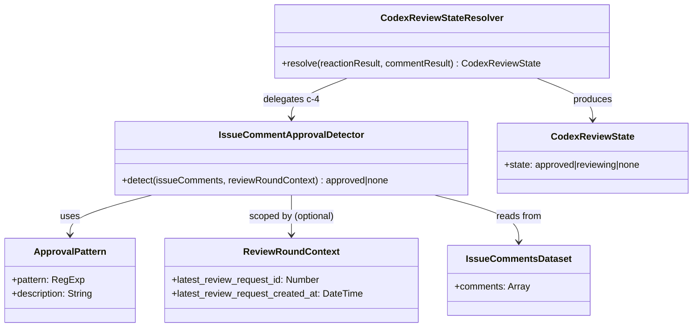

# ドメインモデル: Codex PRレビューIssue Comment承認検出

## 概要

PRマージ前レビューコメント確認のc判定ロジックを拡張し、CodexボットのIssue Commentによる承認パターンを検出する構造を定義する。

**重要**: このドメインモデル設計では**コードは書かず**、構造と責務の定義のみを行います。実装はImplementation Phase（コード生成ステップ）で行います。

## 値オブジェクト（Value Object）

### CodexReviewState

c判定全体の正規化された出力状態。

- **属性**: state: enum(`approved` | `reviewing` | `none`) - Codex PRレビューの状態
- **不変性**: 一度決定された状態は判定プロセス内で変更されない
- **等価性**: `state` の値で判定

| 状態 | 意味 | 後続処理 |
|------|------|----------|
| `approved` | 承認済み（👍リアクションまたは承認コメント） | マージ進行可 |
| `reviewing` | レビュー進行中（👀リアクションのみ） | ユーザーに待機/進行を確認 |
| `none` | 判定不能（リアクションもコメントもなし） | a/b判定のみで続行 |

### ApprovalPattern

承認コメントの検出パターン定義。

- **属性**:
  - pattern: RegExp - 承認キーワードの正規表現
  - description: String - パターンの説明
- **不変性**: 定義後は変更しない（パターン追加は新規定義として行う）
- **等価性**: `pattern` の文字列表現で判定

**初期パターン**:
- `Didn't find any major issues` — Codexが問題なしと判定した場合の既知フレーズ

### ReviewRoundContext

レビューラウンドのコンテキスト情報。c-1でレビュー依頼が特定できない場合は生成されない（Optional）。

- **属性**:
  - latest_review_request_id: Number - 最新の`@codex review`コメントID（c-1で特定）
  - latest_review_request_created_at: DateTime - 最新レビュー依頼の投稿日時
- **不変性**: c-1の実行結果から決定され、以降変更されない
- **等価性**: `latest_review_request_id` で判定
- **null条件**: c-1でコメントIDが取得できない場合（`null`/空）、ReviewRoundContextは生成されず、c-4を含むc判定全体がスキップされる（既存ルール通り）

### IssueCommentsDataset

c-1のpaginate結果（Issue Comments全件）を保持する中間データ。

- **属性**:
  - comments: Array - Issue Commentsの全件データ
- **不変性**: c-1で取得後は変更されない
- **用途**: c-1（`@codex review`コメント特定）とc-4（承認コメント検出）の両方で使用
- **取得タイミング**: c-1のAPI呼び出し時に一度だけ取得し、以降はこのデータセットを参照

## ドメインサービス

### CodexReviewStateResolver

c判定の状態解決サービス。c-1〜c-4の判定結果を集約し、最終的なCodexReviewStateを決定する。

- **責務**: 各サブ判定の結果を優先順位ルールに従って集約し、単一のCodexReviewStateを返す
- **操作**:
  - resolve(reactionResult, commentResult) → CodexReviewState
    - reactionResult: c-3のリアクション判定結果
    - commentResult: c-4のコメント判定結果

**集約規則（優先順位）**:

```text
1. c-3 が approved → approved（c-4をスキップ）
2. c-3 が reviewing → c-4を実行
   2a. c-4 が approved → approved（コメント承認が優先）
   2b. c-4 が none → reviewing（リアクションの状態を維持）
3. c-3 が none → c-4を実行
   3a. c-4 が approved → approved
   3b. c-4 が none → none
```

### IssueCommentApprovalDetector

CodexボットのIssue Commentから承認パターンを検出するサービス。

- **責務**: Issue Commentsデータセットから、指定レビューラウンド以降のCodexボット承認コメントを検出する
- **前提条件**: ReviewRoundContextが存在すること（nullの場合は呼び出さない）
- **操作**:
  - detect(issueCommentsDataset, reviewRoundContext) → `approved` | `none`
    1. `user.login` == `chatgpt-codex-connector[bot]` でフィルタ
    2. `created_at` >= `reviewRoundContext.latest_review_request_created_at` でフィルタ
    3. `body` が ApprovalPattern のいずれかにマッチするか判定
    4. マッチするコメントが1件以上 → `approved`、なし → `none`
    5. フィルタリング処理中にエラー発生 → c-3の結果を保持（c-4はスキップ扱い）

## ドメインモデル図



## ユビキタス言語

- **c判定**: Codex PRレビューの状態を絵文字リアクションおよびIssue Commentから検出する判定プロセス全体
- **レビューラウンド**: `@codex review` コメント投稿から次の `@codex review` コメント投稿までの期間
- **承認コメント**: Codexボットが問題なしと判定した際に投稿するIssue Comment
- **Codexボットアカウント**: `chatgpt-codex-connector[bot]`（定数）

## 不明点と質問（設計中に記録）

なし
