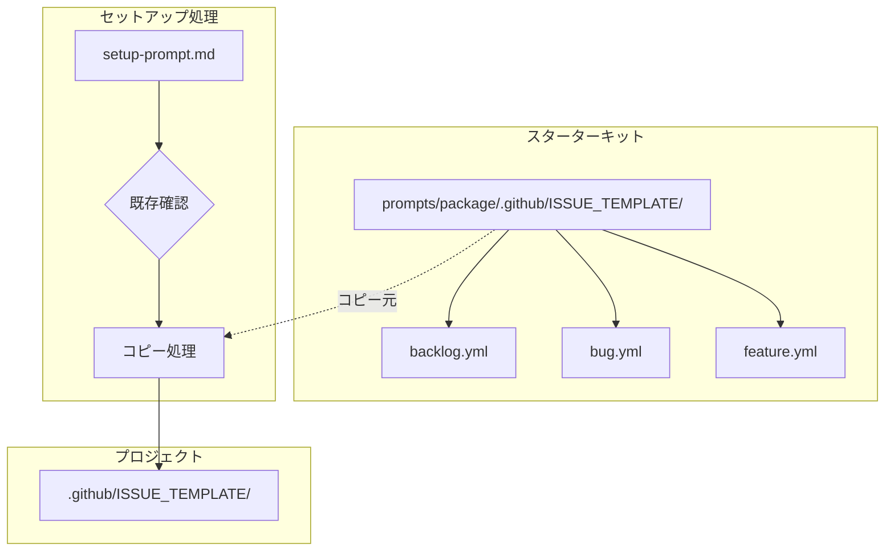

# ドメインモデル: バックログ用Issueテンプレート

## 概要

GitHub Issuesを使ったバックログ管理を可能にするため、Issueテンプレートを定義する。
AI-DLCスターターキットに組み込み、セットアップ時にプロジェクトへコピーできるようにする。

**重要**: このドメインモデル設計では**コードは書かず**、構造と責務の定義のみを行います。

## 構成要素

### 1. IssueテンプレートConfigファイル（任意）

GitHubのIssueテンプレート機能では、`config.yml` で「空のIssue作成を無効化」などの設定が可能。

- **配置**: `.github/ISSUE_TEMPLATE/config.yml`
- **責務**: テンプレート全体の設定（空Issue無効化、外部リンク追加など）
- **今回の対応**: 作成しない（デフォルト設定で十分）

### 2. Issue Forms（YAML形式）

GitHubのIssue Forms機能を使用し、構造化されたフォーム形式で入力を受け付ける。
ファイル拡張子は `.yml`（`.yaml` も可）。

#### テンプレート共通構造

```yaml
name: [テンプレート名（和英併記）]
description: [テンプレートの説明（和英併記）]
title: "[PREFIX] "
labels: [自動付与ラベル]
body:
  - type: [input / textarea / dropdown / checkboxes / markdown]
    id: [フィールドID]
    attributes:
      label: [ラベル]
      description: [説明]
      placeholder: [プレースホルダー]
    validations:
      required: [true / false]
```

### 3. バックログテンプレート（backlog.yml）

- **責務**: AI-DLCのバックログアイテム（気づき・将来の作業）を記録
- **メタデータ**:
  - name: "Backlog / バックログ"
  - description: "Record a task or idea for future implementation / 将来対応が必要な気づきや課題を記録"
  - title: "[Backlog] "
  - labels: ["backlog"]
- **フォームフィールド**:
  - 概要 / Summary（textarea, 必須）
  - 詳細 / Details（textarea, 任意）
  - 発見サイクル / Discovery Cycle（input, 任意）
  - 発見フェーズ / Discovery Phase（dropdown, 任意: Inception/Construction/Operations/N/A）
  - 優先度 / Priority（dropdown, 必須）
  - 対応案 / Proposed Solution（textarea, 任意）

### 4. バグ報告テンプレート（bug.yml）

- **責務**: バグ報告を標準化、必須項目を強制
- **メタデータ**:
  - name: "Bug Report / バグ報告"
  - description: "Report a bug or unexpected behavior / バグや問題を報告"
  - title: "[Bug] "
  - labels: ["bug"]
- **フォームフィールド**:
  - バグの概要 / Bug Summary（textarea, 必須）
  - 再現手順 / Steps to Reproduce（textarea, 必須）
  - 期待される動作 / Expected Behavior（textarea, 必須）
  - 実際の動作 / Actual Behavior（textarea, 必須）
  - 環境情報 / Environment（textarea, 任意）

### 5. 機能要望テンプレート（feature.yml）

- **責務**: 機能要望を標準化
- **メタデータ**:
  - name: "Feature Request / 機能要望"
  - description: "Suggest a new feature or enhancement / 新機能や改善の要望"
  - title: "[Feature] "
  - labels: ["enhancement"]
- **フォームフィールド**:
  - 機能の概要 / Feature Summary（textarea, 必須）
  - 背景・動機 / Motivation（textarea, 必須）
  - 提案内容 / Proposed Solution（textarea, 必須）
  - 代替案 / Alternatives（textarea, 任意）

## セットアップフローとの統合

### 統合点

スターターキットセットアップ（`prompts/setup-prompt.md`）の「8. 共通ファイルの配置」セクションに処理を追加。

### 処理フロー

```
1. プロジェクトの .github/ 状態確認
2. 状態に応じた処理分岐
3. テンプレートのコピー
4. 結果報告
```

### 状態パターンと対応

| プロジェクトの状態 | 対応 |
|------------------|------|
| `.github/` が存在しない | 新規作成・全テンプレートコピー |
| `.github/` は存在するが `ISSUE_TEMPLATE/` がない | `ISSUE_TEMPLATE/` のみ作成・コピー |
| `.github/ISSUE_TEMPLATE/` が存在し、同名ファイルがある | ユーザー確認（上書き/スキップ） |
| `.github/ISSUE_TEMPLATE/` が存在するが、同名ファイルがない | テンプレートのみコピー |

## ユビキタス言語

- **Issueテンプレート**: GitHubでIssue作成時に表示される定型フォーム
- **バックログ**: 将来対応が必要な課題・気づきのリスト
- **フロントマター**: Markdownファイル先頭のYAML形式メタデータ
- **ラベル**: GitHubでIssueを分類するためのタグ

## ドメインモデル図



## 不明点と質問

（なし - Unit定義と技術的考慮事項で十分明確）
