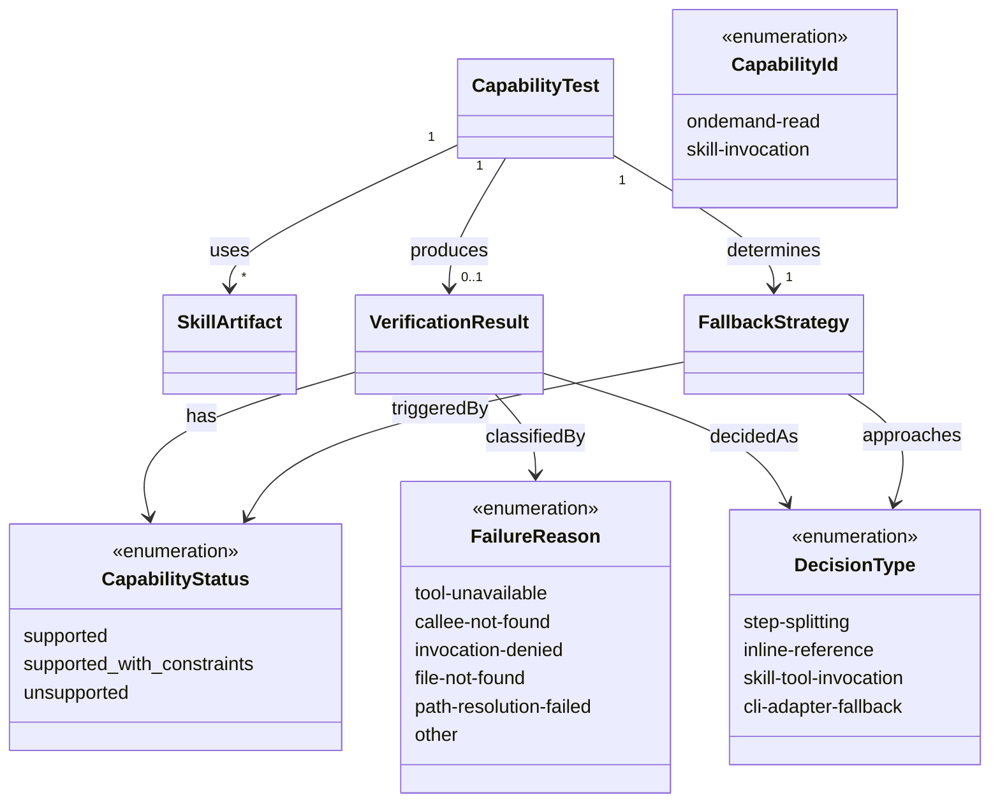

# ドメインモデル: PoC - スキル機能検証

## 概要
Claude Codeスキル機構の2つの技術的前提（オンデマンドRead、スキル間呼び出し）を検証し、v2.0.0の実装方針を確定するためのPoC検証ドメイン。

**重要**: このドメインモデル設計では**コードは書かず**、構造と責務の定義のみを行います。実装はImplementation Phase（コード生成ステップ）で行います。

## エンティティ（Entity）

### CapabilityTest（機能検証テスト）
- **ID**: テスト名（文字列: `ondemand-read` / `skill-invocation`）
- **属性**:
  - name: String - 検証対象の機能名
  - description: String - 検証内容の説明
  - marker: String - 検証用マーカー文字列（例: `[POC-READ-MARKER-12345]`）
  - skillArtifacts: List[SkillArtifact] - 検証に使用するスキル成果物
- **振る舞い**:
  - execute(): 検証を実行し、VerificationResultを生成
  - evaluate(output): 出力をマーカーと照合し、CapabilityStatusを判定

### VerificationResult（検証結果）
- **ID**: CapabilityId
- **属性**:
  - capability: CapabilityId - 検証対象の機能識別子
  - status: CapabilityStatus - 判定結果
  - observedOutput: String - 実際の出力またはエラーメッセージ
  - failureReason: FailureReason - 失敗理由の分類（unsupportedの場合）
  - constraints: List[String] - 制約条件（supported_with_constraintsの場合）
  - decision: DecisionType - 採用する実装方針

## 値オブジェクト（Value Object）

### CapabilityId（機能識別子）
- **属性**: value: Enum(`ondemand-read`, `skill-invocation`)
- **不変性**: 検証対象の固定識別子
- **等価性**: valueの一致で判定

### CapabilityStatus（機能サポート状態）
- **属性**: value: Enum(`supported`, `supported_with_constraints`, `unsupported`)
- **不変性**: 一度判定された結果は変更しない
- **等価性**: valueの一致で判定

### DecisionType（実装方針）
- **属性**: value: Enum(`step-splitting`, `inline-reference`, `skill-tool-invocation`, `cli-adapter-fallback`)
- **不変性**: PoC結果確定後に固定
- **等価性**: valueの一致で判定
- **マッピング**:
  - `step-splitting`: steps/ディレクトリによるステップ分割（Read成功時）
  - `inline-reference`: @参照によるSKILL.md本文への内容埋め込み（Read失敗時）
  - `skill-tool-invocation`: Skillツール経由でreviewing-*を呼び出し（スキル間呼び出し成功時）
  - `cli-adapter-fallback`: 外部CLIベースのレビュー実行アダプタ（スキル間呼び出し失敗時）

### FailureReason（失敗理由分類）
- **属性**: value: Enum(`tool-unavailable`, `callee-not-found`, `invocation-denied`, `file-not-found`, `path-resolution-failed`, `other`)
- **不変性**: 失敗判定時に確定
- **等価性**: valueの一致で判定

### SkillArtifact（スキル成果物）
- **属性**:
  - path: String - ファイルパス
  - role: Enum(`test-skill`, `step-file`, `callee-skill`) - 成果物の役割
  - content: String - ファイル内容の概要
- **不変性**: PoC用の固定成果物であり変更しない
- **等価性**: pathの一致で判定

### FallbackStrategy（フォールバック戦略）
- **属性**:
  - capability: CapabilityId - 対象機能
  - primaryApproach: DecisionType - 第一候補の実装方式
  - fallbackApproach: DecisionType - フォールバック実装方式
  - trigger: CapabilityStatus - フォールバック発動条件（`unsupported`時に発動）
- **不変性**: PoC結果確定後に固定
- **等価性**: capabilityの一致で判定

## 集約（Aggregate）

### CapabilityTest（集約単位）
- **集約ルート**: CapabilityTest
- **含まれる要素**: SkillArtifact（1件以上）、VerificationResult（0..1件）、FallbackStrategy（1件）
- **境界**: 1つの機能検証とその結果・方針を管理
- **不変条件**:
  - 検証完了後にVerificationResultが存在すること
  - statusが`unsupported`の場合、FallbackStrategyのfallbackApproachが定義されていること

## ドメインサービス

### VerificationJudgementService（検証判定サービス）
- **責務**: 検証出力の評価とFallbackStrategy確定（ドメインロジックのみ）
- **操作**:
  - evaluateOutput(test, output) - 出力をマーカーと照合しCapabilityStatusとFailureReasonを判定
  - determineFallback(result) - 検証結果からFallbackStrategyを確定

**注**: テストスキルの作成・プラグインインストール・実行・ドキュメント出力は実行手順（手動操作）であり、ドメインサービスの責務外。

## ドメインモデル図

## ユビキタス言語

- **オンデマンドRead**: SKILL.md内の指示により、スキルディレクトリ内のファイルをReadツールで読み込む機能
- **スキル間呼び出し**: あるスキルの実行中にSkillツールを使って別のスキルを呼び出す機能
- **マーカー文字列**: 検証の成否を判定するためにファイルに埋め込む一意の識別文字列
- **CapabilityStatus**: 機能のサポート状態を3段階（supported / supported_with_constraints / unsupported）で表す判定結果
- **フォールバック戦略**: 機能が利用不可の場合に代替する実装方式

## 不明点と質問（設計中に記録）

現時点で不明点はありません。PoCの実行結果により追加の質問が発生する可能性があります。
