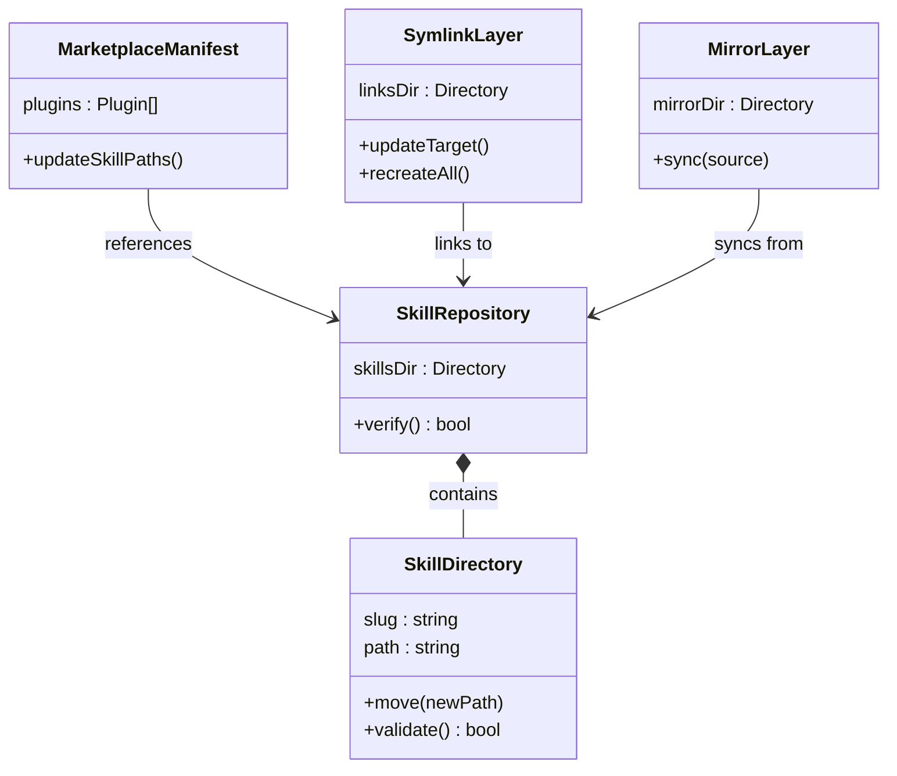

# ドメインモデル: リポジトリ構造基盤

## 概要

スキルファイルの配置構造を `prompts/package/skills/` から `skills/` に移行し、正本と2つの独立した消費パス（ローカルリンク・v1互換ミラー）を確立するためのドメインモデル。

**重要**: このドメインモデル設計では**コードは書かず**、構造と責務の定義のみを行います。

## 構造方針

`skills/` を正本とし、2つの独立した消費パスが存在する：

```text
skills/ (正本)
├──→ .claude/skills/ (SymlinkLayer: ローカル消費用、直接リンク)
└──→ docs/aidlc/skills/ (MirrorLayer: v1外部プロジェクト互換、sync-package.shで同期)
```

**注意**: SymlinkLayerとMirrorLayerはチェーン関係ではなく、それぞれが独立して正本を参照する。

## エンティティ

### SkillDirectory（スキルディレクトリ）

- **ID**: スキルスラッグ（例: `reviewing-code`）
- **属性**:
  - slug: string - スキルの一意識別子（kebab-case）
  - path: string - リポジトリルートからの相対パス
  - contents: ファイル群 - SKILL.md + references/ 等
- **振る舞い**:
  - move(newPath): 別パスへ移動（git mv）
  - validate(): SKILL.mdの存在確認

### MarketplaceManifest（マーケットプレイスマニフェスト）

- **ID**: 単一インスタンス（`.claude-plugin/marketplace.json`）
- **属性**:
  - name: string - プラグイン名
  - plugins: Plugin[] - プラグイン定義の配列
  - plugins[].skills: string[] - スキルパスの配列
- **振る舞い**:
  - updateSkillPaths(oldPrefix, newPrefix): スキルパスの一括置換

### SymlinkLayer（シンボリックリンク層）

- **ID**: `.claude/skills/` ディレクトリ
- **属性**:
  - links: Map<slug, targetPath> - スラッグとリンク先のマップ
  - target: `skills/` ディレクトリ（正本を直接参照）
- **振る舞い**:
  - updateTarget(slug, newTarget): リンク先の変更
  - recreateAll(sourceDir): 全リンクの再作成

### MirrorLayer（互換ミラー層）

- **ID**: `docs/aidlc/skills/` ディレクトリ
- **属性**:
  - source: `skills/` ディレクトリ（正本）
  - syncTool: sync-package.sh
- **振る舞い**:
  - sync(source): 正本からの内容同期（rsync）
- **廃止条件**: Unit 010で v1互換が不要と判断された場合に廃止

## 値オブジェクト

### SkillPath（スキルパス）

- **属性**: path: string - `./skills/<slug>` 形式
- **不変性**: 移行後のパスは `skills/` プレフィックスで始まる
- **等価性**: パス文字列の完全一致

### LayerRole（レイヤー役割）

- **属性**: role: enum（source | mirror | link）
- **不変性**: 各レイヤーの役割は固定
- **等価性**: role値の一致

## 集約

### SkillRepository（スキルリポジトリ構造）

- **集約ルート**: skills/ ディレクトリ
- **含まれる要素**: SkillDirectory[], MarketplaceManifest, SymlinkLayer, MirrorLayer
- **境界**: リポジトリ内のスキル配置に関する全ての構造
- **不変条件**:
  - marketplace.jsonの全skillsパスが実在するディレクトリを指すこと
  - `.claude/skills/` の全シンボリックリンクが `skills/` 配下の有効なターゲットを持つこと
  - `docs/aidlc/skills/` の内容が `skills/` と同期されていること（sync-package.sh実行後）

## ドメインサービス

### SkillMigrationService

- **責務**: 既存スキルの配置移行を安全に実施
- **操作**:
  - migrateSkills(): 全スキルを `prompts/package/skills/` から `skills/` へ移動
  - updateManifest(): marketplace.jsonのスキルパスを更新
  - updateSymlinks(): `.claude/skills/` のリンク先を `skills/` に更新
  - verify(): 移行後の整合性を検証（マニフェスト解決・リンク有効性）

## ドメインモデル図



## ユビキタス言語

- **正本（Source）**: `skills/` - 開発者が直接編集するスキルのソースコード
- **互換ミラー（Mirror）**: `docs/aidlc/skills/` - v1外部プロジェクト互換のためのrsyncコピー。Unit 010で廃止を検討
- **消費者リンク層（Link Layer）**: `.claude/skills/` - Claude Codeが実行時に参照するシンボリックリンク。正本を直接参照
- **スキルスラッグ（Skill Slug）**: スキルのkebab-case識別子（例: `reviewing-code`）
- **マーケットプレイスマニフェスト**: `.claude-plugin/marketplace.json` - プラグイン配布用の定義ファイル
