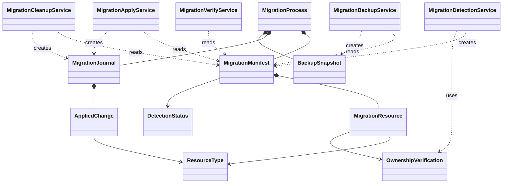

# ドメインモデル: v1→v2移行スキル

## 概要

v1環境からv2への自動移行処理のドメインモデル。移行フロー（検出→バックアップ→適用→クリーンアップ→検証）の状態遷移と、各フェーズの構造・責務を定義する。

**重要**: このドメインモデル設計では**コードは書かず**、構造と責務の定義のみを行います。

## エンティティ（Entity）

### MigrationManifest

移行計画を表す。detect フェーズで生成され、以降の全フェーズで参照される。

- **ID**: manifest_id（ISO8601タイムスタンプベースの論理ID。ファイルパスはアプリケーション層の実装詳細）
- **属性**:
  - version: Integer - manifestスキーマバージョン（現在: 1）
  - status: DetectionStatus - 検出結果の状態
  - detected_at: ISO8601 - 検出日時
  - source_version: String - 移行元バージョン（"v1"）
  - target_version: String - 移行先バージョン（"v2"）
  - backlog_mode: String - 現在のバックログモード設定
  - resources: List[MigrationResource] - 移行対象リソース一覧
- **振る舞い**:
  - 生成時にv1環境の全対象を検出し、resource_type ごとに分類する
  - status と resources の組み合わせで移行要否を判定する

### MigrationJournal

適用済み変更の記録。apply / cleanup フェーズで生成される。

- **ID**: phase名（"config" / "data" / "cleanup"）
- **属性**:
  - phase: String - フェーズ名
  - applied: List[AppliedChange] - 適用済み変更リスト
- **振る舞い**:
  - 各変更の成否を記録する
  - ロールバック時の参照元となる

## 値オブジェクト（Value Object）

### MigrationResource

移行対象の個別リソースを表す。

- **属性**:
  - resource_type: ResourceType - リソース種別（論理分類）
  - path: String - リソースのプロジェクトルート相対パス（識別子を兼ねる）
  - action: Action - 実行アクション（DELETE / UPDATE / MIGRATE）
  - condition: String? - 条件付き実行の条件式
  - ownership_evidence: OwnershipVerification? - 所有権検証結果（detect時に付与）
- **不変性**: 一度 manifest に含まれたリソースは変更しない
- **等価性**: resource_type + path の組み合わせで一意

### DetectionStatus（列挙型）

検出結果の状態を表す。status と resources の組み合わせで移行要否が一意に決まる。

| status | resources | 意味 | オーケストレータの動作 |
|--------|-----------|------|----------------------|
| `already_v2` | 空配列 | v2環境（v1痕跡なし） | 「移行不要」メッセージを表示して終了 |
| `v1_detected` | 非空 | v1環境検出、移行対象あり | 移行続行 |

**不変条件**: `already_v2` の場合 resources は必ず空。`v1_detected` の場合 resources は必ず非空。

### ResourceType（列挙型）

- `symlink_agents` - エージェントスキル用シンボリックリンク
- `symlink_kiro` - Kiro連携用シンボリックリンク
- `file_kiro` - Kiro連携用既知実体ファイル
- `backlog_dir` - バックログディレクトリ
- `github_template` - スターターキット由来のIssueテンプレート
- `config_update` - 設定ファイルのパス更新
- `data_migration` - サイクルデータの移行

### AppliedChange

適用済み変更の個別エントリ。

- **属性**:
  - resource_type: ResourceType
  - path: String
  - status: String - "success" / "skipped" / "error"
  - detail: String - 詳細メッセージ
- **不変性**: 記録後は変更しない
- **等価性**: resource_type + path + status

### BackupSnapshot

バックアップ作成結果を表す。復元時の参照元。

- **属性**:
  - backup_dir: String - バックアップディレクトリのパス
  - files: List[BackupEntry] - バックアップ済みファイル一覧（source: 元パス, backup: バックアップ先パス）
- **不変性**: 作成後は変更しない
- **等価性**: backup_dir

### OwnershipVerification

実体ファイルの所有権検証結果。

- **属性**:
  - method: String - "symlink_target" / "content_hash" / "known_filename"
  - expected_hash: String? - 期待されるSHA256ハッシュ
  - actual_hash: String? - 実際のSHA256ハッシュ
  - is_owned: Boolean - AI-DLC所有と判定されたか
- **不変性**: 検証結果は不変
- **等価性**: method + is_owned

## 集約（Aggregate）

### MigrationProcess

移行プロセス全体を管理する集約。

- **集約ルート**: MigrationManifest
- **含まれる要素**: MigrationManifest, MigrationJournal (config, data, cleanup), BackupSnapshot, List[MigrationResource]
- **境界**: 1回の移行実行全体
- **不変条件**:
  - manifest が生成されるまで apply/cleanup は実行できない
  - backup が完了するまで apply は実行できない
  - apply (config → data) は順序保証
  - cleanup は apply 完了後にのみ実行可能
  - verify は manifest を参照して期待状態と比較する

## ドメインサービス

### MigrationDetectionService

v1環境の検出と manifest 生成を担当。

- **責務**: allowlistに基づいてv1痕跡を検出し、所有権検証ポリシーを適用する
- **操作**:
  - detect() → MigrationManifest: v1環境を検出し、全移行対象をリソースとして列挙。所有権検証結果を各リソースの ownership_evidence に記録する
  - verifyOwnership(path, type) → OwnershipVerification: 所有権検証ポリシーに基づいてリソースの所有権を判定する。検証手段（リンク先解決、内容ハッシュ比較等）は実装層に委譲

### MigrationBackupService

バックアップ作成を担当。

- **責務**: manifest に含まれる全リソースのスナップショットを作成
- **操作**:
  - createBackup(manifest) → BackupSnapshot: cleanup対象を含む全対象のバックアップを作成
  - restoreFromBackup(snapshot, journals: List[MigrationJournal]) → void: 複数フェーズの journal を参照し、成功済み変更を累積的に復元

### MigrationApplyService

config更新・データ移行を担当。

- **責務**: manifest に基づいてconfig更新とデータ移行を実行
- **操作**:
  - applyConfig(manifest) → MigrationJournal: config.toml のパス更新
  - applyData(manifest) → MigrationJournal: cycles配下のデータ移行

### MigrationCleanupService

v1痕跡削除を担当。

- **責務**: manifest に宣言済みのリソースのみを削除（自身では判定しない）
- **操作**:
  - cleanup(manifest) → MigrationJournal: 宣言済みリソースの削除実行（phase: "cleanup"）

### MigrationVerifyService

移行後検証を担当。

- **責務**: manifest の期待状態と実際のファイルシステム状態を比較
- **操作**:
  - verify(manifest) → verify_result: 各検証項目の成否を判定

## ドメインモデル図

## ユビキタス言語

- **manifest**: 移行計画。detect で生成され、全フェーズで参照される変更計画書
- **journal**: 適用済み変更の記録。ロールバック時の参照元
- **allowlist**: 削除対象として許可されたリソースの一覧。AI-DLC所有物のみ含む
- **v1痕跡**: v1で作成されたがv2では不要になったファイル・シンボリックリンク
- **所有権検証**: ファイルがAI-DLCによって生成されたものかを判定する処理
- **冪等性**: 同じ移行を複数回実行しても結果が変わらない性質

## 不明点と質問（設計中に記録）

なし
