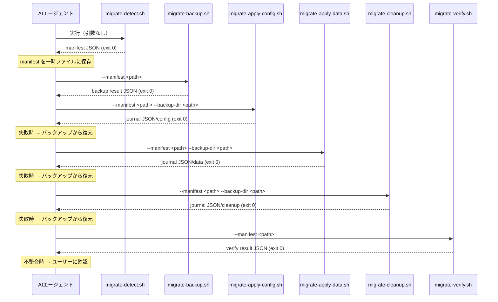

# 論理設計: v1→v2移行スキル

## 概要

v1→v2移行処理のコンポーネント構成、スクリプトインターフェース、処理フローを定義する。

**重要**: この論理設計では**コードは書かず**、コンポーネント構成とインターフェース定義のみを行います。

## アーキテクチャパターン

オーケストレータ + 補償可能ステップパターンを採用。AIエージェント（ステップファイル）がオーケストレータとして状態遷移・分岐・補償処理を制御し、各スクリプトは補償可能な独立ステップとして動作する。

選定理由:
- 各フェーズが独立しており、個別にテスト・ロールバック可能
- manifest を介した疎結合な連携
- AI-DLC の既存スクリプト群（read-config.sh, write-history.sh 等）と同じパターン
- オーケストレータ（AIエージェント）が分岐・補償判断を担い、スクリプトは副作用実行に専念

## コンポーネント構成

### レイヤー / モジュール構成

```text
skills/aidlc/
├── steps/migrate/          # オーケストレーション層
│   ├── 01-preflight.md     # 検出・バックアップ指示
│   ├── 02-execute.md       # 適用・クリーンアップ指示
│   └── 03-verify.md        # 検証・完了指示
├── scripts/                # 実処理層
│   ├── migrate-detect.sh       # v1検出・manifest生成
│   ├── migrate-backup.sh       # バックアップ作成
│   ├── migrate-apply-config.sh # config.toml更新
│   ├── migrate-apply-data.sh   # データ移行
│   ├── migrate-cleanup.sh      # v1痕跡削除
│   └── migrate-verify.sh       # 移行後検証
└── SKILL.md                # ルーティング（migrate引数追加）

examples/kiro/              # サンプル配布物
├── README.md
└── agents/aidlc.json
```

### コンポーネント詳細

#### steps/migrate/01-preflight.md
- **責務**: AIエージェントに検出・バックアップの手順を指示
- **依存**: migrate-detect.sh, migrate-backup.sh
- **公開インターフェース**: なし（AIエージェント向けプロンプト）

#### steps/migrate/02-execute.md
- **責務**: AIエージェントに適用・クリーンアップの手順を指示
- **依存**: migrate-apply-config.sh, migrate-apply-data.sh, migrate-cleanup.sh
- **公開インターフェース**: なし

#### steps/migrate/03-verify.md
- **責務**: AIエージェントに検証・完了メッセージの手順を指示
- **依存**: migrate-verify.sh
- **公開インターフェース**: なし

## スクリプトインターフェース設計

### migrate-detect.sh

#### 概要
v1環境を検出し、移行計画（manifest JSON）を生成する。所有権判定もこのスクリプトが担当。

#### 引数
| 引数 | 必須/任意 | 説明 |
|------|----------|------|
| なし | - | 引数なし。カレントディレクトリのプロジェクトを検査 |

#### 成功時出力（exit 0）
```text
stdout: manifest JSON（計画書のmanifest JSONスキーマに準拠）
  - status="v1_detected": v1環境検出、resources は非空（移行対象あり）
  - status="already_v2": v2環境、resources は必ず空配列
stderr: 検出プロセスの診断メッセージ
```
オーケストレータは JSON の `status` フィールドで分岐する。`already_v2` なら「移行不要」メッセージを表示して終了、`v1_detected` なら移行続行。

#### エラー時出力（exit 2）
```text
stdout: なし
stderr: エラー詳細
```

#### 所有権判定ロジック（検証結果は manifest の各 resource の `ownership_evidence` に記録）
- シンボリックリンク: `readlink` でリンク先を取得し、`docs/aidlc/` を含むか判定。method="symlink_target"
- 実体ファイル（file_kiro, github_template）: SHA256ハッシュをスターターキット原本と比較。method="content_hash"。不一致（ユーザー編集済み）の場合はmanifestに含めない
- ハッシュ原本: スクリプト内に既知ハッシュをハードコード（バージョンごとに更新）
- 各 resource の `ownership_evidence` に `{method, is_owned, expected_hash, actual_hash}` を記録。cleanup/verify が検出時の判断根拠を参照可能

### migrate-backup.sh

#### 概要
manifest に含まれる全リソースのバックアップを作成する。

#### 引数
| 引数 | 必須/任意 | 説明 |
|------|----------|------|
| `--manifest` | 必須 | manifest JSONファイルのパス |

#### 成功時出力（exit 0）
```text
stdout: backup result JSON
  - backup_dir: バックアップディレクトリパス（後続スクリプトに --backup-dir で渡す）
  - files: バックアップ済みファイル一覧（各エントリに source と backup のパス）
stderr: バックアップ処理の診断メッセージ
```

#### エラー時出力（exit 2）
```text
stdout: なし
stderr: エラー詳細
```

### migrate-apply-config.sh

#### 概要
config.toml のパス参照を更新する。

#### 引数
| 引数 | 必須/任意 | 説明 |
|------|----------|------|
| `--manifest` | 必須 | manifest JSONファイルのパス |
| `--backup-dir` | 必須 | バックアップディレクトリパス（失敗時のリストアに使用） |

#### 成功時出力（exit 0）
```text
stdout: journal JSON（phase: "config"）
stderr: 適用処理の診断メッセージ
```

#### エラー時出力（exit 2）
```text
stdout: なし
stderr: エラー詳細
```

### migrate-apply-data.sh

#### 概要
cycles配下のデータ（rules.md, operations.md, backlog.md）を移行する。

#### 引数
| 引数 | 必須/任意 | 説明 |
|------|----------|------|
| `--manifest` | 必須 | manifest JSONファイルのパス |
| `--backup-dir` | 必須 | バックアップディレクトリパス（失敗時のリストアに使用） |

#### 成功時出力（exit 0）
```text
stdout: journal JSON（phase: "data"、各エントリのstatusで成功/スキップ/エラーを表現）
stderr: 移行処理の診断メッセージ
```
オーケストレータはJSONの各エントリの `status` で部分失敗を判定する。

#### エラー時出力（exit 2）
```text
stdout: なし
stderr: エラー詳細
```

### migrate-cleanup.sh

#### 概要
manifest に宣言済みのv1痕跡リソースを削除する。自身では所有権判定を行わない。journal互換の変更記録を返す。

#### 引数
| 引数 | 必須/任意 | 説明 |
|------|----------|------|
| `--manifest` | 必須 | manifest JSONファイルのパス |
| `--backup-dir` | 必須 | バックアップディレクトリパス（失敗時のリストアに使用） |

#### 成功時出力（exit 0）
```text
stdout: journal JSON（phase: "cleanup"、各エントリのstatusで成功/スキップ/エラーを表現）
stderr: 削除処理の診断メッセージ
```
オーケストレータはJSONの各エントリの `status` で一部スキップを判定する。journal 形式で統一することで、ロールバック時の入力契約が apply と同一になる。

#### エラー時出力（exit 2）
```text
stdout: なし
stderr: エラー詳細
```

### migrate-verify.sh

#### 概要
manifest の期待状態と実際のファイルシステム状態を比較検証する。

#### 引数
| 引数 | 必須/任意 | 説明 |
|------|----------|------|
| `--manifest` | 必須 | manifest JSONファイルのパス |

#### 成功時出力（exit 0）
```text
stdout: verify result JSON（overall: "ok" または "fail"、各checkのstatusで詳細表現）
stderr: 検証処理の診断メッセージ
```
オーケストレータはJSONの `overall` フィールドで分岐する。

#### エラー時出力（exit 2）
```text
stdout: なし
stderr: エラー詳細
```

## 処理フロー概要

### 移行フロー



### 冪等性フロー

1. `migrate-detect.sh` を実行（exit 0）
2. JSON の `status` が `already_v2` の場合 → 「移行不要」メッセージを表示して終了
3. `status` が `v1_detected` の場合 → resources は必ず非空。移行続行

### 終了コードとエラーハンドリング方針

全スクリプト共通の終了コード定義:

| 終了コード | 意味 | JSON出力 | オーケストレータの動作 |
|-----------|------|---------|---------------------|
| 0 | 実行完了（部分スキップ含む） | あり | JSON の status/overall で詳細判定 |
| 2 | 実行不能（前提条件未達等） | なし | stderr を確認し、バックアップから復元 |

**exit 0 時の部分失敗**: journal の各エントリに `status: "error"` が含まれる場合、オーケストレータが部分失敗と判定しロールバックを実行する。exit 0 は「スクリプト自体は正常に完了した」ことを意味し、個別リソースの処理結果は JSON で表現する。

### ロールバックフロー

**復元方式**: オーケストレータ（AIエージェント）が backup result JSON の `files` 一覧を参照し、各エントリの `backup` パスから `source` パスへファイルをコピーして復元する。専用の復元スクリプトは設けず、オーケストレータが `cp` コマンドで直接実行する（ファイル数が少なく、AIエージェントの判断で復元範囲を制御できるため）。

**復元の入力契約**:
- backup result JSON の `files[].backup` → `files[].source` へコピー
- 失敗フェーズまでの全 journal の `applied[]` で `status: "success"` のエントリに対応するリソースを累積し、復元対象とする

**フェーズ別フロー**:
1. apply-config 失敗（exit 2、または journal に error エントリ） → config journal の成功エントリを復元 → 中断
2. apply-data 失敗（exit 2、または journal に error エントリ） → config journal + data journal の成功エントリを累積して復元 → 中断
3. cleanup 失敗（exit 2、または journal に error エントリ） → config journal + data journal + cleanup journal の成功エントリを累積して復元 → ユーザーに確認
4. verify 不整合（overall: "fail"） → ユーザーに手動確認を依頼（自動ロールバックは不実施）

## 非機能要件（NFR）への対応

### セキュリティ
- **要件**: 移行対象外のファイルを変更しないこと
- **対応策**: allowlist方式 + 内容ハッシュ検証。manifest に宣言されていないファイルは一切操作しない

### 可用性
- **要件**: 移行途中で失敗した場合に復旧可能であること
- **対応策**: バックアップからのリストア。各フェーズ（config/data/cleanup）が独立しており、失敗箇所の特定と復元が容易

## 技術選定

- **言語**: Bash (POSIX互換 + jq)
- **依存コマンド**: jq（JSON処理）、readlink（シンボリックリンク解決）、sha256sum/shasum（ハッシュ検証）
- **テンプレート**: 既存スクリプト群（read-config.sh等）のパターンに準拠

## 実装上の注意事項

- jq が未インストールの場合のフォールバック: awk/sed ベースの簡易JSONパースか、エラーメッセージで jq インストールを案内
- sha256sum は macOS では `shasum -a 256` を使用（クロスプラットフォーム対応）
- manifest 一時ファイルは `mktemp` で生成し、使用後に削除

## JSONスキーマのバージョニング方針

manifest JSON には `version` フィールドが存在し、スキーマの後方互換性を管理する。journal / backup result / verify result については、v1→v2のワンタイム移行ツールであり、スクリプト間の内部契約として使用されるため、個別のスキーマバージョンは持たない。将来の移行（v2→v3等）が必要になった場合は、manifest の `version` をインクリメントし、新バージョンのスクリプト群を作成する。

## 不明点と質問（設計中に記録）

なし
