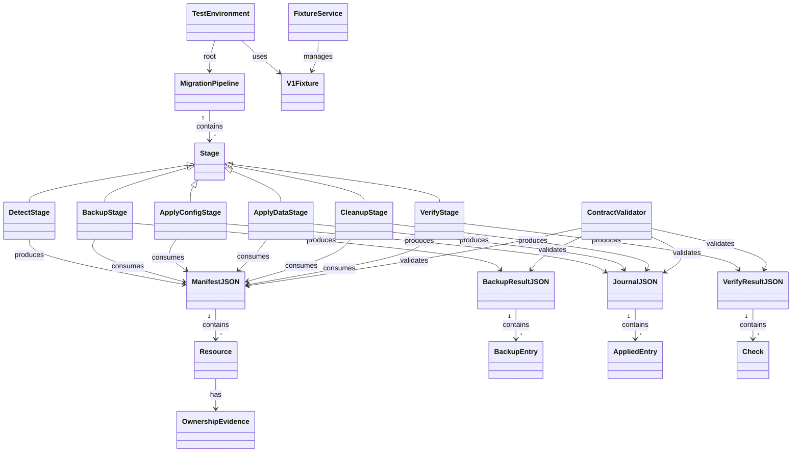

# ドメインモデル: v1→v2移行スクリプトE2Eテスト

## 概要

v1→v2移行パイプライン（detect→backup→apply-config→apply-data→cleanup→verify）の各スクリプトおよび一連フローをbats-coreでテストするためのドメインモデル。テスト対象スクリプトの入出力契約・状態遷移・依存関係を定義する。

**重要**: このドメインモデル設計では**コードは書かず**、構造と責務の定義のみを行います。

## 設計判断の記録

### 終了コード規約との整合性

既存の終了コード規約（`docs/aidlc/guides/exit-code-convention.md`）では `0: 成功 / 1: バリデーションエラー / 2: システムエラー` の3段階を定義している。現行の移行スクリプト群は `0/2` のみ使用しているが、テスト設計では規約準拠の `0/1/2` を前提とし、将来のスクリプト改善時にテストが足かせにならないようにする。

### config_update の移行対象

`.aidlc/config.toml` 内の `docs/aidlc` パス参照は v1→v2 移行で `skills/aidlc` に書き換える必要がある。これは migrate-apply-config.sh の実装済み機能であり、テストはその動作を検証する。移行ガイド（`docs/aidlc/guides/migration-v1-to-v2.md`）でconfig.toml変更不要と読める記述があるが、パス参照の更新はスクリプトが自動的に行うためユーザーの手動変更は不要という意味であり、テスト設計とは矛盾しない。

## エンティティ（Entity）

### MigrationPipeline（移行パイプライン）

テスト対象の移行フロー全体を表す。

- **属性**:
  - stages: Stage[] - パイプラインを構成するステージの順序付きリスト（detect→backup→apply-config→apply-data→cleanup→verify）
  - projectRoot: Path - テスト用一時ディレクトリ（AIDLC_PROJECT_ROOT）
- **振る舞い**:
  - execute(): 全ステージを順序通り実行し、各ステージのJSON出力を次に引き渡す

### ステージ種別と入出力契約

各ステージはスクリプトに対応し、固有の入出力契約を持つ。

| ステージ | スクリプト | 入力 | 出力 | 必須引数 | 終了コード |
|---------|-----------|------|------|---------|-----------|
| DetectStage | migrate-detect.sh | v1ファイルシステム | ManifestJSON | なし | 0/2 |
| BackupStage | migrate-backup.sh | ManifestJSON | BackupResultJSON | --manifest | 0/2 |
| ApplyConfigStage | migrate-apply-config.sh | ManifestJSON + backup_dir | JournalJSON(config) | --manifest --backup-dir | 0/2 |
| ApplyDataStage | migrate-apply-data.sh | ManifestJSON + backup_dir | JournalJSON(data) | --manifest --backup-dir | 0/2 |
| CleanupStage | migrate-cleanup.sh | ManifestJSON + backup_dir | JournalJSON(cleanup) | --manifest --backup-dir | 0/2 |
| VerifyStage | migrate-verify.sh | ManifestJSON | VerifyResultJSON | --manifest | 0/2 |

**注**: 現行スクリプトは終了コード0/2のみ使用。テストでは0/2を検証するが、将来の規約準拠（0/1/2）に備え、終了コード1のテストケースも設計に含める（現時点ではskipアノテーション付き）。

## 値オブジェクト（Value Object）

### ManifestJSON

migrate-detect.shが生成するv1環境検出結果。後続ステージの入力として消費される。

- **属性**:
  - version: int（固定: 1）
  - status: "v1_detected" | "already_v2"
  - detected_at: ISO8601 datetime
  - source_version: "v1"
  - target_version: "v2"
  - resources: Resource[]
- **不変性**: detectステージの出力として一度生成されたら変更されない
- **等価性**: version + status + resources の内容で判定

### Resource

ManifestJSON内の個別リソース。

- **属性**:
  - resource_type: string（symlink_agents / symlink_kiro / file_kiro / backlog_dir / github_template / config_update / data_migration）
  - path: string
  - action: "delete" | "update" | "migrate"
  - condition: string | null（リソース固有の条件。例: backlog_dirの "backlog_mode deprecated (v2.0.3)"）
  - ownership_evidence: OwnershipEvidence | null

### OwnershipEvidence

リソースのスターターキット所有権を示すエビデンス。

- **属性**:
  - method: "symlink_target" | "content_hash" | "known_filename"
  - is_owned: boolean
  - expected_hash: string | null
  - actual_hash: string | null

### BackupResultJSON

migrate-backup.shが生成するバックアップ結果。後続ステージにbackup_dirを提供する。

- **属性**:
  - backup_dir: string（バックアップディレクトリの絶対パス）
  - files: BackupEntry[]

### BackupEntry

BackupResultJSON内の個別バックアップ結果。

- **属性**:
  - source: string（元ファイルの相対パス）
  - backup: string（バックアップ先の絶対パス）

### JournalJSON

apply-config / apply-data / cleanup が生成する適用結果。

- **属性**:
  - phase: "config" | "data" | "cleanup"
  - applied: AppliedEntry[]

### AppliedEntry

JournalJSON内の個別適用結果。

- **属性**:
  - resource_type: string
  - path: string
  - status: "success" | "skipped" | "error"
  - detail: string

### VerifyResultJSON

migrate-verify.shが生成する検証結果。

- **属性**:
  - checks: Check[]
  - overall: "ok" | "fail"

### Check

VerifyResultJSON内の個別検証チェック。

- **属性**:
  - name: "config_paths" | "v1_artifacts_removed" | "data_migrated"
  - status: "ok" | "fail"
  - detail: string

### V1Fixture

テスト用v1構造を表すfixture定義。

- **属性**:
  - symlinks: Map<Path, TargetPath> - シンボリックリンク群
  - files: Map<Path, Content> - 実体ファイル群（ハッシュ一致が必要なものを含む）
  - directories: Path[] - ディレクトリ群
  - configFiles: Map<Path, Content> - 設定ファイル群（docs/aidlc参照あり）
  - dataFiles: Map<Path, Content> - データファイル群（docs/aidlc参照あり）

## 集約（Aggregate）

### TestEnvironment（テスト環境）

- **集約ルート**: MigrationPipeline
- **含まれる要素**: V1Fixture, ManifestJSON, BackupResultJSON, JournalJSON, VerifyResultJSON
- **境界**: 1つのテスト実行に必要な全状態（一時ディレクトリ + fixture + JSON中間出力）
- **不変条件**:
  - AIDLC_PROJECT_ROOT は一時ディレクトリを指す（実プロジェクトを汚染しない）
  - 各テスト間でファイルシステム状態が独立（テスト間干渉なし）
  - テスト完了後に一時ディレクトリが確実にクリーンアップされる

## ドメインサービス

### FixtureService

- **責務**: v1構造fixtureの展開と管理
- **操作**:
  - setup_v1_structure(tmpdir): 一時ディレクトリにv1構造を展開
  - setup_already_v2_structure(tmpdir): v2構造（v1アーティファクトなし）を展開
  - cleanup(tmpdir): 一時ディレクトリを削除

### ContractValidator

- **責務**: JSON出力の契約検証
- **操作**:
  - validate_manifest(json): ManifestJSON構造の検証
  - validate_backup_result(json): BackupResultJSON構造の検証
  - validate_journal(json, phase): JournalJSON構造の検証
  - validate_verify_result(json): VerifyResultJSON構造の検証

## ドメインモデル図

## ユビキタス言語

- **manifest**: migrate-detect.shの出力。v1環境で検出されたリソースの一覧
- **backup_result**: migrate-backup.shの出力。バックアップディレクトリとファイル一覧
- **journal**: apply-*/cleanupの出力。適用結果の記録
- **resource**: manifestに含まれる個別のv1アーティファクト（シンボリックリンク、ファイル、ディレクトリ等）
- **resource_type**: リソースの種別（symlink_agents, file_kiro, config_update等の8種類）
- **ownership_evidence**: リソースがスターターキット由来であることの証拠（ハッシュ一致、シンボリックリンク先等）
- **condition**: リソース固有の条件文字列（例: backlog_dirの廃止理由）
- **fixture**: テスト用に再現したv1ディレクトリ構造
- **contract**: 各スクリプトのJSON入出力の構造仕様
