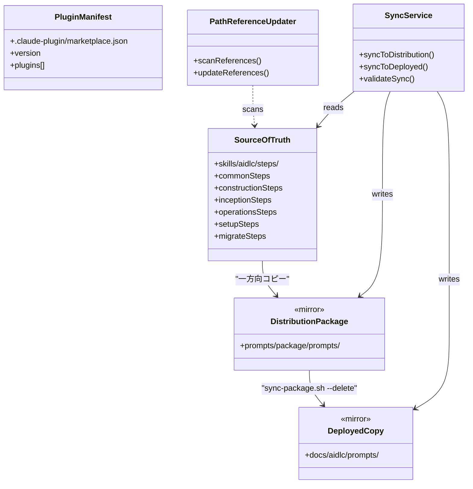

# ドメインモデル: プラグインディレクトリ構造構築

## 概要

AI-DLCスターターキットのファイル配置と同期関係を定義する。`skills/aidlc/steps/` を唯一の正本とし、配布パッケージ（`prompts/package/prompts/`）と利用側（`docs/aidlc/prompts/`）への一方向同期を確立する。

**重要**: このドメインモデル設計では**コードは書かず**、構造と責務の定義のみを行います。

## スコープ

### In Scope（Unit 001）

- 正本（`skills/aidlc/steps/`）→ ミラー（`prompts/package/prompts/`）→ 利用側（`docs/aidlc/prompts/`）の同期経路確立
- 旧モノリシックパス参照の棚卸しと更新（全配布物・ガイド・セットアッププロンプト対象）
- marketplace.json のバージョン更新

### Out of Scope

- SKILL.md の意味変更・ARGUMENTSパーシング仕様変更 → Unit 002
- v1残存資産の全面削除（rsync処理本体、defaults.tomlパス修正、スターターキットパス判定）→ Unit 003
- レビュー系スキルの仕様変更 → 対象外

## エンティティ

### SourceOfTruth（正本ディレクトリ）

- **パス**: `skills/aidlc/steps/`
- **属性**:
  - commonSteps: ディレクトリ - 全フェーズ共通のステップファイル群（15ファイル）
  - constructionSteps: ディレクトリ - Construction Phase ステップファイル群（4ファイル）
  - inceptionSteps: ディレクトリ - Inception Phase ステップファイル群（6ファイル）
  - operationsSteps: ディレクトリ - Operations Phase ステップファイル群（5ファイル）
  - setupSteps: ディレクトリ - Setup Phase ステップファイル群（3ファイル）
  - migrateSteps: ディレクトリ - Migration ステップファイル群（3ファイル）
- **振る舞い**:
  - ファイル編集は常にここで行う
  - 他の場所への変更は禁止（一方向同期の起点）

### DistributionPackage（配布パッケージ）

- **パス**: `prompts/package/prompts/`
- **属性**:
  - stepTree: ディレクトリ群 - SourceOfTruth のステップツリーのミラー（common/, construction/, inception/, operations/, setup/, migrate/）
  - configFiles: ファイル群 - AGENTS.md, CLAUDE.md（付帯設定ファイル、ステップツリーとは別管理）
- **振る舞い**:
  - stepTree は SourceOfTruth からの一方向コピーで更新される（生成物）
  - configFiles は skills/aidlc/ からの一方向コピーで更新される
  - 手動編集禁止

### DeployedCopy（利用側コピー）

- **パス**: `docs/aidlc/prompts/`
- **属性**:
  - 構造は DistributionPackage と同一
- **振る舞い**:
  - `sync-package.sh --delete` による DistributionPackage からの同期で更新される
  - 手動編集禁止（rsyncコピー先）

### PluginManifest（プラグインマニフェスト）

- **パス**: `.claude-plugin/marketplace.json`
- **属性**:
  - name: String - プラグイン名
  - version: String - バージョン番号
  - plugins: Array - スキル一覧
- **振る舞い**:
  - バージョンはサイクルに合わせて更新

## 値オブジェクト

### StepFile（ステップファイル）

- **属性**: path: String - ファイルパス、content: String - Markdown内容
- **不変性**: 同一パスのファイルは正本・ミラー間で内容が同一であるべき
- **等価性**: パスとコンテンツの完全一致

### PathReference（パス参照）

- **属性**: sourceFile: String - 参照元ファイル、targetPath: String - 参照先パス
- **不変性**: 参照先が実在するパスであること
- **等価性**: sourceFile + targetPath の一致

## 集約

### PluginRepository（プラグインリポジトリ構造）

- **集約ルート**: SourceOfTruth
- **含まれる要素**: DistributionPackage, DeployedCopy, PluginManifest
- **境界**: リポジトリ全体のファイル配置と参照整合性
- **不変条件**:
  - SourceOfTruth → DistributionPackage → DeployedCopy の一方向同期
  - 全 PathReference の参照先が実在すること
  - PluginManifest のスキル一覧が `skills/` 配下と一致すること

## ドメインサービス

### SyncService（同期サービス）

- **責務**: 正本から配布パッケージ・利用側への一方向同期
- **操作**:
  - syncToDistribution: SourceOfTruth → DistributionPackage のファイルコピー
  - syncToDeployed: DistributionPackage → DeployedCopy の同期（`sync-package.sh --delete` **必須**。削除伝播なしではミラー整合性が崩れるため）
  - validateSync: 同期後の差分がゼロであることを検証

### PathReferenceUpdater（パス参照更新サービス）

- **責務**: 旧モノリシックパス参照を新モジュラーパスに更新
- **対象カテゴリ**（配布物・利用者向け参照を持つ全ファイル）:
  - `prompts/package/guides/` - 配布パッケージのガイド群
  - `prompts/package/prompts/` - 配布パッケージのプロンプト群（操作後）
  - `prompts/setup-prompt.md` - セットアッププロンプト
  - `README.md` - リポジトリルートのREADME
  - `docs/aidlc/guides/` - sync-package.sh で自動反映されるが、同期前に prompts/package/ 側を修正
- **操作**:
  - scanReferences: 上記対象カテゴリ全体で旧パスを参照しているファイルを検出
  - updateReferences: 旧パス → 新パスの置換

## ドメインモデル図

## ユビキタス言語

- **正本（Source of Truth）**: `skills/aidlc/steps/` - すべての編集はここで行う
- **配布パッケージ（Distribution Package）**: `prompts/package/prompts/` - 正本のミラー、外部プロジェクトへの配布元
- **利用側コピー（Deployed Copy）**: `docs/aidlc/prompts/` - 配布パッケージの同期コピー
- **モノリシックファイル**: v1の単一ファイル形式（例: `construction.md`）
- **モジュラーステップファイル**: v2の分割ファイル形式（例: `construction/01-setup.md`）
- **パス参照**: ドキュメント内の他ファイルへのリンクまたはパス文字列

## 不明点と質問

（設計時点での不明点なし。計画承認済みのため構造は確定）
