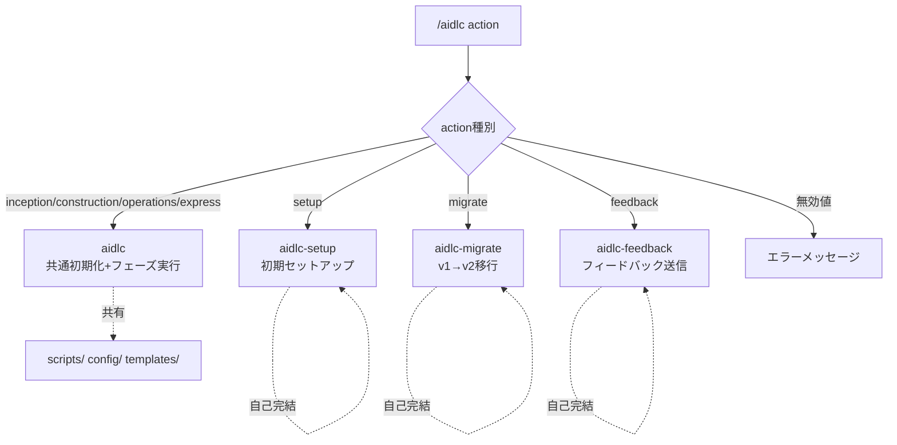

# ドメインモデル: スキル分離

## 概要

AI-DLCスキルの構造的分離。setup/migrate/feedbackを親スキルから独立させ、各スキルが自己完結するアーキテクチャに変更する。

**重要**: このドメインモデルではコードは書かず、スキル間の構造と責務の定義のみを行う。

## エンティティ

### aidlc（親スキル）
- **ID**: skills/aidlc/
- **属性**:
  - SKILL.md: プロンプト定義 - ルータ兼フェーズ実行ファサード
  - steps/common/: 共通ステップファイル - フェーズ横断で使用
  - steps/inception/: Inceptionステップ
  - steps/construction/: Constructionステップ
  - steps/operations/: Operationsステップ
  - scripts/: 共有スクリプト群（read-config.sh等）
  - config/: 設定ファイル（defaults.toml等）
  - templates/: テンプレートファイル群
- **振る舞い**:
  - ARGUMENTSパーシング: action + additional_contextを抽出
  - action検証: 有効値チェック、無効値時エラー出力
  - フェーズ実行: inception/construction/operations/expressの共通初期化+ステップ実行
  - 委譲: setup/migrate/feedbackを独立スキルにルーティング

### aidlc-setup（初期セットアップスキル）
- **ID**: skills/aidlc-setup/
- **属性**:
  - SKILL.md: スキル定義 - 初期セットアップフロー
  - steps/: セットアップステップファイル（01-detect, 02-generate-config, 03-migrate）
  - scripts/: setup専用スクリプト（init-labels.sh, setup-ai-tools.sh, migrate-backlog.sh, migrate-config.sh, read-version.sh）
  - templates/: セットアップ時のファイル生成テンプレート（config.toml.template, rules_template.md, operations_handover_template.md）
  - version.txt: バージョンファイル
- **振る舞い**:
  - 環境検出: config.toml存在チェック、v1環境検出
  - 設定生成: プロジェクト情報推論、config.toml生成
  - AIツールセットアップ: KiroCLI/Claude Code設定
- **内部依存**: なし（親スキルへの依存ゼロ）
- **実行時外部依存**: dasel（config.toml生成時）、git（リポジトリ操作）

### aidlc-migrate（v1→v2移行スキル）
- **ID**: skills/aidlc-migrate/
- **属性**:
  - SKILL.md: スキル定義 - v1→v2移行フロー
  - steps/: 移行ステップファイル（01-preflight, 02-execute, 03-verify）
  - scripts/: migrate専用スクリプト（migrate-detect.sh, migrate-apply-config.sh, migrate-apply-data.sh, migrate-cleanup.sh, migrate-verify.sh）
- **振る舞い**:
  - プリフライト: 未コミット変更チェック、v1環境検出
  - 移行実行: config移行、データ移行、クリーンアップ
  - 検証: 移行成功確認
- **内部依存**: なし（親スキルへの依存ゼロ）
- **実行時外部依存**: git（ブランチ操作、ファイル移行）

### aidlc-feedback（フィードバック送信スキル）
- **ID**: skills/aidlc-feedback/
- **属性**:
  - SKILL.md: スキル定義 - フィードバック送信フロー
  - steps/feedback.md: フィードバックステップ
- **振る舞い**:
  - 設定確認: .aidlc/config.tomlから `rules.feedback.enabled` を直接読み取り（dasel使用）
  - ヒアリング: フィードバック内容収集
  - Issue作成: GitHub CLI経由またはURL案内
- **内部依存**: なし（親スキルへの依存ゼロ。read-config.sh依存をdasel直接呼び出しに置換）
- **実行時外部依存**: dasel（設定読み取り、フォールバックあり）、gh CLI（Issue作成、フォールバックあり）

## 集約

### スキルファミリー集約
- **集約ルート**: aidlc（親スキル）
- **含まれる要素**: aidlc-setup, aidlc-migrate, aidlc-feedback（独立エンティティとして参照）
- **境界**: `/aidlc` コマンドからの到達範囲
- **不変条件**:
  - 親スキルはフェーズ系actionを自身で処理する
  - 独立フロー系actionは対応する独立スキルに委譲する
  - 独立スキルから親スキル配下のステップファイル・スクリプトへの参照がない

## ドメインサービス

### ルーティングサービス（SKILL.md内のARGUMENTSパーシング）
- **責務**: actionに基づくスキル選択と委譲
- **操作**:
  - parseArguments(args) → {action, additional_context}（additional_contextは単一の生文字列。パース・変換せずそのまま透過する）
  - validateAction(action) → 有効/無効
  - routeAction(action) → 自身で実行 or 独立スキルに委譲（委譲時は指示出力のみ。成功/失敗の検出はAIエージェント層の責務）

## ドメインモデル図

## ユビキタス言語

- **親スキル**: `skills/aidlc/` - フェーズ実行とルーティングの両責務を持つファサード
- **独立スキル**: `skills/aidlc-{name}/` - 親スキルから委譲された独立フローを自己完結で実行
- **フェーズ系action**: inception/construction/operations/express - 共通初期化フローを使用
- **独立フロー系action**: setup/migrate/feedback - 共通初期化フローを使用しない
- **委譲**: 親スキルが独立スキルの実行を案内する（Skillツール呼び出し）
- **自己完結**: 独立スキルが親スキル配下のファイル・スクリプトに依存しない状態
