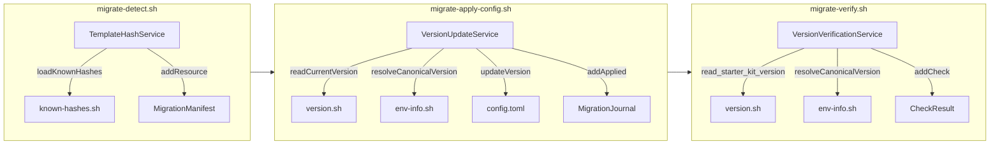

# ドメインモデル: マイグレーションフロー修正

## 概要

aidlc-migrateスキルのマイグレーションパイプライン（detect → apply → verify）における、starter_kit_version更新とIssueテンプレートハッシュ比較の責務・情報フローを定義する。

**重要**: このドメインモデル設計では**コードは書かず**、構造と責務の定義のみを行います。

## エンティティ（Entity）

### MigrationManifest
- **ID**: マイグレーション実行セッション（一時ファイルとして永続化）
- **属性**:
  - resources: Resource[] - 検出されたマイグレーション対象リソースのリスト
- **振る舞い**:
  - addResource(resource) - リソースをmanifestに追加
  - getByType(type) - リソース種別でフィルタ

### MigrationJournal
- **ID**: フェーズ単位のジャーナル（JSON出力）
- **属性**:
  - phase: string - 実行フェーズ名（"config"等）
  - applied: AppliedEntry[] - 適用結果のリスト
- **振る舞い**:
  - addApplied(entry) - 適用結果を記録

## 値オブジェクト（Value Object）

### Resource
- **属性**:
  - resource_type: string - リソース種別（"issue_template", "config_content_migrate"等）
  - path: string - ファイルパス
  - action: string - 操作種別（"delete", "confirm_delete"）
  - ownership_evidence: OwnershipEvidence - 所有権判定の証拠
- **不変性**: 検出時に確定し、以降変更しない
- **等価性**: pathで一意

### OwnershipEvidence
- **属性**:
  - method: string - 判定方法（"known_filename", "hash_comparison"）
  - is_owned: boolean|null - スターターキット由来か（trueなら自動削除可、falseならユーザー編集済み、nullは判定不能）
  - expected_hash: string|null - 既知ハッシュ値（期待値）
  - actual_hash: string|null - 実ファイルのハッシュ値
- **不変性**: 検出時に確定
- **等価性**: 全属性の組み合わせ

### CanonicalVersion
- **属性**:
  - version: string - スターターキットの正規バージョン文字列（SemVer）
- **不変性**: version.txt（配布側メタデータ）から取得した時点で確定。env-info.shはconfig.tomlを読み返すだけのため使用しない
- **等価性**: version文字列の完全一致

## 集約（Aggregate）

### MigrationPipeline
- **集約ルート**: MigrationManifest
- **含まれる要素**: Resource[], OwnershipEvidence, MigrationJournal
- **境界**: detect → apply → verify の3フェーズ全体
- **不変条件**:
  - version更新はconfig migration成功を前提とする
  - verify時の期待値はapply時に使用したcanonical versionと同一であること

## ドメインサービス

### VersionUpdateService
- **責務**: starter_kit_versionの更新とその前提条件チェック
- **操作**:
  - readCurrentVersion(configPath) → CanonicalVersion - version.shのread_starter_kit_version()を使用
  - resolveCanonicalVersion() → CanonicalVersion - version.txt（配布側メタデータ）からcanonical versionを取得
  - updateVersion(configPath, canonicalVersion) - daselでconfig.tomlを更新
  - shouldUpdate(migrationResult) → boolean - migrate-config.sh成功時のみtrue

### TemplateHashService
- **責務**: Issueテンプレートの所有権判定（ハッシュ比較）
- **操作**:
  - loadKnownHashes() → Map<filename, hash> - config/known-hashes.shから既知ハッシュを読み込み
  - computeActualHash(filePath) → string - 既存の _sha256() 関数（sha256sum/shasumフォールバック）でファイルハッシュを計算
  - compareHash(expected, actual) → OwnershipEvidence - ハッシュ比較結果をevidenceとして返す

### VersionVerificationService
- **責務**: starter_kit_versionが正しく更新されたことの検証
- **操作**:
  - verify(configPath, canonicalVersion) → CheckResult - canonical versionとの完全一致検証

## ドメインモデル図

## ユビキタス言語

- **canonical version**: env-info.shが報告するスターターキットの正規バージョン。マイグレーション後にconfig.tomlが持つべき値
- **known hash**: v1テンプレートの既知SHA256ハッシュ値。スターターキットが配布した原本のハッシュ
- **ownership evidence**: ファイルがスターターキット由来か否かの判定証拠（ハッシュ比較結果）
- **journal**: migrate-apply-*.shが出力する適用結果のJSON記録
- **manifest**: migrate-detect.shが出力する検出結果のJSONリスト
