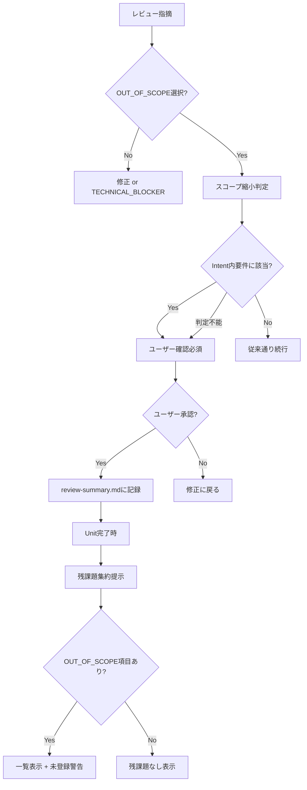

# ドメインモデル: スコープ管理強化

## 概要

レビュー指摘対応時のスコープ縮小をユーザー確認必須化し、Unit完了時に残課題（OUT_OF_SCOPE項目）を可視化するためのドメインコンセプト定義。本Unitはプロンプトファイルの修正のみであり、コード実装は伴わない。

**重要**: このドメインモデル設計では**コードは書かず**、構造と責務の定義のみを行います。

## ドメインコンセプト

### スコープ保護ルール（Scope Protection Rule）

- **定義**: Intentの「含まれるもの」に記載された要件を制限・除外する判断に対して、ユーザー確認を必須とするルール
- **適用条件**: `automation_mode` に関わらず常時適用（semi_auto/expressモードでも例外なし）
- **トリガー**: レビュー指摘対応でOUT_OF_SCOPEを選択する時点
- **判定入力**:
  - 参照元: `.aidlc/cycles/{{CYCLE}}/requirements/intent.md` の「含まれるもの」セクション
  - 比較対象: 指摘対象の機能・要件
  - 曖昧時: ユーザー確認へフォールバック

### スコープ縮小判定（Scope Reduction Detection）

- **責務**: OUT_OF_SCOPE選択時に、対象がIntent内要件に該当するかを判定する
- **配置先**: review-flow.mdの「指摘対応判断フロー」内（OUT_OF_SCOPEの実行ポイント）
- **判定結果**:
  - Intent内要件に該当 → ユーザー確認必須
  - Intent外の要件 → 従来通り（理由バリデーション後に続行）
  - 判定不能（Intentが曖昧/未記載） → ユーザー確認へフォールバック

### 残課題集約（Remaining Issues Aggregation）

- **責務**: Unit完了時にreview-summary.mdからOUT_OF_SCOPE項目を集約し可視化する
- **配置先**: 04-completion.mdのUnit完了時必須作業
- **データソース**: 当該Unitの全review-summary.mdの全Set
- **抽出条件**: 「対応」列が `OUT_OF_SCOPE(` で始まる行
- **表示項目**: 指摘内容 + 対応理由 + バックログ列（`#NNN` / `PENDING_MANUAL` / `SECURITY_PRIVATE`）
- **警告条件**: バックログ列が `PENDING_MANUAL` の場合に未登録警告を表示

## ドメインモデル図

## ユビキタス言語

- **スコープ縮小**: Intentの「含まれるもの」に記載された要件を制限・除外すること
- **スコープ保護**: スコープ縮小に対するユーザー確認の強制
- **残課題**: OUT_OF_SCOPEとしてスコープから除外された指摘項目
- **Intent内要件**: `.aidlc/cycles/{{CYCLE}}/requirements/intent.md` の「含まれるもの」セクションに列挙された要件

## 不明点と質問（設計中に記録）

特になし（Issue #497, #498 の要件が明確）
