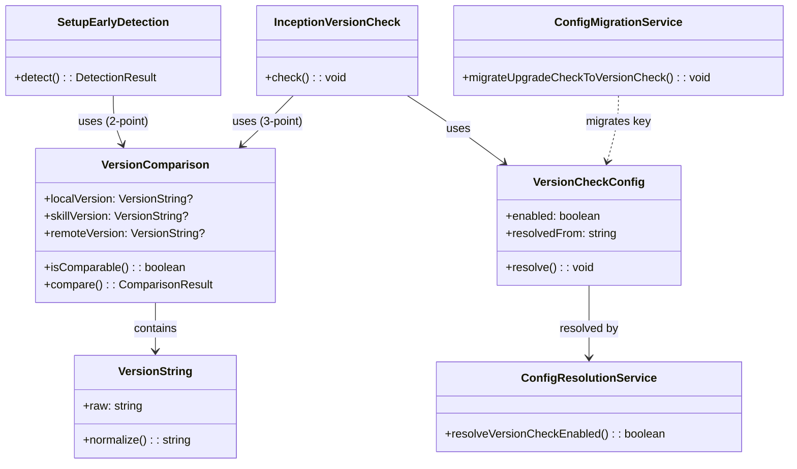

# ドメインモデル: バージョンチェック改善・setup早期判定改修

## 概要

バージョンチェック機能の設定キーを`upgrade_check`から`version_check`にリネームしデフォルト有効化すること、およびsetupスキルの早期判定にバージョン比較を追加してアップグレードモードに遷移できるようにするための構造と責務を定義する。

**重要**: このドメインモデル設計では**コードは書かず**、構造と責務の定義のみを行います。

## 値オブジェクト（Value Object）

### VersionString
- **属性**: raw: string - 未正規化のバージョン文字列
- **不変性**: 取得後に変更されない
- **等価性**: 正規化後の文字列で比較
- **正規化ルール**: `v`プレフィックス除去、前後空白トリム

### ConfigKey
- **属性**: key: string - 設定キーパス（例: `rules.version_check.enabled`）
- **不変性**: 定数として定義
- **等価性**: 文字列完全一致

## エンティティ（Entity）

### VersionCheckConfig（不変結果オブジェクト）
- **属性**:
  - enabled: boolean - バージョンチェックの有効/無効
  - resolvedFrom: enum(version_check | upgrade_check | default | error_default) - 解決元
- **不変性**: ConfigResolutionServiceが生成した後は変更されない

### VersionComparison（純粋な比較結果）
- **属性**:
  - localVersion: VersionString | null - config.tomlのstarter_kit_version
  - skillVersion: VersionString | null - スキルのversion.txt
  - remoteVersion: VersionString | null - GitHubのversion.txt（01-setup.mdのみ）
- **振る舞い**:
  - isComparable(): 必要なソースがすべて取得成功か判定
  - compare(): 正規化後の文字列比較を実行し、一致/不一致の結果のみ返す
- **注**: ComparisonMode判定はVersionComparisonの責務ではない。InceptionVersionCheckが比較結果を受けてモード判定を行う

## 集約（Aggregate）

### SetupEarlyDetection
- **集約ルート**: SetupEarlyDetection
- **含まれる要素**: VersionComparison（localVersion, skillVersionの2点のみ）
- **境界**: config.toml存在時の早期判定フロー
- **不変条件**:
  - 両バージョン取得成功かつ比較可能な場合のみアップグレード判定を実行
  - 取得失敗・パース不能の場合は従来のInception遷移を維持（フェイルセーフ）
  - 初回セットアップ・v1移行の判定には介入しない

### InceptionVersionCheck
- **集約ルート**: InceptionVersionCheck
- **含まれる要素**: VersionCheckConfig, VersionComparison（3点）
- **境界**: Inception Phase開始時のバージョンチェックフロー（ステップ6）
- **不変条件**:
  - 設定解決順に従いenabled判定
  - ComparisonModeの大枠ロジックは維持
  - STARTER_KIT_DEV条件は廃止

## ドメインサービス

### ConfigMigrationService
- **責務**: 旧設定キーから新設定キーへのマイグレーション（永続化の責務）
- **操作**:
  - migrateUpgradeCheckToVersionCheck(): 以下の3ケースに対応
    1. 旧セクションのみ存在 → 旧セクション名を新セクション名にリネーム、値は保持
    2. 新旧両方存在 → 新セクションの値を優先、旧セクションを削除
    3. 新セクションのみ存在 → 何もしない（マイグレーション不要）
  - ensureVersionCheckSection(): 新セクションが存在しない場合にデフォルト値で追加

### ConfigResolutionService
- **責務**: 実行時の設定キー解決（互換性維持の責務）。VersionCheckConfigを生成して返す
- **操作**:
  - resolveVersionCheckConfig(): VersionCheckConfig - 新キー→旧キー→デフォルトの優先順で値を解決し、不変結果オブジェクトとして返す
  - 解決順:
    1. `rules.version_check.enabled` (exit 0) → resolvedFrom=version_check
    2. exit 1（キー不在）→ `rules.upgrade_check.enabled` をフォールバック試行
    3. exit 2（エラー）→ 警告表示、旧キーへは進まずデフォルト true（resolvedFrom=error_default）
    4. 両キー不在 → デフォルト true（resolvedFrom=default）

## ドメインモデル図

## ユビキタス言語

- **バージョンチェック（Version Check）**: `/aidlc`起動時にスターターキットのバージョン不整合を検出する機能
- **早期判定（Early Detection）**: setupスキルでconfig.toml存在を検出した際の自動遷移先決定ロジック
- **設定解決順（Config Resolution Order）**: 新キー→旧キー→デフォルトの優先順でconfig値を決定する仕組み
- **フェイルセーフ**: バージョン取得失敗時に従来の動作を維持し、誤ったモード遷移を防止する方針
- **ComparisonMode**: 利用可能なバージョンソース数に応じた比較方式の選択

## 不明点と質問

（なし - Unit定義と計画レビューで要件が明確化済み）
