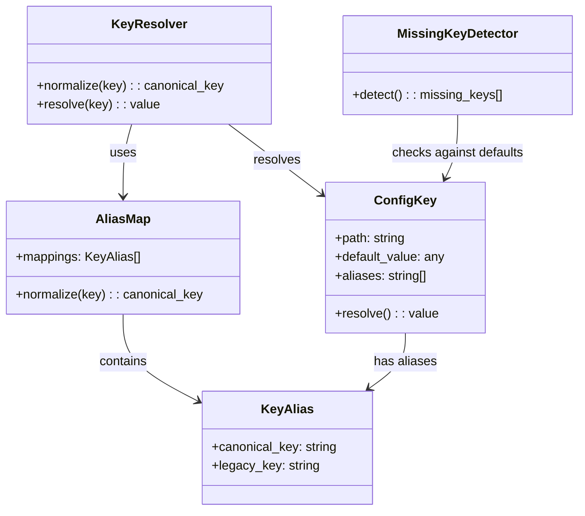

# ドメインモデル: Git関連設定キーの統合

## 概要

Git関連の設定キーを `[rules.git]` に統合し、旧キーとのエイリアス解決を提供するための構造と責務を定義する。

**重要**: このドメインモデル設計では**コードは書かず**、構造と責務の定義のみを行います。

## エンティティ

### ConfigKey（設定キー）
- **ID**: ドット区切りのキーパス（例: `rules.git.squash_enabled`）
- **属性**:
  - path: string - キーパス（`rules.git.squash_enabled`）
  - default_value: any - デフォルト値
  - aliases: string[] - エイリアスキーパスのリスト（例: `["rules.squash.enabled"]`）
- **振る舞い**:
  - resolve(): canonical key に正規化してから値を取得

## 値オブジェクト

### KeyAlias（キーエイリアス）
- **属性**:
  - canonical_key: string - 正規キーパス（新キー）
  - legacy_key: string - 旧キーパス
- **不変性**: エイリアスマッピングは固定（ランタイムで変更されない）
- **等価性**: canonical_key と legacy_key のペアで判定

### AliasMap（エイリアスマップ）
- **属性**:
  - mappings: KeyAlias[] - 全エイリアスマッピング
- **不変性**: マップ全体が定数として定義される
- **等価性**: マッピング内容が同一であること
- **提供モジュール**: `lib/key-aliases.sh`（単一責任点。read-config.sh と detect-missing-keys.sh が共有参照）

## 集約

### ConfigResolution（設定値解決）
- **集約ルート**: ConfigKey
- **含まれる要素**: KeyAlias（値オブジェクト）
- **境界**: 1つのキーの解決プロセス全体
- **不変条件**:
  - 同一canonical keyに対して常に同じ値を返す
  - 新旧どちらのキーで問い合わせても同じ値が解決される
  - 解決順: defaults.toml → ~/.aidlc/config.toml → .aidlc/config.toml → .aidlc/config.local.toml

## ドメインサービス

### KeyResolver（キー解決サービス）
- **責務**: 入力キーをcanonical keyに正規化し、4階層マージで値を解決する
- **操作**:
  - normalize(key) → canonical_key: エイリアスマップを参照し正規化
  - resolve(key) → value: 正規化後、4階層を順に検索

### MissingKeyDetector（欠落キー検出サービス）
- **責務**: defaults.toml のリーフキーと config.toml を比較し、欠落キーを検出する。AliasMap を参照してエイ��アス充足判定も行う
- **操作**:
  - detect() → {missing: key[], migrate: key[]}: defaults.toml のリーフキー一覧と config.toml を比較。旧キーで充足済���の場合は `migrate`（移行推奨）として区別

## ドメインモデル図

## ユビキタス言語

- **canonical key**: 正規キーパス。新キー（`rules.git.*`）を指す
- **legacy key**: 旧キーパス（`rules.branch.mode` 等）。エイリアスとして解決される
- **エイリアス解決**: 旧キーを canonical key に正規化するプロセス
- **4階層マージ**: defaults.toml → global config → project config → local config の順で値を上書きマージする仕組み
- **欠落キー検出**: defaults.toml のリーフキーのうち、config.toml に存在しないキーを検出する仕組み
- **廃止キー**: エイリアス統合ではなく機能的に代替されたキー（例: `worktree_enabled` → `branch_mode=worktree` で代替）

## 不明点と質問

（なし - 計画レビューで方針確定済み）
