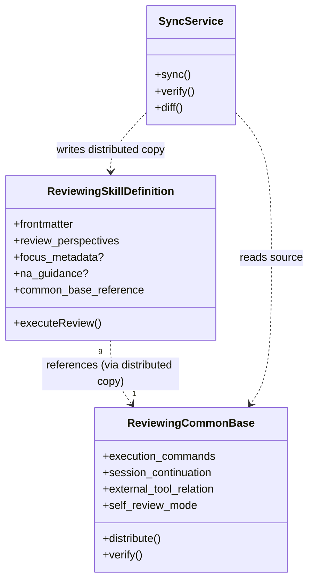

# ドメインモデル: Reviewingスキル共通基盤抽出

## 概要

9つのReviewingスキルのSKILL.mdから共通ボイラープレート（外部ツール実行基盤）を共通基盤ファイルに抽出し、各SKILL.mdをレビュー観点等の固有セクションのみに簡素化する。

**重要**: このドメインモデル設計では**コードは書かず**、構造と責務の定義のみを行います。実装はImplementation Phase（コード生成ステップ）で行います。

## エンティティ（Entity）

### ReviewingCommonBase（共通基盤ファイル）

- **ID**: ファイルパス（`skills/reviewing-common/reviewing-common-base.md` = 正本）
- **属性**:
  - execution_commands: Markdown - Codex/Claude Code/Geminiの3ツール実行コマンド定義
  - session_continuation: Markdown - 反復レビュー用セッション継続コマンド + session-management.md参照リンク
  - external_tool_relation: Markdown - 通常モード/セルフレビューモードの2モード説明と責務分離
  - self_review_mode: Markdown - 手順・実行方式・サブエージェント指示テンプレート・制約
- **振る舞い**:
  - 配布: 正本の内容を9スキルの `references/reviewing-common-base.md` に複製する
  - 検証: 正本と配布先9ファイルの内容が一致するか確認する

### ReviewingSkillDefinition（各スキル定義）

- **ID**: スキル名（例: `reviewing-construction-code`）
- **属性**:
  - frontmatter: YAML - name, description, argument-hint, compatibility, allowed-tools
  - skill_description: Markdown - スキルの1行説明
  - focus_metadata: Markdown（オプション） - focusメタデータの説明（一部スキルのみ）
  - review_perspectives: Markdown - レビュー観点（各スキル固有の品質基準）
  - na_guidance: Markdown（オプション） - N/A判定ガイダンス（reviewing-construction-codeのみ）
  - common_base_reference: Markdown - 共通基盤への参照指示
- **振る舞い**:
  - レビュー実行: レビュー観点に基づいてレビューを実行（共通基盤の実行コマンド/セルフレビュー手順を参照）

## 値オブジェクト（Value Object）

### SkillFrontmatter

- **属性**:
  - name: String - スキル識別名
  - description: String - スキル説明
  - argument_hint: String - 引数ヒント
  - compatibility: String - 互換性情報
  - allowed_tools: String - 許可ツールリスト
- **不変性**: スキルの識別情報であり、共通基盤抽出では変更しない
- **等価性**: name で一意識別

### CommonBaseReference

- **属性**:
  - reference_path: String - `references/reviewing-common-base.md`（固定値）
  - reference_instruction: String - Read指示テキスト
- **不変性**: 参照先パスは全スキル共通で固定
- **等価性**: reference_path で判定

## 集約（Aggregate）

### CommonBaseAggregate（共通基盤集約）

- **集約ルート**: ReviewingCommonBase
- **含まれる要素**: なし（単独集約）
- **境界**: 正本の内容一貫性
- **不変条件**:
  - 正本が存在し、必須セクション（実行コマンド・セッション継続・外部ツール関係・セルフレビューモード）を含む

### SkillDefinitionAggregate（スキル定義集約）× 9

- **集約ルート**: ReviewingSkillDefinition
- **含まれる要素**: なし（各スキルが独立した集約）
- **境界**: 各スキルの識別情報とレビュー観点の完結性
- **不変条件**:
  - frontmatterが完全（name, description等）
  - レビュー観点が存在
  - 共通基盤への参照指示が存在
- **参照**: CommonBaseAggregate（配布先コピー経由。参照であり所有ではない）

## ドメインサービス

### SyncService（配布同期サービス）

- **責務**: 正本から9スキルへの共通基盤ファイル配布と整合性検証
- **操作**:
  - sync: 正本を9スキルの `references/` にコピー
  - verify: 正本と全配布先の一致を検証（MD5比較）
  - diff: 正本と配布先の差分表示

## ドメインモデル図

## ユビキタス言語

- **正本（source of truth）**: 共通基盤ファイルの唯一の原本。`skills/reviewing-common/reviewing-common-base.md` に配置
- **配布先**: 各スキルの `references/reviewing-common-base.md`。正本からの生成物
- **共通基盤**: 全Reviewingスキルで共有される外部ツール実行基盤（実行コマンド・セッション継続・モード説明・セルフレビュー手順）
- **固有セクション**: 各スキルに固有の部分（frontmatter・レビュー観点・focusメタデータ等）
- **配布スクリプト**: 正本から9スキルへの複製を自動化するシェルスクリプト

## 不明点と質問（設計中に記録）

（現時点で不明点なし）
