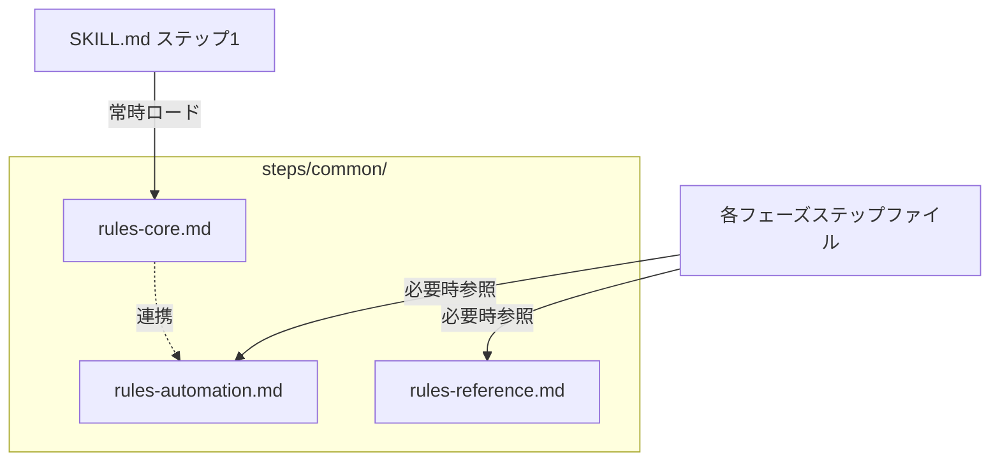

# ドメインモデル: rules.md 3階層分割

## 概要
AI-DLC共通ルールファイル群の責務分離と階層構造を定義する。常時ロードファイルのサイズ削減が目的。

**重要**: このドメインモデル設計では**コードは書かず**、構造と責務の定義のみを行います。

## エンティティ（ファイル単位の責務定義）

### rules-core.md
- **責務**: 全フェーズ・全ステップで常時参照される基本ルール
- **ロードタイミング**: SKILL.md共通初期化フロー ステップ1（常時）
- **含むセクション**:
  - 設定読み込み（read-config.sh使用方法）
  - 質問と実行の判断基準 + 質問と深掘り（統合）
  - 質問フロー
  - 承認プロセス
  - AskUserQuestion使用ルール（インタラクション種別、入出力契約）
  - Gitコミットルール（commit-flow.md参照）
  - スコープ保護ルール
  - 改善提案のバックログ登録ルール + バックログ管理・即時実装優先ルール（統合）
  - コード品質基準
  - 実行前の検証（agents-rules.mdから統合）
  - フェーズ固有のルール（agents-rules.mdから統合）
  - 禁止事項（agents-rules.mdから統合）
  - コンテキスト要約時の情報保持（agents-rules.mdから統合）
- **依存関係**: なし（他ファイルから参照される側）

### rules-automation.md
- **責務**: 自動化制御に関するルール（セミオート・エクスプレス）
- **ロードタイミング**: 各ステップファイルから必要時に参照
- **含むセクション**:
  - セミオートゲート仕様（判定ロジック、フォールバック条件テーブル、レビュー結果シグナル、構造化シグナル、承認ポイントID）
  - エクスプレスモード仕様（適用条件、複雑度判定、有効時の動作）
- **依存関係**: rules-core.md の承認プロセス・AskUserQuestion使用ルールを前提とする（実行時参照。別途ロード指示は不要）

### rules-reference.md
- **責務**: 設定値の詳細定義テーブル（参照データ）
- **ロードタイミング**: 各ステップファイルから必要時に参照
- **含むセクション**:
  - Depth Level仕様（レベル定義、レベル別成果物要件テーブル）
  - 設定仕様リファレンス（設定キー・デフォルト・有効値テーブル）
- **依存関係**: なし（参照データのみ）

## 集約（ファイル群の境界）

### CommonRulesAggregate
- **集約ルート**: rules-core.md
- **含まれる要素**: rules-core.md, rules-automation.md, rules-reference.md
- **境界**: `steps/common/` ディレクトリ内のルール定義ファイル群
- **不変条件**:
  - rules-core.mdは常時ロードされ、他2ファイルは必要時のみ参照
  - 3ファイル合計 < 14,732B（元のrules.md + agents-rules.md合計）
  - 分割前と機能等価（重複コンテンツは統合により1箇所に集約。削除は重複分のみ許可）

## 統合ルール（重複解消）

### 質問関連の統合
- **統合元**: rules.md「質問と実行の判断基準」+ agents-rules.md「質問と深掘り」
- **統合方針**: 判断基準（2条件チェック）を先に、深掘りテクニック・情報提示ルールを後に配置。重複する質問フロー記述は1箇所に集約

### バックログ関連の統合
- **統合元**: rules.md「改善提案のバックログ登録ルール」+ agents-rules.md「バックログ管理」「即時実装優先ルール」
- **統合方針**: 適用場面の違い（即時実装 vs バックログ登録）を明確に記載した1セクションに統合

## ドメインモデル図

## ユビキタス言語

- **常時ロード**: SKILL.md共通初期化フローのステップ1で必ず読み込まれるファイル
- **必要時参照**: ステップファイル内の指示で特定のセクションが必要な場合にのみ読み込まれるファイル
- **機能等価**: 分割前後でルールの内容・適用範囲・判定結果が変わらないこと
