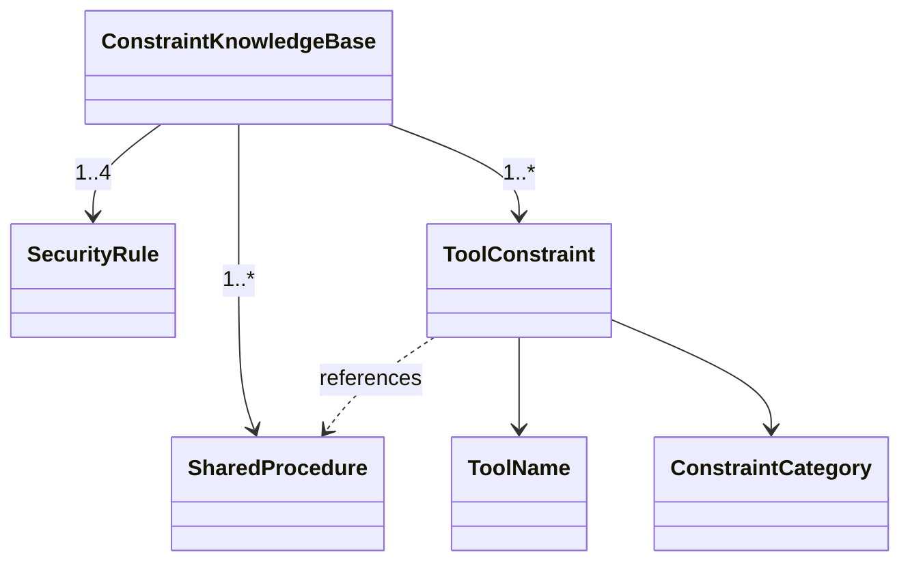

# ドメインモデル: review-flow追加圧縮

## 概要

review-flow-reference.mdが管理する「外部CLIツール制約知識」の意味的構造を定義し、ツール別の重複を排除する正規化方針を示す。

**重要**: このドメインモデル設計では**コードは書かず**、構造と責務の定義のみを行います。実装はImplementation Phase（コード生成ステップ）で行います。

## エンティティ（Entity）

### ToolConstraint（ツール制約）

外部CLIツールの1つの既知制約を表す意味的な単位。

- **属性**:
  - tool: ToolName - 対象ツール（Codex / Claude / Gemini）
  - category: ConstraintCategory - 制約カテゴリ
  - trigger: String - 発生条件
  - symptom: String - 症状
  - mitigation: String - 対処法
  - fallback_ref: String - 事後フォールバック先（review-flow.mdのエラー分類名）

### SecurityRule（セキュリティ規約）

外部CLIツール利用時に遵守すべきセキュリティ規約。

- **属性**:
  - rule_id: String - 識別子
  - description: String - 規約内容

### SharedProcedure（共通手順）

ツール横断で適用される共通対処手順。

- **属性**:
  - procedure_type: ProcedureType - auth_fallback / freeze_countermeasure
  - steps: List&lt;String&gt; - 手順

## 値オブジェクト（Value Object）

### ToolName

- **有効値**: Codex, Claude, Gemini

### ConstraintCategory

制約の性質を分類するカテゴリ。各カテゴリは固有のスキーマを持つ。

- **有効値**: sandbox_restriction, auth_lifecycle, interactive_mode, output_format

### ProcedureType

- **有効値**: auth_fallback, freeze_countermeasure

## カテゴリ固有のスキーマ

ConstraintCategoryごとに、ToolConstraintの属性の解釈が異なる:

### SandboxRestrictionスキーマ

- trigger: サンドボックスモードの種類
- symptom: ファイルアクセス制限の症状
- mitigation: インラインプロンプト等の回避策
- fallback_ref: CLI出力解析不能 / CLI実行エラー

### AuthLifecycleスキーマ

- trigger: 認証トークン失効条件
- symptom: （未使用。検知コマンドで代替）
- mitigation: 検知コマンド + 再認証コマンド
- fallback_ref: SharedProcedure(auth_fallback)への参照

### InteractiveModeスキーマ

- trigger: 非インタラクティブ環境からの実行
- symptom: プロセスハング
- mitigation: execモード使用 + タイムアウト
- fallback_ref: CLI実行エラー

### OutputFormatスキーマ

- trigger: 出力フォーマット指定漏れ
- symptom: パースエラー
- mitigation: フォーマットオプション明示
- fallback_ref: CLI出力解析不能

## 集約（Aggregate）

### ConstraintKnowledgeBase（制約知識ベース）

- **集約ルート**: ConstraintKnowledgeBase
- **含まれる要素**: ToolConstraint群, SecurityRule群, SharedProcedure群
- **不変条件**:
  - SecurityRuleは4項目が全て存在する（機密情報除外、マスキング、平文禁止、公式配布元）
  - 事前予防と事後フォールバックの責務境界が明示されている
  - SharedProcedureはToolConstraintから参照のみされ、制約定義に混在しない

## ドメインモデル図



## 現行構造と新構造の対比

### 現行（ツール別グルーピング）

```
ToolConstraintをツール名で分割
├── Codex/ → sandbox(2件) + auth + interactive
├── Claude/ → sandbox(空) + output_format + auth
├── Gemini/ → sandbox(1件) + auth
└── 共通/ → auth手順 + フリーズ対策
→ 同カテゴリの制約が3箇所に分散
```

### 新構造（カテゴリ別グルーピング）

```
ToolConstraintをConstraintCategoryで分割
├── sandbox_restriction → Codex(2件) + Gemini(1件)
├── output_format → Claude(1件)
├── auth_lifecycle → Codex + Claude + Gemini（各1件）
├── interactive_mode → Codex(1件)
└── SharedProcedure（独立セクション）→ auth_fallback + freeze_countermeasure
→ 同カテゴリの制約が1箇所に集約、共通手順は独立
```

## ユビキタス言語

- **ツール制約**: 外部CLIの既知の制限事項と対処法のペア
- **制約カテゴリ**: 制約の性質による分類（sandbox, auth, interactive, output_format）
- **共通手順**: ツール横断で適用される対処フロー（auth_fallback, freeze対策）
- **責務境界**: 事前予防（本ファイル）と事後フォールバック（review-flow.md）の分担
