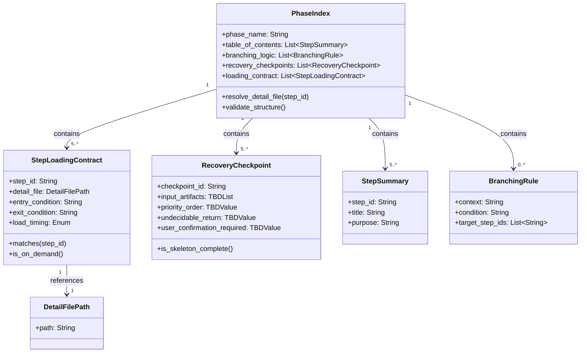

# ドメインモデル: Unit 001 Inception フェーズインデックスのパイロット実装

## 概要

本ドメインモデルは、AI-DLC スキルの「フェーズインデックスファイル」というドキュメント構造物のドメインを記述する。フェーズインデックスは AI エージェントの初回ロード対象となる単一の入口ファイルであり、詳細ステップファイルへのルーティング契約と現在位置判定チェックポイントの骨格を集約する。**本 Unit（Unit 001）はフェーズ非依存の共通構造仕様を確立する基盤 Unit であり、Inception フェーズに先行適用する**。Unit 003/004 は本 Unit で確立した共通構造を Construction/Operations フェーズに**そのまま適用**する（新たな構造設計は行わない）。

**重要**: このドメインモデル設計では**コードは書かず**、構造と責務の定義のみを行います。実装は Phase 2（コード生成ステップ）で行います。

## ドメイン特性

本ドメインは「実行時データ構造」ではなく「ドキュメント構造仕様」を記述する。つまり、ここで言う「エンティティ」「値オブジェクト」は Markdown ファイル上のセクションやテーブル行という**ドキュメント要素**にマップされる。実行時に RDB や API に永続化される概念ではない。このためリポジトリ・ファクトリ・ドメインイベントは該当なしとする。

## エンティティ（Entity）

### PhaseIndex（フェーズインデックス）

- **ID**: フェーズ名（`inception` / `construction` / `operations` の3値のいずれか。文字列型）
- **属性**:
  - `phase_name`: 文字列 — 対象フェーズの名前
  - `table_of_contents`: `StepSummary` のリスト — 全ステップの目次・概要
  - `branching_logic`: `BranchingRule` のリスト — ステップ間分岐ロジックの記述
  - `recovery_checkpoints`: `RecoveryCheckpoint` のリスト — 現在位置判定チェックポイントの骨格
  - `loading_contract`: `StepLoadingContract` のリスト — 契約テーブル（各ステップの `step_id` → `detail_file` マッピング）
- **振る舞い**:
  - `resolve_detail_file(step_id)`: 指定された `step_id` に対応する詳細ファイルパスを契約テーブルから一意に取り出す（Unit 001 の主要検証対象）
  - `list_always_loaded_detail_files()`: `load_timing=always` の詳細ファイルを列挙する（Unit 001 では常に空リスト）
  - `validate_structure()`: 必須セクション（目次・分岐ロジック・判定チェックポイント・契約テーブル）がすべて存在することを保証する

### StepLoadingContract（ステップ読み込み契約エントリ）

- **ID**: `step_id`（例: `inception.01-setup`、`inception.04-stories-units`。ドット区切り命名）
- **属性**:
  - `step_id`: 文字列 — ステップ識別子
  - `detail_file`: `DetailFilePath` — 詳細ファイルのスキルベース相対パス（値オブジェクト）
  - `entry_condition`: 文字列 — このステップに遷移する条件の自然言語記述
  - `exit_condition`: 文字列 — このステップを終了する条件の自然言語記述
  - `load_timing`: 列挙（`on_demand` / `always`） — ロードタイミング
- **振る舞い**:
  - `matches(step_id)`: 指定された `step_id` と一致するかを判定
  - `is_on_demand()`: `load_timing` が `on_demand` であるかを判定

### RecoveryCheckpoint（判定チェックポイントエントリ）

- **ID**: `checkpoint_id`（例: `inception.intent_done`、`inception.units_done`）
- **属性**:
  - `checkpoint_id`: 文字列 — チェックポイント識別子
  - `input_artifacts`: `TBDList` — 判定時に参照する成果物パスのリスト（Unit 001 では `TBD` プレースホルダ）
  - `priority_order`: `TBDValue` — 同点時の優先順位ルール（Unit 001 では `TBD` プレースホルダ）
  - `undecidable_return`: `TBDValue` — 判定不能時の戻り値仕様（Unit 001 では `TBD` プレースホルダ）
  - `user_confirmation_required`: `TBDValue` — ユーザー確認必須かの真偽値（Unit 001 では `TBD` プレースホルダ）
- **振る舞い**:
  - `is_skeleton_complete()`: スキーマの全フィールドが `checkpoint_id` 以外すべて `TBD` 値になっているか（Unit 001 の完了条件）を判定
  - `accept_unit002_spec(spec)`: Unit 002 が本チェックポイントに実判定ロジックを流し込む際のインターフェース（概念上の操作。実装は Unit 002 で行う）

## 値オブジェクト（Value Object）

### DetailFilePath（詳細ファイルパス）

- **属性**: `path`: 文字列 — スキルベースディレクトリからの相対パス（例: `steps/inception/01-setup.md`）
- **不変性**: パスは一度定義されたら当該 Unit の範囲内で変更されない。参照整合性を維持するため
- **等価性**: 文字列としての完全一致

### StepSummary（ステップ概要）

- **属性**:
  - `step_id`: 文字列 — 対応するステップ識別子
  - `title`: 文字列 — ステップの日本語タイトル
  - `purpose`: 文字列 — 1-2 文で記述されたステップの目的
- **不変性**: 目次の可読性を保つため不変
- **等価性**: `step_id` での同一性判定

### BranchingRule（分岐ルール）

- **属性**:
  - `context`: 文字列 — 分岐が発生する文脈（例: `Part1/Part2 遷移`、`エクスプレス判定`、`automation_mode`）
  - `condition`: 文字列 — 分岐条件の自然言語記述
  - `target_step_ids`: `step_id` のリスト — 分岐先ステップ
- **不変性**: 分岐の一貫性を保つため不変
- **等価性**: `context` と `condition` の組み合わせ

### TBDValue / TBDList（プレースホルダ値）

- **属性**: 「TBD」という固定文字列または `TBD` を含むリスト
- **不変性**: Unit 002 が実値に置き換えるまでの間、不変のプレースホルダとして機能
- **等価性**: `TBD` 文字列の一致

## 集約（Aggregate）

### PhaseIndex 集約

- **集約ルート**: `PhaseIndex`
- **含まれる要素**:
  - `PhaseIndex`（ルート）
  - `StepSummary` のリスト（値オブジェクト）
  - `BranchingRule` のリスト（値オブジェクト）
  - `RecoveryCheckpoint` のリスト（エンティティ）
  - `StepLoadingContract` のリスト（エンティティ）
  - `DetailFilePath`（値オブジェクト、`StepLoadingContract` 経由で参照）
  - `TBDValue` / `TBDList`（値オブジェクト、`RecoveryCheckpoint` 経由で参照）
- **境界**: 1つの PhaseIndex は1つのフェーズに閉じる。他フェーズのインデックスとは疎結合（独立したファイル）
- **不変条件**:
  1. `loading_contract` の各エントリの `step_id` は当該フェーズ内で一意
  2. `loading_contract` の各エントリの `detail_file` が実在する（Read 可能なパスを指している）
  3. `recovery_checkpoints` の各エントリの `checkpoint_id` は当該フェーズ内で一意
  4. Unit 001 時点では `recovery_checkpoints` の `checkpoint_id` 以外のフィールドはすべて `TBD`
  5. Unit 001 時点では `loading_contract` の全エントリの `load_timing` は `on_demand` に固定
  6. `table_of_contents`、`branching_logic`、`recovery_checkpoints`、`loading_contract` の4セクションが必ず存在する

## ドメインサービス

### StepRoutingService（ステップルーティングサービス）

- **責務**: AI エージェントが `step_id` を受け取り、対応する詳細ファイルを決定するルーティング責務。本 Unit では SKILL.md の共通初期化フロー内に組み込まれる薄いロジックとして実装する
- **操作**:
  - `route(phase_index, step_id)`: `PhaseIndex.resolve_detail_file(step_id)` を呼び出し、取得した `DetailFilePath` を返す。該当なしの場合はエラー
  - `load_initial_context(phase_index)`: インデックスファイルと共通ファイル群のみをロードする（詳細ファイルはロードしない）

### CurrentStepDetermination（現在ステップ判定サービス）— **論理インターフェースのみ定義、実装は Unit 002**

- **責務**: サイクル配下の成果物群と進捗状態を入力として、現在どの `step_id` から再開すべきかを判定する。Intent で要求される「インデックスが現在位置判定の唯一の正本」という接続点は本サービスに集約される
- **論理インターフェース（Unit 001 で確立、Unit 002 が内部実装を埋める）**:
  - `determine(phase_index, input_artifacts_state)`:
    - **入力**: `PhaseIndex`（対象フェーズのインデックス）+ `InputArtifactsState`（現サイクル配下の `requirements/` / `story-artifacts/` / `construction/` / `operations/` のファイル存在有無と progress.md 完了マーク等を集約した状態オブジェクト）
    - **出力**: `step_id`（文字列、判定成功時）/ `undecidable:<reason_code>`（判定不能時、4系統の `reason_code`: `missing_file` / `conflict` / `format_error` / `legacy_structure`）
    - **ユーザー確認接続**: 判定不能時はユーザー確認フローへ接続しうる契約点を持つ。実際の確認必須性（真偽値）は Unit 002 が reason_code ごとに `RecoveryCheckpoint.user_confirmation_required` に流し込む。Unit 001 では接続可能性のみを保証し、固定真偽値は定義しない
    - **判定ロジックの実体**: Unit 002 が `RecoveryCheckpoint.input_artifacts` / `priority_order` / `undecidable_return` / `user_confirmation_required` に実値を流し込むことで決定する。**Unit 001 ではこの契約インターフェースのみを定義し、中身は実装しない**
- **Unit 001 と Unit 002 の責務境界**:
  - Unit 001: `CurrentStepDetermination` の **入出力契約**と `RecoveryCheckpoint` 骨格スキーマを固定する（列構造・行構造は変更不可）
  - Unit 002: `RecoveryCheckpoint` の `TBD` フィールドを実値で埋め、`determine` 操作の判定規則を `phase-recovery-spec.md` に定義する

### StructureValidationService（構造検証サービス）

- **責務**: フェーズインデックスファイルが不変条件を満たしているかを静的解析で検証する。Unit 001 の完了条件チェックで使用
- **操作**:
  - `validate(phase_index)`: 上記集約の6つの不変条件をすべて検証し、違反があれば報告
  - `check_load_timing_policy(phase_index)`: Unit 001 時点では全 `detail_file` が `on_demand` であることを検証

## リポジトリインターフェース

本ドメインは Markdown ファイルベースであるため、RDB スタイルのリポジトリは存在しない。ただし概念上の「永続化」は以下に対応する:

### PhaseIndexFileStore（ファイルシステム永続化の概念的表現）

- **対象集約**: `PhaseIndex`
- **操作**:
  - `load(phase_name)`: `steps/{phase_name}/index.md` を Read ツールで読み込み、パースして `PhaseIndex` 集約を構築する（AI エージェントの読み込み動作に対応）
  - `save(phase_index)`: `PhaseIndex` 集約を Markdown テキストとしてシリアライズし、ファイルに書き込む（Write ツールでの作成に対応）

## ファクトリ（必要な場合のみ）

該当なし。インデックスファイルは Unit 001 の Phase 2（コード生成）で直接 Write ツールにより作成され、複雑な初期化ロジックは不要。

## ドメインモデル図

## ユビキタス言語

- **フェーズインデックス（Phase Index）**: 1 フェーズに 1 ファイル存在する Markdown ドキュメント。AI エージェントの初回ロード対象であり、当該フェーズの全ステップ情報・分岐ロジック・判定チェックポイント・読み込み契約を集約する
- **ステップ読み込み契約（Step Loading Contract）**: `step_id` から詳細ファイルパスと遷移条件を取り出すためのルーティング規約。インデックスファイル内のテーブル形式で表現される
- **判定チェックポイント骨格（Recovery Checkpoint Skeleton）**: Unit 001 で先行確立する判定チェックポイントのスキーマ。`checkpoint_id` のみ埋まり、他フィールドは `TBD`。Unit 002 が実値に置き換える
- **load_timing**: 詳細ファイルのロードタイミングを示す列挙値。`on_demand`（必要時ロード）または `always`（初回常時ロード）。Unit 001 時点では全て `on_demand`
- **詳細ファイル（Detail File）**: フェーズインデックスから参照される個別ステップの手順記述ファイル。既存の `01-setup.md` 〜 `05-completion.md` に対応する
- **契約ルーティング検証（Contract Routing Verification）**: `manual step_id → detail_file` のルーティングが機能することの検証。Unit 001 の回帰検証項目。`state → step_id` の自動判定は Unit 002 の責務
- **TBD（To Be Determined）**: Unit 001 時点で値が確定せず、Unit 002 以降で埋めることを意味するプレースホルダ

## 不明点と質問（設計中に記録）

（対話を通じて不明点を明確化するセクション。現時点では不明点なし。計画レビュー5回反復により必要な仕様は計画ファイルに固定済み）
