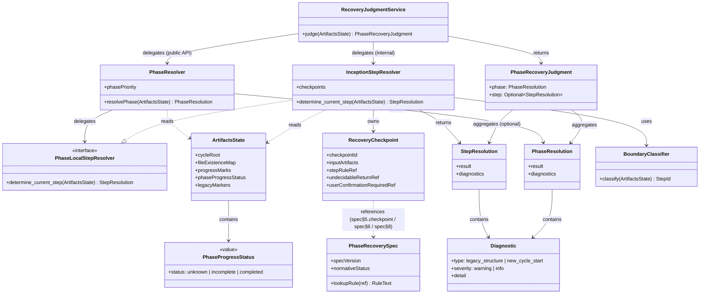

# ドメインモデル: Unit 002 汎用復帰判定仕様

## 概要

AI-DLC のコンパクション復帰時に「現在どのフェーズのどのステップに復帰すべきか」を成果物ファイルの状態から一意に判定するためのドメインモデルを定義する。本 Unit では規範仕様（`phase-recovery-spec.md`）とその Inception への materialized binding を対象とする。

**重要**: このドメインモデル設計では**コードは書かず**、構造と責務の定義のみを行う。

## エンティティ（Entity）

### PhaseResolver

- **ID**: 単一インスタンス（シングルトン相当の仕様実体）
- **属性**:
  - `phasePriority`: 順序付きフェーズリスト - `[Operations, Construction, Inception]` の静的な全体優先順位（ただし phase 完了状態を考慮した補正後の順序）
  - `inceptionGuardRule`: #553 補正ルールへの参照 - Inception `progress.md` 未完了時の優先ガード
- **振る舞い**:
  - `resolvePhase(artifactsState) → PhaseResolution`: 成果物状態から復帰すべきフェーズを決定する。**入力契約は「存在有無」ではなく `PhaseProgressStatus` を含む `ArtifactsState`**。判定順は以下:
    1. **conflict 検出**: 複数 phase が同時に `incomplete` 状態の場合（例: `operations/progress.md` 未完了 + `inception/progress.md` 未完了 + 有効な Construction 作業進行中）は `result=undecidable:conflict` を返す
    2. **Operations 判定**: `operations/progress.md` が存在し、かつ `PhaseProgressStatus=incomplete` の場合のみ Operations を返す（`completed` の場合はスキップして次へ）
    3. **Construction 判定**: `units/*.md` が存在し、かつ Inception 完了条件を満たしている（`inception/progress.md` が `completed`）場合に Construction を返す
    4. **Inception 判定**: 上記以外。特に #553 補正ガード（`units/*.md` 存在しても `inception/progress.md` に未完了ステップがある場合）も本判定に吸収される
    5. **新規開始フォールバック**: 入力状態として `phaseProgressStatus[inception]=unknown`（`inception/progress.md` も存在しない初期状態）の場合は、**新規サイクル開始として Inception にフォールバック**する。このときは `diagnostics[]` に `new_cycle_start` 情報を追加して呼び出し側に明示する
  - **注意**: `unknown` は `PhaseProgressStatus` の入力状態ラベルのみで使われ、`PhaseResolution.result`（戻り値）では使われない。`result` は常に `PhaseName`（`operations`/`construction`/`inception`）または `undecidable:<reason_code>` のいずれかを取る
  - 範囲: phase 層のみを決定し、phase 内の step 決定は下位 resolver に委譲
  - **#553 補正ガード**は上記判定順3〜4の分岐（Inception 完了条件を満たさない限り Construction と判定しない）に本質的に統合される

### PhaseLocalStepResolver（非公開下位契約）

- **ID**: フェーズ名（`inception` / `construction` / `operations`）
- **属性**:
  - `phase`: 対象フェーズ
  - `checkpoints`: `RecoveryCheckpoint` のリスト - 本 Unit では Inception 向けのみ実装
  - `boundaryRules`: 隣接チェックポイント間の境界判定ルールへの参照
- **振る舞い**:
  - `determine_current_step(artifactsState) → StepResolution`: 指定フェーズ内の具体的な復帰ステップ `step_id` を決定する。**`judge()` 経由でのみ呼ばれる下位契約**（呼び出し層から直接参照されない）
  - `detectLegacyStructure(artifactsState) → Optional<Diagnostic>`: 旧構造マーカー（`session-state.md` 等）を検出し、検出時は warning diagnostic を返す
  - `validateArtifacts(artifactsState) → Optional<Undecidable>`: `missing_file` / `format_error` の blocking 条件を検出し、該当時は `undecidable:<reason_code>` を返す（`conflict` は `PhaseResolver` の責務）

**Unit 002 スコープ**: 本 Unit では `InceptionStepResolver`（phase-local 派生）のみを仕様化する。Construction/Operations 向けの派生は Unit 003/004 の責務。

### RecoveryCheckpoint

- **ID**: `checkpoint_id`（文字列、例: `inception.setup_done` / `inception.units_done`）
- **属性**:
  - `checkpointId`: `{phase}.{step_slug}_done` 形式の一意識別子
  - `inputArtifacts`: 判定に必要な成果物パスのリスト（具象パス）
  - `stepRuleRef`: `spec§5.<checkpoint_id>` 形式の spec 参照トークン - **この checkpoint 自身の step 判定規則**への参照（checkpoint 単位で異なる）
  - `undecidableReturnRef`: `spec§6` 等の spec 参照トークン - 戻り値インターフェース契約への参照（全 checkpoint 共通）
  - `userConfirmationRequiredRef`: `spec§8` 等の spec 参照トークン - ユーザー確認必須性ルールへの参照（全 checkpoint 共通）
- **振る舞い**:
  - なし（データ保持専用）。判定ロジックは `PhaseLocalStepResolver` が所有し、本エンティティは binding 層の宣言のみを担う

**注意**: phase 全体優先順位（`operations > construction > inception`）は `PhaseResolver` の固定責務（`spec§4`）であり、checkpoint 表には含めない。checkpoint は自身の step 判定規則（`spec§5`）のみを参照することで、binding 層から phase 層への不要な結合を避ける。

### PhaseRecoverySpec

- **ID**: 固定識別子（`phase-recovery-spec`）
- **属性**:
  - `version`: 仕様バージョン（例: `v1`）
  - `normativeStatus`: `"normative"` - 本仕様が判定ロジックの正本であることを示す
  - `sections`: 10セクションの構造マップ
- **振る舞い**:
  - `lookupRule(ref: string) → RuleText`: `spec§4` 等の参照トークンから本文ルールを解決する（binding 層から使用）

## 値オブジェクト（Value Object）

### ArtifactsState

- **属性**:
  - `cycleRoot`: サイクルディレクトリパス（例: `.aidlc/cycles/v2.3.0`）
  - `fileExistenceMap`: `Map<string, bool>` - 成果物パス → 存在有無
  - `progressMarks`: `Map<string, ProgressStatus>` - progress.md から抽出した各行の状態（step 単位）
  - `phaseProgressStatus`: `Map<PhaseName, PhaseProgressStatus>` - phase 単位の完了状態サマリ（`PhaseResolver` が直接参照）
  - `legacyMarkers`: `List<string>` - 検出された旧構造マーカー（例: `session-state.md` のパス）
- **不変性**: 1 回の判定呼び出し中は変更されない（ただしスナップショットは判定時点の状態を反映）
- **等価性**: 全フィールドの値が一致した場合に等価

### PhaseProgressStatus

- **属性**: `status`: `"unknown" | "incomplete" | "completed"`
  - `unknown`: 該当 phase の進捗源ファイル（`{phase}/progress.md` 等）が存在しない（新規開始または未着手）
  - `incomplete`: 進捗源ファイルが存在し、未完了ステップが残っている
  - `completed`: 進捗源ファイルが存在し、全ステップ完了
- **不変性**: 列挙値のため変更不可
- **等価性**: `status` 値の文字列一致

### ProgressStatus

- **属性**: `status`: `"未着手" | "進行中" | "完了"`
- **不変性**: 列挙値のため変更不可
- **等価性**: `status` 値の文字列一致

### StepResolution

- **属性**:
  - `result`: `StepId | UndecidableReason`
  - `diagnostics`: `List<Diagnostic>` - warning 系イベント（blocking と独立に蓄積）
- **不変性**: 判定結果は不変。呼び出し側で再利用される
- **等価性**: `result` と `diagnostics` の全一致

### PhaseResolution

- **属性**:
  - `result`: `PhaseName | UndecidableReason` - `PhaseName ∈ {operations, construction, inception}`
  - `diagnostics`: `List<Diagnostic>`
- **不変性**: 同上
- **等価性**: 同上

### StepId

- **属性**: `value`: 文字列（`{phase}.{step_slug}` 形式、例: `inception.04-stories-units`）
- **不変性**: 判定後は変更不可
- **等価性**: 文字列一致

### UndecidableReason

- **属性**:
  - `reasonCode`: `"missing_file" | "conflict" | "format_error"` （blocking 系のみ）
  - `detail`: 補足情報（欠損ファイルパス、競合内容、パース失敗行など）
- **不変性**: 判定後は変更不可
- **等価性**: `reasonCode` と `detail` の一致

**注意**: `legacy_structure` は `UndecidableReason` には含めない。warning diagnostic として `Diagnostic` 値オブジェクトで表現する。

### Diagnostic

- **属性**:
  - `type`: `"legacy_structure" | "new_cycle_start"` （本 Unit では2種。将来の warning 追加時に拡張）
  - `severity`: `"warning" | "info"` - `legacy_structure` は `warning`、`new_cycle_start` は `info`（非 blocking 情報）
  - `detail`: 検出内容の説明（例: `"session-state.md 検出（v2.2.x 以前の旧構造）"` / `"inception/progress.md が存在しないため新規サイクル開始としてフォールバック"`）
- **不変性**: 生成後は変更不可
- **等価性**: `type` と `detail` の一致

### CheckpointId / PhaseName

- 値オブジェクト扱いの文字列ラッパー。命名規約（`{phase}.{step_slug}_done` / `operations|construction|inception`）を型として表現する

## 集約（Aggregate）

### PhaseRecoveryJudgment（集約ルート: `RecoveryJudgmentService`）

- **集約ルート**: `RecoveryJudgmentService`（`judge()` を唯一の公開エントリポイントとして提供）
- **含まれる要素**:
  - `RecoveryJudgmentService`（ルート）
  - `PhaseResolver`
  - `PhaseLocalStepResolver` 群（Inception 用は本 Unit、その他は Unit 003/004）
  - `RecoveryCheckpoint` 群（binding 層）
  - `ArtifactsState`（入力スナップショット、`phaseProgressStatus` を含む）
- **境界**: 1 回の復帰判定呼び出しのライフタイムに閉じる。永続化対象ではなく、呼び出しごとに新規構築される
- **不変条件**:
  - `PhaseResolver` は常に判定順（conflict → Operations → Construction → Inception → 新規開始フォールバック）に従う
  - `legacy_structure` / `new_cycle_start` は `UndecidableReason` として扱われない（warning/info の `Diagnostic` のみ）
  - 同一 `ArtifactsState` 入力に対して `result` は常に同一値を返す（決定論的）
  - `stepRuleRef` / `undecidableReturnRef` / `userConfirmationRequiredRef` の具体ポリシーは `PhaseRecoverySpec` のみが保持し、`RecoveryCheckpoint` は参照トークンのみを持つ
  - `InceptionStepResolver.determine_current_step()` は `judge()` 経由でのみ呼ばれ、呼び出し層から直接参照されない

### PhaseRecoverySpecification（集約ルート: `PhaseRecoverySpec`）

- **集約ルート**: `PhaseRecoverySpec`
- **含まれる要素**: 10セクションの構造マップ
- **境界**: 仕様文書そのもの。`steps/common/phase-recovery-spec.md` として materialize される
- **不変条件**:
  - セクション番号（§1〜§10）と参照トークン（`spec§N`）の対応は不変。参照トークン変更時は binding 層も同期更新が必要
  - `normativeStatus="normative"` は常に維持される（非正本化は仕様廃止と同義）

## ドメインサービス

### RecoveryJudgmentService（唯一の公開エントリポイント）

- **責務**: 復帰判定の**唯一の公開エントリポイント**。`compaction.md` / `session-continuity.md` から呼び出される
- **公開 API**:
  - `judge(artifactsState: ArtifactsState) → PhaseRecoveryJudgment`
    - 戻り値 `PhaseRecoveryJudgment` は `PhaseResolution + Optional<StepResolution>` の集約値オブジェクト
  - 内部手順:
    1. `PhaseResolver.resolvePhase(artifactsState)` を呼び出す
    2. phase が決定されかつ該当 phase-local resolver が実装済みなら `PhaseLocalStepResolver.determine_current_step(artifactsState)` を呼び出す
    3. Construction/Operations と判定された場合は本 Unit では phase-local resolver を提供せず、`step=None` を返す（呼び出し側は現行ルートに委譲する暫定ディスパッチャ）
- **下位契約（非公開）**:
  - `InceptionStepResolver.determine_current_step()` は Inception 内部の下位契約であり、呼び出し層（`compaction.md` / `session-continuity.md`）からは直接参照しない。Unit 001 で `inception/index.md` に記述されていた `determine_current_step` 擬似インターフェースは、本 Unit で `judge()` に統合され、下位契約としてリネーム・非公開化される
- **依存方向**:

```text
compaction.md / session-continuity.md
        │
        ▼
RecoveryJudgmentService.judge()        （唯一の公開 API）
        │
        ├─→ PhaseResolver.resolvePhase()     （§4 参照）
        │
        └─→ InceptionStepResolver.determine_current_step()   （§5 参照、非公開）
                │
                ▼
          phase-recovery-spec.md（規範仕様）
```

### LegacyStructureDetector

- **責務**: 旧構造マーカーの検出のみを担う補助サービス
- **操作**:
  - `detect(artifactsState: ArtifactsState) → List<Diagnostic>`: `session-state.md` 等の旧マーカーを検出し warning diagnostic を返す。blocking 判定には関与しない

### BoundaryClassifier（04/05 境界判定）

- **責務**: `inception.units_done` と `inception.completion_done` の境界を単値に確定させる
- **操作**:
  - `classify(artifactsState: ArtifactsState) → StepId`: progress.md「完了処理」セクションと `history/inception.md` の状態から `inception.04-stories-units` / `inception.05-completion` のいずれか**単一値**を返す。両方揃った時のみ `completion_done`、片方のみの場合は前段を返す

## リポジトリインターフェース

### ArtifactsStateRepository

- **対象集約**: `ArtifactsState`（値オブジェクト扱いだが取得経路を明確化するためリポジトリを定義）
- **操作**:
  - `snapshot(cycleRoot: Path) → ArtifactsState`: サイクルディレクトリから現在の成果物状態のスナップショットを構築する
  - `parseProgressMd(path: Path) → Map<string, ProgressStatus>`: progress.md をパースしてマーク状態を抽出する。パース失敗時は `format_error` を呼び出し元に通知

### SpecRuleRepository

- **対象集約**: `PhaseRecoverySpec`
- **操作**:
  - `lookup(ref: string) → RuleText`: `spec§4` 等の参照トークンから本文を解決する。実装は `phase-recovery-spec.md` のセクションへの参照として materialize される（本 Unit では仕様レベルのみ）

## ファクトリ

### InceptionStepResolverFactory

- **生成対象**: Inception 向け `PhaseLocalStepResolver`
- **生成ロジック概要**: `inception/index.md` のチェックポイントテーブル（binding 層）を読み取り、`RecoveryCheckpoint` 群を初期化。`PhaseRecoverySpec` から参照トークンを解決して実判定ルールを bind する

## ドメインモデル図



## ユビキタス言語

このドメインで使用する共通用語:

- **規範仕様（Normative Spec）**: `phase-recovery-spec.md` を指す。判定規則の正本であり、本文はすべてここに置かれる。他のファイルは本文を重複記述せず参照のみを行う
- **Materialized Binding**: 各 phase index（例: `inception/index.md`）の位置付け。規範仕様を具象化する層で、具象パスと spec 参照トークンのみを保持する
- **チェックポイント（Recovery Checkpoint）**: phase 内の各 step に対応する復帰判定点。`{phase}.{step_slug}_done` 形式の `checkpoint_id` で識別される
- **ArtifactsState**: 判定入力となる成果物状態のスナップショット。ファイル存在マップ + progress.md パース結果 + 旧構造マーカーで構成
- **Blocking**: 判定継続不能な異常。`missing_file` / `conflict` / `format_error` が該当し、`result=undecidable:<reason_code>` を返す
- **Warning**: 判定継続可能な警告。`legacy_structure` が該当し、`diagnostics[]` に追加されるが `result` は通常判定を継続する
- **PhaseResolver**: フェーズ層の判定を担うコンポーネント。`operations > construction > inception` の優先順位と #553 補正を適用
- **PhaseLocalStepResolver**: フェーズ内 step 層の判定を担うコンポーネント。本 Unit では Inception 向けのみ実装
- **暫定ディスパッチャ**: Unit 002 時点での `PhaseResolver` の振る舞い。Inception は新方式（spec 参照）、Construction/Operations は現行ルート維持
- **Spec 参照トークン**: `spec§N` 形式で `phase-recovery-spec.md` のセクションへの参照を表す。binding 層がポリシー値を再複製しないための仕組み
- **#553 補正**: Inception 後半状態（`units/*.md` 存在 + `inception/progress.md` 未完了）での誤判定を防ぐための特殊ルール。`PhaseResolver` の判定時に Inception 優先ガードとして適用
- **04/05 境界の単値化**: `inception.units_done` と `inception.completion_done` の境界を一意に確定するルール。progress.md「完了処理」＋ `history/inception.md` の両方で判定

## 不明点と質問（設計中に記録）

[Question] `PhaseResolver` が Construction/Operations と判定した際の「現行ルート委譲」は、具体的にどのインターフェースを返すべきか？ `StepResolution` を返さず `PhaseResolution` のみを返し、呼び出し側が現行ロジック（compaction.md の旧テーブルを使わず、Unit 定義の「実装状態」 / `operations/progress.md` を直接読む）を続行する形が自然。
[Answer] 論理設計ステップで「暫定ディスパッチャの委譲契約」を明示する形で合意する。本ドメインモデルでは `RecoveryJudgmentService.judge()` の戻り値を `(PhaseResolution, Optional<StepResolution>)` とし、Construction/Operations 時は `step` を `None` として返し、呼び出し側（compaction.md の記述）が現行ルートを続行する方針で進める。

[Question] `ArtifactsStateRepository.parseProgressMd` が format_error を検出した場合、snapshot は部分的に構築されるのか、それとも全体が破棄されるのか？
[Answer] 論理設計ステップで確定する。本ドメインモデルでは「snapshot は可能な範囲で構築され、progressMarks の該当行のみが欠落し、呼び出し側が `format_error` を検知して blocking 判定に進む」方針で記述する。
