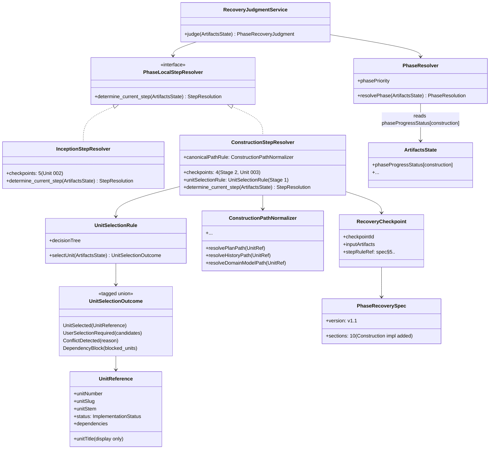

# ドメインモデル: Unit 003 Construction Phase インデックス化

## 概要

Unit 001 で確立したフェーズインデックス構造と Unit 002 で確立した規範仕様（`phase-recovery-spec.md`）+ 2 段レゾルバ構造を Construction Phase に展開する。Construction Phase は Inception と異なり「Unit loop 構造」を持つため、`ConstructionStepResolver` は内部的に 2 段決定（Stage 1: Unit 特定 / Stage 2: Step 特定）を行う。Phase 遷移（Construction → Operations）は `PhaseResolver`（spec §4）の責務として維持し、`ConstructionStepResolver` は step のみを返す。

本 Unit のドメインモデルは Unit 002 ドメインモデルの**拡張**として設計し、既存エンティティ（`RecoveryJudgmentService` / `PhaseResolver` / `RecoveryCheckpoint` / `PhaseRecoverySpec` 等）と値オブジェクト（`ArtifactsState` / `PhaseProgressStatus` / `StepResolution` 等）は**再利用**する。本ドキュメントでは Unit 003 で**追加・変更**される要素のみを記述する。

**重要**: このドメインモデル設計では**コードは書かず**、構造と責務の定義のみを行う。

## 追加エンティティ

### ConstructionStepResolver（`PhaseLocalStepResolver` の Construction 実装）

- **ID**: `phase=construction`
- **継承**: `PhaseLocalStepResolver`（Unit 002 で定義された非公開下位契約）
- **属性**:
  - `phase`: `construction`（固定）
  - `checkpoints`: Construction 向け `RecoveryCheckpoint` のリスト（**4 checkpoint**、Stage 2 の step 進行判定用。binding 層から供給）
  - `unitSelectionRule`: `UnitSelectionRule`（値オブジェクト、Stage 1 の決定ツリー）
  - `canonicalPathRule`: `ConstructionPathNormalizer`（値オブジェクト、ファイル命名規約の正規化）
- **振る舞い**:
  - `determine_current_step(artifactsState) → StepResolution`:
    - **Stage 1: 現在進行中 Unit の特定** — `unitSelectionRule.selectUnit(artifactsState)` を呼び、`UnitSelectionOutcome` を得る
    - **Stage 2: 進行中 Unit の現在ステップ特定** — `UnitSelectionOutcome` が `UnitSelected(currentUnit)` の場合のみ、`currentUnit` の各 checkpoint を評価して単一の `step_id` を返す
    - `UnitSelectionOutcome` が `ConflictDetected` → `result=undecidable:conflict`
    - `UnitSelectionOutcome` が `UserSelectionRequired(candidates)` → `diagnostics[]` に `user_selection_required` info を追加し、`result=None`（呼び出し層でユーザー選択フロー起動）
    - `UnitSelectionOutcome` が `DependencyBlock` → `result=undecidable:dependency_block`
    - **`AllUnitsCompleted` は本 resolver では発生しない**: `PhaseResolver` が `phaseProgressStatus[construction]=completed` を先に検出するため、`ConstructionStepResolver` が呼ばれる時点で必ず `phaseProgressStatus[construction]=incomplete` が保証される（= 少なくとも 1 つの未完了 Unit が存在する）
  - `detectLegacyStructure(artifactsState) → Optional<Diagnostic>`: v2.2.x 以前の `construction/implementation.md` 単一ファイル等を検出し、warning diagnostic を返す
  - `validateArtifacts(artifactsState) → Optional<Undecidable>`: `missing_file`（plan 未存在等）/ `format_error`（history 破損等）を検出

**Unit 003 スコープ**: 本 Unit では `ConstructionStepResolver` の仕様化と Construction binding（`steps/construction/index.md`）の materialization を行う。Operations 向けの `OperationsStepResolver` は Unit 004 の責務。

## 追加値オブジェクト（Value Object）

### UnitSelectionRule（Stage 1 決定ツリー）

- **責務**: Unit 定義ファイル群のスキャン結果から「次にどの Unit を対象とするか」を単一の結果に決定する
- **属性**:
  - `decisionTree`: 既存 `steps/construction/01-setup.md` ステップ 7 の選定ロジックを忠実に表現した決定ツリー（宣言的）
- **振る舞い**:
  - `selectUnit(artifactsState) → UnitSelectionOutcome`:
    1. `in_progress_units = { u | u.status=進行中 }` を算出
    2. `executable_units = { u | u.status=未着手 ∧ u.dependencies ⊆ {完了,取り下げ} }` を算出
    3. `pending_units = { u | u.status∈{未着手,進行中} }` を算出
    4. 決定ツリー（事前条件: `phaseProgressStatus[construction]=incomplete` が PhaseResolver 側で保証、すなわち `|pending_units| > 0`）:
       - `|in_progress_units| ≥ 2` → `ConflictDetected(multi_unit_in_progress)`
       - `|in_progress_units| = 1` → `UnitSelected(that_unit)`（`currentUnit` として Stage 2 へ）
       - `|executable_units| = 0` → `DependencyBlock(pending_units)`（未着手だが依存未達）
       - `|executable_units| = 1` → `UnitSelected(that_unit)`（新規 Unit 選定、step=`construction.01-setup`）
       - `|executable_units| ≥ 2 ∧ automation_mode=semi_auto` → `UnitSelected(min_by_number(executable_units))`（番号順で最小を自動選択）
       - `|executable_units| ≥ 2 ∧ automation_mode=manual` → `UserSelectionRequired(executable_units)`（型レベルで nullable を排除）
- **不変性**: 決定ツリー自体は規範仕様で固定。`automation_mode` は判定時に `artifactsState` から読み取る

### UnitSelectionOutcome（タグ付きユニオン）

- **属性**: `type`: `"UnitSelected" | "UserSelectionRequired" | "ConflictDetected" | "DependencyBlock"`
  - `UnitSelected(currentUnit: UnitReference)`: 進行対象の Unit が単一に決定できた（`currentUnit` は必ず非 null）
  - `UserSelectionRequired(candidateUnits: List<UnitReference>)`: 複数の実行可能 Unit があり、`automation_mode=manual` のためユーザー選択が必要（Stage 2 には進まない）
  - `ConflictDetected(reason: "multi_unit_in_progress")`: 複数 Unit が同時進行中で決定不能（blocking）
  - `DependencyBlock(blocked_units: List<UnitReference>)`: 実行可能 Unit がなく依存ブロック（blocking）

**注意**: `AllUnitsCompleted` バリアントは存在しない。Construction 完了は `PhaseResolver` が `phaseProgressStatus[construction]=completed` を検出して吸収するため、`ConstructionStepResolver` に到達する時点で常に `|pending_units| > 0` が保証される。
- **不変性**: 生成後は変更不可
- **等価性**: `type` と付随データの一致

**重要**: `UnitSelected` の `currentUnit` は nullable ではない。ユーザー選択フローに入る場合は `UserSelectionRequired` バリアントを使い、型レベルで不正状態を排除する。

### UnitReference

- **属性**:
  - `unitNumber`: ゼロ埋め 3 桁数値（例: `001`、`002`、`003`）
  - `unitSlug`: ケバブケース文字列。Unit 定義ファイル名 `{NNN}-{slug}.md` から抽出（例: `inception-phase-index`、`universal-recovery-base`、`construction-phase-index`）
  - `unitStem`: `unitSlug` をアンダースコア化した path 構築用キー（例: `inception_phase_index`、`universal_recovery_base`、`construction_phase_index`）。ファイルシステム上の path 構築専用であり、タイトル文字列とは独立
  - `unitTitle`: 表示専用のタイトル文字列（Unit 定義ファイルの `# Unit: ...` 見出しから抽出）。日本語・任意文字列を許容するが path 構築には一切使用しない
  - `status`: `ImplementationStatus`
  - `dependencies`: `List<UnitReference>`（依存 Unit）
- **等価性**: `unitNumber` による一意性

**重要**: path 構築は `unitSlug` / `unitStem` のみを使い、`unitTitle` は使わない。`unitTitle` はタイトル変更があっても path に影響しないようにするための分離。

### ImplementationStatus

- **属性**: `status`: `"未着手" | "進行中" | "完了" | "取り下げ"`
- **不変性**: Unit 定義ファイル「実装状態」セクションの値を正規化した列挙

### ConstructionPathNormalizer（canonical path 解決）

- **責務**: Construction 成果物のファイル命名規約の混在を、`unitSlug`（ケバブケース）と `unitStem`（アンダースコア化）の 2 種類のキーだけで吸収する。`unitTitle` は path 構築に使用しない
- **属性**:
  - `unitNumberKey`: ゼロ埋め 3 桁（`{NNN}`）
  - `unitNumberTwoDigitKey`: 2 桁（`{NN}`）
  - `unitSlugKey`: ケバブケース slug（`story-artifacts/units/{NNN}-{slug}.md` や `{NNN}-review-summary.md` 等）
  - `unitStemKey`: アンダースコア化された stem（`design-artifacts/domain-models/unit_{NNN}_{stem}_domain_model.md` 等、ファイルシステム上の path 部品として使う）
- **振る舞い**（すべて spec §5.2 の正規化表で固定される）:
  - `resolvePlanPath(unitRef: UnitReference) → Path`: `plans/unit-{NNN}-plan.md`
  - `resolveHistoryPath(unitRef: UnitReference) → Path`: `history/construction_unit{NN}.md`（NN = unitNumber の下 2 桁）
  - `resolveDomainModelPath(unitRef: UnitReference) → Path`: `design-artifacts/domain-models/unit_{NNN}_{stem}_domain_model.md`
  - `resolveLogicalDesignPath(unitRef: UnitReference) → Path`: `design-artifacts/logical-designs/unit_{NNN}_{stem}_logical_design.md`
  - `resolveVerificationPath(unitRef: UnitReference) → Path`: `construction/units/unit_{NNN}_{stem}_verification.md`
  - `resolveReviewSummaryPath(unitRef: UnitReference) → Path`: `construction/units/{NNN}-review-summary.md`
  - `resolveUnitDefPath(unitRef: UnitReference) → Path`: `story-artifacts/units/{NNN}-{slug}.md`
- **不変性**: 命名規約は spec §5.2 の正規化表で固定される。`unitTitle` や日本語文字列は一切 path 構築に使わない

## 追加 UndecidableReason 値

### dependency_block（新 reason_code）

- **blocking 系の新 reason_code**
- **判定条件**: Construction Phase において、`in_progress_units=0 ∧ executable_units=0 ∧ pending_units>0`（未完了 Unit があるが依存関係で実行できない状態）
- **期待動作**: `result=undecidable:dependency_block`、`automation_mode=semi_auto` でも自動継続禁止（`spec§8`）。呼び出し層は依存 Unit 一覧をユーザーに提示し、取り下げ or 依存解消の選択を促す

## Construction Checkpoint 仕様

Stage 1（Unit 特定）と Stage 2（Step 特定）は明確に分離する。Stage 1 は `UnitSelectionRule` のアルゴリズム節として `phase-recovery-spec.md §5.2` に記載され、`RecoveryCheckpoint` 表には**含めない**。`RecoveryCheckpoint` 表は Stage 2 の step 進行判定のみを扱う 4 行構成とする。

**Stage 2 の checkpoint 表（4 行構成）**:

| checkpoint_id | 判定規則（spec §5.2 内で定義） | 対応 step_id |
|---------------|-------------------------------|--------------|
| `construction.setup_done` | `plans/unit-{NNN}-plan.md` 存在 ∧ `history/construction_unit{NN}.md` に「計画承認」記録 | `construction.02-design`（次に進むべき step） |
| `construction.design_done` | Phase 1 完了条件: (a) `domain-models/unit_{NNN}_{stem}_domain_model.md` + `logical-designs/unit_{NNN}_{stem}_logical_design.md` 存在 ∧ `history` に「設計承認」記録 OR (b) `depth_level=minimal` かつ `history` に「設計省略」記録 | `construction.03-implementation` |
| `construction.implementation_done` | `history/construction_unit{NN}.md` に「実装承認」or 統合レビュー完了記録 | `construction.04-completion` |
| `construction.completion_done` | `story-artifacts/units/{NNN}-{slug}.md` の実装状態=「完了」 ∧ `history` に「Unit 完了」記録 | Stage 1 の次周回（次 Unit へ遷移、または全 Unit 完了により `phaseProgressStatus[construction]=completed` となり PhaseResolver が吸収） |

**binding 層の表スキーマとの整合**: Unit 001 で確立した `RecoveryCheckpoint` 列スキーマは 5 列（`checkpoint_id` / `input_artifacts` / `priority_order` / `undecidable_return` / `user_confirmation_required`）で 5 行を想定していた。Unit 003 の Construction binding は 4 行となるが、これは Construction が「Stage 2 のみ」を binding 層で表現するため自然な減少である（Stage 1 は Unit Loop 構造に固有のアルゴリズムで、Inception の 5 checkpoint 構造と本質的に異なる）。列スキーマは不変。

**単値化ルール**: checkpoint は「最後まで達成された最後段」を基準に単一の step_id を返す。例えば `setup_done` は達成済み・`design_done` 未達成の場合、返すべき step は「設計に進むべき」= `construction.02-design`。

## 集約の拡張

### PhaseRecoveryJudgment（集約ルート: `RecoveryJudgmentService`）- 拡張

Unit 002 で定義された集約に以下の要素を追加:

- **含まれる要素の追加**:
  - `ConstructionStepResolver`（Unit 003 で追加）
  - Construction 向け `RecoveryCheckpoint` 群（**4 件**、Stage 2 用の step 進行判定。binding 層から供給）
  - `UnitSelectionRule` / `UnitSelectionOutcome` 値オブジェクト群
  - `ConstructionPathNormalizer`
- **不変条件の追加**:
  - `ConstructionStepResolver.determine_current_step()` は `UnitSelectionRule.selectUnit()` を常に最初に呼ぶ（Stage 1 → Stage 2 の順序）
  - `ConstructionStepResolver` が呼ばれる時点で `phaseProgressStatus[construction]=incomplete` が事前条件として成立する（`PhaseResolver` が保証）。このため `UnitSelectionOutcome` に `AllUnitsCompleted` バリアントは存在せず、型レベルで Construction 完了状態を排除する
  - Construction 固有 checkpoint の `stepRuleRef` は推奨形式 `spec§5.construction.<checkpoint_suffix>` を使用する
  - 同一 Unit 定義セットに対して `UnitSelectionRule.selectUnit()` は決定論的な結果を返す（`automation_mode` を含めた入力が同じなら同じ結果）

### PhaseRecoverySpecification（集約ルート: `PhaseRecoverySpec`）- 拡張

- **更新内容**:
  - `version`: `v1.0` → `v1.1`（minor 更新）
  - §3 に `phaseProgressStatus[construction]` の意味論を追加（`unknown` / `incomplete` / `completed`）
  - §4 に「Construction 完了条件」を追加: 判定順3 に `phaseProgressStatus[construction]=incomplete` 必須条件、判定順4 の Operations 判定で `construction_complete` info diagnostic 追加
  - §5.2 を placeholder から実装に昇格（Stage 1 アルゴリズム節 / Stage 2 の 4 checkpoint 判定条件、canonical path 正規化表、depth_level=minimal 対応）
  - §7 に `dependency_block` 新 reason_code を追加
  - §9 の token grammar を正式化: **推奨形式** `spec§5.<phase>.<checkpoint>` を明記し、Unit 001/002 で使用されていた省略形 `spec§5.<checkpoint>` は **後方互換 alias**（Inception 暗黙形）として許容。spec_version は minor 更新のまま、binding 側の移行は推奨だが必須ではない
  - §10.2（Construction 適用例）を追加
- **不変条件の追加**:
  - `spec_version` が minor 更新（v1.1）の場合、既存 binding は後方互換 alias で動作可能。Unit 003 の作業範囲では Inception binding も明示形に migrate するが、これは cleanliness 目的の同時更新であり、互換性維持のための必須作業ではない

## ArtifactsState の拡張（spec §3）と PhaseResolver の拡張（spec §4）

### ArtifactsState の拡張（spec §3）

Unit 002 の `ArtifactsState` の `phaseProgressStatus: Map<PhaseName, PhaseProgressStatus>` を **Construction についても明示的に定義**する。Unit 002 時点では Construction の `phaseProgressStatus` は未定義だったが、Unit 003 で以下の意味論を spec §3 に追加する:

- `phaseProgressStatus[construction]`:
  - `unknown`: `story-artifacts/units/*.md` が 1 件も存在しない
  - `incomplete`: `story-artifacts/units/*.md` が存在し、かつ `∃ unit. status ∈ {未着手, 進行中}`
  - `completed`: `story-artifacts/units/*.md` が存在し、かつ `∀ unit. status ∈ {完了, 取り下げ}`

この集約値は `ArtifactsStateRepository.snapshot()` が構築時に 1 度だけ計算し、以降は不変とする。`PhaseResolver` はこの集約値を参照するだけで Construction 完了を判定できる（`ConstructionStepResolver` への仮呼び出しは行わない）。

### PhaseResolver の拡張（spec §4）

Unit 002 の `PhaseResolver` 定義を以下の形で**拡張**する（責務・公開 API は不変）:

- **判定順3の拡張**（Construction 判定）: 既存の「`story-artifacts/units/*.md` が存在し、かつ `phaseProgressStatus[inception]=completed`」に以下の必須条件を追加:
  - **`phaseProgressStatus[construction]=incomplete`**: Construction 判定3には「Construction フェーズに未完了 Unit が存在する」ことが必要。`phaseProgressStatus[construction]=completed`（全 Unit 完了）の場合は判定順3 を skip し、判定順4（Operations 判定）へ進む
- **判定順4の拡張**（Operations 判定）: 既存の Operations 判定条件に加え、Construction 完了後の Operations 未着手ケースを扱う:
  - `phaseProgressStatus[inception]=completed` ∧ `phaseProgressStatus[construction]=completed` ∧ `phaseProgressStatus[operations]=unknown`（Operations 未開始）→ Operations に遷移しつつ `diagnostics[]` に `construction_complete` info を追加
- **注意**: この拡張により、`PhaseResolver` は `ConstructionStepResolver` を一切呼び出さずに Construction 完了を判定できる。`ConstructionStepResolver` は phase 判定後（`result=construction`）にのみ呼ばれ、2 段構造の責務境界が保たれる

## Materialized Binding の構造

Construction Phase の binding 層（`steps/construction/index.md`）は Unit 001 で確立した構造を流用し、以下の要素を Construction 向けに差し替える:

- **章立て**: 1. 目次 / 2. 分岐ロジック / 3. 判定チェックポイント表（Stage 2 / 4 行）+ Stage 1 アルゴリズム節 / 4. ステップ読み込み契約 / 5. 汎用構造仕様（参照のみ）
- **step_id 命名**: `construction.01-setup` / `construction.02-design` / `construction.03-implementation` / `construction.04-completion`
- **checkpoint_id**: Stage 2 の 4 件（`setup_done` / `design_done` / `implementation_done` / `completion_done`）。Stage 1（Unit 選定）は checkpoint 表ではなくアルゴリズム節として記述
- **参照トークン**: `spec§5.construction.<checkpoint_suffix>` / `spec§6` / `spec§8`
- **分岐ロジック**: Construction 固有の分岐（Unit 選定 = Stage 1、`depth_level`、`automation_mode`、エクスプレス、AI レビュー、Self-Healing ループのトリガのみ）

既存 Construction ステップファイル（`01-setup.md` 〜 `04-completion.md`）から、インデックスに集約される分岐・判定・`automation_mode` 分岐の重複記述を除去し、詳細手順のみ残す。Self-Healing ループ本体・Unit 完了時必須作業手順・エラー分類判定等の詳細は詳細ファイルに残す（インデックス化対象外）。

## ドメインモデル図（Unit 002 からの差分）

**注意**: Mermaid 図に `PhaseResolver --> ConstructionStepResolver` の直接依存線は**存在しない**。`PhaseResolver` は `ArtifactsState.phaseProgressStatus[construction]` の集約値を読み取るだけで Construction 完了を判定し、`ConstructionStepResolver` を仮呼び出ししない。

## 責務分離の再確認

- **phase 判定**: `PhaseResolver`（spec §4）の責務。Unit 003 で判定順3 に `phaseProgressStatus[construction]=incomplete` 必須条件を追加するが、これは `ArtifactsState` の集約値を参照するだけで、`ConstructionStepResolver` への仮呼び出しは一切発生しない
- **step 判定**: `ConstructionStepResolver`（spec §5.2）の責務。Stage 1（Unit 特定）→ Stage 2（Step 特定）の 2 段構造。`AllUnitsCompleted` バリアントは存在せず、事前条件として `phaseProgressStatus[construction]=incomplete` が保証される
- **規範仕様**: `phase-recovery-spec.md` の正本性は不変。Unit 003 は §3 拡張 + §4 拡張 + §5.2 実装 + §7 追加 + §9 正式化 + §10.2 追加を行うが、責務境界・公開 API は Unit 002 と同じ

## Unit 004/006 への接続点

- **Unit 004 (Operations)**: `OperationsStepResolver` を `PhaseLocalStepResolver` の派生として追加。本 Unit で確立した「2 段決定 + canonical path 正規化 + spec token 拡張形式」を再利用する
- **Unit 006 (計測・クローズ)**: 全フェーズ横断の実地回帰検証。本 Unit では Unit 001 を「完了 Unit」として認識できることと `multi_unit_in_progress` fixture での conflict 検出のみを最小実地回帰として実施
