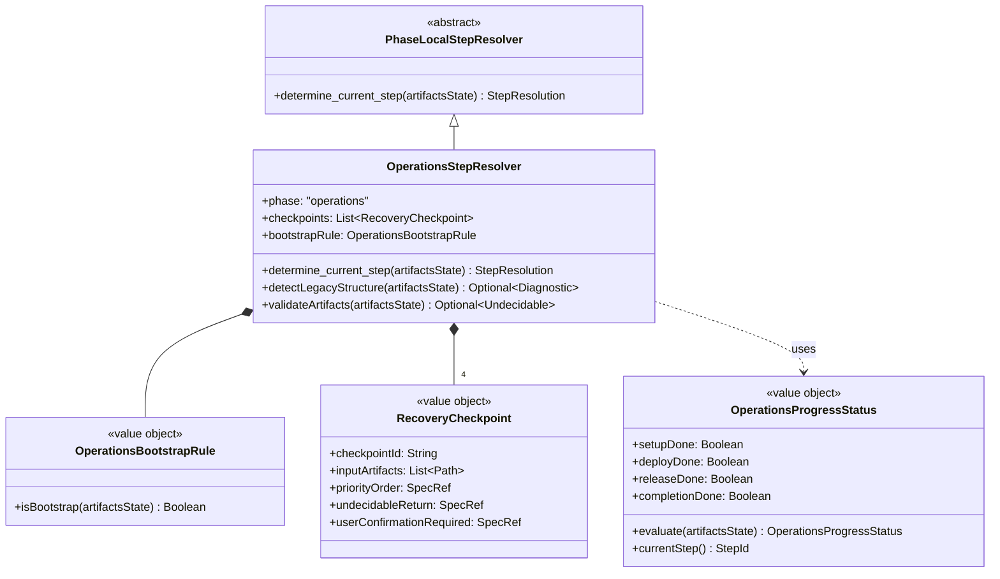

# ドメインモデル: Unit 004 Operations Phase インデックス化

## 概要

Unit 001 で確立したフェーズインデックス構造、Unit 002 で確立した規範仕様（`phase-recovery-spec.md`）+ 2 段レゾルバ構造、Unit 003 で確立した Construction 向け `ConstructionStepResolver` のパターンを **Operations Phase に展開**する。Operations Phase は Inception と同様に Unit loop 構造を持たない直線的進行であり、`OperationsStepResolver` は Inception の `InceptionStepResolver` と同型の単純な checkpoint 評価のみを行う。

本 Unit のドメインモデルは Unit 002/003 ドメインモデルの**拡張**として設計し、既存エンティティ（`RecoveryJudgmentService` / `PhaseResolver` / `RecoveryCheckpoint` / `PhaseRecoverySpec` 等）と値オブジェクト（`ArtifactsState` / `PhaseProgressStatus` / `StepResolution` 等）は**再利用**する。本ドキュメントでは Unit 004 で**追加・変更**される要素のみを記述する。

**重要**: このドメインモデル設計では**コードは書かず**、構造と責務の定義のみを行う。

## 追加エンティティ

### OperationsStepResolver（`PhaseLocalStepResolver` の Operations 実装）

- **ID**: `phase=operations`
- **継承**: `PhaseLocalStepResolver`（Unit 002 で定義された非公開下位契約）
- **属性**:
  - `phase`: `operations`（固定）
  - `checkpoints`: Operations 向け `RecoveryCheckpoint` のリスト（**4 checkpoint**、binding 層から供給）
  - `bootstrapRule`: `OperationsBootstrapRule`（値オブジェクト、Construction → Operations 初回遷移の判定）
- **振る舞い**:
  - `determine_current_step(artifactsState) → StepResolution`:
    1. **bootstrap 分岐評価**: `bootstrapRule.isBootstrap(artifactsState)` を呼び、`true` なら `step_id=operations.01-setup` を返す（Operations 新規開始の正常状態）
    2. **直線的 checkpoint 評価**: `checkpoints` を順に評価し、**未達成の最初の checkpoint** に対応する `step_id` を返す（Inception の評価ロジックと同型）
    3. **すべて達成**: `step_id=operations.04-completion` を返す（次サイクル準備可能状態）
  - `detectLegacyStructure(artifactsState) → Optional<Diagnostic>`: v2.2.x 以前の `operations.md` 単一ファイル等を検出し、warning diagnostic を返す
  - `validateArtifacts(artifactsState) → Optional<Undecidable>`:
    - `operations/progress.md` がパース不能 → `format_error`
    - **bootstrap でない**かつ Operations 進行中マーカーがあるのに `operations/progress.md` 欠損 → `missing_file`
    - **bootstrap である**（Construction 完了直後 + Operations 未着手）→ `validateArtifacts` は何も返さず、`bootstrap_rule` 経由で正常系として処理

**Construction との対比**:

| 観点 | `ConstructionStepResolver`（Unit 003） | `OperationsStepResolver`（Unit 004） |
|------|---------------------------------------|-------------------------------------|
| 進行構造 | Unit loop（複数 Unit を順次実行） | 直線的（単一の Phase 進行） |
| 判定段階 | 2 段（Stage 1: Unit 特定 / Stage 2: Step 特定） | 1 段（直線 checkpoint 評価） |
| 入力 | Unit 定義ファイル群 + history | `operations/progress.md` + history |
| Outcome タイプ | `UnitSelectionOutcome`（タグ付きユニオン） | 直接 `StepResolution` を返す |
| Phase 完了の扱い | `phaseProgressStatus[construction]=completed` を `PhaseResolver` が吸収 | Operations は最終フェーズなので「次サイクル」遷移は AI-DLC オーケストレーター層の責務 |
| bootstrap 分岐 | なし（`PhaseResolver` の判定順 3 で吸収） | あり（`bootstrapRule.isBootstrap` で正常系として扱う） |

## 追加値オブジェクト（Value Object）

### OperationsBootstrapRule

- **責務**: Construction → Operations の初回遷移を「正常な未着手状態」として識別し、`undecidable:missing_file` との衝突を防ぐ
- **属性**:
  - `bootstrapCondition`: 規範仕様で固定された判定条件
- **振る舞い**:
  - `isBootstrap(artifactsState) → Boolean`:
    1. `artifactsState.phaseProgressStatus[construction] == completed` であること
    2. `operations/progress.md` が存在しないこと
    3. `history/operations.md` が存在しないこと（または空であること）
    4. 上記すべてが満たされる場合は `true`（bootstrap 状態）、それ以外は `false`
- **不変性**: 判定条件は規範仕様で固定。`artifactsState` は判定時に読み取る
- **等価性**: 値オブジェクトとして同一クラス内で常に同じ振る舞い

**設計意図**: Operations Phase は AI-DLC サイクルの最終フェーズで、Construction 完了直後に新規開始される。この最初の起動時には `operations/progress.md` がまだ作成されていない（`operations.01-setup` がそれを作成する責務）。この状態を `missing_file` として blocking すると、正規の遷移パスが自分で塞がれてしまうため、bootstrap として明示的に正常系扱いする。

### OperationsCheckpoint（Construction の `RecoveryCheckpoint` を流用）

Operations checkpoint は Unit 001 で確立した `RecoveryCheckpoint` 値オブジェクトをそのまま使用する。属性追加は不要。

**4 checkpoint の責務**（`steps/operations/index.md` の binding テーブルで具現化）:

| checkpoint_id | 対応 step_id | 対応 detail_file | 判定条件 | 対応するファイル責務 |
|--------------|-------------|----------------|---------|-------------------|
| `operations.setup_done` | `operations.01-setup` | `01-setup.md` | `operations/progress.md` が**存在する**（01-setup.md が初期化済み） | プリフライト、Depth Level 確認、`operations/progress.md` の新規作成、運用引き継ぎ情報読み込み、全 Unit 完了確認、Construction 引き継ぎタスク確認 |
| `operations.deploy_done` | `operations.02-deploy` | `02-deploy.md` | `operations/progress.md` のステップ1-7 のすべてが「完了」or「スキップ」（= PR 準備完了 = 7.7 Gitコミット完了） | ステップ1（変更確認）、ステップ2-5（デプロイ準備一式）、ステップ6（バックログ整理）、ステップ7.1-7.7（リリース準備の PR 準備完了まで） |
| `operations.release_done` | `operations.03-release` | `03-release.md` | `history/operations.md` に「PR Ready 化」記録あり（= サブステップ 7.8 完了） | 実行ルール確認、PR Ready 化、完了基準確認 |
| `operations.completion_done` | `operations.04-completion` | `04-completion.md` | `history/operations.md` に「PR マージ」記録あり（= サブステップ 7.13 完了） | PR マージ後手順、worktree フロー、バージョンタグ付け、次サイクル準備 |

**1:1 対応の保証**: 4 checkpoint × 4 step_id × 4 detail_file の 1:1 対応により、`StepLoadingContract` が現実のファイル責務と矛盾しない。`setup_done` は「`01-setup.md` の責務完了 = `operations/progress.md` が作成済み」と再定義することで、ファイル境界と判定条件を完全に一致させる。Inception の 5 step_id × 5 detail_file 構造とは数が異なるが、構造的には同型。

### OperationsProgressStatus（Inception/Construction の対称）

- **属性**:
  - `setupDone`: Boolean
  - `deployDone`: Boolean
  - `releaseDone`: Boolean
  - `completionDone`: Boolean
- **振る舞い**:
  - `evaluate(artifactsState) → OperationsProgressStatus`: `operations/progress.md` と `history/operations.md` から各 done フラグを評価
  - `currentStep() → StepId`: 未達成の最初の checkpoint に対応する step_id を返す
- **不変性**: 値オブジェクトとして変更不可

## 既存エンティティの変更

### PhaseResolver（Unit 002 で定義、変更なし）

Unit 004 では `PhaseResolver` の判定順は変更しない。**判定順2（Operations 判定）** は既に「`operations/progress.md` が存在し、かつ `phaseProgressStatus[operations]=incomplete`」で Operations と判定となっている。さらに Unit 003 で追加された「Construction 完了後の Operations 未着手ケース（spec §4.1 末尾）」では、`phaseProgressStatus[construction]=completed ∧ phaseProgressStatus[operations]=unknown` のとき判定順3 を skip し判定順2 にも `operations/progress.md` 不存在で合致しないが、最終的に `result=operations` を返しつつ `diagnostics[]` に `construction_complete`（severity=info）を追加する形で Operations Phase の新規開始を促す。

Unit 004 ではこの分岐先で `OperationsStepResolver` への委譲先のみが暫定ディスパッチャから正式実装に切り替わる。

**接続点**: PhaseResolver が Operations と判定（通常または bootstrap 経路）→ `OperationsStepResolver.determine_current_step()` を呼ぶ → bootstrap 分岐 or checkpoint 評価で `step_id` を返す。bootstrap 経路では `OperationsStepResolver` 側の `OperationsBootstrapRule.isBootstrap` が `true` を返し、`step_id=operations.01-setup` を返す。

### RecoveryJudgmentService（Unit 002 で定義、変更なし）

公開 API である `judge()` は変更なし。内部実装の `OperationsStepResolver` への委譲が Unit 004 で接続される。

### PhaseRecoverySpec（規範仕様の改訂）

- **`spec_version`**: v1.1 → v1.2 への minor 更新
  - **更新理由**: §5.3 を placeholder から実装に昇格、§12 Operations 適用例追加。binding schema や参照トークン形式（§9.3）は変更なし
- **§1.3**: Unit 004 責務を「実値化済み」に更新
- **§2.2**: Operations 実装を「Unit 004 で実値化（Inception 同型の直線評価、4 checkpoint × 4 step_id × 4 detail_file の 1:1 対応、bootstrap 分岐含む）」に更新
- **§5.3**: 実装内容を記述（4 checkpoint の判定条件、bootstrap 分岐、`OperationsStepResolver` のアルゴリズム）
- **§6**: Operations 戻り値説明から「placeholder」記述を削除
- **§12**: Operations 適用例セクションを新規追加（Construction §11 と同様の構造）

## 集約境界

### OperationsStepResolver 集約

- **集約ルート**: `OperationsStepResolver`
- **構成**:
  - `OperationsBootstrapRule`（値オブジェクト、bootstrap 分岐判定）
  - `RecoveryCheckpoint × 4`（値オブジェクト、Stage 評価）
  - `OperationsProgressStatus`（値オブジェクト、評価結果）
- **不変条件**:
  - `checkpoints.size() == 4` で常に固定
  - `checkpoint_id` は `operations.setup_done` / `deploy_done` / `release_done` / `completion_done` の 4 種類のみ
  - `bootstrapRule` は単一インスタンス（規範仕様で定義された判定条件を実装）
  - `determine_current_step()` の戻り値は常に `StepResolution` 型に従う

### Operations Phase 全体の不変条件

- 任意の有効な `artifactsState` に対して、`OperationsStepResolver.determine_current_step()` は以下のいずれかを返す:
  - `step_id ∈ { operations.01-setup, operations.02-deploy, operations.03-release, operations.04-completion }`（正常系）
  - `result=undecidable:missing_file`（Operations 進行中なのに progress.md 欠損）
  - `result=undecidable:format_error`（progress.md パース不能）
- bootstrap 状態では常に `step_id=operations.01-setup` を返し、`undecidable:missing_file` を**返さない**
- 戻り値は常に単一値（複数 step_id の混在はない）

## 用語集

| 用語 | 定義 |
|------|------|
| `OperationsStepResolver` | `PhaseLocalStepResolver` の Operations 実装 |
| `OperationsBootstrapRule` | Construction 完了直後の Operations 新規開始を正常系として識別する規則 |
| bootstrap 状態 | `phaseProgressStatus[construction]=completed ∧ operations/progress.md 未存在 ∧ history/operations.md 未存在` の状態 |
| `OperationsProgressStatus` | Operations Phase の 4 checkpoint の達成状態を表す値オブジェクト |
| 直線的進行 | Unit loop を持たず、progress.md ベースで順次進行する Operations の構造 |
| `OperationsCheckpoint` | Unit 001 の `RecoveryCheckpoint` を Operations 向けに具現化したインスタンス |

## 関連 spec 参照トークン

Unit 003 で確立した推奨形式 `spec§5.<phase>.<checkpoint>` を Operations binding でも使用:

- `spec§5.operations.setup_done`
- `spec§5.operations.deploy_done`
- `spec§5.operations.release_done`
- `spec§5.operations.completion_done`
- `spec§5.operations.bootstrap`（bootstrap 分岐の参照トークン）

## クラス図（Mermaid）

## 設計の妥当性

1. **Inception 同型の単純さ**: Construction の `UnitSelectionOutcome` のような複雑なタグ付きユニオンは不要。直線的進行のため `StepResolution` を直接返す
2. **bootstrap 分岐の必然性**: Operations は AI-DLC サイクルの最終フェーズであり、Construction 完了直後に新規開始される。この遷移を blocking しないために bootstrap 分岐が不可欠
3. **4 checkpoint × 4 detail_file の 1:1 対応**: Materialized Binding 原則を維持。`StepLoadingContract` が現実のファイル責務と矛盾しない
4. **責務境界**: `OperationsStepResolver` は step のみを返す。Phase 遷移（Operations 完了 → 次サイクル開始）は AI-DLC オーケストレーター層の責務であり、本 resolver の対象外
5. **Unit 005/006 への接続点**: Unit 004 完了時点で `phase-recovery-spec.md §5` 配下のすべての phase（Inception / Construction / Operations）が実値化される。Unit 005（Tier2 統合）/ Unit 006（計測・クローズ判断）は Unit 001-004 で確立したインデックス構造を前提とする
