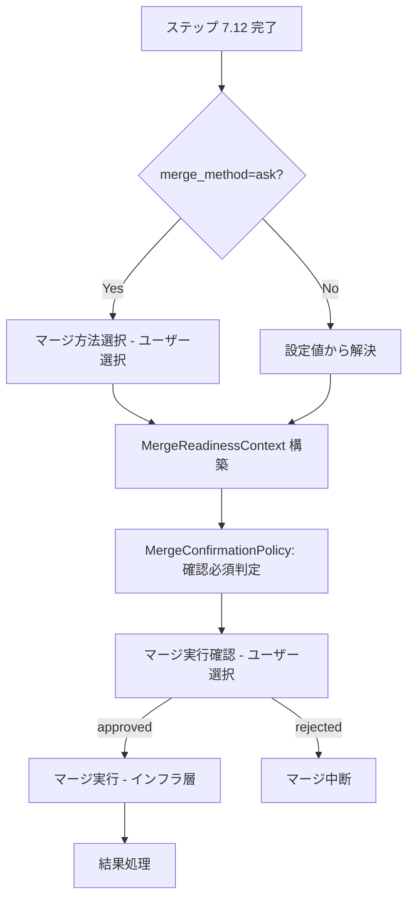

# ドメインモデル: PRマージのユーザー判断化

## 概要

Operations Phase のPRマージ（ステップ 7.13）におけるインタラクション種別を「ゲート承認」から「ユーザー選択」に再分類し、`automation_mode` に関わらずユーザー確認を必須とするワークフロー変更の構造を定義する。

**重要**: このドメインモデル設計では**コードは書かず**、構造と責務の定義のみを行います。

## エンティティ（ワークフロー構成要素）

### MergeConfirmationPolicy（マージ確認ポリシー）

マージ実行前の確認要否を決定するポリシー。

- **ID**: ステップ識別子（`operations.step-7.13`）
- **属性**:
  - `interaction_type`: InteractionType - 「ユーザー選択」（変更後）
  - `confirmation_required`: Boolean - 常に `true`（`automation_mode` に関わらず）
- **不変条件**:
  - `interaction_type` が「ユーザー選択」のとき、`confirmation_required` は常に `true`
  - 確認が完了するまでマージ実行に遷移できない

### InteractionType（インタラクション種別）

ワークフロー上のユーザーインタラクションの分類。SKILL.md「AskUserQuestion使用ルール」で定義された3種別。

- **ID**: 種別名
- **種別と `semi_auto` 時の動作**:

| 種別 | semi_auto 時の動作 | 対象例 |
|------|-------------------|--------|
| ゲート承認 | `auto_approved` 可能 | 計画承認、設計承認、PR Ready化承認 |
| ユーザー選択 | 常にユーザー確認必須 | PRマージ実行、マージ方法選択(`ask`時) |
| 情報収集 | 常にユーザー確認必須 | 追加コンテキスト入力 |

### MergeExecutionDecision（マージ実行判断）

ユーザー確認の結果を表す。

- **ID**: 判断結果
- **属性**:
  - `approved`: Boolean - ユーザーがマージを承認したか
- **遷移**:
  - `approved=true` → マージ実行へ
  - `approved=false` → マージ中断（ユーザー判断で次のアクションを決定）

## 値オブジェクト

### MergeReadinessContext（マージ準備コンテキスト）

マージ実行確認に必要な情報のスナップショット。確認UIに渡される入力情報。

- **属性**:
  - `pr_number`: Integer - PR番号
  - `resolved_merge_method`: MergeMethod - 確定済みマージ方法（`merge_method` 設定または `ask` 時のユーザー選択から解決済み）
  - `gh_availability`: GhAvailabilityStatus - GitHub CLI の利用可否
- **不変性**: 確認時点の情報スナップショットとして不変
- **等価性**: 全属性の等価性で判定

### MergeMethod（マージ方法）

- **有効値**: `merge` | `squash` | `rebase`
- **解決元**: `merge_method` 設定値。`ask` の場合はステップ 7.13 の先行手順でユーザーが選択済み

### GhAvailabilityStatus（GitHub CLI 利用可否）

- **有効値**: `available` | その他（`not-authenticated` 等）
- **解決元**: プリフライトチェックの `gh_status`

## 集約

### PRマージワークフロー

- **集約ルート**: MergeConfirmationPolicy
- **含まれる要素**: MergeExecutionDecision、MergeReadinessContext
- **境界**: ステップ 7.13 内の確認→実行フロー
- **不変条件**:
  - マージ実行前に必ずユーザー確認が完了していること
  - マージ方法は確認時点で解決済みであること（`MergeReadinessContext.resolved_merge_method` が確定）
  - 確認UIではマージ実行の可否のみを問い、マージ方法は選択肢に含めない

## ドメインサービス

### 該当なし

マージスクリプトの呼び出しはインフラ層の責務であり、ドメインモデルの範囲外。

## ドメインモデル図

## ユビキタス言語

- **ユーザー選択**: `automation_mode` に関わらず常にユーザー確認が必要なインタラクション種別。破壊的操作や不可逆操作に適用
- **ゲート承認**: `semi_auto` 時にフォールバック条件非該当なら自動承認される承認ポイント
- **マージ実行確認**: PRマージ前の最終確認。ユーザーはマージの可否のみを判断し、方法は選択しない
- **MergeReadinessContext**: マージ実行確認に必要な情報（PR番号、確定済みマージ方法、gh可用性）のスナップショット

## 不明点と質問（設計中に記録）

（現時点で不明点なし）
