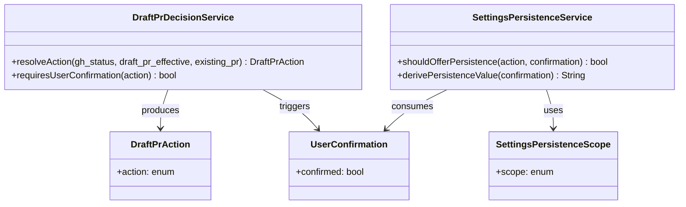

# ドメインモデル: 05-completion.md設定保存フロー分離

## 概要
Inception Phase完了処理のドラフトPR作成フローにおける業務概念の定義。設定保存フローの責務分離に関わるドメイン概念を整理する。

**重要**: このドメインモデル設計では**コードは書かず**、構造と責務の定義のみを行います。実装はImplementation Phase（コード生成ステップ）で行います。

## 値オブジェクト（Value Object）

### DraftPrAction
- **属性**: action: enum(`skip_unavailable` | `skip_existing_pr` | `skip_never` | `ask_user` | `create_draft_pr`)
- **不変性**: `resolveDraftPrAction` の評価結果として確定し、以降変更されない
- **等価性**: action値の文字列一致で判定
- **由来**: `index.md` §2.7.1 の `resolveDraftPrAction` 契約（`gh_status` × `draft_pr_effective` × `existing_pr` の組み合わせ）

### UserConfirmation
- **属性**: confirmed: bool（`true` = はい、`false` = いいえ）
- **不変性**: ユーザーの選択結果として確定し、以降変更されない
- **等価性**: confirmed値の一致で判定
- **発生条件**: `DraftPrAction` が `ask_user` の場合のみ生成される

### SettingsPersistenceScope
- **属性**: scope: enum(`local` | `project`)
- **不変性**: ユーザーの保存先選択として確定
- **等価性**: scope値の一致で判定
- **意味**: `local` = 個人設定、`project` = プロジェクト共有設定

## ドメインサービス

### DraftPrDecisionService
- **責務**: ドラフトPR作成に関するユーザーの意思決定を管理する
- **操作**:
  - resolveAction(gh_status, draft_pr_effective, existing_pr): DraftPrAction - `resolveDraftPrAction`契約に基づきactionを決定（ステップ5a-5cの判定結果を入力）
  - requiresUserConfirmation(action): bool - `ask_user` の場合のみtrue

### SettingsPersistenceService
- **責務**: ユーザーの選択結果を永続化するかどうかの判断を管理する
- **操作**:
  - shouldOfferPersistence(action, confirmation): bool - `ask_user` でユーザーが選択した場合のみtrue
  - derivePersistenceValue(confirmation): String - `true` → `always`、`false` → `never`

## ドメインモデル図

## ユビキタス言語

- **action分岐**: `resolveDraftPrAction`契約に基づくドラフトPR作成フローのパス決定
- **設定永続化**: ユーザーの選択結果を設定ファイルに保存し、次回以降のデフォルト値とすること
- **保存先スコープ**: 設定の永続化先（個人設定 or プロジェクト共有設定）
- **構造分離**: ロジック変更なしで、ステップの配置（Markdown見出し構造）のみを変更すること
