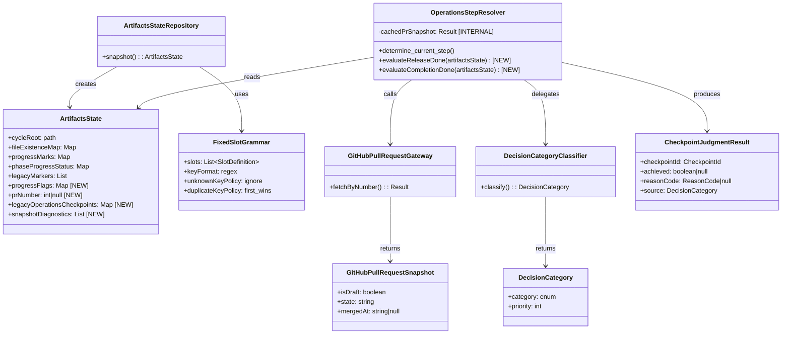

# ドメインモデル: Operations 復帰判定の進捗源移行

## 概要

Operations Phase の復帰判定（`release_done` / `completion_done`）の判定源を `history/operations.md` から `operations/progress.md` の固定スロット + GitHub PR 実態確認の AND 方式に移行する。本ドメインモデルは、`phase-recovery-spec.md` §3 / §5.3 の既存モデルへの拡張と新規概念を定義する。

**重要**: このドメインモデル設計では**コードは書かず**、構造と責務の定義のみを行います。実装は Implementation Phase（コード生成ステップ）で行います。

## エンティティ（Entity）

### ArtifactsState【拡張】

既存エンティティ（spec §3）にフィールドを追加する。

- **ID**: `cycleRoot`（サイクルディレクトリパス）
- **既存属性**:
  - `cycleRoot`: path - サイクルディレクトリパス
  - `fileExistenceMap`: Map<path, bool> - 成果物パス → 存在有無
  - `progressMarks`: Map<step_key, ProgressStatus> - progress.md の行単位状態（step レベル）
  - `phaseProgressStatus`: Map<PhaseName, PhaseProgressStatus> - phase 単位の完了状態サマリ
  - `legacyMarkers`: List<path> - 旧構造マーカー
- **追加属性**:
  - `progressFlags`: Map<flag_name, boolean> - progress.md の固定スロットから抽出したサブステップフラグ。`flag_name` は `release_gate_ready` / `completion_gate_ready` 等の文字列キー
  - `prNumber`: int | null - progress.md の固定スロットから抽出した PR 番号。null は未記録状態
  - `legacyOperationsCheckpoints`: Map<CheckpointId, boolean> - `history/operations.md` から抽出した旧形式の判定結果。`release_done`=「PR Ready 化」記録有無、`completion_done`=「PR マージ」記録有無。旧形式の判定と新フラグの矛盾検出（`has_conflict`）および旧エントリ存在判定（`has_legacy_entry`）に使用
  - `snapshotDiagnostics`: List<Diagnostic> - `ArtifactsStateRepository.snapshot()` 構築時に検出されたパースエラー等の診断情報。`format_error` 等の blocking 条件は本フィールドに記録され、判定層（`PhaseResolver` / `OperationsStepResolver`）が `PhaseRecoveryJudgment.diagnostics` に転写する
- **不変条件**:
  - `progressFlags` と `progressMarks` は独立したフィールドであり、互いに干渉しない。`progressMarks` はステップレベル、`progressFlags` はサブステップ（ゲート準備）レベル
  - `prNumber` は `ArtifactsStateRepository.snapshot()` が `FixedSlotGrammar` に基づいて抽出する。`OperationsStepResolver` は `prNumber` を直接参照するが、抽出ロジックには関知しない
  - `legacyOperationsCheckpoints` は `ArtifactsStateRepository.snapshot()` が `history/operations.md` をスキャンして構築する。旧エントリが不在の場合は空 Map

## 値オブジェクト（Value Object）

### ProgressFlag

- **属性**:
  - `name`: string - フラグ名（`release_gate_ready` / `completion_gate_ready`）
  - `value`: boolean - フラグ値（`true` / `false`）
- **不変性**: progress.md の固定スロットから 1 回の snapshot で抽出された値であり、判定中に変化しない
- **等価性**: `name` と `value` の組み合わせで等価判定

### PrNumber

- **属性**:
  - `value`: int | null - PR 番号。正の整数または未記録（null）
- **不変性**: 1 回のセッション内で不変。永続化タイミングは通常系=7.7、エッジケース=7.8 追加コミット後
- **等価性**: `value` の一致で等価判定
- **バリデーション**: null または正の整数のみ許容。0 以下や非整数は `FixedSlotGrammar` のバリデーションで `format_error` を返す

### ReasonCode【拡張】

既存の値オブジェクト（spec §7.1）に新規コードを追加する。

- **既存コード**: `missing_file` / `conflict` / `format_error` / `dependency_block` / `legacy_structure`
- **追加コード**:
  - `pr_not_found`: blocking - `completion_done` 判定時に `gh pr view` で PR が見つからない（release_done=true まで到達済みなのに PR 消失）
  - `github_unavailable`: blocking - GitHub API 不達（タイムアウト / 認証失敗 / レート制限）
  - `pr_number_missing`: blocking - `completion_done` 判定時に `ArtifactsState.prNumber` が null（PR 作成済みであるべき状態での不整合）。**`release_done` 判定時は blocking ではなく `false`（未到達）扱い**
  - `inconsistent_sources`: blocking - 新フラグと history の判定結果が矛盾（4 カテゴリ決定表の invalid-mixed-format）
- **分類**: `blocking`（自動継続禁止、ユーザー確認必須）/ `warning`（通常判定継続、diagnostics に追加）

### DecisionCategory

4 カテゴリ決定表のカテゴリを表す値オブジェクト。

- **属性**:
  - `category`: enum - `github_unavailable` / `invalid_mixed_format` / `new_format` / `legacy_format`
  - `priority`: int - 評価優先順位（1=github_unavailable, 2=invalid_mixed_format, 3=new_format, 4=legacy_format）
- **不変性**: 4 カテゴリは固定であり、追加・削除は spec 変更を伴う
- **等価性**: `category` 値の一致で等価判定
- **述語の排他性**: 以下の 4 述語で一意に特定される
  - `github_reachable`: gh API 応答成功
  - `has_new_flags`: progress に新フラグ（`*_gate_ready`）あり
  - `has_legacy_entry`: history に旧エントリあり
  - `has_conflict`: 新フラグと history の判定結果が矛盾
- **全状態被覆**:
  - `!has_new_flags` → `legacy_format`（GitHub 可用性に依存しない。旧形式サイクルは GitHub 障害時でも復帰可能。コードレビュー #2 で最優先に変更）
  - `has_new_flags ∧ !github_reachable` → `github_unavailable`（新形式は GitHub 実態確認が必須のため blocking）
  - `has_new_flags ∧ github_reachable ∧ has_conflict` → `invalid_mixed_format`
  - `has_new_flags ∧ github_reachable ∧ !has_conflict` → `new_format`

### GitHubPullRequestSnapshot

GitHub PR の実態スナップショット。`GitHubPullRequestGateway` が取得する。

- **属性**:
  - `isDraft`: boolean - ドラフト状態
  - `state`: string - PR 状態（`OPEN` / `CLOSED` / `MERGED`）
  - `mergedAt`: string | null - マージ日時（ISO 8601）。未マージ時は null
  - `headRefName`: string - head ブランチ名（参考情報、判定には使用しない）
- **不変性**: 1 回の API 呼び出しの結果であり、判定中に変化しない
- **等価性**: 全属性の一致で等価判定

### FixedSlotGrammar

`operations_progress_template.md` の固定スロット解析規則を表すイミュータブルな仕様。

- **属性**:
  - `grammarVersion`: string - grammar のバージョン（例: `v1`）。template 内の `<!-- fixed-slot-grammar: v1 -->` と照合し、互換性を検証する
  - `slots`: List<SlotDefinition> - スロット定義の順序付きリスト
  - `keyFormat`: regex - キー名の許容パターン（`[a-z_]+`）
  - `valueSeparator`: string - キーと値の区切り文字（`=`）
  - `unknownKeyPolicy`: enum - `ignore`（未知キーを無視、前方互換性確保）
  - `duplicateKeyPolicy`: enum - `first_wins`（最初の出現値を採用、残りは警告）
  - `commentPrefix`: string - `#`（固定スロット行内のコメント。Markdown HTML コメント `<!-- -->` は別レイヤーであり、grammar version チェックは `ArtifactsStateRepository` のパース工程が担う）
- **SlotDefinition の構造**:
  - `name`: string - スロット名
  - `valueType`: enum - `boolean` / `integer`
  - `required`: boolean - 必須か任意か
  - `defaultInterpretation`: string - 未記録時の解釈テキスト
  - `checkpointBehavior`: Map<CheckpointId, Behavior> - checkpoint 別の振り分け（例: `pr_number` は `release_done` では `false`、`completion_done` では `undecidable`）
- **不変性**: grammar 仕様は spec 変更時のみ更新される長期安定な仕様
- **等価性**: `slots` リストの全要素が一致

### CheckpointJudgmentResult

各 checkpoint の判定結果を表す値オブジェクト。

- **属性**:
  - `checkpointId`: CheckpointId - 判定対象のチェックポイント
  - `achieved`: boolean | null - 達成判定結果（null = undecidable）
  - `reasonCode`: ReasonCode | null - undecidable 時の理由コード
  - `source`: DecisionCategory - 使用された判定源カテゴリ
- **不変性**: 1 回の判定呼び出しで確定
- **等価性**: 全属性の一致

## 集約（Aggregate）

### OperationsRecoveryJudgment

Operations Phase の復帰判定全体を管理する集約。

- **集約ルート**: `OperationsStepResolver`（既存、拡張）
- **含まれる要素**: `ArtifactsState`（エンティティ）、`DecisionCategory`（値オブジェクト）、`CheckpointJudgmentResult`（値オブジェクト）、`GitHubPullRequestSnapshot`（値オブジェクト）
- **境界**: `phase-recovery-spec.md §5.3` の Operations step 判定ロジック全体
- **不変条件**:
  1. **二段階 AND 判定**: `release_done` / `completion_done` は「progress フラグ == true」AND「GitHub 実態確認 == true」の両方を満たす場合のみ `true`。フラグ単独では判定チェックポイント完了と扱わない
  2. **checkpoint 別契約優先**: 一般契約（フラグ true × GitHub false = undecidable）より checkpoint 別契約（例: `release_done` で PR 未存在 = `false`）が優先される
  3. **4 カテゴリ排他性**: 判定源選択は `DecisionCategory` の述語で一意に決定され、上位カテゴリ該当時に下位は評価しない
  4. **blocking 伝播**: `undecidable:<reason_code>` は `automation_mode=semi_auto` でも自動継続禁止

## ドメインサービス

### OperationsStepResolver【拡張】

既存ドメインサービス（spec §5.3）。`release_done` / `completion_done` の判定ロジックを変更する。

- **責務**: Operations Phase の現在ステップを 4 checkpoint の直線評価で決定する
- **操作**:
  - `determine_current_step(artifactsState)`: 4 checkpoint を順に評価し、未達成の最初の checkpoint の `step_id` を返す
  - `evaluateReleaseDone(artifactsState)`: 【新規】内部で `DecisionCategoryClassifier` → `GitHubPullRequestGateway.fetchByNumber()` を呼び出し、`release_gate_ready` フラグ AND GitHub 実態確認（`isDraft=false ∧ state=OPEN`）の AND 判定を実行。Gateway 呼び出しは Resolver 内部に閉じ込める
  - `evaluateCompletionDone(artifactsState)`: 【新規】同上。`completion_gate_ready` フラグ AND GitHub 実態確認（`state=MERGED ∧ mergedAt!=null`）の AND 判定
- **依存**: `ArtifactsState`（構造化済み入力）、`GitHubPullRequestGateway`（PR 実態取得）、`DecisionCategoryClassifier`（判定源選択）
- **PR スナップショットキャッシュ**: `determine_current_step()` の 1 回の呼び出し内で `fetchByNumber()` 結果をキャッシュし、`release_done` → `completion_done` の連続評価時に 2 回目の API 呼び出しを回避する（NFR「`gh pr view` 1 回の追加のみ」を保証）
- **制約**: `operations_progress_template.md` の具象フォーマットに直接依存しない（レイヤー分離）

### DecisionCategoryClassifier【新規】

4 カテゴリ決定表に基づく判定源選択サービス。

- **責務**: `ArtifactsState` と GitHub 可達性から適用すべき `DecisionCategory` を一意に決定する
- **操作**:
  - `classify(artifactsState, githubReachable)`: 4 述語を評価し、優先順位付きで `DecisionCategory` を返す。内部で `has_new_flags` を `artifactsState.progressFlags` の非空判定、`has_legacy_entry` を `artifactsState.legacyOperationsCheckpoints` の非空判定、`has_conflict` を新フラグ判定結果と旧エントリ判定結果の矛盾検出で計算する
- **判定テーブル**（優先順位順、コードレビュー #2 で改訂: legacy_format を最優先に変更し、旧形式サイクルの GitHub 障害時の可用性を確保）:
  1. `!has_new_flags` → `legacy_format`（GitHub 可用性に依存しない）
  2. `has_new_flags ∧ !github_reachable` → `github_unavailable`
  3. `has_new_flags ∧ github_reachable ∧ has_conflict` → `invalid_mixed_format`
  4. `has_new_flags ∧ github_reachable ∧ !has_conflict` → `new_format`

## リポジトリインターフェース

### ArtifactsStateRepository【拡張】

既存リポジトリ。`snapshot()` メソッドの抽出責務を拡張する。

- **対象集約**: `ArtifactsState`
- **既存操作**:
  - `snapshot(cycleRoot)` → `ArtifactsState`: サイクルディレクトリからスナップショットを構築
- **拡張される抽出責務**:
  - `progress.md` の固定スロットを `FixedSlotGrammar` に基づいてパースし、`progressFlags` に格納。grammar version comment（`<!-- fixed-slot-grammar: v1 -->`）の互換性チェックは本 parser 層の責務（spec 検証側ではなく repository parser 側）
  - `progress.md` の `pr_number` スロットを抽出し、`prNumber` に格納
  - `history/operations.md` をスキャンし、旧形式のチェックポイント記録（「PR Ready 化」/「PR マージ」）を `legacyOperationsCheckpoints` に格納
  - パース失敗時は `snapshotDiagnostics` に `format_error` を追加（判定層が `PhaseRecoveryJudgment.diagnostics` に転写する）
  - 新フラグ不在時は `progressFlags` を空 Map として返す（旧形式フォールバックのトリガー）

### GitHubPullRequestGateway【新規】

GitHub PR の実態を取得するゲートウェイインターフェース。

- **対象**: `GitHubPullRequestSnapshot`
- **操作**:
  - `fetchByNumber(prNumber)` → `Result<GitHubPullRequestSnapshot, GatewayError>`: PR 番号で PR 実態を取得
- **エラー型**:
  - `PrNotFound`: 指定 PR 番号に対応する PR が存在しない
  - `ApiUnavailable`: GitHub API 不達（タイムアウト / 認証失敗 / レート制限）
- **実装ノート**: 具象実装は `gh pr view <prNumber> --json isDraft,state,mergedAt,headRefName` を使用。抽象インターフェースにより実装の差し替え（テスト用スタブ等）が可能

## ドメインモデル図

## ユビキタス言語

| 用語 | 定義 |
|------|------|
| **ゲート準備フラグ**（Progress Flag） | `operations/progress.md` の固定スロットに記録される `release_gate_ready` / `completion_gate_ready` の真偽値。7.7 最終コミット時点で確定する判定の一次ソース |
| **固定スロット**（Fixed Slot） | `operations_progress_template.md` のステップ7サブステップ欄に配置される `key=value` 形式のパース可能な記録領域 |
| **固定スロット grammar** | 固定スロットの解析規則（キー名・値型・必須/任意・未知キー扱い等）を定義するイミュータブルな仕様 |
| **二段階 AND 判定** | 「progress フラグ == true」AND「GitHub 実態確認 == true」の両条件を満たして初めて checkpoint 完了と判定する方式 |
| **4 カテゴリ決定表** | 判定源選択（new-format / legacy-format / invalid-mixed-format / github-unavailable）を 4 述語で排他的に分類する決定テーブル |
| **マージ前完結** | 通常系では 7.7 最終コミット時点、エッジケースでは 7.8 追加コミット時点で全判定ソースが確定するという設計契約 |
| **checkpoint 別契約** | `release_done` / `completion_done` ごとに異なる戻り値（GitHub false 時、`pr_number` 未記録時等）を定義する具体則。一般契約より優先される |
| **PR 番号永続化** | PR 識別子を `operations/progress.md` の固定スロットに記録し、ブランチ名非依存で判定を成立させる契約 |
| **reason_code** | `undecidable:<code>` の形式で返される blocking/warning の理由識別子。`automation_mode=semi_auto` でも blocking は自動継続禁止 |

## 不明点と質問（設計中に記録）

（なし — 計画段階の 4 ラウンドレビューで主要な不明点は解消済み）
