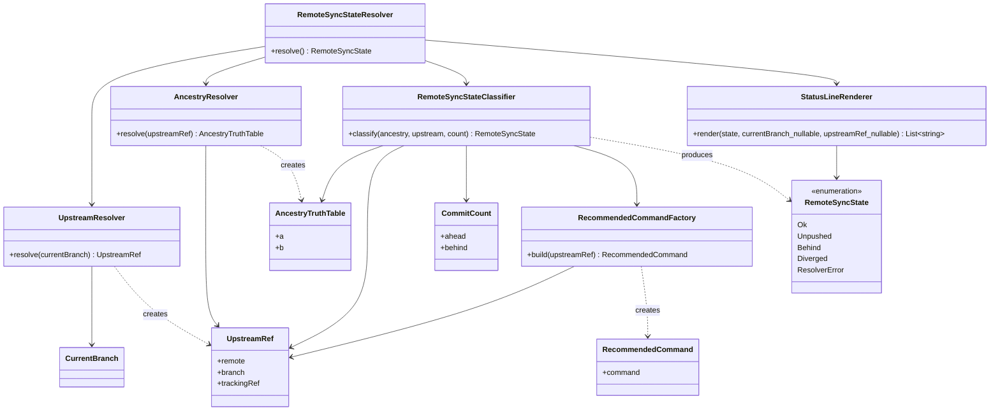

# ドメインモデル: リモート同期チェックの squash 後 divergence 対応

## 概要

`validate-git.sh remote-sync` サブコマンドが扱うドメインを「リモート追跡ブランチとローカル HEAD の ancestry 関係に基づくリモート同期状態」として再定義し、squash 後の履歴書き換えで誤検知されていた `diverged` 状態を独立ステータスとして扱えるようにする。

**重要**: このドメインモデル設計では**コードは書かず**、構造と責務の定義のみを行う。実装は Phase 2（コード生成）で行う。

---

## エンティティ（Entity）

本 Unit は Shell Script ベースの改修であり、永続化を伴う古典的なエンティティは存在しない。唯一「1 回の `run_remote_sync()` 実行」を **RemoteSyncCheck** として識別子なしのプロセスエンティティと見なすことはできるが、モデリング上は値オブジェクトとドメインサービスで表現する。

---

## 値オブジェクト（Value Object）

### CurrentBranch

- **属性**:
  - `name`: `string` - ローカルの現在ブランチ名（`git branch --show-current` の結果）
- **不変性**: 1 回の `run_remote_sync()` 実行内では常に一定（実行途中で変化しない前提）
- **等価性**: `name` 完全一致
- **制約**:
  - 空文字列の場合は `BranchUnresolved`（detached HEAD 等）を意味し、ResolverError に変換される

### UpstreamRef

- **属性**:
  - `remote`: `string` - upstream remote 名（`git config branch.<current>.remote`）
  - `branch`: `string` - upstream branch 名（`git config branch.<current>.merge` から `refs/heads/` プレフィックスを除去）
- **不変性**: 値オブジェクト。生成後に remote / branch を変更しない
- **等価性**: `(remote, branch)` の両方が一致
- **制約**:
  - `remote` が空 → 上位で `FallbackToOrigin`（既存実装の fallback）を適用。`branch.<current>.remote` が未設定の場合のみ `origin` を採用
  - `branch` が `refs/heads/` プレフィックスを持たない、または取得失敗 → `UpstreamResolveFailed` ResolverError に変換される
- **導出フィールド**:
  - `trackingRef`: `"<remote>/<branch>"` 形式の文字列（例: `origin/cycle/v2.3.5`）。内部で `git merge-base --is-ancestor` / `git rev-list` に渡す ref として使用する
- **ユビキタス言語上の重要性**: ローカル branch 名（`CurrentBranch.name`）とは**常に区別する**。異名 upstream（`feature-x` が `origin/release-x` を追跡）で local 名を push 先に使うと誤った ref を破壊しうるため、`UpstreamRef.branch` を一次ソースとして採用する

### AncestryTruthTable

- **属性**:
  - `a`: `boolean` - `git merge-base --is-ancestor <upstream.trackingRef> HEAD` の結果（`true`: upstream が HEAD の祖先）
  - `b`: `boolean` - `git merge-base --is-ancestor HEAD <upstream.trackingRef>` の結果（`true`: HEAD が upstream の祖先）
- **不変性**: 1 回の fetch + 2 回の `merge-base` 実行結果のスナップショット。生成後に書き換えない
- **等価性**: `(a, b)` の両方が一致
- **制約**:
  - `a` / `b` はいずれも `merge-base` が exit 0 / 1 を返した場合のみ構築できる。exit 2 以上が混ざれば `MergeBaseFailed` ResolverError に変換される
  - **必ず両方取得する**（片方だけで判定ツリーを終了させない）: 計画の Round 1 指摘反映
- **意味論**:

  | a | b | 意味 |
  |---|---|------|
  | true | true | 完全一致（HEAD = upstream） |
  | true | false | unpushed（HEAD が upstream を含み更に先行） |
  | false | true | behind（upstream が HEAD を含み更に先行） |
  | false | false | diverged（双方向に差分、新規状態） |

### CommitCount

- **属性**:
  - `ahead`: `integer` - `git rev-list --count <upstream.trackingRef>..HEAD`（HEAD が upstream を超えているコミット数）
  - `behind`: `integer` - `git rev-list --count HEAD..<upstream.trackingRef>`（upstream が HEAD を超えているコミット数）
- **不変性**: スナップショット
- **等価性**: `(ahead, behind)` の両方が一致
- **用途別射影**:
  - `unpushed_commits` = `ahead`（`AncestryTruthTable = (true, false)` 時に出力）
  - `behind_commits` = `behind`（`AncestryTruthTable = (false, true)` 時に出力）
  - `diverged_ahead` = `ahead`、`diverged_behind` = `behind`（`AncestryTruthTable = (false, false)` 時に出力）

### RecommendedCommand

- **属性**:
  - `command`: `string` - 解決済み実値を含む 1 行のコマンド文字列
- **不変性**: 値オブジェクト
- **等価性**: `command` の完全一致
- **生成契約（一次ソース固定）**:
  - `command := "git push --force-with-lease " + upstream.remote + " HEAD:" + upstream.branch`
  - 例（同名 upstream）: `git push --force-with-lease origin HEAD:cycle/v2.3.5`
  - 例（異名 upstream、local `feature-x` が upstream `release-x`）: `git push --force-with-lease origin HEAD:release-x`
- **禁止事項**:
  - ローカル branch 名（`CurrentBranch.name`）の使用は禁止
  - `<remote>` / `<branch>` 等のリテラルプレースホルダー文字列の残置禁止
  - `git rev-parse --abbrev-ref @{u}` を一次ソースとする代替経路は許容しない（`branch.*.merge` が一次ソース）
- **UI 層の責務**: `01-setup.md` §6a / `operations-release.md` 7.10 は `command` 文字列をそのまま表示するのみ。プレースホルダー展開・文字列加工を行わない

### RemoteSyncState（判定結果の列挙）

以下の 5 値を取る値オブジェクト（代数的データ型）:

| 状態 | 構築条件 | 付随する値 |
|------|---------|-----------|
| `Ok` | `AncestryTruthTable = (true, true)` | なし |
| `Unpushed` | `AncestryTruthTable = (true, false)` | `unpushed_commits: CommitCount.ahead` |
| `Behind` | `AncestryTruthTable = (false, true)` | `behind_commits: CommitCount.behind` |
| `Diverged` | `AncestryTruthTable = (false, false)` | `diverged_ahead: CommitCount.ahead`, `diverged_behind: CommitCount.behind`, `recommended_command: RecommendedCommand` |
| `ResolverError` | 下記 **ResolverError** に該当 | `errorCode`, `errorMessage` |

**不変性**: 値オブジェクト。1 回の `run_remote_sync()` で 1 つの状態に決定する

**等価性**: 状態タグと付随値の組み合わせが完全一致

### ResolverError（エラー状態の列挙）

`ResolverError` は `RemoteSyncState` の 1 バリアントで、解決プロセスのどの段階で失敗したかを表す:

| errorCode | 発生段階 | 備考 |
|-----------|---------|------|
| `branch-unresolved` | `CurrentBranch` 解決失敗（detached HEAD 等） | 従来互換 |
| `fetch-failed` | `git fetch <upstream.remote>` 失敗 | 従来互換 |
| `no-upstream` | upstream 追跡ブランチが存在しない | 従来互換（`git show-ref --verify refs/remotes/<remote>/<upstream_branch>` で存在確認。異名 upstream 対応で upstream branch 名を使用） |
| `upstream-resolve-failed` | `UpstreamRef.branch` 解決失敗（`branch.*.merge` 欠損・異常値） | **新規**（本 Unit 追加） |
| `merge-base-failed` | `merge-base --is-ancestor` が exit 2 以上を返す | **新規**（本 Unit 追加） |
| `log-failed` | `git rev-list --count` / `git log` 失敗 | 従来互換 |

**発火時の短絡契約**: どの `errorCode` でも exit 2 で `run_remote_sync()` を短絡し、以降の判定（2 ビット分類含む）を実行しない

---

## 集約（Aggregate）

### RemoteSyncCheckResult

- **集約ルート**: `RemoteSyncState`（上述 5 状態のうちの 1 つ）
- **含まれる要素**:
  - `CurrentBranch`（参照のみ。Ok/Unpushed/Behind/Diverged では `remote`/`branch` フィールドとして stdout に出力する値の元ネタ）
  - `UpstreamRef`（Diverged 時に `RecommendedCommand` を構築するため集約内で保持）
  - `AncestryTruthTable`（Ok/Unpushed/Behind/Diverged の判定入力）
  - `CommitCount`（Unpushed/Behind/Diverged の数値フィールドの元）
  - `RecommendedCommand`（Diverged のみ）
  - `ResolverError`（ResolverError のみ）
- **境界**: 1 回の `run_remote_sync()` 呼び出しが保護する状態確定スナップショット。外部からは `state` および「stdout に出力する行のリスト」のみを観測可能
- **不変条件**:
  1. `AncestryTruthTable` は `(true, true)` / `(true, false)` / `(false, true)` / `(false, false)` の 4 値のみを取り得る（`merge-base` が exit 2 以上を返せばそもそも `AncestryTruthTable` は構築されず `ResolverError:merge-base-failed` に遷移する）
  2. `RemoteSyncState` は上表の 5 値以外を取らない（列挙型）
  3. `ResolverError` 時は `AncestryTruthTable` / `CommitCount` / `RecommendedCommand` を参照しない（短絡済み）
  4. `Diverged` 時には必ず `RecommendedCommand` が存在し、その `command` は `UpstreamRef.remote` と `UpstreamRef.branch` の実値のみを含む（プレースホルダーリテラルを含まない）

---

## ドメインサービス

### AncestryResolver

- **責務**: `UpstreamRef.trackingRef` と `HEAD` の双方向 ancestry を評価し、`AncestryTruthTable` を構築する
- **操作**:
  - `resolve(upstreamRef) -> AncestryTruthTable | ResolverError:merge-base-failed`
    - 2 回の `merge-base --is-ancestor` を**両方とも**実行（片方だけで早期 return しない）
    - どちらかが exit 2 以上 → `ResolverError:merge-base-failed`
    - 両方 exit 0/1 → `AncestryTruthTable((exit_code_a == 0), (exit_code_b == 0))`

### UpstreamResolver

- **責務**: `CurrentBranch` から `UpstreamRef` を組み立てる
- **操作**:
  - `resolve(currentBranch) -> UpstreamRef | ResolverError:{branch-unresolved,no-upstream,upstream-resolve-failed}`
    - `currentBranch.name` が空 → `ResolverError:branch-unresolved`
    - `branch.<currentBranch>.remote` 解決（未設定時は `origin` を fallback。既存実装と同一挙動）
    - `branch.<currentBranch>.merge` から `refs/heads/` プレフィックスを除去して `branch` を得る（**一次ソース**）
    - `branch.*.merge` 未設定・不正値 → `ResolverError:upstream-resolve-failed`
    - 上記成功後に `git show-ref --verify refs/remotes/<remote>/<upstream_branch>` で存在確認のみ実行（**異名 upstream 対応**: ローカル branch 名ではなく upstream branch 名を使用）。失敗なら `ResolverError:no-upstream`（従来互換）
    - `git rev-parse --abbrev-ref @{u}` は存在確認にも `recommended_command` 構築にも一次ソースとして使用しない（参考情報のみ）

### RemoteSyncStateResolver（集約のアプリケーションサービス）

- **責務**: `run_remote_sync()` の全体フローを統括し、`RemoteSyncState` に到達するまでの順序と短絡を保証する
- **操作**:
  - `resolve() -> RemoteSyncState`
    - 順序: `CurrentBranchResolver` → `UpstreamResolver` → `FetchExecutor` → `AncestryResolver` → `CommitCountResolver` → `RemoteSyncStateClassifier`
    - `UpstreamResolver` は upstream remote 名（`$remote`）と upstream branch 名（`$upstream_branch`）の両方を取得するため、`FetchExecutor`（fetch 対象の remote 名が必要）より**先**に実行する
    - どの段階の `ResolverError` もこのサービス層で `RemoteSyncState = ResolverError(...)` に変換し短絡する
    - 成功経路では `AncestryTruthTable` を入力に `RemoteSyncStateClassifier` で 4 状態（Ok/Unpushed/Behind/Diverged）に分類する

### RemoteSyncStateClassifier

- **責務**: `AncestryTruthTable` から 4 状態を純関数的に分類する（副作用なし）
- **操作**:
  - `classify(ancestry, upstreamRef, commitCount) -> Ok | Unpushed | Behind | Diverged`
    - `(true, true)` → `Ok`
    - `(true, false)` → `Unpushed(unpushed_commits=commitCount.ahead)`
    - `(false, true)` → `Behind(behind_commits=commitCount.behind)`
    - `(false, false)` → `Diverged(diverged_ahead=commitCount.ahead, diverged_behind=commitCount.behind, recommended_command=RecommendedCommandFactory.build(upstreamRef))`

### RecommendedCommandFactory

- **責務**: `UpstreamRef` から `RecommendedCommand` を構築する（純関数）
- **生成規則**: `upstreamRef.remote` と `upstreamRef.branch` の実値を `git push --force-with-lease <remote> HEAD:<branch>` に埋め込む
- **一次ソース保証**: 入力に `CurrentBranch.name` を**直接使用しない**。`UpstreamResolver` が `branch.*.merge` から構築した `UpstreamRef.branch` のみを採用する

### StatusLineRenderer

- **責務**: `RemoteSyncState` を stdout 行のリストに変換する（表現層の責務。shell script の `echo` と 1:1 対応）
- **公開インターフェース**: `render(state, currentBranch | null, upstreamRef | null) -> List<string>`
  - `currentBranch` が `null` → `branch:unknown` を出力（ステップ 1 失敗時のみ発生しうる）
  - `upstreamRef` が `null` → `remote:unknown` を出力（ステップ 1 / 2 の一部失敗時に発生しうる）
  - `ResolverError` 以外（`Ok` / `Unpushed` / `Behind` / `Diverged`）では `currentBranch` / `upstreamRef` ともに非 null が保証される（エントリ条件）
- **出力契約**: 計画「ステータス出力仕様（validate-git.sh）」表と完全一致

---

## リポジトリインターフェース

本 Unit では永続化集約がないため、リポジトリは存在しない。代わりに以下の**ゲートウェイ**（外部システムアダプタ）が `RemoteSyncStateResolver` に依存される:

### GitGateway

- **責務**: git CLI 呼び出しを抽象化（テスト容易性と副作用分離）
- **操作**:
  - `showCurrentBranch() -> string`（`git branch --show-current`）
  - `getConfig(key) -> string | null`（`git config --get <key>`）
  - `fetch(remote) -> ExitCode`（`GIT_TERMINAL_PROMPT=0 git fetch <remote>`）
  - `showRefVerify(ref) -> ExitCode`（`git show-ref --verify <ref>`、upstream tracking ref の存在確認用、**一次ソース**）
  - `mergeBaseIsAncestor(ancestorRef, descendantRef) -> ExitCode`（0/1/2）
  - `revListCount(rangeExpression) -> integer`（`git rev-list --count ...`）
  - `revParseAbbrevRefUpstream() -> string | null`（`git rev-parse --abbrev-ref @{u}`、**参考情報用のみ**。no-upstream 判定・recommended_command 構築には使用しない）

**注**: 実装では既存 `validate-git.sh` が直接 `git` を呼ぶスタイルを維持する。本モデルはあくまで論理モデルとして「どのコマンドをどの責務から呼ぶか」を固定する意味合い。

---

## ファクトリ

### RecommendedCommandFactory

上記「ドメインサービス」に記載。純関数的な構築責務を持つ。

---

## ドメインモデル図

---

## ユビキタス言語

このドメインで使用する共通用語:

- **Ancestry（祖先関係）**: 2 つの git 参照の間の親子関係。`git merge-base --is-ancestor X Y` が真のとき「X は Y の祖先」と呼ぶ。完全一致（`X == Y`）も真を返す
- **Upstream（上流）**: ローカルブランチが追跡しているリモート側のブランチ。`branch.<local>.remote` と `branch.<local>.merge` の組で定義される
- **UpstreamRef（上流参照）**: 本ドメイン固有の値オブジェクト。`(remote, branch)` を 1 つの識別子として扱う
- **Tracking Ref（追跡参照）**: `<upstream.remote>/<upstream.branch>` 形式の ref 名（例: `origin/cycle/v2.3.5`）
- **Ok（完全一致）**: ローカル HEAD と upstream が**同じコミット**を指している状態
- **Unpushed（未 push）**: ローカル HEAD が upstream を含み、それに加えて local 固有のコミットがある状態（安全な push 候補）
- **Behind（遅れ）**: upstream がローカル HEAD を含み、それに加えて remote 固有のコミットがある状態（通常の pull/merge で解消）
- **Diverged（分岐）**: ローカル HEAD と upstream が**双方向に**固有コミットを持つ状態（共通の祖先はあるが、両方がそこから分岐している）。squash / rebase / amend 等の履歴書き換えの典型
- **Force push 案内**: Diverged 時にユーザーに表示する推奨コマンド文字列（`git push --force-with-lease`）。本 Unit では**自動実行しない**契約
- **一次ソース（Single Source of Truth）**: 契約が複数箇所に記載される場合、優先度の最も高い記述箇所。本 Unit では `validate-git.sh` の stdout（特に `recommended_command:` 行）が UI 表示の一次ソース
- **UI 層（User Interface Layer）**: `01-setup.md` §6a / `operations-release.md` 7.10 の 2 箇所。一次ソースを読み取って表示する責務のみを持ち、独自の文字列加工を行わない
- **マージ停止（Blocking）**: `operations-release.md` 7.9〜7.11 におけるエラー系統の挙動。Operations Phase の最終ゲートで検出された場合は PR マージを止める
- **skip（続行）**: `01-setup.md` §6a におけるエラー系統の挙動。Operations Phase 開始時の推奨チェックが失敗しても続行する

---

## 不明点と質問（設計中に記録）

現時点で追加の不明点はなし。計画段階で以下が確定済み:

- is-ancestor 判定順（両方取得後の 2 ビット分類）
- upstream 解決の一次ソース（`branch.*.merge`）
- `recommended_command` の形式（`git push --force-with-lease <remote> HEAD:<branch>`）
- 新規 error code 2 種（`merge-base-failed` / `upstream-resolve-failed`）
- 生ステータスと UI 正規化状態のマッピング（§6a=skipped / 7.9-7.11=blocking）

設計レビューで追加の観点があれば本セクションに追記する。
