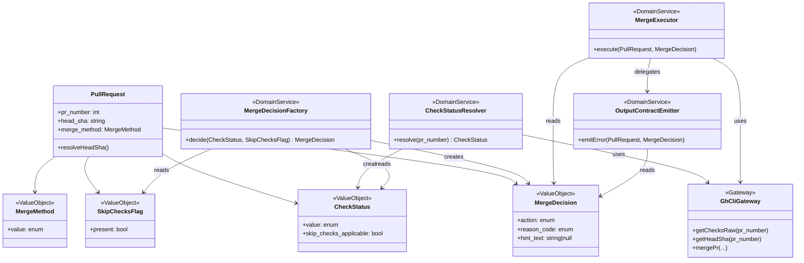

# ドメインモデル: Unit 003 merge-pr `--skip-checks` オプション追加

## 概要

PR マージ前の CI チェック状態判定ドメインを、外部 CLI (`gh pr checks`) の結果から**機械可読な状態**として確定し、安全なバイパス条件（`--skip-checks` 適用可否）を決定する。本ドメインは `scripts/pr-ops.sh cmd_merge()` と `scripts/operations-release.sh cmd_merge_pr()` の責務境界を明確化し、不安全なバイパス（`fail` / `pending` / `checks-query-failed`）を構造的に排除する。

**重要**: このドメインモデル設計では**コードは書かず**、構造と責務の定義のみを行います。

## 責務境界（レイヤー分離）

| レイヤー | 対応スクリプト / markdown | 責務 |
|---------|-------------------------|-----|
| **判定ドメイン** | `pr-ops.sh cmd_merge()` 内 `CheckStatusResolver` | `CheckStatus` 値オブジェクトの生成。`gh pr checks` 生出力から 5 分類への写像を実行する唯一の層 |
| **決定ドメイン** | `pr-ops.sh cmd_merge()` 内 `MergeDecisionFactory` | `CheckStatus` と `SkipChecksFlag` から `MergeDecision` を生成する**唯一の層**（ビジネスルール=安全性契約の単一実装箇所） |
| **マージ実行ドメイン** | `pr-ops.sh cmd_merge()` 内 `MergeExecutor` | `MergeDecision` を受け取り、`gh pr merge` 呼び出しを実行する。**決定ロジックは持たない** |
| **呼び出しラッパー** | `operations-release.sh cmd_merge_pr()` | `--skip-checks` 引数を `pr-ops.sh merge --skip-checks` に透過するだけ（判定・決定ロジックは持たない） |
| **ユーザー対話層** | `steps/operations/operations-release.md` 7.13 節 | `error:checks-status-unknown` + `reason:<code>` 出力を機械可読にパースし、`AskUserQuestion` の選択肢を構築 |

依存方向: ユーザー対話層 → 呼び出しラッパー → マージ実行ドメイン → 決定ドメイン → 判定ドメイン → 外部 CLI（`gh`）

## エンティティ（Entity）

### PullRequest

- **ID**: PR 番号（integer）
- **属性**:
  - `pr_number`: integer - PR 番号（CLI 引数から受領、初期化時に設定）
  - `head_sha`: string | null - head コミット SHA（**遅延解決**: `MergeDecision.action` が `merge-now` / `set-auto-merge` に到達した場合のみ解決）
  - `merge_method`: MergeMethod - マージ方法（`merge` / `squash` / `rebase`）
- **振る舞い**:
  - `resolveHeadSha()`: `gh pr view` から `headRefOid` を取得。失敗時は `error:head-sha-unavailable` で中断。**呼び出しタイミングは `MergeDecision` 確定後**（エラー経路では呼ばない）

**注**: マージコマンドの構築と実行は `MergeExecutor` に一本化する（`PullRequest` エンティティ自身はコマンド構築責務を持たない）。
- **不変条件**:
  - `head_sha` は `action=merge-now` / `set-auto-merge` の実行直前にのみ解決する（障害伝播の縮小）
  - エラー経路（`action=error-*`）では `head_sha` は解決されず null のまま

## 値オブジェクト（Value Object）

### CheckStatus

CI チェック状態の**機械可読な 5 分類**を表す値オブジェクト。`gh pr checks` の結果から決定的に生成される。

- **属性**:
  - `value`: enum {`pass`, `fail`, `pending`, `no-checks-configured`, `checks-query-failed`}
  - `skip_checks_applicable`: boolean（`no-checks-configured` のみ true、他は false）
- **不変性**: 一度生成されたら変更不可。`gh pr checks` の再実行が必要な場合は新しい `CheckStatus` を生成
- **等価性**: `value` が等しければ等価
- **派生関係**:

  | `value` | `skip_checks_applicable` |
  |---------|--------------------------|
  | `pass` | false（バイパス不要、即時マージ） |
  | `fail` | false（バイパス禁止、安全性契約） |
  | `pending` | false（auto-merge 経路） |
  | `no-checks-configured` | **true**（本 Unit の新規バイパス可能状態） |
  | `checks-query-failed` | false（バイパス禁止、原因不明） |

### SkipChecksFlag

`--skip-checks` CLI フラグの有無を表す値オブジェクト。

- **属性**: `present`: boolean
- **不変性**: 引数パース時点で確定、以降変更されない
- **等価性**: `present` が等しければ等価

### MergeDecision

`CheckStatus` と `SkipChecksFlag` の組み合わせから決定されるマージ方針。

- **属性**:
  - `action`: enum {`merge-now`, `set-auto-merge`, `error-checks-failed`, `error-checks-status-unknown`}
  - `reason_code`: enum {`none`, `no-checks-configured`, `checks-query-failed`, `checks-failed`} - エラー時の分類
  - `hint_text`: string | null - 人間向けガイダンス（`reason_code` が non-`none` の場合のみ）
- **不変性**: 生成後は変更不可
- **等価性**: 全属性が等しければ等価
- **生成規則**（MergeDecisionFactory 参照）

### MergeMethod

- **属性**: `value`: enum {`merge`, `squash`, `rebase`}
- **不変性**: 確定後は変更不可
- **等価性**: `value` が等しければ等価

## ドメインサービス

### CheckStatusResolver

- **責務**: `gh pr checks` の生出力（stdout / stderr / exit code）から `CheckStatus` 値オブジェクトを生成する単一の写像層
- **操作**:
  - `resolve(pr_number)` → `CheckStatus`
    - `gh pr checks --required --json bucket --jq ...` を実行
    - exit code、stdout、stderr を全て捕捉
    - 以下の判定順で `CheckStatus` を確定（**exit code 非依存**で stdout を優先）:
      1. stdout の jq 結果が `"pass"` → `CheckStatus(pass)`（exit code に関わらず）
      2. stdout の jq 結果が `"fail"` → `CheckStatus(fail)`（exit code に関わらず）
      3. stdout の jq 結果が `"pending"` → `CheckStatus(pending)`（**exit 8 公式仕様**）
      4. stdout が確定値を返さず、非ゼロ exit **かつ** stderr に `no checks reported` を含む → `CheckStatus(no-checks-configured)`
      5. それ以外 → `CheckStatus(checks-query-failed)`
- **判定順の不変条件**: 上記 1-5 は排他的かつ全網羅。判定順を変えてはならない
- **exit code 非依存で stdout を優先する理由**: `gh pr checks` は pending 時に**追加 exit code 8** を返す公式仕様（`cli.github.com/manual/gh_pr_checks`）。`gh` の exit code を必須条件にすると pending が検出不能になる（既存挙動の regression）
- **`no-checks-configured` 検出の制約**: `no-checks-configured` は非ゼロ exit + 特定 stderr でのみ判定されるため、先に exit code だけで `checks-query-failed` に落とすと検出不能になる

### MergeDecisionFactory

- **責務**: `CheckStatus` と `SkipChecksFlag` から `MergeDecision` を決定する。**ビジネスルール（安全性契約）の唯一の実装箇所**
- **操作**:
  - `decide(checkStatus, skipFlag)` → `MergeDecision`
- **決定表**（安全性契約の完全定義）:

  | `checkStatus.value` | `skipFlag.present` | `action` | `reason_code` |
  |---------------------|--------------------|-----------|---------------|
  | `pass` | false / true | `merge-now` | `none` |
  | `fail` | false / true | `error-checks-failed` | `checks-failed` |
  | `pending` | false / true | `set-auto-merge` | `none` |
  | `no-checks-configured` | false | `error-checks-status-unknown` | `no-checks-configured` |
  | `no-checks-configured` | **true** | **`merge-now`** | `none` |
  | `checks-query-failed` | false / true | `error-checks-status-unknown` | `checks-query-failed` |

- **不変条件**（安全性契約）:
  - `fail` / `pending` / `checks-query-failed` は `skipFlag.present` の値に**関わらず**、`action=merge-now` には遷移しない
  - `action=merge-now` が選択されるのは、`pass` または「`no-checks-configured` + `skipFlag.present=true`」のみ
- **hint_text 生成**:
  - `reason_code=no-checks-configured`（skipFlag なし）: 「必須 CI チェックが未設定です。`--skip-checks` で再実行するとバイパスできます」相当の文言
  - `reason_code=checks-query-failed`: 「CI チェック状態の取得に失敗しました。`--skip-checks` では回避できません」相当の文言
  - `reason_code=checks-failed`: 「CI チェックが失敗しています。`--skip-checks` では回避できません」相当の文言
  - `reason_code=none`: null

### MergeExecutor

- **責務**: `MergeDecision` を実際の `gh pr merge` 呼び出しに変換する実行層
- **操作**:
  - `execute(pullRequest, decision)` → ExecutionResult
    - `action=merge-now`: `gh pr merge <pr_number> <merge_flag> --match-head-commit <head_sha>` を実行
    - `action=set-auto-merge`: `gh pr merge <pr_number> <merge_flag> --auto --match-head-commit <head_sha>` を実行
    - `action=error-checks-failed`: `pr:<N>:error:checks-failed` を出力し exit 1
    - `action=error-checks-status-unknown`: `pr:<N>:error:checks-status-unknown` + `pr:<N>:reason:<reason_code>` + `pr:<N>:hint:<hint_text>` を**順序固定**で出力し exit 1
- **不変条件**: `action=merge-now` / `set-auto-merge` は必ず `--match-head-commit` を付与する（race condition 防止）

### OutputContractEmitter

- **責務**: `MergeDecision` のエラー系出力を**機械可読な順序固定フォーマット**で stdout に書き出す
- **操作**:
  - `emitError(pullRequest, decision)`
    - 出力順序（厳守）:
      1. `pr:<pr_number>:error:<error_kind>`
      2. `pr:<pr_number>:reason:<reason_code>`（non-`none` の場合のみ）
      3. `pr:<pr_number>:hint:<hint_text>`（`hint_text` が non-null の場合のみ）
- **不変条件**: 順序を変えてはならない（呼び出し元は error → reason → hint の順にパースする契約）

## 集約（Aggregate）

### MergeRequestAggregate

- **集約ルート**: `PullRequest`
- **含まれる要素**: `CheckStatus`, `SkipChecksFlag`, `MergeDecision`, `MergeMethod`
- **境界**: 1 つの PR に対する 1 回のマージ判定の全情報を保持する集約
- **不変条件**:
  - `MergeDecision` は `CheckStatus` と `SkipChecksFlag` から `MergeDecisionFactory.decide()` のみで生成される（外部からの直接構築禁止）
  - `MergeDecision.action=merge-now` / `set-auto-merge` の場合、実行直前に `pullRequest.head_sha` を解決する（事前解決不要）
  - `MergeDecision.action=error-*` の場合、`pullRequest.head_sha` は解決されない（障害伝播の縮小）
  - `MergeDecision.action=error-checks-status-unknown` の場合、必ず `reason_code` が `no-checks-configured` または `checks-query-failed` のいずれか
- **処理順序（集約内で厳守）**:
  1. `CheckStatus` 確定（`CheckStatusResolver.resolve`）
  2. `MergeDecision` 確定（`MergeDecisionFactory.decide`）
  3. `head_sha` 解決（`action` が `merge-now` / `set-auto-merge` の場合のみ）
  4. `gh pr merge` 実行または `emit_error` 呼び出し

## リポジトリインターフェース

本ドメインは永続化を持たない（CLI 実行の一連の操作）ため、リポジトリは定義しない。

代わりに以下の**外部ゲートウェイ**を明確化する:

### GhCliGateway

- **責務**: `gh` CLI の呼び出しを抽象化する境界層
- **操作**:
  - `getChecksRaw(pr_number)` → `{ stdout, stderr, exit_code }` - `gh pr checks --required --json bucket --jq ...` の生結果
  - `getHeadSha(pr_number)` → `string | null` - `gh pr view --json headRefOid --jq .headRefOid` の結果
  - `mergePr(pr_number, merge_flag, head_sha, auto_flag?)` → `{ stdout, stderr, exit_code }` - `gh pr merge` の実行
- **契約**: 実装は `gh` CLI の 1 呼び出しに 1 対 1 対応。この層ではビジネスルールを持たない

## ファクトリ

### MergeDecisionFactory（上記参照）

ドメインサービスとして定義済み。`CheckStatus` + `SkipChecksFlag` から `MergeDecision` を生成する唯一の経路。

## ドメインモデル図

## ユビキタス言語

- **`CheckStatus`（チェックステータス）**: PR の CI 必須チェックの状態を表す 5 分類の値オブジェクト（`pass` / `fail` / `pending` / `no-checks-configured` / `checks-query-failed`）
- **`no-checks-configured`（チェック未設定）**: リポジトリに必須 CI チェックが一つも設定されていない状態。`gh pr checks` が非ゼロ exit + stderr に `no checks reported` を出力した場合のみ該当
- **`checks-query-failed`（チェック問合せ失敗）**: CI チェック状態を取得できなかった状態（ネットワーク障害 / API エラー / 認証失効等）。安全側に倒すため `--skip-checks` でバイパスされない
- **`--skip-checks` フラグ**: `operations-release.sh merge-pr` および `pr-ops.sh merge` の CLI オプション。`no-checks-configured` の場合のみ CI バイパスを許可する
- **`MergeDecision`（マージ決定）**: `CheckStatus` と `--skip-checks` フラグから決定されるマージ方針（`merge-now` / `set-auto-merge` / `error-*`）
- **`reason:<code>` 行**: `error:checks-status-unknown` に続いて出力される機械可読な原因分類行（`no-checks-configured` または `checks-query-failed`）。呼び出し元はこの行で分岐する
- **`hint:<text>` 行**: `reason:<code>` 行に続いて出力される人間向け日本語ガイダンス。機械的判定には使用しない
- **出力順序契約**: エラー出力時の行順序（`error:` → `reason:` → `hint:`）を固定する契約。呼び出し元はこの順序を前提にパースする
- **判定ドメイン**: `CheckStatusResolver` 単独の層。`gh pr checks` 生出力から `CheckStatus` への写像を担う
- **決定ドメイン**: `MergeDecisionFactory` 単独の層。`CheckStatus` + `SkipChecksFlag` から `MergeDecision` への決定を担う（本 Unit のビジネスルール=安全性契約の唯一の実装箇所）
- **マージ実行ドメイン**: `MergeExecutor` 単独の層。`MergeDecision` を受け取り `gh pr merge` コマンドを構築・実行する。決定ロジックを持たない
- **merge-pr ドメイン層全体**: 上記 3 ドメイン（判定・決定・実行）の総称。**この層の外で CI 状態判定・マージ決定・マージコマンド実行を行ってはならない**（`cmd_merge_pr()` や `operations-release.md` など上位層は、引数透過と出力契約のパースのみを行う）

## 不明点と質問

[Question] 既存の `pr-ops.sh cmd_merge()` は `resolveHeadSha()` 失敗時に `pr:<N>:error:head-sha-unavailable` を出力して exit 1 しているが、`--skip-checks` 指定時もこの挙動を変えないか？
[Answer] 変えない。`head-sha-unavailable` は CI チェック判定以前のゲート失敗であり、`--skip-checks` は CI チェック判定のバイパス専用フラグ。`head-sha` が取れない PR はそもそもマージ不能なため、`--skip-checks` の有無に関わらず exit 1 で中断する（Unit 定義「責務」の「安全性を損なわない」に準拠）。

[Question] `gh pr checks` の `skipping` / `cancel` バケット（`bucket` フィールドの値）は現状 jq ロジックでどう分類されるか？
[Answer] 現状 jq ロジック `'[.[].bucket] | if length == 0 then "pass" elif all(. == "pass") then "pass" elif any(. == "pending") then "pending" else "fail" end'` は、`skipping` / `cancel` を「pending でも pass でもない」ので `"fail"` にマッピングする。本 Unit のスコープ（`unknown` バケット分離）を超えるため、現状挙動を維持する（既存 `fail` 経路に落とす）。バックログ化の要否は設計レビューで判断。

[Question] `CheckStatusResolver.resolve()` の判定で「stderr に `no checks reported` を含む」文言マッチは将来の `gh` CLI アップグレードで変わる可能性があるが、検知・フォールバック手段はあるか？
[Answer] 文言マッチに失敗すれば `checks-query-failed` に落ちる（計画書リスクテーブル記載）。`checks-query-failed` は `--skip-checks` があってもバイパスされないため、安全側に倒れる。文言変更時は本スクリプトのテストが失敗するため検知可能。長期対応としては `gh` が構造化された error code を提供し始めたタイミングで移行する（本 Unit のスコープ外、将来の改善提案としてバックログ登録の要否を設計レビューで判断）。
