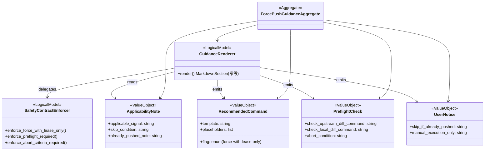

# ドメインモデル: Unit 004 Construction 側の squash 完了後 force-push 案内

## 概要

Construction Phase の Unit 完了フロー（`04-completion.md`）で、squash 実行後にリモートへ force-push する際の**静的な事前案内ドメイン**を定義する。案内の目的は、ユーザーが Operations Phase 開始を待たずに Construction 側で force-push の要否を判断し、安全な事前確認を経て明示的に実行できるようにすること。

**重要**: このドメインは本質的に **静的ドキュメント（Markdown 記述）のみ**を対象とし、実行時の状態判定や外部スクリプト呼び出しは行わない。動的な状態判定（既に push 済みか、diverged か等）は Unit 002（Operations Phase `validate-git.sh remote-sync`）の責務に委ねる（多層防御）。

**重要**: このドメインモデル設計では**コードは書かず**、構造と責務の定義のみを行います。

## 責務境界（レイヤー分離）

| レイヤー | 対応ファイル | 責務 |
|---------|------------|-----|
| **条件付き案内ドメイン（本 Unit）** | `skills/aidlc/steps/construction/04-completion.md` ステップ 7 直後の Markdown セクション（記述は常設、AI エージェントによる提示は条件付き） | squash 完了時（`squash:success`）のみ AI エージェントがユーザーに force-push 推奨コマンドと事前確認を提示する。`squash:skipped` / `squash:error` では提示を抑制 |
| **動的検出ドメイン（Unit 002）** | `skills/aidlc/scripts/validate-git.sh run_remote_sync` + `skills/aidlc/steps/operations/01-setup.md` §6a + `operations-release.md` 7.10 | Operations Phase 開始時にリモート状態を検出し `diverged` と判定、実値ベースの推奨コマンドを表示する動的ドメイン |
| **実行ドメイン（ユーザー）** | ユーザーの手動 `git push --force-with-lease` コマンド | 本 Unit とも Unit 002 とも独立。自動実行は禁止 |

### 両ドメインの独立性

Construction 側の静的案内と Operations 側の動的検出は **独立したドキュメント**として扱う:

- 文字列完全一致は目指さない（Construction はリテラルのプレースホルダー `<remote>` / `<upstream_branch>`、Operations は実値を展開）
- **推奨コマンドの種別は共通**（`git push --force-with-lease`）
- **事前確認の観点は共通**（`git log HEAD..<remote>/<upstream_branch>` と逆方向）

### 多層防御

Construction 側で案内を見落としたユーザーでも、Operations Phase 開始時に Unit 002 の `validate-git.sh remote-sync` が `diverged` を検出して再度案内するため、安全性は確保される。

## 値オブジェクト（Value Object）

### ApplicabilityNote（適用範囲の注記 / AI エージェントへの提示指示）

Markdown に**常設される**注意書き。読者（ユーザー）への適用範囲表示と、AI エージェントへの提示条件指示を兼ねる。

- **属性**:
  - `applicable_signal`: string - 「`squash:success` のときのみ AI エージェントが本節をユーザーに提示する」旨の文言
  - `skip_condition`: string - 「`squash:skipped` / `squash:error` では提示しない（抑制）」旨の文言
  - `already_pushed_note`: string - 「ユーザーが既に force-push 済みを示唆した場合は提示せずスキップしてよい」旨の文言
- **不変性**: Markdown 記述のため実行時変更不可
- **等価性**: 全属性が等しければ等価
- **性質**:
  - Markdown ファイル自体は常設（書き換えない）。AI エージェントの提示制御の指示は、ステップ 7 の分岐テーブルおよびセクション見出し・本文冒頭の 3 箇所で重複して表現する（冗長化による誤解防止）
  - 「提示しない」の判断は AI エージェントが `squash:success` シグナル以外を受けた場合、または既に push 済みがユーザー確認で判明した場合に行う
  - `04-completion.md` 自体は手順書であり実行時に Markdown を書き換えない。提示制御の主体はあくまで AI エージェント

### RecommendedCommand（推奨コマンド）

force-push 推奨コマンドの静的表現。Markdown に記述されるリテラル文字列。

- **属性**:
  - `template`: string - 固定の推奨コマンドテンプレート（プレースホルダー形式）
  - `placeholders`: list of string - `<remote>`, `<upstream_branch>` 等の置換対象
  - `flag`: enum {`--force-with-lease`}（`--force` は禁止値として除外）
- **不変性**: Markdown 記述のため実行時変更不可
- **固定値**:
  - `template = "git push --force-with-lease <remote> HEAD:<upstream_branch>"`
  - `flag = "--force-with-lease"`
- **制約**:
  - `flag == "--force-with-lease"` に固定（他者作業破壊リスク低減）
  - `--force` を代替として記述してはならない（安全性契約）

### PreflightCheck（事前確認）

force-push 実行前にユーザーが確認すべき観点を表す値オブジェクト。

- **属性**:
  - `check_upstream_diff_command`: string - upstream 側の差分確認コマンド（`git log HEAD..<remote>/<upstream_branch>`）
  - `check_local_diff_command`: string - ローカル側の差分確認コマンド（`git log <remote>/<upstream_branch>..HEAD`）
  - `abort_condition`: string - 実行中止の判定基準（「他者コミットが upstream に含まれる」「tracking 設定違いが疑われる」）
- **不変性**: Markdown 記述のため実行時変更不可
- **等価性**: 全属性が等しければ等価（Unit 002 と同等の観点を含むこと）

### UserNotice（ユーザー向け注記）

案内に付随する注意事項を表す値オブジェクト。

- **属性**:
  - `skip_if_already_pushed`: string - 「既に force-push 済みなら本案内をスキップしてよい」の注記
  - `manual_execution_only`: string - 「自動実行は行わず、ユーザーが明示的に実行する」の注記
- **不変性**: Markdown 記述のため実行時変更不可

## ドメインサービス

### GuidanceRenderer（案内レンダラー、論理モデル）

Markdown 記述として **常設される** 案内生成ロジックの論理モデル。Bash や関数としての実装は持たず、Markdown 文書そのもので表現される。AI エージェントはステップ 7 のシグナルに応じて本節をユーザーに提示するか抑制するかを判断する。

- **責務**: 常設の Markdown セクションとして案内テキストを定義し、AI エージェントへの提示指示を内包する論理モデル
- **操作**（論理）:
  - `render()` → Markdown セクション（常設）
    - `04-completion.md` ステップ 7 に常設される Markdown 記述として展開
    - AI エージェントが `squash:success` 時のみ本節を読み上げてユーザーに提示、`squash:skipped` / `squash:error` では提示を抑制
- **含まれる要素**（Markdown セクションの必須構成要素、欠落不可）:
  - セクションタイトル（例: `### 7a. Force-push 推奨コマンド案内`）
  - `ApplicabilityNote`（適用範囲の注記）
  - `RecommendedCommand.template`（推奨コマンド例）
  - `--force-with-lease` 推奨理由（1 文、`--force` 非推奨の明記を含む）
  - `PreflightCheck.check_upstream_diff_command` と `check_local_diff_command`（事前確認の手順）
  - `PreflightCheck.abort_condition`（実行中止の判定基準）
  - `UserNotice.manual_execution_only`（自動実行しない旨）
  - 多層防御の紹介（Operations Phase の動的検出）
- **不変条件**:
  - 上記要素が**すべて同一セクション内に欠落なく**含まれること
  - 順序は Markdown として読みやすい任意の並びを許容（厳密な順序固定はしない。例: 「事前確認を先に書く」構成も許容）
  - `--force-with-lease` を必ず推奨し、`--force` を代替として提示してはならない

### SafetyContractEnforcer（安全性契約ガード、論理モデル）

静的案内における**安全性の不変条件**を表現する論理モデル。Markdown 記述が以下の契約を満たすことを保証する:

- **責務**: Markdown 記述の安全性契約の宣言
- **不変条件（必須要件、欠落不可）**:
  1. `--force-with-lease` のみを推奨する（`--force` を案内に含めない）
  2. 事前確認（`PreflightCheck`）を必ず併記する（省略禁止）
  3. 実行中止の判定基準を必ず併記する（他者コミット含有時の警告）
  4. 自動実行は禁止の旨を必ず併記する
  5. 「既に push 済みなら本案内をスキップ」の注記（`ApplicabilityNote.already_pushed_note`）を必ず併記する
  6. Operations Phase（Unit 002）の動的検出を多層防御として必ず紹介する（省略禁止）
- **検証方法**: Construction Phase 実行時の目視確認 + 計画書の完了条件チェックリスト

## 集約（Aggregate）

### ForcePushGuidanceAggregate（案内集約）

- **集約ルート**: `GuidanceRenderer`（論理モデル、Markdown 記述として展開される）
- **含まれる要素**: `ApplicabilityNote`, `RecommendedCommand`, `PreflightCheck`, `UserNotice`
- **境界**: `04-completion.md` ステップ 7 の直後に**常設**される単一の Markdown セクション（Markdown 自体は常設、AI エージェントがシグナルに応じて提示制御）
- **不変条件**:
  - `ApplicabilityNote` に基づき AI エージェントは `squash:success` のときのみ提示、他シグナルでは抑制する
  - `RecommendedCommand.flag == "--force-with-lease"` 固定
  - `PreflightCheck` の 2 つのコマンドは必ず併記
  - セクション内の要素は `GuidanceRenderer` の必須要素リストを**欠落なく**含む（順序は Markdown として読みやすい任意の並びを許容）
  - 提示条件は 3 箇所で重複表現する: ステップ 7 分岐テーブル、セクション見出し `【squash:success 時のみ提示】`、セクション本文冒頭の `> 提示条件: ...`

## リポジトリインターフェース

本ドメインは**静的ドキュメントのみ**のため、永続化層やリポジトリは定義しない。Markdown ファイルそのものが「永続化された静的表現」であり、Git バージョン管理下で保守される。

## ファクトリ

本ドメインでは動的な集約生成を行わないため、ファクトリは定義しない。Markdown 記述としての `GuidanceRenderer.render()` が実質的な「固定形式の生成」を担う。

## ドメインモデル図

## ユビキタス言語

- **静的案内（条件付き提示）**: 実行時のリモート状態判定を行わず、Markdown 記述として**常設**した案内を AI エージェントが **squash シグナルに応じて条件付きで** ユーザーに提示する方式。Construction 側の本 Unit の方式
- **動的検出**: 実行時にスクリプト（`validate-git.sh remote-sync`）がリモート状態を判定して案内する方式。Operations 側の Unit 002 の方式
- **`ApplicabilityNote`（適用範囲の注記 / AI 向け提示指示）**: Markdown セクション本文冒頭および見出し・分岐テーブルに常設される注記。AI エージェントに対する「`squash:success` のときのみ提示、他は抑制」の指示と、ユーザーに対する「既に push 済みならスキップしてよい」の案内を兼ねる
- **`RecommendedCommand`（推奨コマンド）**: `git push --force-with-lease <remote> HEAD:<upstream_branch>` の固定文字列テンプレート
- **`PreflightCheck`（事前確認）**: force-push 実行前の差分確認手順（upstream 側と local 側の双方向の `git log`）
- **`UserNotice`（ユーザー向け注記）**: 「既に push 済みならスキップ」「自動実行はしない」等の注意事項
- **`--force-with-lease`**: 他者コミットの誤上書きを防ぐ安全な force-push 形式。本 Unit では必ずこちらを推奨
- **`--force`**: **非推奨**。他者作業破壊リスクがあり、本 Unit の案内に含めない
- **多層防御**: Construction 側の静的案内と Operations 側の動的検出の双方で force-push の要否を案内する方式。一方を見落としても他方で救済される
- **役割差**: Construction=静的案内、Operations=動的検出。両者は独立した文書として整合するが、文字列完全一致は目指さない

## 不明点と質問

[Question] `RecommendedCommand.template` のプレースホルダー `<upstream_branch>` は、Construction Phase のサイクルブランチ（例: `cycle/v2.3.5`）を想定しているが、Unit ブランチ（`cycle/v2.3.5/unit-003` 等）の運用時は別のブランチ名が入る。これはどう案内すべきか？
[Answer] プレースホルダー `<upstream_branch>` のまま記述し、ユーザーが自分の環境（サイクルブランチ or Unit ブランチ）に応じて置換する。Unit 004 の案内は squash 完了**直後**に表示されるため、ユーザーは自分がどのブランチで作業しているか明示的に認識している前提。markdown に特定のブランチ名を埋め込まない。

[Question] `rules.git.squash_enabled=false` の場合は squash ステップ自体が実行されないため、案内セクションに到達しないユーザーが大半となる。この挙動は本 Unit の設計で問題ないか？
[Answer] 問題ない。本 Unit の案内セクションは `04-completion.md` ステップ 7 の直後に常設されるため Markdown としては存在するが、`rules.git.squash_enabled=false` の場合はユーザーが Unit PR 作成までにこのセクションを経由せず通り過ぎても問題ない（squash 未実施のため rewrite がなく、force-push 不要）。`ApplicabilityNote.applicable_signal` の文言で「`squash:success` のときのみこの案内を参照する」旨を明示することで、読者が自己判断でスキップできる。

[Question] Unit 002 の `operations-release.md` 7.10 節では事前確認の手順が AskUserQuestion を通じて対話的に提示されるが、Construction 側は静的 markdown のため対話機能がない。これは安全性契約違反にならないか？
[Answer] 違反しない。本 Unit は**静的案内**であり、ユーザーは案内を読んで理解した上で明示的にコマンドを実行する前提。Unit 002 は実行時に `validate-git.sh` が `diverged` を検出した場合の**動的な選択フロー**を提供するもので、役割が異なる。静的案内でも事前確認の観点を必ず併記し、`--force-with-lease` のみを推奨することで安全性を確保する。Construction 側の静的案内を見落としたユーザーは Operations Phase 開始時に Unit 002 の動的検出でカバーされる（多層防御）。
