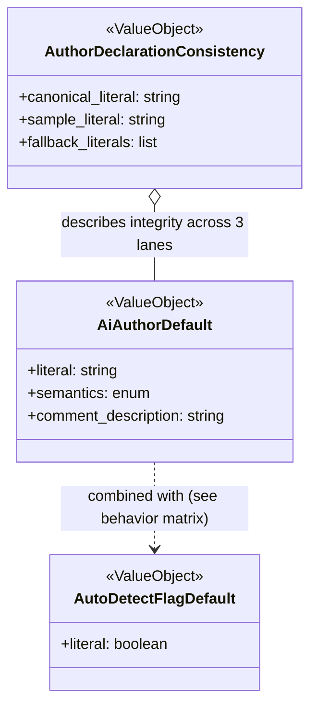

# ドメインモデル: Unit 005 config.toml.template の ai_author デフォルトを空文字に変更

## 概要

`aidlc setup` 実行時にプロジェクトへ配置される `config.toml` の**既定値**（特に `ai_author`）を、自動検出フロー起動を前提にした一貫した状態に揃えるドメイン。対象は「設定既定値の宣言」のみで、実行時ロジックは変更しない。

**重要**: このドメインモデル設計では**コードは書かず**、設定宣言の構造と責務の定義のみを行います。実装（TOML ファイルの値・コメント編集）は Phase 2 で行います。

## 責務境界（レイヤー分離と成果物の役割）

Codex 設計レビュー指摘 #2 に基づき、成果物を役割別に 3 系統に分離する。「全ファイル同値」の単一不変条件ではなく、**正本 → 派生整合** の依存構造で整理する。

| 系統 | 役割 | 対応ファイル | 本 Unit での変更 | 整合性の種類 |
|------|------|------------|--------------|------------|
| **正本（setup 新規生成経路）** | `aidlc setup` で新規プロジェクトへ配置される `config.toml` のテンプレート。`ai_author` 既定値の**正本** | `skills/aidlc-setup/templates/config.toml.template` | **あり**（値 + コメント変更） | Runtime invariant（setup 実行時に解釈される） |
| **参照サンプル（Informational artifact）** | 利用者が参照するサンプル。setup 時に消費されず、コピー参照用途 | `skills/aidlc/config/config.toml.example` | **あり**（値変更のみ） | Informational integrity（正本と値の意味が一致すること） |
| **フォールバック・アップグレード経路（既存、変更なし）** | `read-config.sh` のフォールバック / v1→v2 マイグレーション時の挿入値 | `skills/aidlc/config/defaults.toml`, `skills/aidlc-setup/config/defaults.toml`, `skills/aidlc-setup/scripts/migrate-config.sh` | なし（既に `""`） | Runtime invariant（defaults 2 ファイル）/ Upgrade-time invariant（migrate-config.sh） |

### Co-Authored-By 決定経路（既存、変更なし）

| レイヤー | 対応ファイル | 責務 |
|---------|------------|-----|
| **Co-Authored-By 決定ドメイン** | `skills/aidlc/steps/common/commit-flow.md` の ai_author 分岐、`docs/configuration.md` の仕様記述 | 本 Unit 変更なし。`ai_author` の値（空/非空）と `ai_author_auto_detect` の組合せで「自動検出 / 明示値採用 / 無付与」の振る舞いを決定 |

### ai_author の既存仕様（正本は `docs/configuration.md`）

本 Unit は以下の既存仕様に依存する。出典は [docs/configuration.md:82-83](../../../../docs/configuration.md) と v1.9.2 実装時のドメインモデル（`.aidlc/cycles/v1.9.2/design-artifacts/domain-models/ai-author-auto-detect_domain_model.md`）。

- **空文字の扱い**: `ai_author = ""` は「手動指定なし＝自動検出を許可」を意味する（`docs/configuration.md` 参照）
- **自動検出の起動条件**: `ai_author` が空文字 かつ `ai_author_auto_detect = true` の場合、`CONFIG → SELF_RECOGNITION → ENVIRONMENT → USER_INPUT` の優先順位で検出（v1.9.2 ドメインモデル準拠）
- **自動検出無効時の挙動**: `ai_author_auto_detect = false` なら、空文字でも検出を実施せず `Co-Authored-By` を付与しない（`docs/configuration.md` の「設定済みなら使用、未設定なら検出」の否定側）
- **明示値採用**: `ai_author` に非空の値が設定されている場合は `ai_author_auto_detect` の値に関わらずその値を採用

**本 Unit との関係**: 本 Unit は上記仕様を**変更しない**。既定値を `""` に揃えることで「空文字 × auto_detect=true」のデフォルト状態を作り出し、自動検出フローを setup 直後から起動させる。

### 仕様明文化の不足と対応

Codex 設計レビュー指摘 #1 に基づき、`skills/aidlc/steps/common/commit-flow.md:53` は「設定済みなら使用、未設定なら検出」と簡潔に書かれているが、以下の規約は明文化されていない:

- `""`（空文字）を「未設定」同等に扱う明示
- `ai_author_auto_detect = false` 時の分岐挙動

本 Unit は仕様本体（正本は `docs/configuration.md`）に基づいて設計しており、`commit-flow.md` の文言補強は**本 Unit のスコープ外**とする（Unit 定義「境界」に準拠）。ただし、実装レビュー後に `commit-flow.md` の文言明文化を別 Issue（バックログ）として提案することを推奨する。

### 本 Unit の責務の限定

- 書き換えるのは正本（`config.toml.template`）と参照サンプル（`config.toml.example`）の 2 ファイルの `ai_author` 行のみ
- `ai_author_auto_detect` の既定値 `true` には触れない
- 既存プロジェクトの `.aidlc/config.toml` 実ファイルへの遡及書き換えは行わない
- `commit-flow.md` の自動検出フロー本体も変更しない
- `docs/configuration.md` の仕様記述も変更しない

## 値オブジェクト（Value Object）

### AiAuthorDefault（ai_author の既定値宣言）

setup 時の `config.toml` およびサンプル `.example` に書かれる `ai_author` の**既定値リテラル**と、その意味を表す値オブジェクト。

- **属性**:
  - `literal`: string - TOML に書き込まれる値（`""` または `"Name <email>"`）
  - `semantics`: enum {`auto_detect_on_empty`, `explicit_author`} - 空文字は「自動検出を許可」、非空は「明示値を Co-Authored-By に採用」
  - `comment_description`: string - 値の意味を説明するコメント文字列
- **不変性**: TOML ファイル上のテキストとして不変（実行時に書き換えない）
- **等価性**: `literal` と `semantics` が等しければ等価
- **本 Unit 後の固定値**:
  - `literal = ""`
  - `semantics = "auto_detect_on_empty"`
  - `comment_description` は「空なら自動検出」を明示する文言

### AutoDetectFlagDefault（ai_author_auto_detect の既定値宣言、参照のみ）

`ai_author_auto_detect` の既定値を表す値オブジェクト。本 Unit では**変更対象外**だが、`AiAuthorDefault` と組み合わさって振る舞いを決めるため、モデル上の整合を示す目的で参照する。

- **属性**:
  - `literal`: boolean - `true` / `false`
  - `default`: boolean - `true`（本 Unit で変更しない）
- **不変性**: TOML ファイル上のテキストとして不変

### AuthorDeclarationConsistency（宣言整合性、系統別不変条件）

`ai_author` 既定値が **役割の異なる 3 系統**で一貫していることを表す値オブジェクト。単一の「5 ファイル同値」不変条件ではなく、役割別に不変条件を分離する（Codex 指摘 #2 対応）。

- **属性**:
  - `canonical_literal`: string - 正本（`config.toml.template`）の値。本 Unit 後は `""`
  - `sample_literal`: string - 参照サンプル（`config.toml.example`）の値。本 Unit 後は `""`
  - `fallback_literals`: list of string - フォールバック経路（`defaults.toml` × 2, `migrate-config.sh`）の値。全て `""`
- **系統別不変条件**:
  1. **正本整合**: `config.toml.template` の `ai_author` 既定値は「自動検出を許可する空文字 `""`」である（本 Unit の主要不変条件）
  2. **情報整合（参照サンプル）**: `config.toml.example` の `ai_author` 値は正本と同じ意味（`""` で自動検出許可状態）を表す。リテラル同値であることが推奨だが、コメント等の付与で意味が揃えば可とする
  3. **フォールバック整合**: `defaults.toml`（2 ファイル）、`migrate-config.sh` の既定値は `""` で揃っている（既存状態、本 Unit 後も維持）
- **本 Unit 後の状態**:
  - 系統 1（正本）: `""` に更新
  - 系統 2（参照サンプル）: `""` に更新（計画の論点 1 で候補 A 確定、リテラル同値を採用）
  - 系統 3（フォールバック）: 変更なし（既に `""`）
- **同期運用の既存実態**:
  - 系統 3 の 2 ファイル（`defaults.toml` × 2）は `.aidlc/operations.md` で自動同期チェック対象
  - 系統 1 / 系統 2 の自動チェックは未整備（既知の運用上の穴、本 Unit では扱わない）。必要なら別 Issue で提案

## 挙動マトリクス（ai_author × ai_author_auto_detect）

Codex 指摘 #1 / #3 に対応し、DDD 風の集約/サービス定義を簡約して、実設計判断点である**挙動マトリクス**を中心に据える。

| `ai_author` | `ai_author_auto_detect` | 振る舞い | 出典 |
|-------------|------------------------|---------|------|
| `""`（空文字） | `true` | 自動検出フロー起動: `SELF_RECOGNITION → ENVIRONMENT → USER_INPUT` の順に探索。ユーザー拒否時は `Co-Authored-By` なしで続行 | `docs/configuration.md:82-83`, v1.9.2 ドメインモデル |
| `""`（空文字） | `false` | 自動検出スキップ、`Co-Authored-By` なしでコミット | `docs/configuration.md:82-83` の否定側 |
| `"Name <email>"` | `true` | 明示値 `Name <email>` を採用（自動検出は実行しない） | `docs/configuration.md:82` の「手動指定時」 |
| `"Name <email>"` | `false` | 明示値 `Name <email>` を採用（自動検出も実行しない） | 同上 |

**本 Unit の主眼**: setup 直後の既定状態を「1 行目（`""` × `true`）」にすることで、自動検出フローが setup 直後から機能する。

### 本 Unit の変更が波及する論理モデル（参照のみ、変更なし）

| 論理モデル | 役割 | 本 Unit との関係 |
|-----------|------|--------------|
| `TemplateEmitter` | `config.toml.template` を setup 時にプロジェクトへ配置する既存経路 | 既存挙動に乗るのみ、変更なし |
| `ExampleReferenceSample` | `config.toml.example` を利用者が参照する静的サンプルとして提供する既存経路 | 既存挙動に乗るのみ、変更なし |
| `AutoDetectActivation` | `commit-flow.md` の ai_author 分岐（上記挙動マトリクスの実装） | 既存挙動に乗るのみ、変更なし |

## リポジトリインターフェース・ファクトリ

本ドメインは**静的テキスト（TOML ファイル）の既定値宣言のみ**で、実行時の集約生成や永続化層を持たない。TOML ファイルそのものが Git バージョン管理下の「永続化された宣言」であり、リポジトリ・ファクトリは定義しない（過剰な構造化を避ける、Codex 指摘 #3 対応）。

## ドメインモデル図（簡約版）

## ユビキタス言語

- **ai_author 既定値（`ai_author` default）**: setup 時にプロジェクトへ配置される `config.toml` の `ai_author` フィールドの初期値。本 Unit 後は `""`（空文字）
- **自動検出フロー（auto-detect flow）**: `commit-flow.md` の Co-Authored-By 決定経路の一つ。`ai_author == ""` かつ `ai_author_auto_detect == true` のとき「自己認識 → 環境変数 → ユーザー確認」の順に AI 著者情報を解決する
- **明示値モード（explicit author）**: `ai_author` に非空の値が設定されたとき、その値を常に Co-Authored-By として採用する経路
- **宣言整合性（declaration consistency）**: 3 系統（正本 / 参照サンプル / フォールバック）それぞれで `ai_author` 既定値が役割に応じた形で整合している状態。単一の「5 ファイル同値」ではなく、系統別の不変条件として扱う（正本=runtime invariant、参照サンプル=informational integrity、フォールバック=現状維持）
- **配布物 vs 利用者書き換え**: 本 Unit のドメインは「配布物としての既定値」のみ。ユーザーがローカルで `config.toml` を書き換えた結果はドメイン外

## 不明点と質問

[Question] `config.toml.example` は `config.toml.template` と比べてコメントが少ない（1 行）。本 Unit で `.example` 側にも template と同じコメント 3 行を追加すべきか？

[Answer] 追加しない。`.example` の役割は「利用者向けの最小サンプル」であり、解説コメントは `config.toml.template` と `guides/config-merge.md` 等に集中させる方針。既存スタイル（コメントなし 1 行）に揃える。論点 2 の結論と一致。

[Question] 既存プロジェクトの `.aidlc/config.toml` が旧既定値 `"Claude <noreply@anthropic.com>"` のまま残っていると、「自動検出を意図した利用者」でも Claude 固定になる。これは本 Unit の変更で救済されるか？

[Answer] 救済されない。本 Unit は新規 setup のみが対象で、既存ファイルの遡及変更は Unit 定義「境界」でスコープ外と明記されている。既存プロジェクトの利用者は手動で `ai_author = ""` に書き換える運用となる。旧既定の自動マイグレーションは別 Issue としてバックログ登録の可能性あり（本 Unit では扱わない）。

[Question] `ai_author_auto_detect` も同時に既定値を見直すべきでは？

[Answer] 不要。`ai_author_auto_detect = true` のまま維持することで、setup 直後の `空 × true` パスが成立し、自動検出フローが即時機能する。本 Unit の目的（自動検出の有効化）には現行の `true` が適しており、変更は不要。Unit 定義「境界」でも変更対象外と明記。
